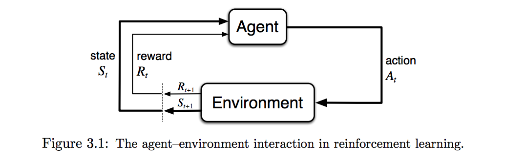

## Table of Contents

## What is reinforcement learning and how does it apply to execution?

Reinforcement learning is a type of artificial intelligence where an agent learns to make decisions by doing things and getting feedback. Imagine you're teaching a dog a new trick. You give the dog a treat when it does the trick right, and you don't give a treat when it does it wrong. The dog learns to do the trick better over time to get more treats. In the same way, a computer program, or agent, tries different actions and learns from the results. If the action leads to a good result, the agent gets a reward. If the action leads to a bad result, the agent might get a penalty. Over time, the agent figures out the best actions to take to get the most rewards.

In terms of execution, reinforcement learning can be used to improve how tasks are done. For example, in a factory, a robot might use reinforcement learning to figure out the best way to pick up and move objects. At first, the robot might try different ways of doing the task and get feedback on how well it did. If the robot moves an object quickly and safely, it gets a reward. If it drops the object or takes too long, it gets a penalty. Over time, the robot learns the best way to do the task by getting more rewards. This makes the factory's work more efficient and effective.

## Can you explain the basic components of a reinforcement learning system?

A reinforcement learning system has a few main parts that work together to help an agent learn. The first part is the agent itself, which is like a computer program that makes decisions. The agent tries different actions in an environment, which is the second part. The environment can be anything from a video game to a real-world setting like a factory. The agent interacts with the environment by taking actions, and the environment responds by changing in some way.

The third part is the reward signal. When the agent does something, it gets feedback in the form of a reward or a penalty. A good action gets a reward, and a bad action gets a penalty. This helps the agent figure out what to do next. The fourth part is the policy, which is like a set of rules the agent uses to decide what action to take. Over time, the agent updates its policy based on the rewards it gets, trying to get more rewards in the future. Together, these parts help the agent learn to do tasks better and better.

## How does an agent learn to improve its execution through reinforcement learning?

An agent learns to improve its execution through reinforcement learning by trying different actions and getting feedback from the environment. When the agent does something, it gets a reward if the action is good and a penalty if the action is bad. Over time, the agent figures out which actions lead to more rewards. It does this by changing its policy, which is like a set of rules it follows to decide what to do next. The more the agent practices, the better it gets at choosing the right actions to get the most rewards.

For example, imagine a robot in a factory trying to learn the best way to move boxes. At first, the robot might try different ways of picking up and moving the boxes. If it moves a box quickly and safely, it gets a reward. If it drops a box or takes too long, it gets a penalty. The robot keeps track of which actions lead to rewards and adjusts its policy accordingly. Over time, the robot learns the best way to move boxes, making the factory's work more efficient. This is how an agent improves its execution through reinforcement learning.

## What are the differences between positive and negative reinforcement in execution?

Positive reinforcement is when you get something good after doing something right. In execution, this means that if an agent does a task well, it gets a reward. This reward makes the agent want to do the task the same way again to get more rewards. For example, if a robot moves a box quickly and safely, it might get a point. The robot will then try to move boxes the same way to get more points. This helps the agent learn to do the task better by focusing on what works well.

Negative reinforcement is when you avoid something bad by doing something right. In execution, this means that if an agent does a task well, it avoids getting a penalty. This makes the agent want to do the task the same way to avoid penalties in the future. For example, if a robot moves a box without dropping it, it avoids getting a point taken away. The robot will then try to move boxes the same way to avoid losing points. This helps the agent learn to do the task better by focusing on avoiding what doesn't work well.

Both positive and negative reinforcement help an agent improve its execution, but they do it in different ways. Positive reinforcement encourages the agent to repeat good actions by giving rewards, while negative reinforcement encourages the agent to avoid bad actions by removing penalties. Together, they help the agent learn the best way to do a task.

## Can you describe a simple example of reinforcement learning applied to task execution?

Imagine a robot in a warehouse that needs to learn how to move boxes from one place to another. The robot starts by trying different ways to pick up and move the boxes. If it moves a box quickly and safely, it gets a reward, like a point. But if it drops the box or takes too long, it gets a penalty, like losing a point. Over time, the robot figures out the best way to move boxes by trying to get more points and avoid losing points.

At first, the robot might try different speeds and paths to see what works best. It learns that moving too fast can cause it to drop boxes, so it slows down a bit. It also learns that taking a straight path is faster than going around obstacles. As the robot keeps practicing, it gets better at moving boxes quickly and safely. This makes the warehouse's work more efficient because the robot is now good at its job.

## What are the common algorithms used in reinforcement learning for execution?

One common algorithm used in reinforcement learning for execution is Q-learning. Q-learning helps an agent learn the best action to take in different situations. The agent tries different actions and gets rewards or penalties based on what happens. Over time, it builds a table, called a Q-table, that shows which actions are best in each situation. This helps the agent choose the right action to get the most rewards. Q-learning is simple but powerful and works well for many tasks.

Another popular algorithm is Deep Q-Network (DQN). DQN uses a neural network instead of a Q-table to decide what to do. This makes it better for tasks with lots of different situations and actions. The neural network learns from the rewards and penalties the agent gets, just like in Q-learning. But because it can handle more complex situations, DQN is often used for things like playing video games or controlling robots in a factory. Both Q-learning and DQN help agents learn to do tasks better by getting feedback from their actions.

## How do reward functions influence the learning process in execution scenarios?

Reward functions are very important in reinforcement learning because they tell the agent if it did a good job or not. When an agent does something, it gets a reward if the action is good and a penalty if the action is bad. The reward function decides how much reward or penalty the agent gets. This helps the agent figure out what to do next. If the reward function gives big rewards for good actions, the agent will try to do those actions more often. If it gives big penalties for bad actions, the agent will try to avoid those actions.

In execution scenarios, like a robot moving boxes in a warehouse, the reward function can make a big difference in how fast the robot learns. If the reward function gives a big reward for moving boxes quickly and safely, the robot will learn to do that faster. But if the reward function doesn't give enough reward for moving boxes safely, the robot might try to move them too fast and drop them. So, it's important to set up the reward function right to help the agent learn the best way to do the task.

## What challenges are faced when implementing reinforcement learning for real-world execution?

One challenge of using reinforcement learning in real life is that the world is very complicated. A robot in a factory has to deal with many things that can change, like other robots moving around or boxes being in different places. It's hard for the robot to learn from all these changes because it might take a long time to try all the different ways of doing things. Also, the robot might make mistakes while it's learning, like dropping boxes, which can cause problems in the factory.

Another challenge is that it can be hard to set up the right rewards and penalties. If the rewards are too small, the robot might not learn quickly enough. If the penalties are too big, the robot might be too afraid to try new things. It's also hard to know what to reward the robot for. For example, should the robot get a reward for moving boxes quickly, or should it get a reward for moving them safely? Getting the reward function right is important but can be tricky.

## How can reinforcement learning be integrated with other AI techniques to enhance execution?

Reinforcement learning can be made better by working with other AI techniques like supervised learning and unsupervised learning. Supervised learning is like having a teacher show the agent how to do things right. The agent can learn from examples before it starts trying things on its own. This can help the agent learn faster and make fewer mistakes. Unsupervised learning helps the agent find patterns in the environment without being told what to look for. This can help the agent understand the world better and make better decisions.

Another way to improve reinforcement learning is by using techniques like imitation learning and transfer learning. Imitation learning is when the agent watches a human or another agent do a task and tries to copy what it sees. This can be a quick way for the agent to learn the basics of a task. Transfer learning is when the agent uses what it learned in one task to help it do another task. For example, if a robot learned how to move boxes in a warehouse, it might use that knowledge to help it move different objects in another setting. By combining these techniques, reinforcement learning can become more powerful and help agents execute tasks even better.

## What are the latest advancements in reinforcement learning specifically for execution optimization?

One of the latest advancements in reinforcement learning for execution optimization is the development of more efficient algorithms like Proximal Policy Optimization (PPO). PPO helps agents learn faster and more stably by making small, safe changes to their policy. This means the agent can improve its actions without making big mistakes that could cause problems in real-world settings like factories. PPO is especially useful for tasks that need to be done quickly and safely, like moving boxes or controlling machines.

Another advancement is the use of multi-agent reinforcement learning. In this approach, several agents work together and learn from each other to do a task better. For example, in a warehouse, multiple robots can learn to move boxes more efficiently by watching and helping each other. This can lead to better overall performance and faster execution of tasks. Multi-agent systems are becoming more popular because they can handle complex tasks that one agent might find too hard to do alone.

## How do you evaluate the performance of a reinforcement learning model in execution tasks?

To evaluate how well a reinforcement learning model does in execution tasks, you need to look at a few things. One important thing is how much reward the model gets over time. If the model is getting more rewards, it means it's getting better at the task. Another thing to look at is how fast the model learns. If it takes too long to get good at the task, it might not be useful in real life where time matters. Also, you need to check if the model can do the task well in different situations. If it can only do the task well in one specific setting, it might not be very useful.

Another way to evaluate the model is by looking at how well it does compared to other ways of doing the task. For example, if a robot using reinforcement learning moves boxes faster and safer than a robot using a different method, then the reinforcement learning model is doing a good job. It's also important to see if the model can keep doing the task well over a long time. If it starts to do worse after a while, it might need more training or a different approach. By looking at these things, you can tell if the reinforcement learning model is good at executing tasks.

## What future trends are expected in the field of reinforcement learning for execution?

In the future, reinforcement learning for execution is expected to become even better at handling real-world tasks. One trend is that algorithms will get smarter and faster. This means that robots and other machines will be able to learn how to do things like moving boxes or controlling machines more quickly and safely. Another trend is that more machines will work together using multi-agent reinforcement learning. This will help them do complex tasks better by learning from each other and working as a team.

Another important trend is that reinforcement learning will be used in more places, like self-driving cars and smart homes. As these technologies become more common, reinforcement learning will help them do their jobs better. For example, a self-driving car might use reinforcement learning to learn the best way to drive in different situations, making it safer and more efficient. Overall, these trends will make reinforcement learning a key part of many everyday tasks, helping machines do their jobs better and faster.

## What is Reinforcement Learning: A Primer?

Reinforcement learning (RL) is a prominent area within machine learning that emphasizes the development of intelligent [agents](/wiki/agents) capable of making decisions based on interactions with their environment. The primary objective is to derive a sequence of actions that maximizes cumulative reward over time. Unlike supervised learning, which relies on labeled datasets to train models, reinforcement learning operates through a process of exploration and exploitation, learning from the consequences of actions taken rather than predefined labels.

In reinforcement learning, an agent perceives the state of its environment and takes actions accordingly. These actions affect the environment, leading to feedback in the form of rewards. This feedback is crucial for the learning process, as it informs the agent about the quality of its decisions with respect to the long-term goal of maximizing cumulative reward. The agent's process can be formalized using the Markov Decision Process (MDP), which consists of:

- A set of states $S$
- A set of actions $A$
- A state transition probability $P(s' | s, a)$, describing the probability of transitioning from state $s$ to state $s'$ when action $a$ is taken
- A reward function $R(s, a, s')$, which assigns rewards to state transitions
- A discount factor $\gamma \in [0, 1]$, used to balance immediate and future rewards

The goal of the agent is to learn a policy $\pi(a | s)$, which maximizes the expected return from each state. The expected return is typically defined as the sum of discounted future rewards, expressed mathematically as:

$$
G_t = R_{t+1} + \gamma R_{t+2} + \gamma^2 R_{t+3} + \cdots = \sum_{k=0}^{\infty} \gamma^k R_{t+k+1}
$$

One fundamental algorithm used in RL is Q-learning. Q-learning is an off-policy method that seeks to find the optimal action-selection policy by learning the action-value function $Q(s, a)$, which estimates the expected return of taking action $a$ in state $s$ and then following the optimal policy thereafter. The Q-learning update rule is given by:

$$
Q(s, a) \leftarrow Q(s, a) + \alpha \left[ R_{t+1} + \gamma \max_{a'} Q(s', a') - Q(s, a) \right]
$$

where $\alpha$ is the learning rate. This iterative update allows the agent to incrementally improve estimates of the action-value function based on new experiences.

By leveraging these concepts, reinforcement learning allows agents to autonomously discover efficient strategies for decision-making problems, navigating through trial and error to refine their actions for optimal long-term outcomes.

## References & Further Reading

[1]: Sutton, R. S., & Barto, A. G. (2018). ["Reinforcement Learning: An Introduction."](https://web.stanford.edu/class/psych209/Readings/SuttonBartoIPRLBook2ndEd.pdf) MIT Press.

[2]: Silver, D., Huang, A., Maddison, C. J., Guez, A., Sifre, L., van den Driessche, G., ... & Hassabis, D. (2016). ["Mastering the game of Go with deep neural networks and tree search."](https://www.nature.com/articles/nature16961) Nature, 529(7587), 484-489.

[3]: Mnih, V., Kavukcuoglu, K., Silver, D., Rusu, A. A., Veness, J., Bellemare, M. G., ... & Hassabis, D. (2015). ["Human-level control through deep reinforcement learning."](https://www.nature.com/articles/nature14236) Nature, 518(7540), 529-533.

[4]: ["Advances in Financial Machine Learning"](https://www.wiley.com/en-us/Advances+in+Financial+Machine+Learning-p-9781119482086) by Marcos Lopez de Prado.

[5]: ["Deep Reinforcement Learning Hands-On: Apply modern RL methods, with deep Q-networks, value iteration, policy gradients, TRPO, AlphaGo Zero and more"](https://www.amazon.com/Deep-Reinforcement-Learning-Hands-Q-networks/dp/1788834240) by Maxim Lapan.

[6]: Chan, E. (2009). ["Quantitative Trading: How to Build Your Own Algorithmic Trading Business"](https://github.com/egorpe/EPChan-QuantitativeTrading/blob/master/example7_6.m). Wiley Trading.

[7]: ["Machine Learning for Algorithmic Trading: Predictive models to extract signals from market and alternative data for systematic trading strategies with Python, 2nd Edition"](https://www.amazon.com/Machine-Learning-Algorithmic-Trading-alternative/dp/1839217715) by Stefan Jansen.