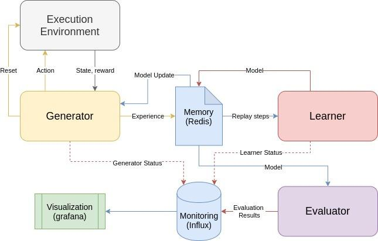

## Table of Contents

## What is reinforcement learning and how does it apply to order execution?

Reinforcement learning is a type of artificial intelligence where a computer learns to make decisions by trying different actions and seeing what works best. It's like learning from trial and error. The computer gets rewards for good actions and penalties for bad ones. Over time, it figures out the best way to do things by maximizing the rewards it gets.

In order execution, reinforcement learning can be used to decide the best way to buy or sell stocks or other financial assets. Imagine you're trying to sell a bunch of stocks without causing the price to drop too much. You could use reinforcement learning to figure out the best times and amounts to sell. The computer would learn from past trades, trying different strategies, and getting better at choosing the right moments to execute orders to get the best possible price.

## What are the basic components of a reinforcement learning system for order execution?

In a reinforcement learning system for order execution, there are a few key parts that work together. First, there's the agent, which is like the computer that makes the decisions. The agent learns how to buy or sell stocks by trying different strategies. It gets information about the current state of the market, like stock prices and trading volumes. Based on this information, the agent decides what action to take, like selling a certain amount of stock at a specific time.

The second important part is the environment, which is the market itself. The environment responds to the agent's actions and gives feedback in the form of rewards or penalties. If the agent sells stocks at a good price, it gets a reward. If the price drops because of the sale, it gets a penalty. The agent uses these rewards and penalties to learn what works and what doesn't. Over time, the agent gets better at choosing the right actions to maximize its rewards, leading to better order execution strategies.

## How does an agent learn to optimize order execution through reinforcement learning?

An agent learns to optimize order execution through reinforcement learning by trying different ways to buy or sell stocks and seeing which ones work best. It starts by making random decisions about when and how much to trade. Each time it makes a trade, it gets feedback from the market in the form of a reward or penalty. If the trade results in a good price, the agent gets a reward. If the trade makes the price go down, it gets a penalty. The agent uses these rewards and penalties to figure out what works and what doesn't.

Over time, the agent keeps trying different strategies and learning from the results. It remembers the strategies that led to good rewards and tries to use them more often. It also avoids strategies that led to penalties. This process of trial and error helps the agent get better at choosing the right times and amounts to trade, so it can get the best possible price for the stocks. By continuously learning from the market's feedback, the agent becomes smarter and more efficient at executing orders.

## What are the common reward functions used in reinforcement learning for order execution?

In reinforcement learning for order execution, the reward function is very important because it tells the agent if it's doing a good job or not. A common reward function is based on the difference between the price the agent gets for selling stocks and the market price. If the agent can sell the stocks at a higher price than the market, it gets a positive reward. If the price drops because of the agent's selling, it gets a negative reward. This helps the agent learn to sell stocks at the best possible price without causing the price to go down too much.

Another common reward function looks at how much of the order the agent can complete without moving the market price too much. If the agent can sell a big part of the order without making the price go down, it gets a good reward. If the price moves a lot, the agent gets a penalty. This helps the agent learn to break up big orders into smaller parts and sell them at different times to get the best overall price. By using these reward functions, the agent can learn to execute orders in a way that gets the best results for the trader.

## How do state and action spaces influence the design of a reinforcement learning model for order execution?

The state space in a reinforcement learning model for order execution includes all the information the agent needs to make decisions, like current stock prices, trading volumes, and the size of the order it needs to fill. A bigger state space means the agent has more information to work with, which can help it make better decisions. But it also makes the learning process harder because the agent has to figure out how all these different pieces of information affect its choices. So, when designing the model, you need to think about what information is really important and how to keep the state space manageable so the agent can learn quickly and effectively.

The action space is all the different things the agent can do, like selling a certain amount of stock at a specific time. A larger action space gives the agent more options, which can be good because it can try different strategies to find the best one. But it also makes the learning process more complicated because the agent has to figure out which actions lead to the best rewards. When designing the model, you need to balance having enough actions for the agent to find good strategies with keeping the action space small enough that the agent can learn quickly. By carefully choosing the state and action spaces, you can help the agent learn to execute orders in the best way possible.

## What are the challenges of applying reinforcement learning to real-time order execution?

Applying reinforcement learning to real-time order execution can be tricky because the market is always changing. The agent needs to make quick decisions based on the latest information, but it can be hard to learn fast enough to keep up. If the agent takes too long to learn, it might miss out on good trading opportunities or make bad decisions that cost money. Also, the market can be unpredictable, so the agent needs to be able to adapt to new situations quickly.

Another challenge is making sure the agent can handle the huge amount of data that comes with real-time trading. The state space can get very big because there's so much information to consider, like stock prices, trading volumes, and news events. This can make it hard for the agent to learn what's important and what's not. Plus, the action space can be complicated too, because there are so many different ways to buy or sell stocks. The agent needs to find the best strategy out of all these options, which can be tough to do in real-time.

## How can exploration vs. exploitation be balanced in the context of order execution?

Balancing exploration and exploitation in order execution means the agent needs to try new ways of trading while also sticking with what works well. Exploration is when the agent tries different strategies to see if they can find a better way to buy or sell stocks. This is important because the market changes, and what worked yesterday might not work today. But if the agent explores too much, it might miss out on good trading opportunities because it's always trying new things instead of using strategies that have already been proven to work.

Exploitation is when the agent uses the strategies that have given good results in the past. This helps the agent get the best possible price for stocks because it's using what it knows works well. The challenge is to find the right balance between exploring new strategies and exploiting the ones that are already successful. If the agent can do this well, it can keep improving its trading strategies while still making good trades in the present. This balance is key to getting the best results in real-time order execution.

## What role does market impact play in reinforcement learning models for order execution?

Market impact is really important in reinforcement learning models for order execution. It's about how buying or selling a lot of stocks can change the price. When the agent sells a big order, it might make the price go down, which is bad because it means the agent gets less money for the stocks. So, the agent needs to learn how to sell the stocks without causing the price to drop too much. This is tricky because the agent has to think about how each trade will affect the market.

To handle market impact, the agent uses the reward function to learn from its trades. If the agent sells stocks and the price stays the same or goes up, it gets a good reward. But if the price goes down because of the agent's selling, it gets a penalty. By trying different ways to sell and seeing how the market reacts, the agent can figure out the best way to execute orders. Over time, it gets better at breaking up big orders into smaller pieces and selling them at the right times to minimize market impact and get the best possible price.

## How can historical data be used to train and validate reinforcement learning models for order execution?

Historical data is really useful for training and validating reinforcement learning models for order execution. You can use past stock prices, trading volumes, and other market data to teach the agent how to make good trades. The agent tries different ways of buying and selling stocks using this old data, and it learns from the results. If a certain way of trading worked well in the past, the agent remembers that and tries to use it again. By practicing on historical data, the agent can learn a lot about what works and what doesn't without risking real money.

After the agent has learned from the historical data, you can use more old data to test how well it does. This is called validation. You give the agent new data it hasn't seen before and see how it trades. If it makes good decisions and gets good prices, you know the agent has learned well. But if it makes bad trades, you might need to train it more or change how it learns. Using historical data to train and validate the model helps make sure the agent can handle real trading situations and get the best possible results.

## What advanced techniques can be used to improve the performance of reinforcement learning in order execution?

To make reinforcement learning better for order execution, you can use a technique called deep reinforcement learning. This means using a special kind of computer program called a [neural network](/wiki/neural-network) to help the agent learn. The neural network can handle a lot of information at once, like stock prices and trading volumes, and figure out the best way to trade. It's like giving the agent a super smart brain that can learn from a lot of data quickly. By using deep reinforcement learning, the agent can make better decisions and get better prices for stocks.

Another way to improve performance is by using something called transfer learning. This is when the agent learns from one situation and then uses that knowledge in a different situation. For example, the agent might learn how to trade stocks in one market and then use what it learned to trade in another market. This can save a lot of time because the agent doesn't have to start learning from scratch every time. It can use what it already knows to make good trades in new situations, which can lead to better order execution overall.

## How do multi-agent systems enhance reinforcement learning strategies for order execution?

Multi-agent systems can make reinforcement learning better for order execution by having more than one agent work together. Each agent can learn different things about the market and share what they know with the others. This means they can try different ways to buy or sell stocks and find the best strategies faster. When one agent finds a good way to trade, it can tell the other agents, so they can all use that strategy. This teamwork helps the agents learn from each other and make better decisions, which can lead to getting better prices for stocks.

Another way multi-agent systems help is by making the learning process more realistic. In real markets, there are lots of people and computers trading at the same time, and they all affect each other. By having multiple agents, the system can mimic this better. Each agent can act like a different trader, and they can all learn how to trade well together. This makes the agents smarter because they learn how to deal with other traders and find the best times and amounts to buy or sell. Using multi-agent systems can make the reinforcement learning model more effective and better at executing orders in the real world.

## What are the future trends and potential developments in reinforcement learning for order execution?

In the future, reinforcement learning for order execution is likely to become even smarter and faster. One big trend will be using more advanced neural networks, like [deep learning](/wiki/deep-learning), to help the agent learn from huge amounts of data. These smart networks can figure out complex patterns in the market and make better decisions about when and how to trade. Another trend will be using more real-time data, like news and social media, to help the agent react quickly to changes in the market. By using all this information, the agent can learn to execute orders in the best way possible, even when the market is changing fast.

Another potential development is using more multi-agent systems, where lots of agents work together to find the best trading strategies. These agents can share what they learn with each other, which can help them find good ways to trade faster. They can also mimic how real markets work, with many traders buying and selling at the same time. This can make the agents better at dealing with other traders and finding the best times and amounts to trade. As these technologies get better, reinforcement learning could become a powerful tool for executing orders in the stock market.

## What is Understanding Reinforcement Learning?

Reinforcement learning is a subset of [machine learning](/wiki/machine-learning) focused on training algorithms to make a sequence of decisions by interacting with an environment. It involves several key components: agents, environments, and reward systems. An agent is the decision-maker, which operates within an environment — the space where it makes decisions. The environment provides feedback to the agent in the form of rewards, which guide the agent toward desirable outcomes. The goal of reinforcement learning is to define a policy — a mapping from states of the environment to actions — that maximizes the cumulative reward over time.

Unlike supervised learning, where algorithms learn from a labeled dataset, [reinforcement learning](/wiki/reinforcement-learning) does not rely on fixed input-output pairs. Instead, it learns from the consequences of its actions and refines its strategies accordingly. This contrasts with unsupervised learning, which deals with discovering patterns in data without explicit delimiters. In reinforcement learning, the focus is on finding a balance between exploration (trying new actions to discover their effects) and exploitation (using known actions that yield high rewards).

Several notable algorithms exemplify reinforcement learning's capabilities. Q-learning is a model-free algorithm that seeks to learn the quality, or Q-values, of actions in particular states. The Q-values are updated using the formula:

$$
Q(s, a) \leftarrow Q(s, a) + \alpha \left[ r + \gamma \max_{a'} Q(s', a') - Q(s, a) \right]
$$

where $s$ is the state, $a$ is the action, $r$ is the reward, $\alpha$ is the learning rate, $\gamma$ is the discount factor, and $s'$ is the next state. Deep Q-Networks (DQN) extend this concept by using deep neural networks to approximate Q-values, thereby handling high-dimensional state spaces effectively.

Policy gradients offer another approach, focusing directly on optimizing the policy itself rather than the value functions. These methods adjust policy parameters through gradients of expected returns, enabling learning in environments with continuous actions.

Reinforcement learning finds applications beyond trading. In healthcare, it optimizes treatment plans by continually adjusting therapies based on patient responses. In robotics, it guides autonomous [agents](/wiki/agents) to navigate and manipulate objects. In game playing, algorithms such as AlphaGo demonstrated superior learning by balancing exploration and exploitation to master complex games. These examples underscore reinforcement learning's versatility in solving dynamic decision-making challenges across diverse domains.

## References & Further Reading

[1]: Sutton, R. S., & Barto, A. G. (2018). ["Reinforcement Learning: An Introduction."](https://web.stanford.edu/class/psych209/Readings/SuttonBartoIPRLBook2ndEd.pdf) MIT Press.

[2]: Silver, D., Huang, A., Maddison, C. J., Guez, A., Sifre, L., Van Den Driessche, G., ... & Hassabis, D. (2016). ["Mastering the game of Go with deep neural networks and tree search."](https://www.nature.com/articles/nature16961) Nature, 529(7587), 484-489.

[3]: Mnih, V., Kavukcuoglu, K., Silver, D., Rusu, A. A., Veness, J., Bellemare, M. G., ... & Hassabis, D. (2015). ["Human-level control through deep reinforcement learning."](https://www.nature.com/articles/nature14236) Nature, 518(7540), 529-533.

[4]: Lopez de Prado, M. (2018). ["Advances in Financial Machine Learning."](https://books.google.com/books/about/Advances_in_Financial_Machine_Learning.html?id=oU9KDwAAQBAJ) Wiley.

[5]: Chan, E. P. (2013). ["Algorithmic Trading: Winning Strategies and Their Rationale."](https://github.com/ftvision/quant_trading_echan_book) Wiley Trading Series.

[6]: Jansen, S. (2020). ["Machine Learning for Algorithmic Trading: Predictive Models to Extract Signals from Market and Alternative Data for Systematic Trading Strategies with Python."](https://github.com/stefan-jansen/machine-learning-for-trading) Packt Publishing.

[7]: Silver, D., Schrittwieser, J., Simonyan, K., Antonoglou, I., Huang, A., Guez, A., ... & Hassabis, D. (2017). ["Mastering Chess and Shogi by Self-Play with a General Reinforcement Learning Algorithm."](https://pubmed.ncbi.nlm.nih.gov/29052630/) arXiv Preprint arXiv:1712.01815.