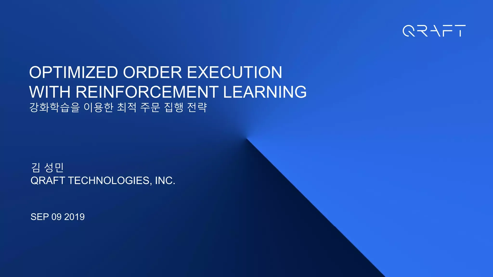

Order execution in the context of algorithmic trading refers to the process of buying and selling financial instruments through automated systems that execute trades based on predefined criteria and algorithms. These algorithms are designed to optimize the execution of orders, reducing the overall impact on the market and minimizing costs, thereby increasing the efficiency and profitability of trades.

Reinforcement learning is a form of machine learning where agents learn to make decisions by interacting with an environment to maximize cumulative rewards. Unlike supervised learning, which requires labeled datasets, or unsupervised learning, which identifies patterns or groupings in data, reinforcement learning focuses on developing a strategy or policy that determines the best actions to take in a given situation. In trading, reinforcement learning agents can analyze vast amounts of market data, continuously adapting to patterns and dynamics to optimize trading strategies.

Optimal order execution is crucial in trading. It seeks to ensure that trades are executed at the most favorable conditions, effectively managing transaction costs and reducing market impact. This is essential for maximizing trade efficiency and improving profitability. Poor execution can lead to significant costs, including slippage, where the final price of a trade is different from the intended price, and market impact, which refers to the adverse effect of one's own trades on the overall market price.

Reinforcement learning presents solutions to several challenges in order execution. Traditional methods may struggle to handle the unpredictability and volatility of financial markets, but reinforcement learning can address these challenges through continuous learning and adaptation. It allows for the development of dynamic trading strategies that can operate under varying market conditions, exploiting fleeting opportunities and adjusting to new information in real time.

Algorithmic trading has significantly evolved with advancements in artificial intelligence. Early strategies were rule-based and static, while contemporary systems leverage AI to enable more advanced, adaptive, and effective trading strategies. As AI technology continues to progress, particularly in areas such as reinforcement learning, the landscape of algorithmic trading is poised for further transformation, offering enhanced capabilities for market analysis and order execution.

## Table of Contents

## Understanding Reinforcement Learning

Reinforcement learning is a subset of machine learning focused on training algorithms to make a sequence of decisions by interacting with an environment. It involves several key components: agents, environments, and reward systems. An agent is the decision-maker, which operates within an environment — the space where it makes decisions. The environment provides feedback to the agent in the form of rewards, which guide the agent toward desirable outcomes. The goal of reinforcement learning is to define a policy — a mapping from states of the environment to actions — that maximizes the cumulative reward over time.

Unlike supervised learning, where algorithms learn from a labeled dataset, [reinforcement learning](/wiki/reinforcement-learning) does not rely on fixed input-output pairs. Instead, it learns from the consequences of its actions and refines its strategies accordingly. This contrasts with unsupervised learning, which deals with discovering patterns in data without explicit delimiters. In reinforcement learning, the focus is on finding a balance between exploration (trying new actions to discover their effects) and exploitation (using known actions that yield high rewards).

Several notable algorithms exemplify reinforcement learning's capabilities. Q-learning is a model-free algorithm that seeks to learn the quality, or Q-values, of actions in particular states. The Q-values are updated using the formula:

$$
Q(s, a) \leftarrow Q(s, a) + \alpha \left[ r + \gamma \max_{a'} Q(s', a') - Q(s, a) \right]
$$

where $s$ is the state, $a$ is the action, $r$ is the reward, $\alpha$ is the learning rate, $\gamma$ is the discount factor, and $s'$ is the next state. Deep Q-Networks (DQN) extend this concept by using deep neural networks to approximate Q-values, thereby handling high-dimensional state spaces effectively.

Policy gradients offer another approach, focusing directly on optimizing the policy itself rather than the value functions. These methods adjust policy parameters through gradients of expected returns, enabling learning in environments with continuous actions.

Reinforcement learning finds applications beyond trading. In healthcare, it optimizes treatment plans by continually adjusting therapies based on patient responses. In robotics, it guides autonomous [agents](/wiki/agents) to navigate and manipulate objects. In game playing, algorithms such as AlphaGo demonstrated superior learning by balancing exploration and exploitation to master complex games. These examples underscore reinforcement learning's versatility in solving dynamic decision-making challenges across diverse domains.

## Application of Reinforcement Learning in Order Execution

Reinforcement learning (RL) algorithms have emerged as potent tools for determining optimal buy and sell times in trading strategies. At the core of this application is the capability of reinforcement learning to interact with and adapt to dynamic market environments, thereby facilitating more precise decision-making in order execution. These algorithms leverage past experiences to optimize decisions, aiming to maximize cumulative rewards in trading scenarios.

The transformation of market data into actionable environments for RL agents is a critical step. Market data, which includes historical prices, volumes, and [order book](/wiki/order-book-trading-strategies) information, is pre-processed and fed into an RL framework where it serves as the environment. This environment is continually updated to reflect real-time changes in the market, thus allowing the RL agents to interact with it as they learn. The agents make decisions at each time step, which corresponds to the actions of buying, selling, or holding a particular asset. These decisions are based on the current state of the environment and a policy that the agent is continuously improving through interaction.

The reward system within an RL context is vital for achieving efficient execution. The design of the reward function directly influences the behavior and learning efficiency of the RL agents. In trading, reward functions can be crafted to reflect profitability, risk-adjusted returns, or transaction costs. For example, a simple reward function might be the change in portfolio value after each trade, whereas more complex formulations could include penalties for excessive market impact or deviations from a benchmark index. This reward feedback helps the RL algorithm to evaluate the quality of the trades executed and adjust future actions accordingly.

When comparing RL-based strategies with traditional strategies, several advantages and limitations emerge. Traditional strategies often rely on predefined set rules or heuristics derived from historical data analysis, with limited ability to adapt to unforeseen market conditions. In contrast, RL-based strategies provide the ability to learn from the market environment, potentially uncovering novel trading opportunities that static strategies might overlook. They can dynamically adjust to changing market conditions, improving execution efficiency and reducing costs due to their adaptive nature. However, RL models require substantial amounts of data and computational power, and their performance relies heavily on the quality and robustness of the designed reward function. Additionally, traditional strategies tend to be more interpretable, while RL strategies can often operate as black boxes, posing challenges in understanding the decision-making process.

In summary, the application of reinforcement learning in order execution promises innovative approaches to optimizing trade decisions. By continuously interacting with evolving market environments, RL agents enhance order execution, aiming for superior trading performance over conventional methods.

## Benefits of Using Reinforcement Learning in Algo Trading

Reinforcement learning (RL) offers several benefits when applied to [algorithmic trading](/wiki/algorithmic-trading), primarily through its ability to enhance trade execution efficiency. By continuously learning and adapting to varying market conditions, RL algorithms evolve from past experiences, thereby improving decision-making processes in real-time trading environments. This continuous adaptation allows for dynamic adjustments to strategies, aligning trade execution with current market scenarios.

One of the standout strengths of RL in trading is its ability to uncover complex patterns within market data. Unlike traditional algorithms, RL models do not require predefined rules or pattern recognitions; instead, they autonomously develop strategies through extensive data interaction. This ability is particularly advantageous in detecting and exploiting non-linear relationships and subtle patterns that are imperceptible through conventional statistical methods.

Moreover, RL algorithms are designed to minimize market impact and transaction costs. By optimizing execution strategies, these models can determine the ideal execution path that balances speed, market impact, and cost efficiency. For instance, by employing a reward system that penalizes high transaction costs or market impacts, an RL agent can learn to execute large orders without significantly distorting the market.

RL-based strategies are also effective in managing market [volatility](/wiki/volatility-trading-strategies). Traditional models may struggle with sudden market shifts; however, RL's adaptive framework allows models to recalibrate strategies based on real-time feedback. This results in a more resilient strategy that can better withstand and exploit volatile market conditions. RL agents can optimize their actions by evaluating risks and returns dynamically, thus making more informed decisions during periods of heightened uncertainty.

In summary, the adoption of reinforcement learning in algorithmic trading presents significant advantages, including increased efficiency, the discovery of complex patterns, cost-effective execution, and improved handling of market volatility. These benefits position RL as a powerful tool for enhancing the robustness and profitability of trading strategies.

## Challenges and Considerations

Reinforcement learning (RL) is increasingly leveraged in algorithmic trading for optimal order execution. However, several challenges and considerations must be addressed to ensure its successful implementation.

Data quality is paramount in developing realistic RL environments. High-quality, accurate, and timely market data underpins model performance. Inconsistent or erroneous data can adversely affect RL agents, leading them to learn suboptimal policies. Therefore, establishing a robust data pipeline that filters noise while preserving relevant signals is crucial. Moreover, having diverse datasets that cover various market conditions is essential to train models capable of generalizing across different scenarios.

The computational cost of training complex RL models is substantial. RL involves training agents through trial and error, often requiring millions of iterations to converge on effective strategies. Each iteration demands significant computational resources, particularly when employing sophisticated algorithms like Deep Q-Networks (DQN) or policy gradients. High-performance computing infrastructure and efficient algorithms are therefore necessary to manage these demands, which can result in significant operational costs.

Model interpretability presents another challenge. RL models, particularly those based on [deep learning](/wiki/deep-learning), tend to function as black boxes, providing little insight into their decision-making processes. This opacity can be problematic for traders and regulatory bodies who require transparency in trading strategies. Efforts to improve interpretability, such as integrating explainable AI techniques or designing simpler models, are important to enhance trust and accountability.

Regulatory considerations and ethical implications are critical in the context of automated trading. The speed and autonomy of RL algorithms pose unique challenges for regulatory oversight. Ensuring compliance with financial regulations, such as those targeting market manipulation and fair trading practices, is imperative. Additionally, ethical concerns arise due to the potential for reinforcing existing market biases or triggering unintended cascading effects. Implementing failsafes and maintaining human oversight can mitigate these risks, ensuring that automated systems operate responsibly and within prescribed guidelines.

## Future Directions

Emerging trends in the application of reinforcement learning (RL) within trading highlight a promising shift towards more sophisticated and adaptive trading strategies. One of the key trends is the integration of diverse [artificial intelligence](/wiki/ai-artificial-intelligence) technologies, such as natural language processing (NLP), with reinforcement learning frameworks. This integration aims to leverage textual data from news articles, financial reports, and social media platforms to enhance decision-making capabilities. By extracting sentiment and interpreting linguistic nuances, RL agents can gain insights into market sentiment shifts and potential price movements, thereby creating a more holistic trading strategy.

Another promising direction is the improvement of transparency and explainability in RL models used for trading. There is a growing demand for understanding the decision processes of RL agents to ensure accountability and trust. Researchers are focusing on developing interpretable models where the reasoning behind decisions made by RL algorithms is clear and communicable. This involves elucidating the relationship between input features, model decisions, and market outcomes, possibly through visualization techniques or simplified model approximations.

Speculation regarding future regulations is primarily centered around accommodating advanced AI-powered trading technologies. Regulators may need to address the unique challenges posed by RL-based trading systems, including the potential for market manipulation, systemic risk, and the ethical use of AI. There could be calls for frameworks ensuring that RL systems exhibit fairness, non-discrimination, and operational integrity, while robust auditing processes might be instituted to trace and validate agent behaviors. As these technologies evolve, regulatory bodies may develop new guidelines that balance innovation with market stability and investor protection.

## Conclusion

The exploration of reinforcement learning (RL) in the domain of algorithmic trading, specifically in the context of order execution, underscores its transformative potential. Reinforcement learning offers innovative solutions to optimize trade efficiency by continuously learning and adapting to the ever-evolving market conditions. By employing advanced algorithms such as Q-learning, Deep Q-Networks (DQN), and policy gradients, RL can significantly enhance the decision-making process for optimal order execution. This approach allows traders to minimize transaction costs while effectively managing market impact and volatility.

The integration of reinforcement learning provides a nuanced understanding of complex market dynamics, uncovering patterns and strategies that traditional methods may overlook. Moreover, RL-based strategies facilitate a greater level of adaptability, accommodating the fluctuating nature of financial markets more adeptly than conventional approaches.

Despite these advancements, challenges persist, such as the need for high-quality data and the computational resources required for training sophisticated models. Additionally, the opaque nature of RL algorithms poses interpretability and ethical considerations that must be diligently addressed.

As the field progresses, there is a pressing need for continuous research and development. Enhancements in model transparency, regulatory alignment, and the integration of supplementary AI technologies, like natural language processing (NLP), could further potentiate RL applications in trading. The trajectory of advancements will likely shape a more sophisticated and efficient trading landscape, inviting ongoing investigation and innovation to fully realize the potential of reinforcement learning in transforming order execution.

## References & Further Reading

[1]: Sutton, R. S., & Barto, A. G. (2018). ["Reinforcement Learning: An Introduction."](https://web.stanford.edu/class/psych209/Readings/SuttonBartoIPRLBook2ndEd.pdf) MIT Press.

[2]: Silver, D., Huang, A., Maddison, C. J., Guez, A., Sifre, L., Van Den Driessche, G., ... & Hassabis, D. (2016). ["Mastering the game of Go with deep neural networks and tree search."](https://www.nature.com/articles/nature16961) Nature, 529(7587), 484-489.

[3]: Mnih, V., Kavukcuoglu, K., Silver, D., Rusu, A. A., Veness, J., Bellemare, M. G., ... & Hassabis, D. (2015). ["Human-level control through deep reinforcement learning."](https://www.nature.com/articles/nature14236) Nature, 518(7540), 529-533.

[4]: Lopez de Prado, M. (2018). ["Advances in Financial Machine Learning."](https://books.google.com/books/about/Advances_in_Financial_Machine_Learning.html?id=oU9KDwAAQBAJ) Wiley.

[5]: Chan, E. P. (2013). ["Algorithmic Trading: Winning Strategies and Their Rationale."](https://github.com/ftvision/quant_trading_echan_book) Wiley Trading Series.

[6]: Jansen, S. (2020). ["Machine Learning for Algorithmic Trading: Predictive Models to Extract Signals from Market and Alternative Data for Systematic Trading Strategies with Python."](https://github.com/stefan-jansen/machine-learning-for-trading) Packt Publishing.

[7]: Silver, D., Schrittwieser, J., Simonyan, K., Antonoglou, I., Huang, A., Guez, A., ... & Hassabis, D. (2017). ["Mastering Chess and Shogi by Self-Play with a General Reinforcement Learning Algorithm."](https://pubmed.ncbi.nlm.nih.gov/29052630/) arXiv Preprint arXiv:1712.01815.