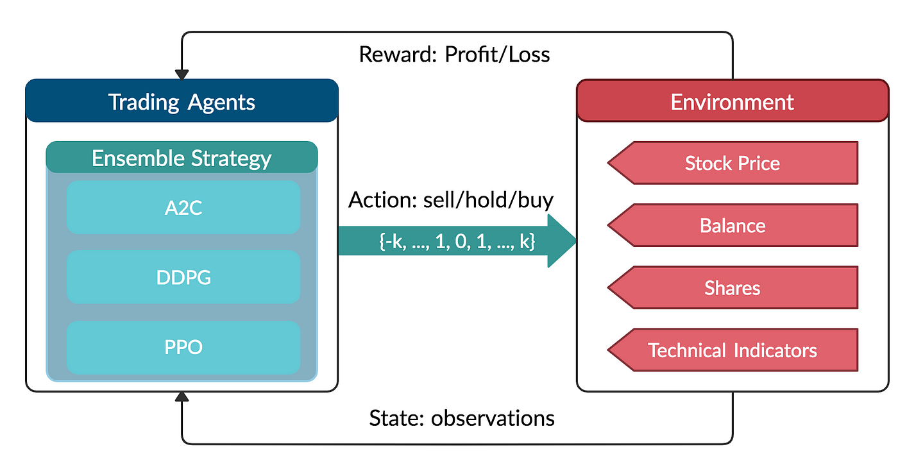

## Table of Contents

## What is reinforcement learning and how does it apply to trading?

Reinforcement learning is a type of artificial intelligence where a computer learns to make decisions by doing things and getting feedback. Imagine you're teaching a dog a new trick. You give the dog a treat when it does the trick right, and you don't give a treat when it does it wrong. The dog learns over time what to do to get more treats. In reinforcement learning, the computer is like the dog, trying different actions to see what works best, and it gets a "reward" when it does well.

In trading, reinforcement learning can be used to make better decisions about buying and selling stocks or other financial products. The computer starts trading and learns from the results. If a trade makes money, that's like getting a treat, and the computer remembers what it did to make that happen. If a trade loses money, it's like not getting a treat, and the computer tries to avoid doing that again. Over time, the computer gets better at trading because it learns which actions lead to more profits. This way, reinforcement learning can help traders make smarter choices based on past experiences.

## What are the basic components of a reinforcement learning system in trading?

In a reinforcement learning system for trading, there are a few key parts that work together to make it work. The first part is the agent, which is like a computer program that makes the trading decisions. The agent looks at the current situation in the market, like stock prices and other information, and decides what to do, like buying or selling a stock. The second part is the environment, which is the market itself. The environment gives the agent information about what's happening and reacts to the agent's actions, like changing stock prices after a trade.

The third part is the reward system. When the agent makes a trade, it gets a reward based on how well it did. If the trade makes money, the reward is high, and if it loses money, the reward is low. This reward helps the agent learn what to do in the future. The fourth part is the policy, which is like a set of rules the agent follows to decide what to do. The policy gets better over time as the agent learns from its rewards. Together, these parts help the reinforcement learning system get better at trading by learning from experience.

## How does an agent learn from the market environment in trading?

An agent learns from the market environment in trading by trying different actions and seeing what happens. It's like playing a game where the agent makes a move, like buying a stock, and then sees if that move was good or bad based on the reward it gets. If the stock price goes up after the agent buys it, the reward is high, and the agent learns that buying that stock in that situation was a good idea. If the stock price goes down, the reward is low, and the agent learns to avoid that action next time.

Over time, the agent keeps trying different things and learning from the rewards. It starts to see patterns in the market and figures out what works best. The agent gets smarter and makes better trading decisions because it remembers what led to high rewards in the past. This way, the agent can adapt to changes in the market and keep improving its trading strategy.

## What are the common reward functions used in trading with reinforcement learning?

In trading with reinforcement learning, the reward function is like a score that tells the agent how well it did on a trade. One common reward function is based on profit and loss. If the agent makes a trade that earns money, it gets a high reward. If the trade loses money, the reward is low or even negative. This simple reward helps the agent learn to make trades that increase its profits over time.

Another common reward function looks at the risk and return of trades. It gives the agent a higher reward if it makes a good profit with low risk, and a lower reward if the profit is high but the risk is also high. This helps the agent learn to balance making money with keeping trades safe. By using these reward functions, the agent can learn to make smart trading decisions that lead to better overall performance in the market.

## Can you explain the difference between positive and negative reinforcement in trading scenarios?

Positive reinforcement in trading means the agent gets a reward when it does something good. For example, if the agent buys a stock and the price goes up, it gets a reward. This reward makes the agent want to do that action again in the future. It's like getting a treat for doing something right. By getting these rewards, the agent learns which actions make money and tries to repeat them.

Negative reinforcement in trading is a bit different. It means the agent gets a reward by avoiding something bad. For example, if the agent sells a stock just before the price goes down, it might get a reward for avoiding a loss. This reward encourages the agent to keep doing things that help it avoid losing money. Over time, the agent learns to make choices that reduce risk and prevent bad outcomes.

## What are some popular algorithms used in reinforcement learning for trading?

One popular algorithm used in reinforcement learning for trading is Q-learning. Q-learning is like a game where the agent tries different actions and learns which ones are best. It keeps a table of scores, called Q-values, that tell it how good each action is in different situations. Over time, the agent updates these scores based on the rewards it gets from trading. This helps the agent figure out the best way to trade and make money.

Another common algorithm is Deep Q-Networks (DQN). DQN is similar to Q-learning but uses a [neural network](/wiki/neural-network) to handle more complex situations. The neural network can learn from lots of data and make better predictions about what to do next. This is helpful in trading because the market can be very complicated, and DQN can find patterns that a simple table might miss. By using DQN, the agent can make smarter trading decisions and improve its performance over time.

## How do you handle the exploration vs. exploitation dilemma in trading using reinforcement learning?

In trading using reinforcement learning, the exploration vs. exploitation dilemma is about deciding whether to try new things or stick with what works. Exploration means the agent tries different actions to see if they can find better ways to trade. For example, it might buy a new stock it hasn't tried before. This can help the agent learn more about the market and find new ways to make money. But, it also means the agent might make some bad trades while it's learning.

Exploitation, on the other hand, means the agent sticks with the actions it knows are good. If the agent knows that buying a certain stock usually makes money, it will keep doing that. This can help the agent make more money right away, but it might miss out on finding even better ways to trade. To handle this dilemma, the agent can use strategies like epsilon-greedy. This means the agent usually exploits what it knows but sometimes explores new things. By balancing exploration and exploitation, the agent can keep learning and improving its trading strategy over time.

## What are the challenges of applying reinforcement learning to real-time trading markets?

Applying reinforcement learning to real-time trading markets can be tough because the market changes all the time. The agent needs to learn fast and make good decisions quickly. If it takes too long to learn, it might miss out on good trades or make bad ones. Also, the market can be unpredictable, and what worked yesterday might not work today. This means the agent has to keep learning and adapting, which can be hard to do in real time.

Another challenge is balancing risk and reward. The agent needs to make trades that make money but also keep the risk low. If it takes too many risks, it might lose a lot of money. But if it's too careful, it might not make enough money. Finding the right balance is tricky, and the agent has to learn from its experiences without losing too much along the way. This makes it hard to apply reinforcement learning to real-time trading markets, but with the right approach, it can be done.

## How can one evaluate the performance of a reinforcement learning model in trading?

Evaluating the performance of a reinforcement learning model in trading involves looking at how well it makes money and manages risk. One way to do this is by checking the model's profit and loss over time. If the model is making more money than it's losing, that's a good sign. You can also look at how much risk the model is taking. If it's making good profits without taking too many risks, that means the model is doing well. Another important thing to check is how the model performs compared to other trading strategies or the market as a whole. If the model is doing better than other ways of trading, it's a good indication that the reinforcement learning model is working well.

Another way to evaluate the model is by looking at how it learns and adapts over time. A good reinforcement learning model should get better at trading as it gains more experience. You can see this by tracking how the model's performance changes over time. If the model is making smarter decisions and improving its profits, that's a sign that it's learning well. It's also important to test the model in different market conditions to see how it handles changes. If the model can adapt to different situations and still make good trades, that shows it's a strong and reliable model for trading.

## What are the advanced techniques for improving the efficiency of reinforcement learning models in trading?

One advanced technique for improving the efficiency of reinforcement learning models in trading is using deep reinforcement learning. This means combining reinforcement learning with neural networks, which are good at handling lots of data and finding patterns. For example, a model can use a Deep Q-Network (DQN) to learn from the market. The DQN can look at lots of different pieces of information, like stock prices and news, and figure out what to do next. This helps the model make better trading decisions and learn faster, even in a fast-changing market.

Another technique is using transfer learning. This is when the model starts with what it already knows from one market and uses that knowledge to learn about a new market faster. For example, if the model has learned how to trade stocks in the US, it can use that experience to start trading in Europe more quickly. This saves time and helps the model adapt to new situations without starting from scratch. By using these advanced techniques, the model can become more efficient and better at making money in trading.

## How does multi-agent reinforcement learning apply to trading strategies?

Multi-agent reinforcement learning in trading means using more than one computer program, or agents, to make trading decisions. Each agent tries to learn the best way to trade by watching what the other agents are doing and learning from the market. It's like a group of people working together, where each person tries different things and shares what works best. In trading, one agent might focus on buying stocks, while another might focus on selling. By working together, the agents can find better ways to make money than if they were working alone.

This approach can help make trading strategies better because the agents can learn from each other's successes and failures. For example, if one agent makes a good trade, the others can see what it did and try to do the same thing. This can help the whole group make smarter decisions and adapt to changes in the market faster. By using multi-agent reinforcement learning, traders can create a system that keeps getting better at finding the best times to buy and sell, leading to more profits over time.

## What are the future trends and research directions in reinforcement learning for trading?

In the future, reinforcement learning for trading will likely focus on making models smarter and faster. One big trend will be using more advanced neural networks, like [deep learning](/wiki/deep-learning), to handle lots of data and find patterns in the market. These models can learn from things like stock prices, news, and even social media to make better trading decisions. Another trend will be using more computers at the same time, called distributed computing, to help the models learn faster and handle more information. This can make the models better at adapting to changes in the market and finding new ways to make money.

Another area of research will be making reinforcement learning models work well with other types of trading strategies. For example, combining reinforcement learning with traditional methods like technical analysis or even human traders can create a powerful system. Researchers will also look at ways to make the models more explainable, so traders can understand why the model makes certain decisions. This can help build trust in the models and make them easier to use in real trading situations. Overall, the future of reinforcement learning in trading looks bright, with lots of exciting possibilities for making better and smarter trading decisions.

## How can we design an environment for creating a virtual stock market?

A virtual stock market environment is essential for training [reinforcement learning](/wiki/reinforcement-learning) (RL) [agents](/wiki/agents) to function effectively within financial markets. This simulated environment must be carefully designed to mimic real-world conditions and provide the necessary components for the agent to learn and adapt.

The state space forms the foundation of the virtual environment by capturing all the relevant information visible to the RL agent at any given moment. This includes data such as current stock prices, trading volumes, technical indicators like moving averages, and other pertinent market signals. By establishing a comprehensive state space, the environment ensures that the agent has access to sufficient data to inform its trading decisions.

Action space represents the set of all possible actions the RL agent can undertake, typically including buying, selling, or holding a financial asset. The design of the action space influences the complexity and capability of the agent's decision-making process. For instance, in a simplistic scenario, the agent might only have binary options, such as buy or sell. However, in more sophisticated models, the action space could include additional options like specifying the quantity of shares to trade or selecting different financial instruments.

The reward system plays a crucial role in guiding the agent's learning process. It is usually constructed around the agent's profitability, providing positive feedback for actions that lead to gains and negative feedback for losses. The reward function can be mathematically defined to align with specific trading objectives, such as maximizing returns while minimizing risk, and might look like this:

$$
R_t = P_t - P_{t-1}
$$

where $R_t$ is the reward at time $t$, $P_t$ is the portfolio value at time $t$, and $P_{t-1}$ is the portfolio value at the previous time step. Alternatively, more sophisticated reward functions might incorporate risk-adjusted returns or factor in transaction costs.

Simulating market dynamics is critical to ensuring that the virtual environment conditions are realistic and representative of actual market behavior. This involves modeling various factors such as price movements, [liquidity](/wiki/liquidity-risk-premium), and [volatility](/wiki/volatility-trading-strategies). By incorporating these elements, the simulation can provide a robust platform for testing the RL agent's adaptability and resilience under different market scenarios. This approach enables continuous evaluation and refining of the agent's strategies, ultimately leading to a more effective AI-driven trading system.

## What is the training process for learning the ropes?

The training process in reinforcement learning (RL), specifically in the context of [algorithmic trading](/wiki/algorithmic-trading), is crucial for developing robust decision-making capabilities in AI agents. This process involves simulating trade activities to iteratively improve the trading strategies employed by the RL agent.

A critical component of this training phase is balancing exploration and exploitation. Exploration involves trying out new trading strategies to discover potentially profitable actions that have not been previously considered. Exploitation, on the other hand, focuses on utilizing strategies that are already known to be successful based on past experiences. Striking a balance between these two approaches ensures that the agent can refine its strategy without overfitting to historical data or missing out on novel opportunities.

The agent's networks, typically comprised of neural networks in Deep Reinforcement Learning (DRL), are updated after each training session. This updating process involves adjusting the weights and biases of the network using optimization algorithms like Stochastic Gradient Descent (SGD) or Adam. The objective is to minimize the difference between predicted and actual rewards, usually expressed through a loss function. A common approach in DRL is to use the Temporal-Difference (TD) learning method, which updates the Q-values based on the difference between predicted and observed rewards:

$$
Q(s, a) \leftarrow Q(s, a) + \alpha \left[ r + \gamma \max_{a'} Q(s', a') - Q(s, a) \right]
$$

Here, $Q(s, a)$ represents the Q-value for state $s$ and action $a$, $\alpha$ is the learning rate, $r$ is the reward received, $\gamma$ is the discount [factor](/wiki/factor-investing), and $s'$ is the next state.

Performance monitoring during training is essential to ensure the AI is improving over time. Metrics such as reward accumulation, volatility of returns, and success rates of different strategies are tracked. This monitoring allows for real-time adjustments if the learning plateau is reached or if undesirable patterns emerge, guiding the decision on whether further exploration or additional training might be necessary. By carefully observing the agent's trading performance and analyzing these metrics, developers can refine the training process and improve the AI's adaptation to market dynamics.

## How do we evaluate the performance of our AI when putting it to the test?

Performance evaluation is a critical stage in the development of an AI-driven trading system, as it determines the system's readiness for deployment in live markets. The objective is to ensure that the AI can effectively generalize its trading strategies across various market conditions and deliver reliable performance. This involves testing on unseen data and employing specific metrics to evaluate profitability and risk.

Testing on unseen data, also known as out-of-sample testing, is a fundamental component of robust AI evaluation. It ensures that the model is not merely memorizing historical patterns but is capable of adapting to new, unseen scenarios. By using a portion of the dataset as a holdout sample, we can simulate real-world conditions and assess the model's predictive power.

Several metrics serve as standards in assessing the performance of trading algorithms. Total returns measure the overall profit generated by the model over the testing period and provide a basic understanding of profitability. However, to evaluate risk-adjusted performance, the Sharpe ratio is crucial. It is calculated as:

$$
\text{Sharpe Ratio} = \frac{E[R_p - R_f]}{\sigma_p}
$$

where $E[R_p - R_f]$ is the expected return of the portfolio minus the risk-free rate, and $\sigma_p$ is the standard deviation of the portfolio returns. A higher Sharpe ratio indicates better risk-adjusted returns, signifying that the AI performs efficiently even with the inherent volatility in market conditions.

Maximum drawdown is another pivotal metric used to assess risk, representing the largest peak-to-trough decline during the evaluation period. It provides insight into the potential risk posed to capital and helps identify the level of exposure during downtrends. Minimizing maximum drawdown is integral to maintaining capital preservation.

These evaluations help pinpoint areas where the model may require further refinement or training. For instance, a low Sharpe ratio or a high maximum drawdown might highlight the need for better risk management techniques within the trading strategy. The iterative process of performance evaluation and feedback is essential for optimizing the AI, ensuring that it not only meets profitability targets but also aligns with acceptable risk levels in dynamic market environments.

## References & Further Reading

[1]: Mnih, V., Kavukcuoglu, K., Silver, D., et al. (2015). ["Human-level control through deep reinforcement learning."](https://www.nature.com/articles/nature14236) Nature, 518(7540), 529-533.

[2]: Sutton, R. S., & Barto, A. G. (2018). ["Reinforcement Learning: An Introduction."](https://web.stanford.edu/class/psych209/Readings/SuttonBartoIPRLBook2ndEd.pdf) MIT Press.

[3]: Silver, D., Huang, A., Maddison, C. J., et al. (2016). ["Mastering the game of Go with deep neural networks and tree search."](https://www.nature.com/articles/nature16961) Nature, 529(7587), 484-489.

[4]: ["Advances in Financial Machine Learning"](https://www.amazon.com/Advances-Financial-Machine-Learning-Marcos/dp/1119482089) by Marcos Lopez de Prado

[5]: ["Machine Learning for Algorithmic Trading"](https://github.com/stefan-jansen/machine-learning-for-trading) by Stefan Jansen

[6]: ["Reinforcement Learning: State-of-the-Art"](https://link.springer.com/book/10.1007/978-3-642-27645-3) by Marco Wiering and Martijn van Otterlo

[7]: Ke, G., Meng, Q., Finley, T., Wang, T., Chen, W., Ma, W., Ye, Q., & Liu, T. (2017). ["LightGBM: A Highly Efficient Gradient Boosting Decision Tree."](https://www.semanticscholar.org/paper/LightGBM%3A-A-Highly-Efficient-Gradient-Boosting-Tree-Ke-Meng/497e4b08279d69513e4d2313a7fd9a55dfb73273) In Advances in Neural Information Processing Systems 30.