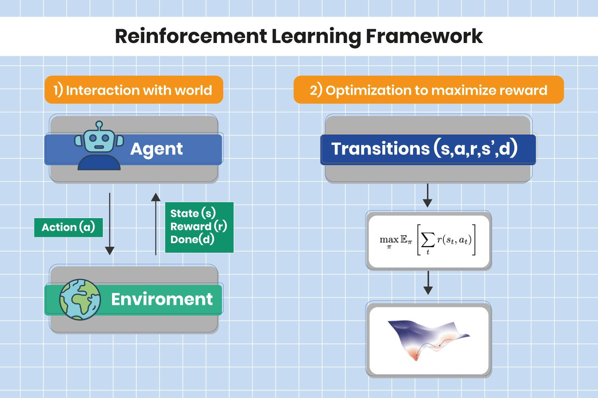

## Table of Contents

## What is reinforcement learning and how does it differ from other types of machine learning?

Reinforcement learning is a type of machine learning where an agent learns to make decisions by performing actions in an environment to achieve a goal. The agent receives feedback in the form of rewards or penalties, which helps it learn which actions are good or bad. Over time, the agent tries to maximize the total reward it gets by choosing the best actions. Imagine teaching a dog a new trick: you reward the dog with treats when it does the trick right, and the dog learns to repeat the action to get more treats.

Reinforcement learning differs from other types of machine learning like supervised and unsupervised learning. In supervised learning, the algorithm is trained on a dataset where the correct answers are already known, and it learns to predict outcomes based on that data. For example, if you want to teach a computer to recognize pictures of cats, you would show it many pictures labeled as "cat" or "not cat." In contrast, unsupervised learning involves finding patterns in data without any labeled outcomes, like grouping similar items together without knowing what those items are. Reinforcement learning is unique because it learns from trial and error in an interactive environment, rather than from a static dataset, making it suitable for problems where the best action depends on the current situation.

## What are the basic components of a reinforcement learning framework?

The basic components of a reinforcement learning framework include an agent, an environment, actions, states, and rewards. The agent is the learner or decision-maker that interacts with the environment. The environment is everything outside the agent that the agent can interact with. Actions are the choices the agent can make, and states represent the current situation of the environment. Rewards are the feedback the agent receives after taking an action, telling it whether the action was good or bad.

The agent's goal is to learn a policy, which is a strategy that tells the agent which action to take in each state to maximize the total reward over time. The agent starts with little to no knowledge and learns by trial and error. It takes actions, observes the new state and the reward it gets, and then updates its policy based on this information. Over many interactions, the agent refines its policy to make better decisions. The process can be described mathematically, where the expected return $$G_t$$ at time $$t$$ is the sum of future discounted rewards, and the agent's objective is to maximize this value.

## Can you explain the concept of an agent, environment, and reward in reinforcement learning?

In [reinforcement learning](/wiki/reinforcement-learning), an agent is like a learner or a decision-maker. Imagine it as a robot or a computer program that tries to figure out the best way to do things. The agent interacts with its surroundings, called the environment. The environment can be anything from a video game to a real-world scenario like a robot moving around a room. The agent takes actions in the environment, like moving left or right in a game, and the environment changes based on these actions. The agent's job is to learn how to make the best choices to achieve its goals.

The reward is like a score or feedback that the agent gets after taking an action. If the action helps the agent get closer to its goal, it gets a positive reward, like points in a game. If the action is not helpful, the agent might get a negative reward or no reward at all. The agent uses these rewards to learn which actions are good and which are bad. Over time, the agent tries to find a strategy, called a policy, that helps it get the highest total reward possible. The total reward the agent aims to maximize is called the expected return, which can be written as $$G_t = \sum_{k=0}^{\infty} \gamma^k R_{t+k+1}$$, where $$R$$ is the reward at each step and $$\gamma$$ is a discount [factor](/wiki/factor-investing) that makes future rewards less important than immediate ones.

## What are some common algorithms used in reinforcement learning frameworks?

Some common algorithms used in reinforcement learning are Q-learning and SARSA. Q-learning is a popular method where the agent learns to predict the best action to take in each state by estimating a value called the Q-value. The Q-value represents how good it is to take a certain action in a certain state. The agent updates these Q-values based on the rewards it gets and the best possible future rewards it can achieve. The formula for updating Q-values in Q-learning is $$Q(s, a) \leftarrow Q(s, a) + \alpha \left[ R + \gamma \max_{a'} Q(s', a') - Q(s, a) \right]$$, where $$s$$ is the current state, $$a$$ is the action taken, $$R$$ is the reward received, $$s'$$ is the next state, $$\alpha$$ is the learning rate, and $$\gamma$$ is the discount factor. Q-learning is called "off-policy" because it learns from actions that might not be the ones the agent would choose to take.

Another common algorithm is SARSA, which stands for State-Action-Reward-State-Action. SARSA is similar to Q-learning but it's "on-policy," meaning it learns from the actions the agent actually takes. In SARSA, the agent updates its Q-values based on the action it will take next, not the best possible action. The update rule for SARSA is $$Q(s, a) \leftarrow Q(s, a) + \alpha \left[ R + \gamma Q(s', a') - Q(s, a) \right]$$, where $$a'$$ is the next action the agent will take in the next state $$s'$$. SARSA can be more stable than Q-learning in some environments because it learns from the actual experiences of the agent.

There are also more advanced algorithms like Deep Q-Networks (DQN) and Proximal Policy Optimization (PPO). DQN combines Q-learning with deep neural networks to handle environments with large state spaces. It uses a technique called experience replay to learn from past experiences more efficiently. PPO is a policy gradient method that tries to find the best policy by directly optimizing the actions the agent takes. It does this in a way that makes the learning process stable and efficient. These algorithms are more complex but can handle more challenging tasks in reinforcement learning.

## How does the AM framework facilitate reinforcement learning?

The AM framework, or Actor-Model framework, helps reinforcement learning by breaking down the learning process into two main parts: the actor and the model. The actor is like a decision-maker that chooses what actions to take in the environment. The model, on the other hand, tries to understand how the environment works. By separating these two roles, the AM framework makes it easier for the agent to learn. The actor can focus on improving its actions based on the rewards it gets, while the model learns to predict what will happen next in the environment. This separation allows the agent to learn more efficiently because each part can be updated separately without messing up the other.

In the AM framework, the actor uses the model's predictions to decide which actions to take. For example, if the model predicts that moving right will lead to a high reward, the actor will be more likely to choose that action. The actor then updates its strategy, called the policy, based on the actual rewards it receives. The model, on the other hand, gets better at predicting the future by learning from the actual outcomes of the actor's actions. This back-and-forth helps the agent improve over time. The formula for updating the actor's policy might look like $$ \pi(a|s) \leftarrow \pi(a|s) + \alpha \nabla \log \pi(a|s) \cdot A(s,a) $$, where $$\pi(a|s)$$ is the policy, $$\alpha$$ is the learning rate, and $$A(s,a)$$ is the advantage function that tells how good the action was compared to others. By using the AM framework, reinforcement learning can be more effective and faster at finding the best ways to achieve goals.

## What unique features does RLAIF offer for reinforcement learning applications?

RLAIF, or Reinforcement Learning from AI Feedback, offers a unique approach to reinforcement learning by using feedback from another AI model to guide the learning process. Instead of relying solely on human-defined rewards, RLAIF uses an AI model to provide feedback on the agent's actions. This can be especially helpful in complex environments where it's hard for humans to come up with good reward signals. The AI feedback can be more detailed and nuanced, helping the agent learn faster and better. For example, if the agent is learning to play a game, the AI feedback can tell it not just if it won or lost, but also how well it did in different parts of the game.

One key feature of RLAIF is that it can adapt to changing environments more easily. Since the AI model providing feedback can learn and update its understanding of the environment, the agent can keep improving even as the environment changes. This makes RLAIF very useful for real-world applications where conditions might change over time. Another advantage is that RLAIF can help reduce the need for human input, making the learning process more automated and scalable. By using AI feedback, the agent can learn from a large number of interactions without needing constant human supervision.

## How does SCST improve upon traditional reinforcement learning methods?

SCST, or Self-Critical Sequence Training, improves upon traditional reinforcement learning methods by using a clever way to train the agent. Instead of just using rewards to guide the learning, SCST compares the agent's actions to a baseline. This baseline is usually the agent's own average performance. By doing this, SCST helps the agent focus on improving its weak points. For example, if the agent usually does well but sometimes makes big mistakes, SCST will push it to fix those mistakes. This makes the learning process more efficient because the agent knows exactly where it needs to improve.

Another way SCST improves traditional methods is by making the rewards more meaningful. In traditional reinforcement learning, the agent might get a reward that doesn't really show how well it did compared to other times. SCST solves this by using a formula like $$R = r - b$$, where $$r$$ is the actual reward the agent gets, and $$b$$ is the baseline reward. This difference, $$R$$, tells the agent how much better or worse it did compared to its average. By using this difference, SCST helps the agent learn from its own past performance, making the learning process more stable and effective.

## What are the advantages of using TLA in complex reinforcement learning scenarios?

TLA, or Temporal Logic of Actions, helps make reinforcement learning easier in tricky situations. It does this by letting us describe what we want the agent to do using clear rules. These rules are like instructions that tell the agent what to aim for, step by step. For example, if you want a robot to clean a room, TLA can help you tell it to first pick up the trash, then vacuum the floor, and finally put things back in order. By using TLA, we can break down complex tasks into smaller, easier parts, which makes it simpler for the agent to learn what to do.

Another advantage of using TLA is that it helps the agent understand the long-term goals better. In regular reinforcement learning, the agent might only focus on getting rewards right away, which can lead to it making bad choices in the long run. But with TLA, we can set up rules that guide the agent towards achieving bigger goals over time. For instance, if the agent is playing a game, TLA can help it understand that winning the game is more important than just getting points quickly. This way, the agent learns to make smarter decisions that lead to better results in the end.

## How does POMO enhance the efficiency of reinforcement learning processes?

POMO, or Policy Optimization with Multiple Objectives, helps make reinforcement learning faster and better by letting the agent work on many goals at the same time. Instead of focusing on just one goal, like getting a high score in a game, POMO lets the agent try to do several things well at once. For example, in a game, the agent might try to get a high score, avoid losing lives, and finish the level quickly all at the same time. By juggling multiple objectives, the agent learns to make better decisions that help it do well in many different ways, not just one.

This method also makes the learning process more stable. When an agent is learning, it can sometimes make big jumps in performance but then fall back. POMO helps smooth out these ups and downs by balancing the different goals the agent is working on. This balance helps the agent keep improving steadily without big swings in performance. By using POMO, the agent can learn more efficiently and reach its goals faster and more reliably.

## Can you describe the integration of DDQL in modern reinforcement learning frameworks?

Double Deep Q-Learning, or DDQL, is a smart way to make reinforcement learning better. It helps the agent learn to pick the best actions by fixing a problem that can happen with regular Q-learning. In Q-learning, the agent might think an action is good because it predicts a high reward, but it might be wrong. DDQL solves this by using two Q-networks instead of one. One network picks the action, and the other network tells how good that action is. This way, the agent gets a more accurate idea of which actions are really the best. The formula for updating the Q-values in DDQL is $$Q(s, a) \leftarrow Q(s, a) + \alpha \left[ R + \gamma Q'(s', \arg\max_{a'} Q(s', a')) - Q(s, a) \right]$$, where $$Q$$ and $$Q'$$ are the two Q-networks, and the other symbols are the same as in regular Q-learning.

DDQL is used in modern reinforcement learning frameworks to make them work better, especially in tricky environments. It's often used with deep neural networks, which can handle lots of information and learn from it. This makes DDQL great for tasks like playing video games or controlling robots, where the agent needs to understand a lot about the world around it. By using DDQL, the agent can learn faster and make fewer mistakes, which helps it reach its goals more reliably.

## What specific problems does myGym aim to solve in the reinforcement learning community?

myGym aims to solve the problem of making reinforcement learning easier and more accessible for everyone. It does this by providing a simple and flexible platform where people can create their own environments for training agents. This means that whether you're a student learning about reinforcement learning or a researcher working on a new project, you can quickly set up and test your ideas without needing to build everything from scratch. myGym helps users focus on the learning part of reinforcement learning, rather than spending time on the technical details of setting up environments.

Another problem myGym tackles is the need for diverse and realistic environments for training [agents](/wiki/agents). Traditional reinforcement learning environments might not always match real-world scenarios, which can limit how well an agent learns. myGym allows users to create environments that are more like the real world, which helps agents learn skills that are more useful in practical situations. By making it easy to design and share these environments, myGym encourages a community of users to contribute and improve the variety and quality of training scenarios available for reinforcement learning.

## How do advanced frameworks like Sym-NCO, MushroomRL, and Blue River Controls push the boundaries of reinforcement learning?

Sym-NCO, MushroomRL, and Blue River Controls are advanced frameworks that help push the boundaries of reinforcement learning by making it easier to handle complex and real-world problems. Sym-NCO, for example, uses symbolic methods to help the agent understand the environment better. This means the agent can learn from rules and patterns, not just from trial and error. This can be really helpful in situations where the environment is too complicated for the agent to figure out just by trying different things. MushroomRL, on the other hand, is great for researchers because it has a lot of different algorithms and tools built-in. This makes it easier for them to test new ideas and see how well they work. Blue River Controls focuses on using reinforcement learning for controlling systems in the real world, like robots or machines. It helps make sure that the agent's actions are safe and reliable, which is super important when you're dealing with physical things.

These frameworks also help by making reinforcement learning more efficient and scalable. For example, Sym-NCO can use formulas like $$Q(s, a) = \max_{\pi} \mathbb{E} \left[ \sum_{t=0}^{\infty} \gamma^t R_{t+1} | S_0 = s, A_0 = a, \pi \right]$$ to guide the agent's learning process more effectively. MushroomRL's wide range of algorithms means that researchers can quickly switch between different methods to find the best one for their problem. And Blue River Controls uses techniques to make sure the agent learns in a way that's safe for real-world applications. By providing these advanced tools and methods, these frameworks help push the field of reinforcement learning forward, making it possible to solve more challenging and practical problems.

## References & Further Reading

[1]: Sutton, R. S., & Barto, A. G. (1998). ["Reinforcement Learning: An Introduction"](https://ieeexplore.ieee.org/document/712192). MIT Press. This book provides a comprehensive introduction to the field of reinforcement learning and is a foundational resource.

[2]: Mnih, V., Kavukcuoglu, K., Silver, D., et al. (2015). ["Human-level control through deep reinforcement learning."](https://www.nature.com/articles/nature14236) Nature, 518, 529–533. This paper introduces Deep Q-Networks (DQN), a significant development in deep reinforcement learning.

[3]: Lillicrap, T. P., Hunt, J. J., Pritzel, A., et al. (2015). ["Continuous control with deep reinforcement learning."](https://arxiv.org/abs/1509.02971) arXiv preprint arXiv:1509.02971. This paper is essential for understanding continuous action spaces in reinforcement learning using deep learning techniques.

[4]: Schulman, J., Wolski, F., Dhariwal, P., et al. (2017). ["Proximal Policy Optimization Algorithms."](https://arxiv.org/abs/1707.06347) arXiv preprint arXiv:1707.06347. This work is informative for readers interested in policy gradient methods and Proximal Policy Optimization (PPO).

[5]: Watkins, C. J. C. H., & Dayan, P. (1992). ["Q-learning."](https://link.springer.com/article/10.1007/BF00992698) Machine Learning, 8(3-4), 279–292. This paper details Q-learning, a foundational algorithm in reinforcement learning.

[6]: Bellemare, M. G., Naddaf, Y., Veness, J., & Bowling, M. (2013). ["The Arcade Learning Environment: An Evaluation Platform for General Agents."](https://arxiv.org/abs/1207.4708) Journal of Machine Learning Research, 47, 1–47. This reference is pertinent for understanding how reinforcement learning agents are evaluated in simulated environments.

[7]: Sutton, R. S., McAllester, D., Singh, S., & Mansour, Y. (2000). ["Policy Gradient Methods for Reinforcement Learning with Function Approximation."](https://dl.acm.org/doi/10.5555/3009657.3009806) Advances in Neural Information Processing Systems. This paper provides insights into policy gradient methods, useful for readers interested in function approximation.