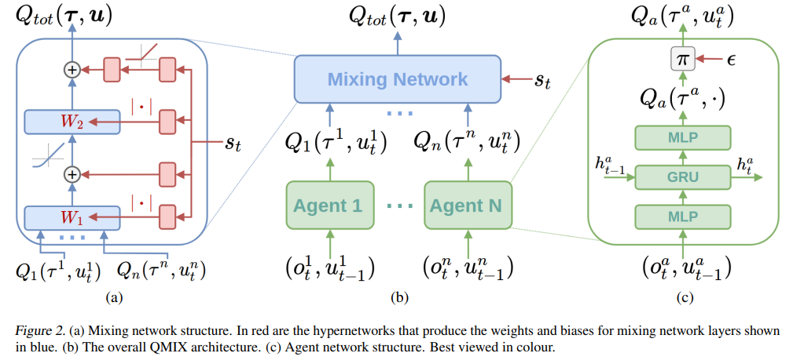

Reinforcement Learning (RL) is a branch of machine learning focused on how intelligent agents should act within an environment to maximize cumulative rewards over time. Unlike traditional supervised learning approaches, which rely on labeled datasets to infer outputs from inputs, RL emphasizes learning through direct interaction with the environment, allowing the agent to learn an optimal strategy or policy based on feedback in the form of rewards or penalties. This iterative process enables the system to improve decisions continuously.

RL has emerged as a significant area of interest in recent years within the financial sector, especially in algorithmic trading, where it is applied to enhance trading execution strategies. Algorithmic trading automates trading processes in financial markets using algorithm-driven strategies. Execution, as a critical component of this system, involves strategically placing orders in the marketplace to minimize costs and optimize performance metrics such as execution speed, market impact, and slippage.



The integration of RL into execution strategies in algorithmic trading enhances the decision-making process. By continually learning from and adapting to evolving market dynamics, RL-based execution strategies have the potential to outperform static or less adaptive algorithms. This adaptability is particularly advantageous in the fast-paced and ever-changing landscape of financial markets, where minor inefficiencies can have significant impacts on execution outcomes.

In this article, we will explore how reinforcement learning can be employed to refine execution-focused algorithmic trading. We will discuss the benefits that RL offers in optimizing execution strategies and some of the common RL methodologies applied in this context. These discussions will shed light on how RL is transforming trading execution and pushing the boundaries of what's possible in automated trading.

## Table of Contents

## What is Reinforcement Learning?

Reinforcement Learning (RL) is a subset of machine learning where an agent learns optimal decision-making by interacting with its environment. In RL, the agent makes decisions by taking specific actions and experiences feedback in terms of rewards or penalties. The objective is to derive a policy that maximizes the cumulative long-term reward.

Unlike supervised learning paradigms, RL does not rely on a dataset with pre-labeled inputs and outputs. Rather, it operates through trial and error, utilizing the outcomes of past actions to inform future decisions. This interaction with the environment is central to the learning process, allowing the agent to adapt and optimize its strategy over time.

The main components of an RL system include:

1. **Agent**: The learner or decision-maker that interacts with the environment.  
2. **Environment**: The external system with which the agent interacts. The environment responds to the agent's actions and presents new situations or states.
3. **State**: A representation of the current situation as perceived by the agent. The state serves as the input for the decision-making process.
4. **Action**: The set of all possible moves the agent can make at any given state. Actions are chosen based on a policy that can be deterministic or stochastic.
5. **Reward**: A scalar value the agent receives after taking an action in a particular state. It serves as a feedback mechanism to indicate how favorable the action's outcome is.

The agent's task is to learn a policy $\pi(a | s)$, where $a$ is an action and $s$ is a state, which maps states to actions in a way that maximizes the expected return. The return is typically defined as the discounted sum of all future rewards:

$$
G_t = R_{t+1} + \gamma R_{t+2} + \gamma^2 R_{t+3} + \cdots = \sum_{k=0}^{\infty} \gamma^k R_{t+k+1}
$$

where $\gamma$ is a discount factor between 0 and 1, balancing the importance of immediate and future rewards.

The learning process relies heavily on algorithms such as Q-Learning and Policy Gradient Methods, which seek to improve the policy iteratively by estimating or optimizing certain expected rewards. These algorithms often employ techniques such as function approximation to handle scenarios with large state or action spaces, which is crucial for their applicability to real-world problems.

## Reinforcement Learning in Algorithmic Trading

Reinforcement Learning (RL) has emerged as a compelling approach in the domain of [algorithmic trading](/wiki/algorithmic-trading), aimed at developing strategies that can adjust to the complex and ever-shifting landscape of financial markets. The primary advantage of using RL in this context is its ability to autonomously devise and refine trading strategies through iterative interactions with the market environment.

In a typical RL framework, an agent is deployed within the simulated market environment—acting on various trading decisions as it learns. The core objective is to optimize a policy $\pi(a | s)$, where the policy defines a strategy that tells the agent which actions $a$ to take given a particular state $s$. Each action taken by the agent results in feedback from the environment, referred to as the reward signal, which evaluates the success of the action with respect to the agent’s objectives, such as profit maximization or risk reduction.

Python code can help conceptualize an RL agent making trading decisions:

```python
import numpy as np

class TradingRLAgent:
    def __init__(self, state_size, action_size, learning_rate=0.01, discount_factor=0.99):
        self.state_size = state_size
        self.action_size = action_size
        self.learning_rate = learning_rate
        self.discount_factor = discount_factor
        self.q_table = np.zeros((state_size, action_size))

    def choose_action(self, state):
        return np.argmax(self.q_table[state, :])

    def update_q_value(self, state, action, reward, next_state):
        best_next_action = np.argmax(self.q_table[next_state, :])
        td_target = reward + self.discount_factor * self.q_table[next_state, best_next_action]
        td_error = td_target - self.q_table[state, action]
        self.q_table[state, action] += self.learning_rate * td_error

# Example of how an agent might interact:
state = get_current_market_state()
action = agent.choose_action(state)
reward, next_state = perform_trade_action(action)
agent.update_q_value(state, action, reward, next_state)
```

The RL agent benefits from continual exposure to new market data, allowing it to refine and enhance its policies over time. This adaptability is crucial given the dynamic nature of financial markets, where factors like news events, regulatory changes, or economic signals can abruptly affect market conditions. The process of continuously learning and adapting is known as online or continual learning, a hallmark advantage that RL brings to trading.

One significant aspect of leveraging RL in algorithmic trading is the capacity to extract informational features from vast streams of market data, transforming high-frequency data into actionable insights. As the agent processes these data streams, it learns to recognize patterns and anomalies that might inform future trading decisions.

Ultimately, the integration of RL into algorithmic trading is a testament to its capabilities in navigating complex systems and crafting adaptive strategies. As models evolve, their capacity to not only react but also anticipate market moves marks an evolutionary step in the realm of financial strategy optimization.

## Benefits of Reinforcement Learning in Execution

Reinforcement Learning (RL) introduces significant advancements in execution strategies within algorithmic trading, offering a distinct set of benefits. One of the primary advantages is the enhanced decision-making process facilitated by an RL agent's ability to continuously learn from realtime market data. Unlike traditional models that rely on static rules or fixed parameters, RL systems dynamically adjust their strategies based on ongoing interactions with the market. This adaptability allows RL [agents](/wiki/agents) to better anticipate market movements, leading to more informed trading decisions.

Furthermore, RL plays a pivotal role in minimizing trading costs by optimizing order execution. In financial markets, trading costs are a critical concern, involving expenses such as slippage, market impact, and transaction fees. By leveraging RL, traders can implement strategies that effectively balance these costs while maximizing execution quality. For example, an RL agent might learn to split large orders into smaller ones and time their execution to reduce market impact, thereby optimizing the overall cost structure.

A key feature of RL is its ability to adapt to changing market conditions, providing a competitive edge over static trading strategies. Traditional algorithms may struggle with adjusting to [volatility](/wiki/volatility-trading-strategies), sudden market shifts, or structural changes. On the other hand, RL agents employ a framework that continuously updates their understanding of the environment, allowing them to respond to new patterns and anomalies as they arise. This adaptability not only enhances performance but also allows for maintaining robustness in various market scenarios, offering a significant advantage in environments characterized by uncertainty and rapid changes.

In essence, RL empowers algorithmic trading systems with an advanced level of flexibility and intelligence, crucial for maintaining competitiveness in the fast-paced financial sector. By learning from fresh market data, optimizing execution pathways, and embracing adaptability, [reinforcement learning](/wiki/reinforcement-learning)-driven strategies present an increasingly attractive proposition in the pursuit of enhanced execution efficiency.

## Challenges and Considerations

Market environments present significant challenges due to their inherent complexity and unpredictability. These factors can impede reinforcement learning (RL) agents from consistently learning optimal strategies. One of the main challenges arises from the dynamic and stochastic nature of financial markets, which can lead to drastic changes in the environment that the RL agent may not have previously encountered. This requires the RL systems to be robust and adaptable, able to effectively generalize across diverse market conditions and not just overfit to specific historical patterns.

Another challenge is the handling of high-frequency data, which is often vast and noisy. This necessitates efficient data processing and feature extraction methods to ensure that the RL agent is learning from reliable information. High-frequency data can overwhelm an RL system if not duly processed and filtered, potentially leading to incorrect decision-making and suboptimal policy formation. Advanced techniques in data preprocessing, such as dimensionality reduction and noise filtering, are critical to distilling meaningful features from raw data.

Additionally, there is a need to ensure that the strategies learned by RL agents are robust and generalizable. This involves not only training the agent on diverse datasets that reflect a variety of market scenarios but also implementing regularization techniques to prevent overfitting. Employing methods such as cross-validation and robustness testing can aid in evaluating how well an RL agent's strategy can withstand different market environments. These approaches are essential to ascertain that the learned policies are not skewed by anomalies or temporary market aberrations but instead are capable of maintaining performance across fluctuating market conditions. 

Therefore, researchers and practitioners must continually refine RL algorithms, integrating resilience against unpredictability and ensuring adept handling of large-scale, noisy datasets to craft sophisticated execution strategies.

## Common RL Techniques in Execution

Reinforcement Learning (RL) techniques play a significant role in optimizing execution strategies within algorithmic trading. Among these techniques, Q-Learning, Policy Gradient Methods, and Deep Reinforcement Learning have emerged as notable approaches.

**Q-Learning** is a fundamental value-based method in RL, where an agent learns a quality function, denoted as $Q(s, a)$. This function evaluates the expected cumulative reward of taking a specific action $a$ in a given state $s$. The core principle of Q-Learning involves updating the Q-values iteratively using the Bellman equation:

$$
Q(s, a) \leftarrow Q(s, a) + \alpha \left( r + \gamma \max_{a'} Q(s', a') - Q(s, a) \right)
$$

Here, $\alpha$ represents the learning rate, $r$ is the received reward, and $\gamma$ is the discount [factor](/wiki/factor-investing). Through continuous interaction with the environment, the agent refines its Q-values, enabling it to identify optimal trading actions given the current market state.

**Policy Gradient Methods** differ from value-based methods like Q-Learning by focusing directly on optimizing the policy $\pi(a|s)$, which defines the probability distribution over actions given a particular state. These methods are especially beneficial in complex environments where the action space is vast or continuous. The objective is to maximize the expected reward by adjusting policy parameters $\theta$, typically using gradient ascent on the performance measure $J(\pi_\theta)$. The update rule for the parameters can often be expressed as:

$$
\theta \leftarrow \theta + \alpha \nabla_\theta J(\pi_\theta)
$$

Policy gradient methods, such as REINFORCE or Proximal Policy Optimization (PPO), offer advantages in situations where direct policy modeling provides more flexible representation of strategies.

**Deep Reinforcement Learning** combines the representational power of deep neural networks with RL to manage high-dimensional state spaces. Deep Q-Networks (DQNs) are a prominent example where a neural network is used to approximate the Q-value function. This approach allows the agent to process and learn from raw market data, such as price movements or order book dynamics, without requiring extensive feature engineering. The Q-values are updated as:

$$
Q(s, a; \theta) \leftarrow r + \gamma \max_{a'} Q(s', a'; \theta^-)
$$

Where $\theta$ denotes the parameters of the [neural network](/wiki/neural-network), and $\theta^-$ represents the target network's parameters, updated less frequently to stabilize training.

These RL techniques enable the development of adaptive and robust execution strategies capable of responding to the ever-changing conditions in financial markets. By continuously learning and optimizing their decision-making processes, these methods help in improving execution efficiency and reducing costs associated with trading.

## Future Prospects

As financial markets continue to evolve, the role of Reinforcement Learning (RL) in trading and execution is poised to expand significantly. The dynamic nature of these markets creates a conducive environment for the application of intelligent, adaptive models. Emerging technologies, coupled with increased computational power, are setting the stage for the deployment of more sophisticated RL models in trading systems.

Advancements in hardware, such as Graphics Processing Units (GPUs) and Tensor Processing Units (TPUs), enhance the capability of processing large volumes of trading data swiftly. These technological improvements enable the training of complex RL models that were previously computationally prohibitive. The ability to process and analyze high-frequency data, which is characteristic of modern markets, allows for the application of models capable of learning and executing trades rapidly and efficiently.

Ongoing research in RL is increasingly focused on overcoming the challenges associated with modeling financial markets. One promising area is the development of advanced algorithms that can better handle high-dimensional state spaces. This complexity arises from the multitude of factors influencing market dynamics, including geopolitical events, macroeconomic indicators, and investor sentiment. Techniques such as Deep Reinforcement Learning (DRL), which integrates deep neural networks with traditional RL methodologies, show considerable promise in addressing these challenges. DRL algorithms like Deep Q-Networks (DQNs) and Proximal Policy Optimization (PPO) are examples where neural networks approximate optimal policies or value functions, facilitating decision-making in intricate environments.

Research is also directed towards improving the robustness and generalizability of RL strategies. The stochastic nature of markets demands that RL models are not only adaptive but also resilient to varying conditions. Approaches like model-based RL, which incorporate predictions about market behavior into the learning process, offer potential solutions for crafting strategies that are both robust and adaptable.

The convergence of RL with other technological trends, such as quantum computing and blockchain, could further enhance trading strategies. Quantum computing presents possibilities for solving complex optimization problems at unprecedented speeds, while blockchain technology offers transparent and secure platforms for executing RL strategies.

In conclusion, the future prospects for RL in trading and execution are bright. As computational capabilities continue to grow and as the understanding of sophisticated [machine learning](/wiki/machine-learning) techniques deepens, RL is expected to play a crucial role in innovating trading strategies that keep pace with advanced trading dynamics and the intricate complexities of global markets.

## Conclusion

Reinforcement Learning (RL) is demonstrating significant potential in the realm of algorithmic trading, especially in the sphere of execution optimization. By employing RL, traders can harness the power of adaptive decision-making that evolves with market dynamics. This adaptability is pivotal in navigating the volatile nature of financial markets, where static strategies may falter. RL agents excel in learning from continuous streams of market data, thus refining their strategies to achieve cost-effective order execution and enhanced performance metrics.

Despite facing complexities such as the unpredictability of market environments and the demand for robust, generalizable strategies, RL offers a competitive edge by minimizing trading costs and dynamically adjusting to evolving conditions. These capabilities empower traders to better manage risks and explore innovative approaches to maximize their reward functions over extended horizons. Continuous advancements in this field are anticipated as RL converges with financial technologies, paving the way for more nuanced and powerful trading algorithms.

The integration of machine learning in finance is expected to further drive innovation in trading strategies, promoting the development of sophisticated models capable of handling increasingly complex market scenarios. As computational power expands and research in RL progresses, the potential for deploying more advanced RL models in trading becomes more viable. This continued evolution is likely to transform traditional trading paradigms, enabling more efficient and effective execution strategies that align with the intricacies of modern financial markets.

## References & Further Reading

[1]: Sutton, R. S., & Barto, A. G. (2018). ["Reinforcement Learning: An Introduction."](https://web.stanford.edu/class/psych209/Readings/SuttonBartoIPRLBook2ndEd.pdf) MIT Press.

[2]: Silver, D., Schrittwieser, J., Simonyan, K., Antonoglou, I., Huang, A., Guez, A., ... & Hassabis, D. (2017). ["Mastering the game of Go without human knowledge."](https://www.nature.com/articles/nature24270) Nature, 550(7676), 354-359.

[3]: Mnih, V., Kavukcuoglu, K., Silver, D., Rusu, A. A., Veness, J., Bellemare, M. G., ... & Hassabis, D. (2015). ["Human-level control through deep reinforcement learning."](https://www.nature.com/articles/nature14236) Nature, 518(7540), 529-533.

[4]: Li, Y., & Malik, J. (2017). ["Learning to optimize."](https://arxiv.org/abs/1606.01885) Preprint arXiv:1606.01885.

[5]: ["Advances in Financial Machine Learning"](https://www.amazon.com/Advances-Financial-Machine-Learning-Marcos/dp/1119482089) by Marcos Lopez de Prado

[6]: ["Artificial Intelligence in Finance: A Python-Based Guide"](https://www.amazon.com/Artificial-Intelligence-Finance-Python-Based-Guide/dp/1492055433) by Yves Hilpisch

[7]: Metzger, M., & Katiffe, A. (2020). ["Reinforcement learning in finance: A survey."](https://ieeexplore.ieee.org/document/9904958) Preprint arXiv:1911.06207.