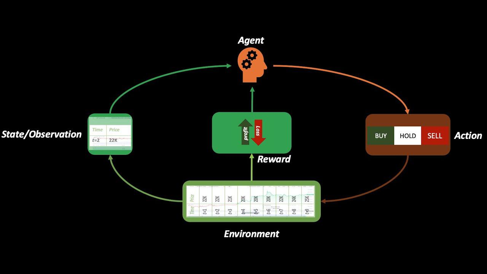

## Table of Contents

## What is reinforcement learning and how does it apply to finance?

Reinforcement learning is a type of artificial intelligence where an agent learns to make decisions by taking actions in an environment and receiving rewards or penalties. It's like learning from trial and error. The agent tries different actions, sees what happens, and adjusts its behavior to get the best outcome over time. The goal is to find a strategy that maximizes the total reward.

In finance, reinforcement learning can be used to make better investment decisions. For example, an AI system could use it to decide when to buy or sell stocks. The system would learn from past trades, figuring out which strategies lead to profits and which lead to losses. Over time, it gets better at making choices that increase returns. This can help manage portfolios more effectively, adapting to changes in the market automatically.

## Can you explain the basic components of a reinforcement learning system in the context of financial markets?

In a reinforcement learning system applied to financial markets, there are three main parts: the agent, the environment, and the reward. The agent is like a smart trader that makes decisions, like whether to buy or sell stocks. The environment is the stock market itself, where the agent's actions happen. Every time the agent makes a move, like buying a stock, the environment changes a bit, like the stock price going up or down.

The reward is how the agent knows if it made a good or bad decision. If the agent buys a stock and the price goes up, it gets a positive reward because it made money. If the price goes down, it gets a negative reward because it lost money. Over time, the agent learns from these rewards to make better choices. It tries different strategies, sees what works, and adjusts its actions to get more rewards, which means making more profit in the financial market.

## How does reinforcement learning differ from other machine learning methods in financial applications?

Reinforcement learning is different from other [machine learning](/wiki/machine-learning) methods in finance because it learns by doing. It's like a trader trying different strategies in the market, seeing what works, and getting better over time. Other methods, like supervised learning, use past data to predict future outcomes. For example, they might look at past stock prices to guess what will happen next. But [reinforcement learning](/wiki/reinforcement-learning) doesn't just predict; it acts and learns from the results of those actions.

In finance, this means reinforcement learning can adapt to new situations better than other methods. It can handle the ever-changing nature of the market because it's always learning from its latest trades. Supervised learning might struggle if the market behaves differently than it did in the past data it was trained on. Meanwhile, unsupervised learning, which looks for patterns in data without specific outcomes in mind, can be useful for finding hidden trends but doesn't make decisions like reinforcement learning does. So, reinforcement learning stands out by making and learning from real-time decisions, which is very valuable in the dynamic world of finance.

## What are some common challenges faced when applying reinforcement learning to financial trading?

One big challenge when using reinforcement learning in financial trading is dealing with the randomness of the market. The stock market can be unpredictable, and small changes can lead to big swings in prices. This makes it hard for the reinforcement learning system to learn a good strategy because what worked yesterday might not work today. The system needs a lot of data and time to figure out what's really a good move and what's just luck.

Another challenge is the cost of making mistakes. In trading, every wrong decision can cost money. While the system is learning, it might make bad trades that lose money. This is risky, especially if the system is managing a lot of money. Traders have to find a balance between letting the system learn and keeping losses under control. It's like teaching a kid to ride a bike; you want them to learn, but you don't want them to crash too hard.

Lastly, there's the problem of overfitting. This happens when the system learns too well from past data and doesn't do well with new, different situations. In finance, the market is always changing, so a system that's too focused on past patterns might not adapt well to new trends. Traders need to make sure their reinforcement learning system can handle new data and stay flexible, which is easier said than done.

## Can you provide examples of successful implementations of reinforcement learning in finance?

One successful example of reinforcement learning in finance is the work done by researchers at J.P. Morgan. They created an AI system that uses reinforcement learning to manage a portfolio of stocks. The system learns by trying different trading strategies and seeing which ones make the most money. Over time, it gets better at [picking](/wiki/asset-class-picking) the right stocks to buy and sell. This has helped J.P. Morgan make better investment decisions and improve their returns.

Another example is a [hedge fund](/wiki/hedge-fund-trading-strategies) called Man AHL, which uses reinforcement learning to trade in the foreign exchange market. Their AI system learns from past trades and adjusts its strategies to make more profit. It can handle the fast-changing nature of the currency markets and has shown good results. This has helped Man AHL stay ahead in the competitive world of trading.

## How can reinforcement learning be used to optimize portfolio management?

Reinforcement learning can help with portfolio management by making smart choices about which investments to buy or sell. It's like having a computer that learns from its past trades. If it buys a stock and the price goes up, it gets a reward. If the price goes down, it gets a penalty. Over time, the computer figures out which strategies work best and changes its actions to make more money. This helps manage a portfolio better because the computer can try lots of different approaches and learn from what works and what doesn't.

In portfolio management, markets can change quickly, and what worked last week might not work this week. Reinforcement learning is good at handling these changes because it keeps learning and adjusting. It can look at lots of data, like stock prices and news, to decide what to do next. This means the portfolio can adapt to new situations and try to make the most money possible. By using reinforcement learning, portfolio managers can have a system that gets better over time and helps them make smarter investment choices.

## What role does the reward function play in financial reinforcement learning models?

The reward function is like a scorekeeper in financial reinforcement learning models. It tells the computer if it made a good or bad decision when it buys or sells stocks. If the computer buys a stock and the price goes up, the reward function gives it a high score, which means it did well. If the price goes down, it gets a low score, showing it made a mistake. This helps the computer learn what works and what doesn't, so it can make better choices next time.

In portfolio management, the reward function is really important because it guides the computer to make decisions that will make the most money. It's not just about one trade; the reward function looks at the big picture and helps the computer find the best way to manage the whole portfolio. By using the reward function, the computer can keep learning and adjusting its strategies to do better in the ever-changing world of finance.

## How do you handle the exploration-exploitation trade-off in financial reinforcement learning?

In financial reinforcement learning, the exploration-exploitation trade-off is like deciding whether to try new things or stick with what works. Exploration means trying out different trading strategies to see if they can make more money. This is important because the market changes, and what worked before might not work now. But if you explore too much, you might make mistakes and lose money. Exploitation, on the other hand, means using the strategies that have already been successful. This can make money in the short term, but it might miss out on better opportunities if the market changes.

Balancing exploration and exploitation is key. One way to do this is by using something called an epsilon-greedy strategy. This means most of the time, the computer sticks with what it knows works (exploitation), but sometimes, it tries something new (exploration). The trick is to set the right balance so the computer learns enough new things without taking too many risks. Over time, this helps the computer find the best way to make money in the ever-changing financial markets.

## What are the ethical considerations of using reinforcement learning in financial markets?

Using reinforcement learning in financial markets brings up some big ethical questions. One main concern is fairness. If only some big companies can use these smart systems, it might not be fair to others who can't afford them. This could make the rich get richer and leave smaller investors behind. Also, these systems can learn to do things that might not be good for everyone, like causing big price changes in the market that can hurt other people's investments.

Another issue is transparency. It's hard to understand how these systems make their choices, which can be a problem if things go wrong. People might not trust a system they can't understand, especially if it's handling their money. Plus, there's the risk of the system making bad decisions that could lead to big losses. It's important to think about how to use reinforcement learning in a way that's fair and safe for everyone involved in the financial markets.

## How can one evaluate the performance of a reinforcement learning model in a financial setting?

To evaluate how well a reinforcement learning model is doing in a financial setting, you can look at how much money it makes over time. This means checking if the model's trading decisions are leading to profits or losses. You can do this by comparing the model's performance to a simple strategy, like just buying and holding stocks. If the model is making more money than this simple strategy, it's doing a good job. Another way is to use something called "sharpe ratio," which looks at the reward compared to the risk. A higher sharpe ratio means the model is making good returns without taking too many risks.

It's also important to see how the model handles different market conditions. You can test this by using past data to see how the model would have done during times when the market went up or down a lot. This helps you understand if the model can adapt to changes in the market. Another thing to consider is how often the model makes big mistakes. You want to make sure it's not taking too many risky trades that could lead to big losses. By looking at these different measures, you can get a good idea of how well the reinforcement learning model is performing in the financial world.

## What advanced techniques can enhance the effectiveness of reinforcement learning in complex financial environments?

One way to make reinforcement learning better in the tricky world of finance is by using something called "deep reinforcement learning." This combines reinforcement learning with a type of [artificial intelligence](/wiki/ai-artificial-intelligence) called neural networks. Neural networks can handle lots of information and find patterns in it. In finance, this means the system can look at all sorts of data, like stock prices, news, and even social media, to make smarter trading decisions. By using deep reinforcement learning, the system can learn more complex strategies and adapt better to the ever-changing market.

Another technique is called "multi-agent reinforcement learning." Instead of having one system making all the decisions, you can have several systems working together. Each system, or agent, can learn different parts of the market or try different strategies. They can share what they learn with each other, which helps them all get better faster. In finance, this can be useful because the market is so big and complex. By working together, these agents can cover more ground and make better overall decisions. This teamwork approach can lead to smarter and more effective trading strategies.

## How might future developments in reinforcement learning impact the finance industry?

Future developments in reinforcement learning could really change how the finance industry works. As these systems get smarter, they'll be able to handle even more data and make better decisions faster. This means they could find new ways to make money that people might not have thought of before. They could also help manage risks better by learning from past mistakes and figuring out how to avoid big losses. With these improvements, more companies might start using reinforcement learning, making the whole industry more competitive and efficient.

Another big impact could be in making trading more accessible to everyone. As the technology gets cheaper and easier to use, even small investors might be able to use these smart systems. This could level the playing field a bit, giving more people a chance to make smart investment choices. But it also means we'll need to think carefully about how to use these systems fairly and safely. As reinforcement learning keeps growing, it's important to make sure it helps everyone and doesn't just make things harder for some people.

## What are the Basics of Reinforcement Learning?

Reinforcement learning (RL) is a distinct branch of machine learning wherein an agent learns to make decisions through interactions with an environment, aiming to maximize cumulative rewards. This form of learning diverges from supervised learning, as it does not rely on predefined input-output pairs. Instead, RL focuses on learning from the consequences of actions, exploring the trade-off between exploration (trying new actions) and exploitation (choosing known beneficial actions).

There are several key components in RL:

1. **Agent**: The learner or decision-maker, which takes actions in the environment.

2. **Environment**: The world within which the agent operates. It provides feedback in the form of states and rewards based on the actions taken by the agent.

3. **Actions**: The set of all possible moves the agent can make within the environment. This could be discrete or continuous.

4. **Rewards**: Feedback from the environment, provided as a scalar value that tells the agent how good or bad an action was in a particular state.

5. **Policy**: A strategy employed by the agent to determine the next action based on the current state. It can be deterministic or stochastic.

The mathematical foundation of RL is often modeled as a Markov Decision Process (MDP), characterized by:

- A finite set of states $S$.
- A finite set of actions $A$.
- Transition probabilities $P(s' | s, a)$ that describe the probability of moving from state $s$ to state $s'$ given action $a$.
- A reward function $R(s, a, s')$ that provides the immediate reward received after transitioning from state $s$ to state $s'$ due to action $a$.

The agent’s objective is to find a policy $\pi(a|s)$ that maximizes the expected sum of the rewards over time, known as the return. The return $G_t$ at time $t$ can be expressed as:

$$
G_t = R_{t+1} + \gamma R_{t+2} + \gamma^2 R_{t+3} + \cdots = \sum_{k=0}^{\infty} \gamma^k R_{t+k+1}
$$

where $\gamma$ is the discount factor, a value between 0 and 1, that influences the importance of future rewards.

In the context of [algorithmic trading](/wiki/algorithmic-trading), RL can be employed to develop strategies that dynamically adapt to market conditions. The financial market is a quintessential dynamic environment where decision-making is intricate and highly dependent on the timing and sequencing of trades. An algorithmic trading agent might form part of an RL framework by:

- Viewing market data as the environment's state.
- Selecting buy/sell actions to maximize portfolio returns.
- Receiving rewards based on trading performance metrics such as profits or portfolio growth rates.

Reinforcement learning’s capacity to iteratively improve through cycles of exploration and exploitation renders it exceptionally suited to the nuanced challenges of financial markets, where traditional predictive models might falter due to high [volatility](/wiki/volatility-trading-strategies) and latent market variables. This adaptability is one of the core strengths of RL, allowing for the continuous refinement of strategies to align with real-time market dynamics.

## What are the applications of reinforcement learning in finance?

Reinforcement learning (RL) has become an integral component of algorithmic trading within the financial sector, demonstrating its capacity to create sophisticated trading strategies that adapt to varying market conditions. This adaptability makes RL especially valuable in volatile environments, enabling financial institutions to capitalize on sudden shifts and trends.

In the domain of algorithmic trading, RL-based strategies distinguish themselves by continuously learning and refining their decision-making processes. This capability is particularly valuable in portfolio management, where the goal is to optimize asset allocations to achieve the highest possible returns while managing risk. By learning from historical data, RL algorithms can assess the risk-return trade-offs and make informed decisions to balance or diversify a portfolio effectively.

Additionally, RL is applied in risk management, where the focus is on minimizing potential losses while maintaining exposure to potential gains. RL algorithms can dynamically adjust risk exposure by evaluating the expected future states of the market. This is achieved through the formulation of policies that anticipate unfavorable market movements, thereby allowing institutions to hedge against these risks in a timely manner.

Market making, another crucial area within financial markets, benefits from RL by optimizing bid and ask prices to ensure [liquidity](/wiki/liquidity-risk-premium) and profitability. RL algorithms in [market making](/wiki/market-making) seek to maximize the difference between the bid-ask spread while managing inventory risk. The continuous interaction with the market allows these algorithms to adjust their strategies based on the observed order flow and market conditions.

Numerous case studies highlight the success of RL [agents](/wiki/agents) in outperforming traditional trading strategies. These agents utilize a feedback loop to enhance performance by learning from the outcomes of their actions. For example, via the use of deep Q-networks (DQNs), RL agents effectively estimate the value of potential actions in a given state without the need for explicit modeling of the market dynamics. This leads to enhanced performance over static models, which are often unable to accommodate the fluctuating nature of financial markets.

Mathematically, the RL framework can be expressed as a Markov Decision Process (MDP), characterized by the tuple $(S, A, P, R, \gamma)$, where $S$ represents the state space, $A$ the action space, $P$ the transition probabilities between states, $R$ the reward function, and $\gamma$ the discount [factor](/wiki/factor-investing). The objective is to determine a policy $\pi : S \rightarrow A$ that maximizes the expected cumulative reward: 

$$
V^\pi(s) = \mathbb{E}_\pi \left[ \sum_{t=0}^{\infty} \gamma^t R(s_t, a_t) \mid s_0 = s \right]
$$

Python has become a favored programming language to implement and test RL algorithms due to its extensive libraries and frameworks, such as TensorFlow, PyTorch, and OpenAI’s Gym, which facilitate the development and simulation of RL environments.

Overall, RL continues to present unique opportunities in finance, allowing strategies to adapt and evolve with the dynamic nature of financial markets. This capability signifies a pivotal development in how trading strategies are formulated and executed, fostering greater efficiency and effectiveness in financial operations.

## What are some case studies and real-world examples?

Reinforcement learning (RL) has found practical applications in various sectors of financial markets, significantly enhancing algorithmic trading strategies. Below are notable instances where RL has been successfully implemented, showcasing its versatility and efficacy.

One prominent example is the use of RL in stock trading systems. For instance, JPMorgan Chase has incorporated RL into its trading algorithms to improve market predictions and trading performance. The RL agent's ability to continuously learn and adapt to new data allows the firm to develop trading strategies that are more responsive to market changes. These RL models often employ Deep Q-Networks (DQNs) to optimize execution strategies. The agent observes the environment and selects actions to maximize a cumulative reward, which typically represents the trading profit. The equation used in these models, based on the Bellman Equation, is:

$$
Q(s, a) = r + \gamma \max_{a'} Q(s', a')
$$

where $Q(s, a)$ is the expected reward of an action $a$ taken in state $s$, $r$ is the reward received after taking action $a$, $\gamma$ is the discount factor, and $s'$ is the new state after taking action $a$.

In [forex](/wiki/forex-system) trading, RL algorithms have been used to execute trades automatically. Forex markets are highly volatile and require strategies that adapt swiftly to changing conditions. RL models like the Proximal Policy Optimization (PPO) algorithm are employed to handle such volatilities effectively. These models benefit from their capacity to optimize currency [pair trading](/wiki/pair-trading) strategies, thereby increasing trade success rates while minimizing risk.

The [cryptocurrency](/wiki/cryptocurrency) market, known for its unpredictability and rapid shifts, represents another area where RL's adaptability proves advantageous. Algorithms such as Recurrent Reinforcement Learning (RRL) have been employed by firms to navigate the cryptocurrency trading landscape. RRL leverages the Recurrent Neural Network's structure to handle sequential data, which is abundant in the context of time-series trading data for cryptocurrencies. The RL models can be fine-tuned to execute buy, hold, or sell strategies depending on the reward policy defined by the firm's objectives.

Beyond specific sectors, algorithmic trading systems often incorporate RL for strategic asset allocation and risk management. By integrating RL with traditional portfolio management techniques, firms can achieve more dynamic risk-return profiles. For example, in risk management, RL is combined with Value at Risk (VaR) frameworks to balance potential losses with attainable returns.

These case studies illustrate the transformative potential of RL across various domains of financial markets. As RL technology continues to mature, it is expected to further optimize trading strategies, cope with complex decision-making environments, and ultimately enhance profitability for financial institutions.

## References & Further Reading

[1]: Sutton, R. S., & Barto, A. G. (1998). ["Reinforcement Learning: An Introduction"](https://ieeexplore.ieee.org/document/712192). MIT Press.

[2]: Mnih, V., Kavukcuoglu, K., Silver, D., Rusu, A. A., et al. (2015). ["Human-level control through deep reinforcement learning."](https://www.nature.com/articles/nature14236) Nature, 518, 529–533.

[3]: Silver, D., Huang, A., Maddison, C. J., Guez, A., et al. (2016). ["Mastering the game of Go with deep neural networks and tree search."](https://www.nature.com/articles/nature16961) Nature, 529, 484–489.

[4]: Lopez de Prado, M. (2018). ["Advances in Financial Machine Learning."](https://books.google.com/books/about/Advances_in_Financial_Machine_Learning.html?id=oU9KDwAAQBAJ) John Wiley & Sons.

[5]: Moody, J., Saffell, M. (2001). ["Learning to trade via direct reinforcement."](https://ieeexplore.ieee.org/document/935097) Neural Computation, 12(4), 875-905.

[6]: Alp, T. Y., & Sami, T. (2017). ["Deep Reinforcement Learning for Algorithmic Trading."](https://arxiv.org/abs/2106.00123) Proceedings of the Fields Workshop on Big Data.

[7]: Jansen, S. (2020). ["Machine Learning for Algorithmic Trading: Predictive models to extract signals from market and alternative data for systematic trading strategies with Python."](https://github.com/stefan-jansen/machine-learning-for-trading) Packt Publishing.

[8]: Chan, E. P. (2009). ["Quantitative Trading: How to Build Your Own Algorithmic Trading Business."](https://github.com/egorpe/EPChan-QuantitativeTrading/blob/master/example7_6.m) John Wiley & Sons.

[9]: Peters, J., & Schaal, S. (2006). ["Policy Gradient Methods for Robotics."](https://ieeexplore.ieee.org/document/4058714) Proceedings of the 2006 IEEE International Conference on Robotics and Automation.