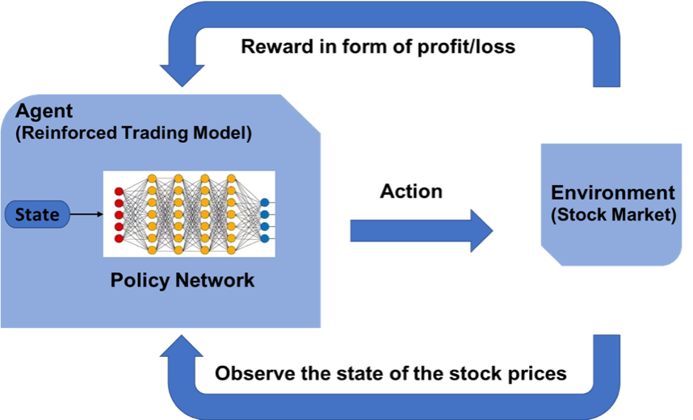

The application of Deep Reinforcement Learning (DRL) in algorithmic trading has emerged as a transformative force in financial markets. Armed with the capability to process vast amounts of data and execute complex decision-making processes, DRL offers a powerful tool for enhancing trading strategies. Its integration within trading systems marks a significant technological advancement, moving from conceptualization to deployment, and reshaping how financial activities are conducted.

DRL employs a learning approach where agents optimize their trading strategies through the continuous evaluation of market scenarios. By simulating hundreds of thousands of potential outcomes, DRL algorithms learn to take actions that increase profits while minimizing risks. This adaptability is particularly beneficial for both novice and seasoned financial professionals, allowing them to leverage data-driven insights to improve their trading strategies.



In exploring the potential of AI in trading, this guide outlines the entire process, beginning with essential concepts in Reinforcement Learning to building and deploying a DRL system. As markets grow more complex, understanding and utilizing such AI-powered mechanisms become not just an advantage but a necessity for effective trading.

This introduction lays the groundwork for a deeper understanding of how such groundbreaking technology can be implemented to enhance trading strategies, promising improved efficiency and competitiveness. By unraveling the potential of AI-powered trading mechanisms, traders can not only optimize their current strategies but also explore new frontiers in financial markets.

## Table of Contents

## Understanding Reinforcement Learning in Trading

Reinforcement Learning (RL) is a branch of machine learning that focuses on developing algorithms capable of learning optimal strategies through the mechanisms of rewards and penalties. This method involves an agent making decisions, executing actions, and receiving feedback from the environment in the form of rewards (positive or negative), allowing it to learn from the outcomes of its decisions. The underlying goal of RL is to enable the agent to maximize cumulative reward over time.

In the context of trading, RL algorithms can be instrumental in optimizing trading strategies by simulating a vast number of trading scenarios. A trading RL agent operates by exploring different actions—such as buying, holding, or selling assets—and learning from the simulated environment's responses. This iterative process helps the agent to develop a proficiency in selecting actions that lead to desirable financial outcomes.

The adaptability of RL is one of its most significant advantages. Unlike traditional algorithmic strategies, which may rely on fixed rules or historical data analyses, an RL-based approach allows the agent to continuously evolve its strategy as it processes new data. This capability is crucial in the ever-changing market conditions where static models might become obsolete.

To illustrate, consider a simplified model where an agent at each time step $t$ must decide an action $a_t$ based on the current state $s_t$, receiving a reward $r_t$ as a result. The agent aims to determine a policy $\pi(a|s)$ that maximizes the expected return:

$$
R_t = \sum_{k=0}^{\infty} \gamma^k r_{t+k}
$$

where $\gamma$ is the discount factor ranging between 0 and 1, indicating the preference for immediate rewards over distant ones.

Through repeated trials and the application of methods such as Q-learning or policy gradients, RL [agents](/wiki/agents) improve their decision-making capabilities, refining their strategies to achieve improved financial performance. The use of Q-learning involves updating a Q-value function, which estimates the expected utility of actions taken in given states:

$$
Q(s, a) \leftarrow Q(s, a) + \alpha [r + \gamma \max_{a'} Q(s', a') - Q(s, a)]
$$

Here, $\alpha$ is the learning rate, determining the extent to which new information overrides old information.

For traders, understanding and employing RL principles can be transformative. By harnessing these data-driven decision-making processes, they can enhance their strategies to be more adaptive to market conditions, ultimately striving for better returns and risk management. Through simulated market environments, traders can develop and test RL algorithms, fostering innovative approaches that transcend the constraints of traditional financial analyses.

## Data Collection: Building the Foundation

Data constitutes the backbone of any flourishing [algorithmic trading](/wiki/algorithmic-trading) system. The foundation of a robust trading model is predicated on the collection and utilization of high-quality data. One of the primary data sources is historical stock prices, which provide a window into past market performances and underpin predictive analytics. Alongside historical prices, trading volumes furnish insights into market [liquidity](/wiki/liquidity-risk-premium) and investor behavior, serving as vital indicators of market strength or weakness.

In constructing an effective AI-driven trading model, the inclusion of company financials is indispensable. These typically encompass balance sheets, income statements, and cash flow statements, offering a comprehensive view of a company's financial health. The integration of such financial data enables models to more accurately gauge intrinsic values and potential growth trajectories.

Moreover, the sentiment from news articles is an increasingly pivotal data source. Sentiment analysis, facilitated by natural language processing (NLP) techniques, transforms qualitative news text into quantifiable metrics, allowing AI models to gauge market sentiment and potential impacts on stock prices. The continuous influx of news sentiment data ensures the AI system is well-informed and responsive to real-time developments.

Comprehensive data collection lays the groundwork for nurturing effective AI trading models. It involves not only the acquisition of diverse datasets but the assurance of data quality and integrity. Quality data is critical in empowering AI systems to discern market trends and devise informed trading decisions. Clean, reliable data minimizes noise and inaccuracies, facilitating the development of predictive models with high precision and robustness in various market conditions.

The utilization of such multifaceted data supports the creation of a nuanced trading strategy. For instance, Python libraries such as `pandas`, `numpy`, and `scikit-learn` can be employed to manage and preprocess data, forming the basis for subsequent AI modeling processes. By harnessing data from these varied sources, traders can enhance their algorithmic systems, driving more informed and strategic market engagements.

## Data Preprocessing: Preparing for Analysis

Raw financial data exhibits inherent complexity, necessitating comprehensive preprocessing to ensure usability and efficacy in algorithmic trading systems. Data preprocessing is essential for converting raw data into a structured format suitable for AI analysis, which involves several critical steps.

Firstly, data cleaning is paramount. This involves detecting and correcting errors or inconsistencies found in the datasets. Common tasks include removing duplicates, correcting inaccuracies, and validating ranges. For instance, erroneous stock prices that are unusually high or low need identification and rectification, either through correction or omission, ensuring analysis integrity.

Handling missing values is another crucial step. Financial datasets frequently have gaps due to various reasons, such as holidays or incomplete data feeds. Techniques like imputation, where missing values are replaced with substituted values derived from statistical methods, or simply removing missing data entries if they do not significantly impact data quality, are often employed. For example, filling missing stock price data with a simple moving average of existing data points can be effective.

Normalization of datasets is required to maintain consistency, especially when dealing with features of varying scales. For instance, stock prices and trading volumes could vastly differ in magnitude, potentially skewing [machine learning](/wiki/machine-learning) models. Normalization techniques such as min-max scaling or z-score standardization ensure that all features contribute equally to the learning process. Mathematically, this can be expressed as:

$$
X_{\text{norm}} = \frac{X - X_{\text{min}}}{X_{\text{max}} - X_{\text{min}}}
$$

for min-max scaling, where $X_{\text{norm}}$ is the normalized value, $X$ represents the original data point, and $X_{\text{min}}$ and $X_{\text{max}}$ are the feature's minimum and maximum values, respectively.

Feature engineering is a sophisticated stage where existing data points are transformed or combined to create new feature sets that enhance the AI model’s learning potential. This process could involve creating features such as moving averages, [momentum](/wiki/momentum) indicators, or [volatility](/wiki/volatility-trading-strategies) measures from historical price data. For instance, calculating a 50-day moving average offers insights into stock price trends over a medium-term period, providing valuable context for trading models.

The culmination of these data preprocessing steps transforms raw datasets into a structured format conducive to AI analysis, laying a robust foundation for further model development and optimization in algorithmic trading systems. This structured approach not only enhances the model’s learning capability but also mitigates potential biases, ensuring the development of reliable and effective trading strategies.

## Environment Design: Crafting a Simulated Market

Creating a realistic simulation environment is central to effectively training trading algorithms, as it allows for the emulation of real-world market conditions in a controlled and risk-free manner. This environment is structured through the careful definition of state spaces, action spaces, and a reward system, each playing a critical role in facilitating the learning process of Deep Reinforcement Learning (DRL) agents.

The state space is a representation of all possible conditions or configurations the agent could encounter in the trading environment. It encompasses various market indicators and features, including stock prices, trading volumes, and different financial ratios. Properly defining the state space is crucial because it enables the DRL agent to perceive the market's current status comprehensively. For instance, a state could be represented as a vector comprising normalized historical prices, moving averages, and other relevant technical indicators. Mathematically, a state at time $t$, $s_t$, can be described as:

$$
s_t = [p_t, v_t, ma_t, ...]
$$

where $p_t$ is the normalized price, $v_t$ is the trading volume, and $ma_t$ is the moving average.

The action space is composed of all potential trading decisions that the agent can execute. In trading applications, actions typically include buying, selling, or holding assets. The action space needs to be defined in a manner that reflects realistic trading operations, thereby allowing the agent to explore a wide range of strategies. For example, actions can be encoded as discrete steps, such as:

$$
a_t \in \{ \text{Buy}, \text{Sell}, \text{Hold} \}
$$

Alternatively, actions can be continuous to model conditions like the proportion of the portfolio to trade.

The reward system is central to guiding the learning of the DRL agent by assigning values to the outcomes of actions taken in specific states. The reward function is crafted to align the agent's objectives with profitable trading outcomes, commonly correlating rewards with financial metrics such as profits, risk-adjusted returns, or even penalties for significant drawdowns. A simple reward function might be defined as the difference in portfolio value over time, such that:

$$
r_t = V_t - V_{t-1}
$$

where $V_t$ is the portfolio value at time $t$.

Simulation environments serve as virtual testbeds where AI agents can execute trades and learn from their outcomes without bearing the financial risks associated with real markets. Through iterative simulations, DRL agents can explore and refine trading strategies, optimizing their performance before moving to live markets. Since simulations dynamically replicate market behaviors, they also provide a platform for stress-testing strategies under various scenarios, enhancing the robustness and adaptability of the resulting trading systems.

## Developing the DRL Agent

In the development of a Deep Reinforcement Learning (DRL) agent for algorithmic trading, the agent's architecture is central to success. This architecture typically comprises policy and value networks. The policy network is responsible for determining the most optimal trading actions from a given market state, essentially functioning as the decision-making component of the DRL agent. The value network, on the other hand, assesses the profitability of specific market states, helping the agent understand when and why certain actions lead to positive outcomes.

A crucial element in this architecture is the memory buffer, which stores past trading experiences. This component is vital for the learning process, as it allows the agent to perform experience replay. By revisiting past interactions with the market, the DRL agent can learn better strategies without the need for continuous real-time training. This capability significantly improves the efficiency of the learning process and enhances the agent's performance by helping it understand complex trading paths and patterns.

The adaptation of the DRL agent occurs through iterative training cycles. During each cycle, the agent utilizes collected data to refine its policies and value estimations, striving for improved decision-making capabilities. This adaptation is facilitated by algorithms such as Q-learning, where the goal is to maximize the expected reward over time. The Q-value, representing the expected utility of taking a given action in a given state, guides the agent's learning process:

$$
Q(s, a) \leftarrow Q(s, a) + \alpha [r + \gamma \max_a' Q(s', a') - Q(s, a)]
$$

In this equation, $Q(s, a)$ is the action-value function, $r$ is the immediate reward, $\gamma$ is the discount [factor](/wiki/factor-investing), $\alpha$ is the learning rate, and $s'$ represents the subsequent state.

Python can be utilized to implement these algorithms, using libraries such as TensorFlow or PyTorch for constructing neural networks. Here is a simple example of setting up a [neural network](/wiki/neural-network) for the policy and value estimations:

```python
import torch
import torch.nn as nn
import torch.optim as optim

class TradingAgent(nn.Module):
    def __init__(self, input_size, action_space):
        super(TradingAgent, self).__init__()
        self.policy_network = nn.Sequential(
            nn.Linear(input_size, 64),
            nn.ReLU(),
            nn.Linear(64, action_space),
            nn.Softmax(dim=-1)
        )
        self.value_network = nn.Sequential(
            nn.Linear(input_size, 64),
            nn.ReLU(),
            nn.Linear(64, 1)
        )

    def forward(self, state):
        policy = self.policy_network(state)
        value = self.value_network(state)
        return policy, value

# Example initialization
agent = TradingAgent(input_size=10, action_space=3)
criterion = nn.MSELoss()
optimizer = optim.Adam(agent.parameters(), lr=0.001)
```

The continual process of decision making, evaluation, and learning ensures the DRL agent evolves, leveraging its accumulated knowledge to improve market engagement strategies. This adaptability is crucial, allowing the agent to remain effective even as market conditions change.

## Training the AI: Learning from Experience

Training the AI to make informed decisions in algorithmic trading involves a systematic process of iterative simulations. During each simulation, the AI agent engages in a cycle of decision-making where it evaluates potential actions and observes their resultant outcomes. This process is crucial for refining the agent's abilities to navigate complex financial markets.

A core aspect of this training is balancing exploration with exploitation. Exploration allows the AI to test new strategies by choosing actions that might not seem immediately profitable but hold potential for future gains. On the other hand, exploitation involves utilizing known strategies that have previously yielded favorable results. By maintaining a balance between these two approaches, the agent can continuously enhance its decision-making repertoire.

Following each round of simulated trading, the agent's neural networks are updated to reflect the latest experiences. This involves adjusting the weights and biases of the networks using new insights from the simulation. The goal is to minimize the difference between predicted and actual outcomes, thereby improving the accuracy of future decisions. Techniques such as backpropagation and stochastic gradient descent are commonly employed to facilitate these updates.

A significant advantage of this approach is the ability to accumulate extensive experience rapidly. Unlike human traders who are limited by time and cognitive capacity, an AI agent can simulate millions of trading scenarios in a relatively short period. This provides the agent with a rich dataset from which to learn, enabling it to develop a robust understanding of market dynamics.

Through continuous training and adaptation, the AI agent becomes adept at recognizing patterns and forecasting market trends. This iterative learning process not only refines existing strategies but also cultivates new ones, enhancing the agent's overall effectiveness in real-world trading environments.

## Evaluation and Optimization

Before deploying a deep [reinforcement learning](/wiki/reinforcement-learning) (DRL) trading system, it is essential to conduct comprehensive evaluations on previously unseen data to ensure the system's robustness and reliability. This stage in the development pipeline confirms that the AI is capable of performing effectively in real-market conditions.

Evaluations focus on several key metrics which are crucial in determining the viability of the trading strategy. Total returns measure the absolute gain or loss over a specific period and provide a straightforward assessment of performance. However, for a more nuanced analysis, the Sharpe ratio is employed. This ratio evaluates risk-adjusted returns by considering the excess return per unit of risk, calculated as:

$$
\text{Sharpe Ratio} = \frac{E[R_i - R_f]}{\sigma_i}
$$

where $E[R_i]$ is the expected portfolio return, $R_f$ is the risk-free rate, and $\sigma_i$ denotes the standard deviation of the portfolio returns. A higher Sharpe ratio is indicative of a more favorable risk/reward balance, suggesting a more reliable trading strategy.

Another critical metric is the maximum drawdown, which assesses the largest single drop from peak to trough in a portfolio's value, providing insight into the potential risk of loss. It is expressed as:

$$
\text{Maximum Drawdown} = \frac{\text{Peak Value - Trough Value}}{\text{Peak Value}}
$$

After these evaluations, optimization becomes a key focus. This process often involves fine-tuning the hyperparameters of the DRL model, which can significantly impact performance. Adjusting learning rates, exploration-exploitation balance, and batch sizes are common adjustments to enhance learning efficiency and efficacy.

Further optimization might require modifying the network architecture, like altering the number of layers or neurons, to ensure the model's capacity aligns with the complexity of the trading environment. Python can be particularly useful for these tasks due to its rich ecosystem of libraries like TensorFlow and PyTorch. Here's an example of how one might adjust a hyperparameter using Python:

```python
import tensorflow as tf

# Sample code to adjust the learning rate in an optimizer
optimizer = tf.keras.optimizers.Adam(learning_rate=0.0001)
```

By iterating through these evaluations and optimization processes, the DRL system evolves into a robust trading agent, refining its strategies to handle the intricacies of the market. This iterative optimization cycle, grounded in empirical data analysis, ensures that the trading strategy is well-equipped for live market deployment, reducing the risk and increasing the potential for successful trades.

## Deployment and Monitoring: Transitioning to Live Trading

Deploying an AI trading system to live financial markets is a delicate process that requires structured steps to mitigate risks and ensure reliable performance. Initially, paper trading, which simulates trading execution without the financial risk, provides a secure environment for verifying algorithmic decisions in real-time conditions. This step is crucial for identifying discrepancies and behavioral nuances that might not surface during [backtesting](/wiki/backtesting).

Following a successful paper trading phase, gradual integration with real capital is advisable. This phased approach starts with minimal capital allocation to control potential losses as the system adapts to live data flows. Such real-money integration should be paired with pre-defined risk management protocols to manage exposure efficiently as confidence in the system grows.

Continuous performance monitoring is essential after deployment, leveraging key performance indicators (KPIs) such as total returns, Sharpe ratio, and drawdowns. The trading environment is perpetually dynamic, necessitating systems that actively adjust to market shifts. Therefore, the trading algorithms should incorporate feedback mechanisms allowing for real-time adaptability. For instance, mechanisms like model retraining and hyperparameter adjustment can be employed to maintain robustness.

Artificial Intelligence systems, including Deep Reinforcement Learning agents, must remain adaptable, as they fundamentally depend on the statistical characteristics of the current market state. When significant market shifts occur, retraining or re-evaluating strategic elements may be necessary to align the AI’s model with updated conditions. This iterative refinement process supports a resilient performance capable of withstanding volatility and unpredictability.

Additionally, sophisticated anomaly detection systems can preemptively identify potential issues before they escalate into significant errors. Deploying such insights not only safeguards the trading strategy but also optimizes transaction execution, enhancing the overall efficacy of the algorithm. Real-time dashboards and alert systems should be employed to provide traders and engineers with early warnings and performance insights.

In summary, deploying AI trading models is a multi-faceted task involving cautious testing, incremental capital exposure, and robust monitoring strategies. By diligently managing these stages, traders can effectively transition AI systems from simulated environments to profitable live trading applications.

## Conclusion: The Future of AI in Trading

Reinforcement learning (RL) is emerging as a pivotal force in advancing trading strategies, demonstrating its potential to revolutionize market interactions with AI-driven insights. By embracing such strategies, traders unlock opportunities for more nuanced and data-informed decisions, harnessing the power of machine learning to identify patterns conventional methods might overlook. As technology progresses, AI's role is set to become increasingly significant, reshaping how market participants engage with financial markets.

AI-driven strategies move beyond traditional static models, offering dynamic adaptation as market conditions evolve. This adaptability enables traders to maintain a competitive edge, even as markets introduce unforeseen challenges. The flexibility inherent in reinforcement learning framework ensures continuous learning and optimization, further pushing the boundaries of what's possible within algorithmic trading.

This transformative approach calls for a reconsideration of existing strategies, urging financial professionals to view markets through an AI-enhanced lens. Not only does this involve leveraging vast datasets but also integrating complex algorithms capable of processing and learning from this data efficiently. Python libraries such as TensorFlow and PyTorch facilitate this process, enabling traders to build and refine their AI models with accessible tools. Here's a basic example of how a reinforcement learning agent might be structured in Python:

```python
import tensorflow as tf
from tensorflow.keras import layers

def create_drl_agent(state_size, action_size):
    model = tf.keras.Sequential()
    model.add(layers.Dense(24, input_dim=state_size, activation='relu'))
    model.add(layers.Dense(24, activation='relu'))
    model.add(layers.Dense(action_size, activation='linear'))
    model.compile(loss='mse', optimizer=tf.keras.optimizers.Adam(0.001))
    return model
```
This code snippet outlines the structure of a simple deep reinforcement learning agent, demonstrating the accessibility and practicality of implementing such technologies into trading strategies.

In essence, AI technologies, particularly reinforcement learning, are considerably altering the landscape of trading, fostering strategies that are not only informed by historical data but also equipped to swiftly adapt to new market environments. This guide has charted a [course](/wiki/best-algorithmic-trading-courses) towards harnessing AI for enhancing trading strategies and understanding complex market mechanics, pointing towards a future wherein AI serves as an indispensable tool in financial markets.

## References & Further Reading

[1]: Mnih, V., Kavukcuoglu, K., Silver, D., et al. (2015). ["Human-level control through deep reinforcement learning."](https://www.nature.com/articles/nature14236) Nature, 518(7540), 529–533.

[2]: Sutton, R. S., & Barto, A. G. (2018). ["Reinforcement Learning: An Introduction"](https://web.stanford.edu/class/psych209/Readings/SuttonBartoIPRLBook2ndEd.pdf) (Second Edition). MIT Press.

[3]: Li, Y., & Gao, J. (2019). ["DRL for automated trading."](https://scholar.google.com/citations?user=dhMUyD4AAAAJ&hl=en) arXiv preprint arXiv:1908.03480.

[4]: Silver, D., Huang, A., Maddison, C. J., et al. (2016). ["Mastering the game of Go with deep neural networks and tree search."](https://www.nature.com/articles/nature16961) Nature, 529(7587), 484–489.

[5]: ["Advances in Financial Machine Learning"](https://www.amazon.com/Advances-Financial-Machine-Learning-Marcos/dp/1119482089) by Marcos Lopez de Prado.

[6]: ["Machine Learning for Algorithmic Trading: Predictive models to extract signals from market and alternative data for systematic trading strategies with Python, 2nd Edition"](https://www.amazon.com/Machine-Learning-Algorithmic-Trading-alternative/dp/1839217715) by Stefan Jansen.

[7]: Watkins, C. J. C. H., & Dayan, P. (1992). ["Q-Learning."](https://link.springer.com/article/10.1007/BF00992698) Machine Learning, 8(3), 279–292.

[8]: ["Deep Reinforcement Learning Hands-On: Apply modern RL methods with deep Q-networks, value iteration, policy gradients, TRPO, AlphaGo Zero and more, 2nd Edition"](https://en.wikipedia.org/wiki/Ici_Paris_%C3%8Ele-de-France) by Maxim Lapan.

[9]: ["Algorithms for Reinforcement Learning"](https://web.stanford.edu/~mossr/pdf/rl.pdf) by Csaba Szepesvári.