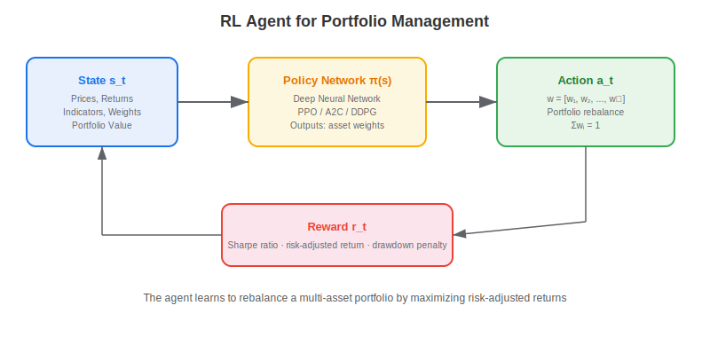
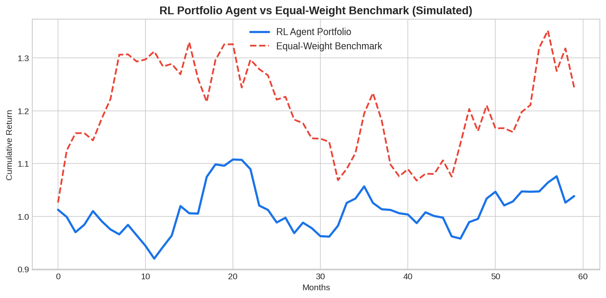

**Reinforcement learning (RL) for portfolio management** trains an agent to dynamically allocate capital across assets by interacting with a market environment and learning from reward signals. Unlike traditional portfolio optimization methods (Markowitz, Black-Litterman) that produce static allocations from estimated parameters, an RL agent continuously adapts its weights based on the evolving state of the market. The agent learns a policy $\pi(s) \rightarrow w$ that maps market observations to portfolio weights, optimizing for risk-adjusted returns over time.

## The RL Portfolio Framework

The portfolio management problem maps naturally onto the RL formalism:

- **State** $s_t$: current prices, returns, technical indicators, portfolio weights, account value
- **Action** $a_t$: new portfolio weights $w = [w_1, w_2, \ldots, w_n]$ where $\sum w_i = 1$
- **Reward** $r_t$: risk-adjusted portfolio return (e.g., daily Sharpe contribution, log return minus drawdown penalty)
- **Transition**: market moves to next state based on actual price changes

$$\text{Reward: } r_t = \log\left(\frac{V_{t+1}}{V_t}\right) - \lambda \cdot \text{transaction\_cost}$$



## Common RL Algorithms for Portfolios

| Algorithm | Type | Strengths for Portfolio | Limitations |
|-----------|------|----------------------|-------------|
| PPO | Policy gradient | Stable training, continuous actions | Requires many episodes |
| A2C | Actor-Critic | Efficient, good for multi-asset | Sensitive to hyperparameters |
| DDPG | Off-policy, continuous | Sample-efficient, handles continuous weights | Can be unstable |
| SAC | Maximum entropy | Exploration-exploitation balance | Complex implementation |
| DQN | Value-based | Simple, well-understood | Discrete actions only |

## Python Implementation

```python
import numpy as np

class SimpleRLPortfolioAgent:
    """
    A simplified policy-gradient RL agent for portfolio management.
    Uses REINFORCE with a linear policy for clarity.
    """
    def __init__(self, n_assets, n_features, lr=0.001):
        self.n_assets = n_assets
        self.theta = np.random.randn(n_assets, n_features) * 0.01
        self.lr = lr
    
    def get_weights(self, features):
        """Softmax policy: map features to portfolio weights."""
        logits = self.theta @ features
        exp_logits = np.exp(logits - logits.max())
        return exp_logits / exp_logits.sum()
    
    def update(self, features, weights, reward):
        """REINFORCE policy gradient update."""
        logits = self.theta @ features
        exp_logits = np.exp(logits - logits.max())
        probs = exp_logits / exp_logits.sum()
        # Gradient of log-softmax
        grad = np.outer(weights - probs, features)
        self.theta += self.lr * reward * grad

# Training loop
np.random.seed(42)
n_assets, n_features, T = 3, 5, 500

agent = SimpleRLPortfolioAgent(n_assets, n_features)
prices = np.cumsum(np.random.randn(T, n_assets) * 0.01, axis=0) + 100
returns = np.diff(prices, axis=0) / prices[:-1]

portfolio_values = [100000]
for t in range(len(returns)):
    features = np.random.randn(n_features)  # Simplified feature vector
    weights = agent.get_weights(features)
    port_return = np.dot(weights, returns[t])
    portfolio_values.append(portfolio_values[-1] * (1 + port_return))
    agent.update(features, weights, port_return)

total_return = portfolio_values[-1] / portfolio_values[0] - 1
print(f"RL Agent Total Return: {total_return:.2%}")
print(f"Buy-Hold Equal Weight: {((1 + returns.mean(axis=1)).prod() - 1):.2%}")
```



## Reward Function Design

The reward function is the most critical design choice. Common options include log portfolio return (encourages growth), differential Sharpe ratio (penalizes volatility), and return minus maximum drawdown penalty. A well-designed reward should balance return maximization against risk control and incorporate realistic [transaction costs](https://paperswithbacktest.com/wiki/implementation-shortfall-overview-examples).

## Limitations and Risks

RL portfolio agents face overfitting to training data, sensitivity to reward function specification, and poor out-of-sample generalization during regime changes. The non-stationarity of financial data means that a policy learned in one period may fail in the next. Combine RL agents with traditional risk constraints (max position size, sector limits) and validate extensively with [backtesting](https://paperswithbacktest.com/wiki/backtesting-with-python).

## Conclusion

Reinforcement learning offers a fundamentally different approach to portfolio management — one that learns and adapts rather than optimizing a static snapshot. While challenges remain in training stability and generalization, the ability to incorporate complex objectives (Sharpe maximization, drawdown limits) and adapt to changing conditions makes RL a compelling tool for [systematic trading strategies](https://paperswithbacktest.com/wiki/systematic-trading-strategies).

---

**Explore further on PapersWithBacktest:**
- Browse [backtested portfolio strategies](https://paperswithbacktest.com/strategies) with Python code and performance metrics
- Access [clean historical market data](https://paperswithbacktest.com/datasets) for equities, crypto, and futures
- Take the [algo trading course](https://paperswithbacktest.com/course) — 60+ video lessons and notebooks
- Related wiki pages: [Systematic Trading Strategies](https://paperswithbacktest.com/wiki/systematic-trading-strategies) · [Kelly Criterion Position Sizing](https://paperswithbacktest.com/wiki/kelly-criterion-position-sizing) · [Backtesting with Python](https://paperswithbacktest.com/wiki/backtesting-with-python)
