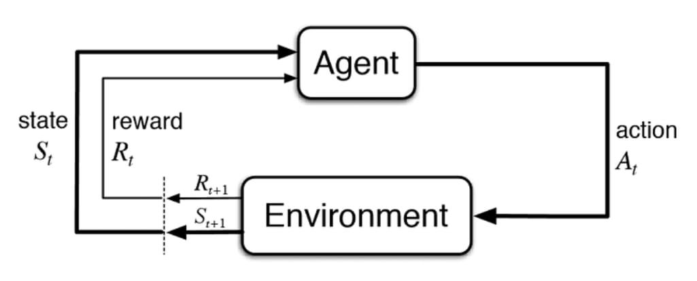

## Table of Contents

## What is Reinforcement Learning (RL) and how does it differ from other types of machine learning?

Reinforcement Learning (RL) is a type of machine learning where an agent learns to make decisions by taking actions in an environment to achieve a goal. The agent receives feedback in the form of rewards or penalties, which helps it learn which actions are good or bad. Over time, the agent improves its strategy to maximize the total reward. Think of it like learning to play a video game: you try different moves, see what works, and get better at the game as you go.

RL differs from other types of machine learning, like supervised and unsupervised learning, in how it learns and what it learns from. In supervised learning, the model is trained on a dataset with correct answers, like a teacher showing you the right way to do something. Unsupervised learning, on the other hand, looks for patterns in data without any specific guidance, like sorting objects into groups without knowing what the groups should be. RL, however, learns from trial and error in an interactive environment, without a set dataset or explicit guidance, making it more like learning from experience.

## Can you explain the basic components of a Reinforcement Learning system?

In a Reinforcement Learning system, there are three main parts: the agent, the environment, and the reward. The agent is like a learner or a player that tries to figure out the best way to do things. The environment is the world around the agent where it can take actions and see what happens. The reward is like a score that tells the agent if it did a good job or not. When the agent does something, the environment changes, and the agent gets a reward to know if that action was helpful or not.

The agent's job is to learn a policy, which is a set of rules that tell it what to do in different situations. It does this by trying different actions and seeing what rewards it gets. Over time, the agent gets better at choosing actions that lead to higher rewards. The goal is for the agent to find the best policy that will give it the most reward in the long run. This process of learning from rewards and improving the policy is what makes Reinforcement Learning different from other types of [machine learning](/wiki/machine-learning).

## What is the difference between positive and negative reinforcement in RL?

In Reinforcement Learning, positive reinforcement means giving the agent a reward when it does something good. It's like getting a treat when you do your chores right. The reward makes the agent want to do that action again because it feels good. So, the agent learns to repeat the actions that get it rewards, helping it get better at its task.

Negative reinforcement, on the other hand, is about taking away something bad when the agent does the right thing. It's like when the annoying noise from an alarm stops when you get out of bed. The agent learns to do the action that makes the bad thing go away. This way, the agent also learns what to do to avoid bad situations, which can help it improve its behavior.

Both positive and negative reinforcement help the agent learn, but they do it in different ways. Positive reinforcement encourages good actions by giving rewards, while negative reinforcement encourages good actions by removing bad things. Together, they help the agent figure out the best way to act in its environment.

## How does the concept of a reward function work in RL?

In Reinforcement Learning, the reward function is like a scorekeeper that tells the agent how well it's doing. When the agent does something in the environment, it gets a reward, which can be a number that shows if the action was good or bad. If the agent does something helpful, it might get a big reward, like getting points in a game. If it does something not so good, it might get a small reward or even a penalty, like losing points. The reward function is important because it guides the agent to learn what actions to take to do better over time.

The agent's goal is to find the best way to act so it gets the most rewards in the long run. It does this by trying different actions and seeing what rewards it gets. Over time, the agent learns which actions lead to more rewards and which ones to avoid. This helps the agent improve its strategy, or policy, to get the highest total reward. The reward function is key to this learning process because it tells the agent what's good and what's bad, helping it figure out the best way to reach its goal.

## What are some common algorithms used in Reinforcement Learning?

Some common algorithms used in Reinforcement Learning are Q-learning, SARSA, and Deep Q-Networks (DQN). Q-learning is a simple way for an agent to learn what to do by trying different actions and seeing what rewards it gets. It uses a table to keep track of how good each action is in different situations. SARSA is similar to Q-learning, but it learns from the actions it actually takes, not just the best possible action. It's like learning from your own experiences instead of just thinking about what could be the best thing to do.

Deep Q-Networks, or DQN, take Q-learning to the next level by using a type of [artificial intelligence](/wiki/ai-artificial-intelligence) called neural networks. This helps the agent learn in more complex environments where it's hard to keep track of everything in a simple table. DQN can handle situations with lots of different states and actions, making it useful for things like playing video games or controlling robots. These algorithms help the agent figure out the best way to act to get the most rewards over time, each in their own way.

## Can you describe the exploration vs. exploitation dilemma in RL?

In Reinforcement Learning, the agent faces a challenge called the exploration vs. exploitation dilemma. It's like trying to decide whether to try new things or stick with what you know works. Exploration means the agent tries new actions to see if they might lead to better rewards. It's like trying a new path in a maze to see if it's faster. Exploitation, on the other hand, means the agent sticks with the actions it already knows are good because they have given rewards before. It's like always taking the path you know leads to the end of the maze quickly.

The tricky part is finding the right balance between exploring and exploiting. If the agent only explores, it might find better ways to get rewards, but it could also waste time trying things that don't work well. If it only exploits, it might miss out on even better actions it hasn't tried yet. The goal is for the agent to explore enough to find good actions, but also exploit the good actions it knows to get the most rewards in the long run. This balance helps the agent learn the best way to act in its environment.

## What is Q-learning and how does it work?

Q-learning is a way for a computer to learn how to do things by trying different actions and seeing what happens. It's like learning to play a game by trying different moves and seeing which ones get you more points. The computer keeps a table, called a Q-table, to remember how good each action is in different situations. Each time the computer does something, it updates the table based on the reward it gets. Over time, the computer learns which actions are the best to take in each situation to get the most rewards.

The Q-learning process works like this: the computer starts in a situation and chooses an action. It then looks at the reward it gets and the new situation it's in. The computer updates the Q-table using a special formula that takes into account the reward it just got and the best action it could take in the new situation. This helps the computer figure out the best way to act in the long run. By doing this over and over, the computer learns the best actions to take in every situation, getting better at its task as it goes.

## How do Deep Q-Networks (DQN) enhance traditional Q-learning?

Deep Q-Networks, or DQN, make traditional Q-learning better by using something called neural networks. In regular Q-learning, the computer uses a table to keep track of how good each action is in different situations. But this can be hard when there are lots of different situations and actions. DQN solves this problem by using a [neural network](/wiki/neural-network) instead of a table. The neural network can learn from examples and figure out the best actions even in really complicated situations, like playing video games or controlling robots.

DQN also helps by using something called experience replay. When the computer tries different actions, it saves what happens in a memory. Later, it can look back at these memories and learn from them again. This helps the computer learn faster and better because it can see the same situation many times and figure out the best way to act. By using neural networks and experience replay, DQN makes Q-learning much more powerful and able to handle really tough problems.

## What are the applications of Reinforcement Learning in real-world scenarios?

Reinforcement Learning is used in many real-world situations to help machines learn and make decisions. One common use is in video games, where computers learn to play games like chess or Go by trying different moves and seeing what works best. This helps them get better at the game over time. Another use is in robotics, where robots learn to do tasks like walking or [picking](/wiki/asset-class-picking) up objects by trying different actions and getting feedback on what works. This helps them improve their skills and become more useful.

Another important application is in self-driving cars. These cars use Reinforcement Learning to learn how to drive safely by trying different actions on the road and getting rewards for good driving. Over time, they learn the best ways to steer, speed up, or slow down to avoid accidents and reach their destination. Reinforcement Learning is also used in recommendation systems, like those on Netflix or Amazon, where the system learns what users like by seeing how they react to different suggestions. This helps the system give better recommendations over time, making users happier with their choices.

## How does policy gradient methods differ from value-based methods in RL?

Policy gradient methods and value-based methods are two ways to teach a computer to make decisions in Reinforcement Learning, but they do it differently. Policy gradient methods focus on directly improving the policy, which is like a set of rules that tells the computer what to do in different situations. Instead of trying to figure out how good each action is, the computer tries different policies and sees which ones lead to more rewards. It's like trying different ways to do a job and picking the one that works best. This can be really helpful when there are lots of different actions to choose from or when the best action changes a lot.

Value-based methods, on the other hand, work by figuring out how good each action is in different situations. They use something called a value function to keep track of how much reward the computer can expect to get by taking certain actions. The computer then chooses the action that has the highest value, hoping to get the most reward in the long run. It's like looking at a menu and picking the dish that you think will taste the best. While policy gradient methods change the rules directly, value-based methods change the rules by learning which actions are the best ones to take.

## What are the challenges and limitations of implementing RL in complex environments?

Implementing Reinforcement Learning in complex environments can be tough because there are so many things to think about. In a simple game, the computer might only need to learn a few moves. But in a complex environment, like a busy city for a self-driving car, there are tons of different situations and choices to make. This makes it hard for the computer to try every possible action and see what happens. Also, in the real world, things can change quickly, and the computer needs to learn fast to keep up. If it takes too long to learn, it might not be useful.

Another challenge is that the computer might do things that are risky or dangerous while it's learning. In a video game, trying a new move might just make you lose a life. But in the real world, like with a robot learning to walk, trying a new move could make it fall and get damaged. This means we need to be careful and find ways to teach the computer safely. Plus, figuring out the right rewards to give the computer can be tricky. If the rewards don't match what we really want the computer to do, it might learn the wrong lessons. So, setting up the right rewards and making sure the computer learns safely are big challenges in complex environments.

## What advancements have been made in multi-agent reinforcement learning?

Multi-agent [reinforcement learning](/wiki/reinforcement-learning) is when lots of computers, or agents, learn together in the same environment. They can work together or against each other, kind of like playing a team sport or a game like chess. In recent years, people have made big steps in making these computers learn better together. One cool thing they've done is come up with ways for the agents to share what they learn with each other. This means one computer can get better by seeing what another computer did, making the whole group learn faster.

Another big advancement is figuring out how to make these computers learn in environments where things keep changing. In real life, things are always moving and changing, so the computers need to be able to keep up. Researchers have found ways to make the agents learn from past experiences and adapt to new situations quickly. This is really helpful for things like traffic control, where lots of cars need to work together to keep the roads moving smoothly. These advancements are making multi-agent reinforcement learning more useful for solving real-world problems where lots of things are happening at once.

## What is Reinforcement Learning?

Reinforcement Learning (RL) is a prominent subset of machine learning that enables an agent to learn how to make decisions through direct interaction with its environment. Unlike supervised learning, which relies on a dataset of input-output pairs for training, RL utilizes a trial-and-error approach. In this process, the agent performs actions and receives feedback in the form of rewards or penalties. This interaction is generally framed as a sequential decision-making problem.

The central aim in RL is to maximize the cumulative reward an agent receives over time. This objective aligns closely with the goal of maximizing trading profits in [algorithmic trading](/wiki/algorithmic-trading) scenarios. To achieve this, the agent must learn a policy—a mapping from states of the environment to actions—which guides its behavior to achieve high rewards.

In financial trading, RL can be effectively used to empower [agents](/wiki/agents) with the ability to make optimal decisions regarding buying, selling, or holding assets. These decisions are made based on the prevailing market conditions, which are represented as the state in RL terminology.

The theoretical underpinning of RL is often modeled using a Markov Decision Process (MDP). An MDP is defined by a set of states $S$, a set of actions $A$, a reward function $R: S \times A \rightarrow \mathbb{R}$, and a transition model $T: S \times A \rightarrow S$. Formally, at each time step $t$, the agent observes a state $s_t \in S$, chooses an action $a_t \in A$, transitions to a new state $s_{t+1}$, and receives a reward $r_t$.

Mathematically, the goal is to find a policy $\pi: S \rightarrow A$ that maximizes the expected cumulative reward, often discounted over time:

$$
J(\pi) = \mathbb{E}_\pi \left[ \sum_{t=0}^{\infty} \gamma^t r_t \right]
$$

where $\gamma \in [0,1)$ is the discount factor, reflecting the importance of future rewards.

Python offers libraries such as OpenAI's Gymnasium to create simulated environments that facilitate the training and evaluation of RL agents, which is particularly useful in the context of developing trading strategies.

## References & Further Reading

[1]: Sutton, R. S., & Barto, A. G. (2018). ["Reinforcement Learning: An Introduction."](https://web.stanford.edu/class/psych209/Readings/SuttonBartoIPRLBook2ndEd.pdf) MIT Press.

[2]: Tsitsiklis, J. N., & Van Roy, B. (1997). ["An Analysis of Temporal-Difference Learning with Function Approximation."](https://www.mit.edu/~jnt/Papers/J063-97-bvr-td.pdf) IEEE Transactions on Automatic Control.

[3]: Silver, D., Huang, A., Maddison, C. J., Guez, A., Sifre, L., Van Den Driessche, G., ... & Hassabis, D. (2016). ["Mastering the Game of Go with Deep Neural Networks and Tree Search."](https://www.nature.com/articles/nature16961) Nature, 529(7587), 484-489.

[4]: Mnih, V., Kavukcuoglu, K., Silver, D., Rusu, A. A., Veness, J., Bellemare, M. G., ... & Hassabis, D. (2015). ["Human-Level Control through Deep Reinforcement Learning."](https://www.nature.com/articles/nature14236) Nature, 518(7540), 529-533.

[5]: ["Advances in Financial Machine Learning"](https://www.amazon.com/Advances-Financial-Machine-Learning-Marcos/dp/1119482089) by Marcos Lopez de Prado

[6]: Li, Y., & Malik, J. (2017). ["Distributional Reinforcement Learning for Efficient Exploration."](https://dl.acm.org/doi/10.5555/3600270.3602516) arXiv preprint arXiv:1707.06887.

[7]: Jansen, S. (2020). ["Machine Learning for Algorithmic Trading."](https://github.com/stefan-jansen/machine-learning-for-trading) Packt Publishing.

[8]: ["Grokking Deep Reinforcement Learning"](https://ieeexplore.ieee.org/abstract/document/10280270/) by Miguel Morales