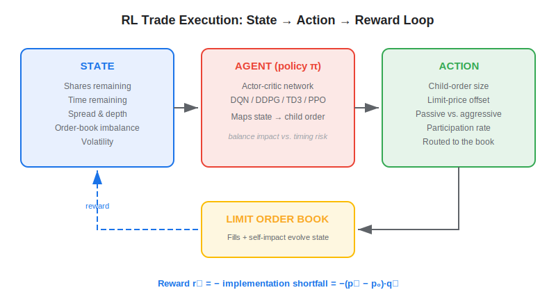
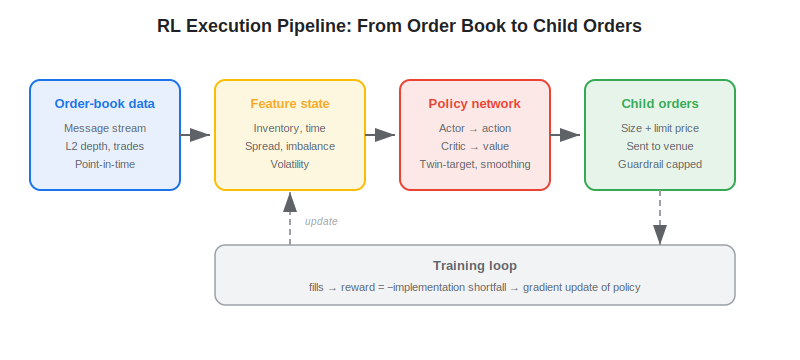
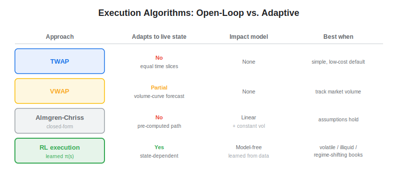

**Reinforcement learning for trade execution** trains an agent to break a large parent order into a sequence of smaller child orders, deciding *when*, *how much*, and *how aggressively* to trade so that the realized price stays as close as possible to the price at the moment the decision was made. The agent learns this scheduling policy by interacting with a limit order book and receiving a reward tied to execution cost — typically the negative of implementation shortfall. Unlike a fixed schedule such as TWAP or a closed-form solution like Almgren-Chriss, an RL execution agent adapts in real time to spread, depth, volatility, and order-flow imbalance. This article defines the problem, formalizes it as a Markov decision process, contrasts RL with classical execution algorithms, and grounds it in live-trading reality.

## Table of Contents

## What Is Reinforcement Learning for Trade Execution?

Optimal trade execution is the problem of liquidating (or acquiring) a position of $X$ shares over a fixed horizon while minimizing trading cost. The two opposing forces are **market impact** — trading too fast pushes the price against you — and **timing risk** — trading too slowly exposes you to adverse price moves. Almgren and Chriss (2001) formalized this as a mean-variance trade-off and derived a static, closed-form optimal trajectory under a linear impact model. Reinforcement learning takes the same objective but drops the modeling assumptions: instead of solving an analytic equation, the agent learns a *state-dependent* policy directly from order-book data.

The seminal empirical work is Nevmyvaka, Feng, and Kearns (2006), *Reinforcement Learning for Optimized Trade Execution*, which trained a value-based agent on millions of NASDAQ order-book events and reported double-digit-percentage reductions in implementation shortfall versus a static submit-and-leave benchmark. Since then the field has moved from discrete value methods to continuous-action actor-critic algorithms — including recent designs such as the 2026 Twin-Target Deterministic Actor-Critic with Policy Smoothing (TT-DAC-PS), which borrows TD3-style twin critics, target-policy smoothing, and conservative Q-regularization to curb the value-overestimation that destabilizes naive execution agents.

## How It Works

Execution maps cleanly onto the [Markov decision process](https://paperswithbacktest.com/wiki/markov-decision-process-trading) framework. At each decision step the agent observes the market and its own progress, places a child order, and is scored on the cost of the resulting fills.

- **State** $s_t$: shares remaining $x_t$, time remaining $T-t$, bid-ask spread, top-of-book depth, recent volatility, [order-book imbalance](https://paperswithbacktest.com/wiki/high-frequency-trading-ii-limit-order-book), and recent price drift.
- **Action** $a_t$: how many shares to send this interval and the limit-price offset (passive at the touch vs. aggressive crossing the spread). Discrete actions suit DQN; continuous sizing suits DDPG, TD3, SAC, and PPO.
- **Reward** $r_t$: the negative cost of the fills obtained this step, usually expressed relative to the arrival (decision) price $p_0$.
- **Transition**: the order book evolves, partially as a function of the agent's own impact.

The standard cost metric is **implementation shortfall** — the slippage between the decision price and the volume-weighted realized price:

$$\text{IS} = \sum_{t} (p_t - p_0)\, q_t + \text{fees}$$

where $q_t$ shares fill at price $p_t$ and $p_0$ is the arrival price. The episodic RL objective is to minimize expected shortfall, often with a variance penalty mirroring the Almgren-Chriss risk-aversion term:

$$\min_{\pi}\; \mathbb{E}[\text{IS}] + \lambda\, \mathrm{Var}[\text{IS}]$$

A subtlety unique to execution is that the agent's own actions perturb the environment. Permanent impact (the lasting price move from informed trading) and temporary impact (the transient cost of consuming liquidity) are both functions of trade size — closely related to [Kyle's lambda](https://paperswithbacktest.com/wiki/kyles-lambda), the linear price-impact coefficient. Realistic training therefore requires either a high-fidelity limit-order-book simulator with an impact model or, better, replay of historical message data with a queue-position simulator.

## RL vs Almgren-Chriss, TWAP, and VWAP

The benchmark execution algorithms occupy different points on the simplicity-vs-adaptivity spectrum. [TWAP](https://paperswithbacktest.com/wiki/twap) splits the order into equal time slices; VWAP tracks a forecast intraday volume curve; Almgren-Chriss computes an optimal front-loaded or back-loaded trajectory from a risk-aversion parameter. All three are *open-loop* — the schedule is fixed before trading begins. RL is *closed-loop*: it conditions each child order on the live state.

| Approach | Schedule | Adapts to live state? | Impact model | Tuning effort |
|---|---|---|---|---|
| TWAP | Equal time slices | No | None | Trivial |
| VWAP | Volume-curve weighted | Partial (volume forecast) | None | Moderate |
| Almgren-Chriss | Closed-form optimal | No (pre-computed) | Assumes linear impact | Analytic |
| RL execution | Learned policy $\pi(s)$ | Yes (state-dependent) | Model-free / learned | Heavy (training) |

The practical edge of RL appears precisely when the linear-impact, constant-volatility assumptions of Almgren-Chriss break down — around the open and close, during news-driven volatility spikes, or in thin order books where depth fluctuates sharply. In those regimes a learned policy can accelerate when liquidity is abundant and pull back when the book thins, behavior that a static trajectory cannot express. Where the assumptions roughly hold, Almgren-Chriss and a well-calibrated VWAP are hard to beat and far cheaper to deploy and audit.

## Practical Considerations in Algo Trading

Execution improvements are measured in **basis points of slippage**, not in headline Sharpe. For an institutional order of 1–5% of average daily volume, realistic shortfall ranges from a few bps for liquid large-caps to tens of bps for less liquid names. RL agents in the literature typically claw back a meaningful fraction of that cost relative to TWAP — useful at scale, but a long way from the eye-catching return numbers seen in signal-generation research. Execution is a cost-minimization game, and the savings compound across thousands of orders rather than producing standalone alpha.

Several realities temper the approach. Training data must be point-in-time order-book messages, which are expensive and venue-specific; a policy fit to one stock or one liquidity regime rarely transfers cleanly to another. Non-stationarity means a policy trained on calm markets can misbehave in a stress event, so production systems wrap the agent in hard guardrails — maximum participation rate, minimum/maximum slice size, and a fallback to TWAP if behavior drifts out of bounds. [Overfitting the backtest](https://paperswithbacktest.com/wiki/backtesting-pitfalls-overfitting) is acute here: a simulator that underestimates queue position or self-impact will flatter the agent, then disappoint live. Validation must use realistic fill assumptions and out-of-sample order-book data. RL execution sits naturally alongside [RL for portfolio management](https://paperswithbacktest.com/wiki/reinforcement-learning-portfolio-management) and [model-based RL](https://paperswithbacktest.com/wiki/model-based-reinforcement-learning-trading) in the broader stack of learned [systematic trading](https://paperswithbacktest.com/wiki/systematic-trading-strategies) components — the portfolio layer decides *what* to hold, the execution layer decides *how* to get there cheaply.

## Conclusion

Reinforcement learning reframes trade execution from solving a static optimization to learning an adaptive scheduling policy that responds to the live order book. It earns its complexity in volatile, illiquid, or regime-shifting conditions where closed-form schedules underperform, while TWAP, VWAP, and Almgren-Chriss remain the pragmatic baselines everywhere else. As order-book simulators grow more faithful and actor-critic stability improves, the gap between research results and audited live savings is the frontier that will decide how widely RL execution is deployed on real trading desks.

## References & Further Reading

[1]: [Reinforcement Learning for Optimized Trade Execution (Nevmyvaka, Feng, Kearns, 2006)](https://www.cis.upenn.edu/~mkearns/papers/rlexec.pdf)
[2]: [Optimal Execution of Portfolio Transactions (Almgren & Chriss, 2001)](https://www.smallake.kr/wp-content/uploads/2016/03/optliq.pdf)
[3]: [TT-DAC-PS: Twin-Target Deterministic Actor-Critic with Policy Smoothing for Optimal Trade Execution (2026)](https://arxiv.org/abs/2606.08379)
[4]: [Double Deep Q-Learning for Optimal Execution (Ning, Lin, Jaimungal, 2018)](https://arxiv.org/abs/1812.06600)
