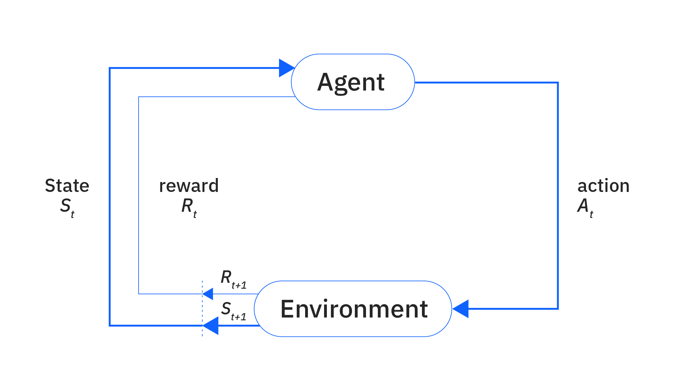

## Table of Contents

## What is reinforcement learning?

Reinforcement learning is a type of artificial intelligence where a computer learns to make decisions by trying different actions and seeing what happens. It's like learning by doing. Imagine teaching a dog a new trick: you give the dog a treat when it does the right thing. The dog learns to repeat the action to get more treats. In reinforcement learning, the computer is like the dog, and the treats are called rewards. The computer tries different actions, gets rewards or penalties, and learns the best way to achieve its goal over time.

This method is used in many areas, like playing games or controlling robots. For example, a computer can learn to play a video game by trying different moves and getting points for good moves. Over time, it gets better at the game. Another example is a robot learning to walk. The robot tries different ways to move its legs, and if it stays upright, it gets a reward. If it falls, it gets a penalty. By repeating this process, the robot learns to walk better. Reinforcement learning helps machines improve their performance by learning from their experiences, just like humans do.

## How does reinforcement learning differ from other types of machine learning?

Reinforcement learning is different from other types of machine learning like supervised and unsupervised learning. In supervised learning, the computer is given examples with the correct answers, like a teacher showing the right way to do something. It learns by looking at these examples and figuring out how to do it right. On the other hand, reinforcement learning doesn't have these examples. Instead, the computer learns by trying things out and seeing what works best. It's more like learning through trial and error, without a teacher telling it what to do.

Unsupervised learning is also different from reinforcement learning. In unsupervised learning, the computer looks for patterns in data without any guidance or rewards. It tries to find groups or connections in the data on its own. For example, it might group similar customers together without being told how to do it. Reinforcement learning, however, focuses on learning to make decisions that lead to the best results, using rewards to guide the learning process. So, while unsupervised learning is about finding patterns, reinforcement learning is about finding the best actions to take to achieve a goal.

## What are the main components of a reinforcement learning system?

A reinforcement learning system has three main parts: the agent, the environment, and the reward signal. The agent is like the learner, it's the computer or robot that makes decisions. The environment is everything around the agent, like a game or a room. The agent does things in the environment, and the environment changes because of those actions. The reward signal is like a score that tells the agent if it did well or not. If the agent does something good, it gets a high reward, and if it does something bad, it gets a low reward or even a penalty.

The agent learns by trying different actions and seeing what rewards it gets. Over time, it figures out which actions lead to the best rewards. This process is called a policy, which is like a set of rules the agent follows to decide what to do next. The agent keeps updating its policy to get better at achieving its goal. The goal is usually to get the highest total reward over time. So, the main parts work together: the agent acts, the environment reacts, and the reward signal guides the agent to learn the best way to reach its goal.

## Can you explain the concept of an agent, environment, and reward in reinforcement learning?

In reinforcement learning, the agent is like a student who is learning how to do something. It's the part of the computer or robot that makes decisions and takes actions. The agent tries different things to see what works best. For example, if the agent is a robot learning to walk, it will try different ways to move its legs. The agent doesn't know the best way at first, but it learns over time by doing.

The environment is everything around the agent. It's like the world where the agent lives and acts. When the agent does something, the environment changes in response. For example, if the robot takes a step forward, the environment might change because the robot is now in a new position. The environment gives feedback to the agent, helping it learn what works and what doesn't.

The reward is like a score that tells the agent how well it's doing. When the agent does something good, it gets a high reward, which is like getting a gold star or a treat. If it does something bad, it might get a low reward or even a penalty. The agent tries to get the highest total reward over time. By using the rewards, the agent learns which actions are best to achieve its goal. So, the reward guides the agent's learning process, helping it get better and better at what it's trying to do.

## What is the difference between positive and negative reinforcement in learning?

Positive reinforcement is when you get something good after doing something right. It's like getting a candy when you finish your homework. This makes you want to do the homework again because you know you'll get a reward. In learning, positive reinforcement means giving a reward to the learner when they do something well. For example, if a computer learns to play a game and gets points for making good moves, those points are positive reinforcement. The computer will try to make those good moves again to get more points.

Negative reinforcement is different. It's when something bad goes away after you do something right. Imagine you have a headache and you take medicine. When the headache goes away, you feel better, so you're more likely to take the medicine next time you have a headache. In learning, negative reinforcement means taking away something unpleasant when the learner does something well. For example, if a robot is learning to walk and it falls down, it might feel a penalty. When the robot learns to walk without falling, the penalty goes away, which is negative reinforcement. This encourages the robot to keep walking well to avoid the penalty.

## How does the exploration vs. exploitation dilemma affect reinforcement learning?

In reinforcement learning, the exploration vs. exploitation dilemma is like choosing between trying new things and sticking with what you know works. Imagine you're at a restaurant and you've tried one dish that you really like. Exploitation means you keep ordering that dish because you know it's good. But if you only do that, you might miss out on other great dishes. Exploration means trying different dishes to see if you can find something even better. In reinforcement learning, the agent has to balance these two choices to learn the best way to achieve its goal.

If the agent only exploits what it knows, it might miss out on better actions that could lead to higher rewards. For example, if a robot only uses the walking method it knows, it might never find a more efficient way to walk. On the other hand, if the agent only explores, it might never settle on a good action because it's always trying new things. The key is finding the right balance. Over time, the agent needs to explore enough to find good actions but also exploit what it has learned to get the best rewards. This balance helps the agent learn and improve its performance in the long run.

## What are some common algorithms used in reinforcement learning?

One common algorithm in reinforcement learning is Q-learning. Q-learning is like a way for the agent to figure out which actions are best in different situations. It does this by keeping a table of scores, called Q-values, for each action in each situation. The agent tries different actions and updates the Q-values based on the rewards it gets. Over time, the agent learns which actions lead to the highest rewards. Q-learning is simple but powerful and is often used in games and other environments where the agent needs to make decisions.

Another popular algorithm is called SARSA, which stands for State-Action-Reward-State-Action. SARSA is similar to Q-learning, but it's a bit different because it takes into account what the agent plans to do next. Like Q-learning, SARSA uses a table to keep track of scores for different actions, but it updates these scores based on the current action, the reward, and the next action the agent will take. This makes SARSA useful in situations where the agent's future actions matter. Both Q-learning and SARSA help the agent learn to make better decisions by balancing exploration and exploitation.

A third common algorithm is Deep Q-Network (DQN), which combines Q-learning with deep learning. DQN uses a neural network to estimate Q-values instead of a table. This makes it possible for the agent to handle more complex environments with lots of different states and actions. The neural network learns from examples of actions and rewards, and it gets better over time. DQN has been used to teach computers to play video games at a high level, showing how powerful reinforcement learning can be when combined with deep learning.

## Can you describe the Q-learning algorithm and its applications?

Q-learning is a simple but powerful way for a computer to learn how to make the best decisions. It works by keeping a table of scores, called Q-values, for each action the computer can take in different situations. The computer tries different actions and then updates these scores based on the rewards it gets. If an action leads to a good reward, the score for that action goes up. Over time, the computer learns which actions lead to the best rewards by trying out different things and seeing what works. This process helps the computer figure out the best way to act in any situation.

Q-learning is used in many different areas. One popular use is in games, where a computer can learn to play better by trying different moves and getting rewards for good moves. For example, Q-learning has been used to teach computers to play games like Pac-Man or chess. Another use is in robotics, where a robot can learn to do tasks like walking or picking up objects by trying different actions and getting rewards for doing things well. Q-learning is great because it can work in many different kinds of environments and helps computers learn to make smart decisions on their own.

## What is the role of the Markov Decision Process in reinforcement learning?

The Markov Decision Process (MDP) is like a map that helps a computer learn in reinforcement learning. It shows the computer all the different places it can be, the actions it can take, and the rewards it might get. Imagine you're playing a board game. The MDP is like the game board, showing you where you are, where you can move, and what you might win or lose by moving to different spots. The computer uses the MDP to understand its world and learn the best way to move around to get the highest rewards.

In reinforcement learning, the MDP helps the computer figure out what to do next by keeping track of the current situation, or state. The computer looks at the MDP to see what actions it can take from that state and what rewards it might get. By using the MDP, the computer can plan its moves and learn over time which actions lead to the best results. This makes the MDP a really important part of reinforcement learning, helping the computer make smart decisions and improve its performance.

## How do deep learning and reinforcement learning work together in deep reinforcement learning?

Deep reinforcement learning is when we mix deep learning and reinforcement learning to make a computer learn even better. Deep learning is like a smart way for computers to learn from lots of examples, using something called a neural network. In deep reinforcement learning, we use this neural network to help the computer understand its world and make decisions. The computer tries different actions and gets rewards, just like in regular reinforcement learning, but the neural network helps it figure out which actions are best in different situations. This makes the computer really good at learning from its experiences and getting better over time.

One cool thing about deep reinforcement learning is that it can handle really complicated tasks. For example, it's been used to teach computers to play video games at a high level, like beating human players at games like Go or Atari games. The neural network in deep reinforcement learning can learn to recognize patterns in the game and figure out the best moves to make. By combining the power of deep learning with the learning-by-doing approach of reinforcement learning, deep reinforcement learning helps computers solve tough problems and learn to do things that are hard for regular computers to figure out.

## What are some challenges faced in implementing reinforcement learning in real-world scenarios?

One big challenge in using reinforcement learning in real life is that the world is very complicated. In a game, the computer knows all the rules and can try different moves to see what works. But in real life, there are so many things that can change and affect what happens. For example, if a robot is learning to walk outside, it has to deal with different kinds of ground, weather, and other things that can make it hard to learn. The computer might need a lot of time and tries to figure out the best way to do things in such a changing world.

Another challenge is that trying new things in real life can be risky. In a game, the computer can try a bad move and just start over. But in real life, trying something new might cause problems. For example, if a self-driving car is learning to drive, it can't just try a dangerous move to see what happens. It has to be safe and careful. This means the computer has to learn in a way that doesn't cause harm, which can make the learning process slower and more complicated.

## Can you discuss advanced topics like multi-agent reinforcement learning and its implications?

Multi-agent reinforcement learning is when lots of computers or robots learn together instead of just one. Imagine a bunch of robots playing a game or working on a task. Each robot has to learn not just what to do by itself, but also how to work with the other robots. This makes things a lot more complicated because what one robot does can affect what happens to the others. For example, if one robot learns to do something new, it might change the game for the other robots, and they all have to learn and adapt together. This kind of learning is useful in situations where teamwork is important, like in sports or in managing a busy factory where lots of machines need to work together.

The implications of multi-agent reinforcement learning are big. It can help us create smarter and more cooperative systems. For example, in traffic control, cars could learn to work together to reduce traffic jams. In business, different parts of a company could learn to work better together to improve how things are done. But it also brings new challenges. It's harder to predict what will happen when lots of agents are learning at the same time, and they might not always learn to work together in the best way. They might even learn to compete instead of cooperate, which could cause problems. So, while multi-agent reinforcement learning has a lot of potential, it also needs careful planning to make sure it works well in the real world.

## What is Understanding Reinforcement Learning?

Reinforcement Learning (RL) is a subset of machine learning where an agent learns to make decisions by interacting with an environment. Unlike supervised learning, which relies on a dataset with input-output pairs, RL is characterized by its focus on learning through trial and error to achieve long-term goals.

At its core, RL involves several key components:

1. **Agent**: The learner or decision-maker that interacts with the environment to achieve a specific objective.
2. **Environment**: Everything that the agent interacts with, external to the agent. The environment provides feedback to the agent's actions.
3. **States**: A representation of the environment's current condition. The state encapsulates all the necessary information that an agent needs to decide on its next action.
4. **Actions**: All possible moves or decisions an agent can make at any given state. The chosen action influences the environment's state.
5. **Rewards**: Scalar feedback that indicates how well the action taken by the agent has achieved its goals concerning the state of the environment. The reward is essential for the agent to evaluate the success of its actions.

Agents in RL aim to optimize cumulative rewards, balancing the exploration of new actions and the exploitation of known rewarding actions. The agent's behavior strategy, often known as a policy, maps states to actions and can be deterministic or stochastic.

RL techniques are broadly categorized into two types: model-free and model-based approaches.

- **Model-free RL**: In this approach, agents learn to optimize the policy directly from experiences without building a model of the environment. Common algorithms include Q-learning and Deep Q-Networks (DQN). In Q-learning, the aim is to learn the Q-values, which represent the expected utility of taking an action in a given state and following the optimal policy thereafter. The agent updates its Q-values based on the Bellman equation:

$$
Q(s, a) \leftarrow Q(s, a) + \alpha [r + \gamma \max_{a'} Q(s', a') - Q(s, a)]
$$

  Where $s$ and $s'$ are the current and next states, $a$ and $a'$ are the actions, $r$ is the reward, $\alpha$ is the learning rate, and $\gamma$ is the discount [factor](/wiki/factor-investing).

- **Model-based RL**: Here, the agent tries to model the environment's dynamics and uses this model to make decisions. This involves predicting the next state and reward given a state-action pair. Model-based methods typically offer faster convergence to optimal policies because of their predictions, but they require accurate modeling, which can be challenging.

Both types have their applications, with model-free methods being preferable for environments with unknown or highly complex dynamics and model-based methods being suited for scenarios where environmental dynamics can be accurately captured. Understanding these fundamental aspects of [reinforcement learning](/wiki/reinforcement-learning) equips us to explore its applications in various domains, including [algorithmic trading](/wiki/algorithmic-trading).

## What are the popular reinforcement learning algorithms used in trading?

Reinforcement learning (RL) has increasingly made its mark in algorithmic trading, thanks to its ability to learn and adapt from interactions with the trading environment. Several RL algorithms stand out for their use in trading: Q-learning, Deep Q-Networks (DQN), and Proximal Policy Optimization (PPO).

### Q-learning

Q-learning is a model-free RL algorithm that aims to find the best action to take given the current state. It works by learning a policy, represented by the Q-function, which models the expected utility of taking an action in a given state.

#### Formula:
The Q-value is updated using the Bellman equation:

$$
Q(s, a) = Q(s, a) + \alpha \left( r + \gamma \max_{a'} Q(s', a') - Q(s, a) \right)
$$

- **Real-world applications**: Q-learning has been employed for simple trading strategies where the state and action spaces are not too large. An example might be choosing between buying, holding, or selling a stock based on predefined indicators like moving averages.
- **Advantages**: Simplicity and ease of implementation. It does not require a model of the environment.
- **Limitations**: Struggles with large state-action spaces and can be computationally expensive as it requires storing the Q-values for all possible state-action pairs.

### Deep Q-Networks (DQN)

DQN extends Q-learning by using [neural network](/wiki/neural-network)s to approximate the Q-values for each state-action pair, making it feasible to handle large state spaces.

#### Real-world applications:
DeepMind's breakthrough with DQN in video games inspired its application in trading scenarios where feature-rich data, such as historical prices and technical indicators, are processed through deep neural networks for decision-making.

- **Advantages**: Capable of handling high-dimensional input states, such as price histories and complex financial indicators. DQNs can learn richer trading policies than basic Q-learning.
- **Limitations**: Susceptible to instability and divergence during training due to correlated updates, especially in non-stationary markets. Techniques like experience replay and target networks are often required to stabilize training.

### Proximal Policy Optimization (PPO)

PPO is a popular policy-gradient method that updates the policy parameters in small steps, ensuring stable convergence. It uses a surrogate objective that penalizes large deviations from the current policy.

#### Real-world applications:
PPO is particularly useful in trading environments where direct action-value estimation (like in Q-learning) might not be feasible. For instance, it is advantageous in scenarios requiring continuous action spaces, such as dynamic portfolio optimization.

- **Advantages**: Balances between exploration and exploitation and provides robustness to hyperparameter settings. Its ability to directly learn the policy makes it suitable for complex action spaces.
- **Limitations**: Requires more computational resources than simpler methods like Q-learning and may face challenges if the policy objective is poorly specified or if data quality is insufficient.

In summary, while all these algorithms offer unique strengths for trading applications, choosing the right one depends on the specific requirements and constraints of the trading strategy. Q-learning provides a straightforward solution for simple problems, DQNs enhance capability in high-dimensional spaces, while PPO is excellent for complex policies and action spaces. As RL continues to evolve, these methods remain foundational elements in the development of advanced trading systems.

## References & Further Reading

[1]: Mnih, V., Kavukcuoglu, K., Silver, D., et al. (2015). ["Human-level control through deep reinforcement learning."](https://www.nature.com/articles/nature14236) Nature.

[2]: Sutton, R. S., & Barto, A. G. (2018). ["Reinforcement Learning: An Introduction."](https://mitpress.mit.edu/9780262039246/reinforcement-learning-second-edition/) MIT Press.

[3]: ["Advances in Financial Machine Learning"](https://www.amazon.com/Advances-Financial-Machine-Learning-Marcos/dp/1119482089) by Marcos Lopez de Prado.

[4]: Lillicrap, T. P., et al. (2016). ["Continuous control with deep reinforcement learning."](https://arxiv.org/abs/1509.02971) arXiv preprint arXiv:1509.02971.

[5]: ["Machine Learning for Algorithmic Trading"](https://www.amazon.com/Machine-Learning-Algorithmic-Trading-intelligence/dp/9918608013) by Stefan Jansen.

[6]: Silver, D., et al. (2014). ["Deterministic policy gradient algorithms."](https://proceedings.mlr.press/v32/silver14.html) In Proceedings of the 31st International Conference on Machine Learning (ICML-14).

[7]: ["Quantitative Trading: How to Build Your Own Algorithmic Trading Business"](https://www.amazon.com/Quantitative-Trading-Build-Algorithmic-Business/dp/0470284889) by Ernest P. Chan.