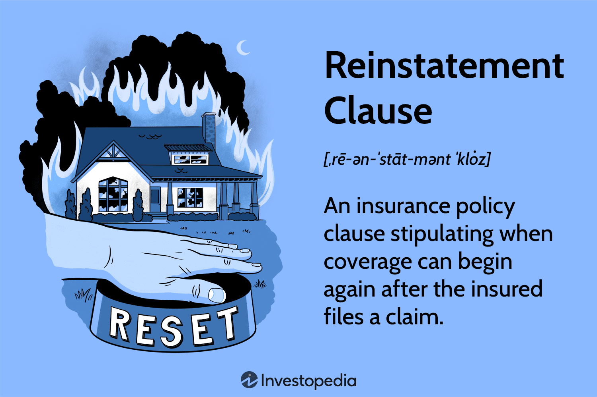

## Table of Contents

## What is reinstated value?

Reinstated value is a term used in insurance. It means that if something you own gets damaged or destroyed, the insurance company will pay to replace it with a new one, not just give you money for what it was worth when it got damaged. This is good because the cost to replace things often goes up over time, so you get enough money to buy a new item at today's prices.

For example, if you have a TV that you bought for $500 five years ago and it gets ruined in a fire, the insurance company won't just give you $500. Instead, they will give you enough money to buy a new TV at today's price, which might be $800. This way, you can get a new TV without having to pay extra out of your pocket.

## How does reinstated value differ from replacement cost?

Reinstated value and replacement cost are similar because they both help you get a new item when your old one is damaged or destroyed. But they are a bit different. Reinstated value means the insurance company will pay to replace your item with a brand new one at today's price. This is good because prices can go up over time, so you get enough money to buy something new without paying extra.

Replacement cost also means you get money to buy a new item, but it might not always be the latest model or the exact same thing. For example, if your old laptop breaks, replacement cost might give you enough money to buy a similar laptop, but not necessarily the newest version. So, reinstated value usually gives you a bit more money to make sure you can get the newest and best replacement.

## Why is reinstated value important in insurance policies?

Reinstated value is important in insurance policies because it helps people get back to normal after something bad happens. If your things get damaged or destroyed, you want to replace them with new ones so you can keep living your life the way you were before. Reinstated value makes sure the insurance company gives you enough money to buy new items at today's prices, not just what you paid for them a long time ago.

This is really helpful because prices for things like electronics, furniture, and other stuff can go up over time. If you only got the money you paid for your old TV, you might not have enough to buy a new one now. With reinstated value, you get enough money to buy a new TV at the current price, so you don't have to pay extra out of your pocket. This makes insurance more fair and helps people feel secure knowing they can replace their things properly if something goes wrong.

## Can you explain the process of reinstating value in an insurance claim?

When you need to claim insurance because something you own got damaged or destroyed, the process of reinstating value helps you get enough money to buy a new one. First, you tell your insurance company what happened and show them proof of the damage. They will look at your policy to see if you have reinstated value coverage. If you do, they will figure out how much it would cost to buy a new item at today's price, not just what you paid for it before.

Once the insurance company knows the current price, they will give you that amount of money. This means you can go out and buy a new item without worrying about paying more because prices went up. It's important to keep good records and follow the insurance company's steps carefully so you can get the full reinstated value and replace your things properly.

## What are the common scenarios where reinstated value is applied?

Reinstated value is often used when people need to replace things like electronics, furniture, or appliances that got damaged or destroyed. For example, if your house burns down and your TV, couch, and refrigerator are ruined, reinstated value means the insurance company will give you enough money to buy new ones at today's prices. This is helpful because prices for these things can go up over time, so you need more money now than what you paid before.

Another common scenario is when natural disasters like floods or storms damage your home and belongings. If your laptop and washing machine get ruined by water, reinstated value helps you get enough money to buy new ones. This way, you don't have to worry about paying extra because the cost of new electronics and appliances has gone up since you bought them.

## How do insurance companies calculate reinstated value?

Insurance companies calculate reinstated value by figuring out how much it would cost to buy a brand new version of the item that got damaged or destroyed, at today's prices. They look at the current market to see what similar new items are selling for. For example, if your old TV was ruined in a fire, they would check the price of a new TV with similar features and size to find out how much money you need.

To do this, insurance companies might use price lists from stores, online shopping sites, or even talk to experts who know about the prices of different products. They want to make sure they give you enough money to replace your things with new ones, so you don't have to pay more out of your pocket because prices have gone up since you bought the original item. This way, you can get back to normal faster after something bad happens.

## What factors can affect the reinstated value of a property?

Several things can change how much money you get for reinstated value. One big thing is how much the price of the item has gone up since you bought it. If a new TV costs more now than when you got yours, the insurance company will give you enough money to buy a new one at today's price. Another thing is how easy it is to find the item you need to replace. If it's hard to find, the insurance company might have to pay more to get it for you.

Also, the condition of the item before it got damaged can make a difference. If your old TV was already broken or worn out, the insurance company might not give you as much money as if it was in perfect shape. Lastly, where you live can affect the price too. Things might cost more in some places than others, so the insurance company will look at local prices to figure out how much to give you.

## Are there any limitations or exclusions to reinstated value coverage?

Yes, there can be some limits or things that aren't covered by reinstated value insurance. One big thing is that the insurance might not cover things that wear out over time, like old clothes or furniture that's already falling apart. If something was already broken or worn out before it got damaged, the insurance company might not give you enough money to buy a brand new one.

Another thing is that some policies have a limit on how much money they will give you for certain items. For example, they might say they will only pay up to $1,000 for a new TV, even if a new one costs more than that. Also, if you don't have the right kind of insurance, you might not get reinstated value at all. It's important to check your policy to know what's covered and what's not, so you're not surprised if something bad happens.

## How can policyholders ensure they have adequate reinstated value coverage?

To make sure you have enough reinstated value coverage, it's important to look at your insurance policy carefully. You need to see if it says you have reinstated value for the things you own, like your TV, furniture, and appliances. If it's not clear, ask your insurance company to explain it to you. They can tell you if you have this kind of coverage and how much money you would get if something got damaged or destroyed.

Also, you should keep your policy up to date. Things like electronics and furniture can get more expensive over time, so you might need more coverage than you had before. Talk to your insurance company every year or when you buy new things to make sure your coverage is enough. If you keep your policy updated, you'll be more likely to get enough money to replace your things with new ones if something bad happens.

## What are the legal and regulatory considerations for reinstated value in insurance?

When it comes to reinstated value in insurance, there are laws and rules that insurance companies have to follow. These laws make sure that insurance companies treat people fairly and give them enough money to replace their things when they get damaged or destroyed. In different countries or states, there might be different rules about how much money insurance companies have to give for reinstated value. So, it's important for insurance companies to know these rules and follow them to avoid getting in trouble.

To make sure they follow the rules, insurance companies have to be clear about what they cover in their policies. They need to tell people if they offer reinstated value and how much money they will give. If someone thinks they didn't get enough money or the insurance company didn't follow the rules, they can complain to a special group that watches over insurance companies. This group can help make sure the insurance company does the right thing and gives people the money they need to replace their things.

## How does reinstated value impact the overall cost of an insurance policy?

Reinstated value can make your insurance policy more expensive. This is because the insurance company promises to give you enough money to buy new things at today's prices if they get damaged or destroyed. Since things like TVs and furniture can cost more now than when you bought them, the insurance company needs to charge you more for your policy to cover this extra money they might have to pay.

But having reinstated value can be worth it. It means you don't have to pay extra out of your pocket to replace your things if something bad happens. This can give you peace of mind knowing that you'll be able to get new items and get back to normal life quickly. So, even though it might cost more, the extra protection and security can make it a good choice for many people.

## What are the best practices for managing and updating reinstated value assessments?

To manage and update reinstated value assessments, it's important to regularly review your insurance policy. Check to see if the amounts listed for your things like TVs, furniture, and appliances are still enough to buy new ones at today's prices. If prices have gone up, you might need to ask your insurance company for more coverage. Also, whenever you buy new things or get rid of old ones, tell your insurance company right away so they can change your policy to match what you own now.

Keeping good records can also help. Write down what you own, how much you paid for it, and how much it would cost to replace it now. This way, if something bad happens, you can show your insurance company exactly what you need to replace and how much it should cost. Updating your policy every year or when you make big changes to what you own can make sure you always have enough coverage and don't get surprised if you need to make a claim.

## What are the key elements of successful algorithmic trading strategies?

Successful [algorithmic trading](/wiki/algorithmic-trading) strategies rely extensively on data analysis, computational technology, and market insights. Fundamental to these strategies are several core methodologies, including trend-following, statistical [arbitrage](/wiki/arbitrage), and mean reversion.

Trend-following strategies seek to capitalize on market [momentum](/wiki/momentum) by identifying and following the direction of established price trends. These strategies often employ technical indicators such as moving averages to identify trend patterns. For instance, a common approach involves moving average crossovers, where a short-term moving average crossing above a long-term moving average signals a buy, and a crossover below signals a sell.

Statistical arbitrage exploits price discrepancies between correlated securities, allowing trades to be executed based on expected price realignment. This requires rigorous statistical modeling to ascertain relationships and deviations that can be exploited before reversion to the mean occurs. Successful [statistical arbitrage](/wiki/statistical-arbitrage) demands proficiency in techniques such as co-integration tests to establish statistical dependencies between assets.

Mean reversion strategies, on the other hand, operate on the assumption that prices will revert to their long-term average over time. This approach entails identifying assets that have diverged from their historical price trends, predicting their reversion, and executing trades accordingly. A basic mathematical model often used in this context is:

$$
P(t) = \mu + \epsilon(t)
$$

Where $P(t)$ is the current price, $\mu$ represents the mean price, and $\epsilon(t)$ denotes the random deviation from the mean.

Incorporating [machine learning](/wiki/machine-learning) and [artificial intelligence](/wiki/ai-artificial-intelligence) further enhances the predictive precision of algorithmic trading. Techniques like supervised learning can be applied to historical trading data to predict future price movements, while [reinforcement learning](/wiki/reinforcement-learning) algorithms can refine strategy performance based on [backtesting](/wiki/backtesting) feedback.Python, a popular programming language among data scientists, provides libraries such as scikit-learn and TensorFlow, enabling the development and implementation of machine learning models effectively within trading algorithms.

Adapting trading algorithms to evolving market conditions is crucial for maintaining competitiveness. This adaptability can be facilitated through continuous monitoring and updating of model parameters based on real-time market data. Strategies that succeed in dynamic environments often integrate real-time analytics and connectivity to diverse data sources for refined decision-making.

In sum, successful algorithmic trading strategies are underpinned by robust data-driven approaches and state-of-the-art computational techniques, supplemented by adaptive frameworks that respond swiftly to market changes.

## References & Further Reading

[1]: Bergstra, J., Bardenet, R., Bengio, Y., & Kégl, B. (2011). ["Algorithms for Hyper-Parameter Optimization."](https://papers.nips.cc/paper/4443-algorithms-for-hyper-parameter-optimization) Advances in Neural Information Processing Systems 24.

[2]: ["Advances in Financial Machine Learning"](https://www.amazon.com/Advances-Financial-Machine-Learning-Marcos/dp/1119482089) by Marcos Lopez de Prado

[3]: ["Evidence-Based Technical Analysis: Applying the Scientific Method and Statistical Inference to Trading Signals"](https://www.amazon.com/Evidence-Based-Technical-Analysis-Scientific-Statistical/dp/0470008741) by David Aronson

[4]: ["Machine Learning for Algorithmic Trading"](https://github.com/stefan-jansen/machine-learning-for-trading) by Stefan Jansen

[5]: ["Quantitative Trading: How to Build Your Own Algorithmic Trading Business"](https://books.google.com/books/about/Quantitative_Trading.html?id=j70yEAAAQBAJ) by Ernest P. Chan