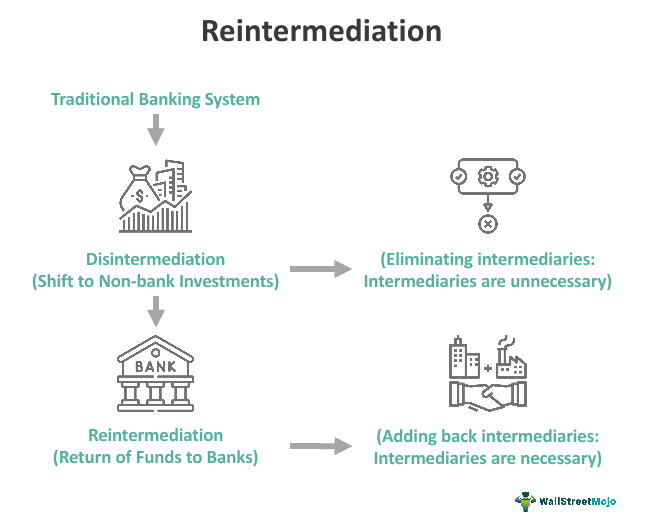

In the ever-evolving world of finance, algorithmic trading has asserted itself as a transformative and dominant force. This automated form of trading utilizes complex algorithms to analyze and execute trades at speeds and volumes that surpass human capabilities. At the core of efficient algorithmic trading systems lies the 'process reintermediation function,' a concept that emphasizes the reintroduction of certain functions or intermediaries to enhance operational efficiency.

Reintermediation in algorithmic trading refers to the strategic incorporation of intermediaries—be it technology, human oversight, or processes—where they had previously been minimized or eliminated. This approach is often adopted to address the growing complexities and dynamism inherent in modern financial markets. By doing so, trading systems can better manage data flows, mitigate risks, and adapt to continuous market changes.

This article explores the critical role reintermediation plays within algorithmic trading systems, specifically at the intersection of technology, strategy, and organization. It examines how these elements coalesce to create a resilient and robust trading environment capable of sustaining competitive advantages in a volatile marketplace. Understanding these dynamics is essential for professionals involved in, or considering entry into, algorithmic trading, as it equips them with insights into maintaining operational excellence and strategic foresight. 

Navigating the challenges of algorithmic trading requires a balance of automation and strategic intermediary roles, a theme explored throughout this discussion. The efficacy of this balance is pivotal to ensuring ongoing market vigilance, adaptive strategies, and ultimately, sustained success in an unpredictable financial landscape.

## Table of Contents

## Understanding Reintermediation

Reintermediation involves the reintroduction of intermediaries in contexts where they were previously eliminated, aiming to enhance complex processes, particularly in areas like trading. Trading has evolved significantly, often shifting toward fully automated systems, but reintermediation recognizes the potential benefits of middlemen in certain scenarios.

In financial markets, reintermediation can be employed to manage intricate trading processes and systems, particularly during volatile market conditions where quick, strategic decision-making is paramount. These intermediaries could range from financial analysts providing specialized expertise to advanced software systems optimizing complex algorithms. The demand for such middle management often escalates in rapidly changing market environments, highlighting the need for specialized insight and advanced analytical capabilities.

Reintermediation can also enhance the operational efficiency of trading systems. By introducing intermediaries with the necessary expertise, companies can optimize workflows and improve decision-making processes, thus potentially achieving faster and more accurate trade executions. However, this improved efficiency often incurs additional costs, such as those associated with hiring specialized personnel or investing in sophisticated software solutions. These costs must be weighed against the potential benefits and efficiencies gained.

Furthermore, effective reintermediation strategies can significantly support better resource allocation within companies. Through strategic planning and allocation of resources, firms can ensure that their workforce is focused on high-priority tasks, leveraging intermediary expertise where it can add the most value. This strategic focus on resource allocation can result in improved overall performance and competitiveness.

Ultimately, reintermediation in trading highlights the balance companies must strike between automated processes and human or software intermediaries to manage complexity and maintain competitive advantages in challenging market conditions.

## Role of Reintermediation in Algorithmic Trading

Algorithmic trading systems, at their core, thrive on the swift processing of vast datasets and making rapid decision-making to capitalize on market movements. In this landscape, reintermediation plays a transformative role by streamlining data flows and enhancing trade executions. By reintroducing intermediaries, such as sophisticated software systems or experienced financial analysts, traders can fine-tune algorithm parameters to adapt to fluctuating market demands.

One significant advantage of incorporating intermediaries lies in optimizing the execution layer of trading systems. For example, software providers can offer advanced analytical tools that enable traders to identify inefficiencies within their algorithms, leading to more precise and timely executions. This augmentation can be crucial when milliseconds determine profitability, as even the slightest improvement in execution speed or accuracy can yield substantial financial gains.

Moreover, while automation is the backbone of [algorithmic trading](/wiki/algorithmic-trading), complete reliance on machines can pose inherent risks. The reintroduction of human oversight serves as a counterbalance, mitigating potential pitfalls associated with fully autonomous systems. For instance, humans can intervene to address unexpected algorithmic behaviors or market anomalies, reducing the risk of significant financial losses caused by machine errors or unforeseen events.

Reintermediation is also critical in fostering a dynamic response to ongoing market changes. Markets are in a constant state of flux, influenced by geopolitical, economic, and social factors. The presence of intermediaries allows trading systems to continuously adapt to these changes, ensuring that strategies remain relevant and effective. This adaptability is vital for maintaining a competitive edge in a crowded trading environment, where the ability to swiftly pivot strategies can distinguish successful traders from the rest.

Ultimately, reintermediation in algorithmic trading provides a structured yet flexible framework, enabling traders to harness the full potential of technology while leveraging human expertise. This hybrid model not only enhances operational efficiency but also ensures sustainable success by aligning algorithmic decision-making with the dynamic nature of financial markets.

## Technological and Strategic Benefits

Technological advancements have greatly enhanced the integration of reintermediation in algorithmic trading. These advancements provide traders with sophisticated tools that improve risk management through diversified trading strategies. By introducing intermediaries such as software tools and expert analysts, trading firms can gain critical insights into market behavior and asset correlations, facilitating more informed decision-making processes.

Reintermediation further supports the optimization and [backtesting](/wiki/backtesting) of trading algorithms. When intermediaries are involved in designing and refining algorithms, they can incorporate advanced [machine learning](/wiki/machine-learning) models and [artificial intelligence](/wiki/ai-artificial-intelligence) to process large volumes of historical data. This allows traders to simulate various market conditions and fine-tune parameters for optimal performance, increasing the probability of successful trades. Backtesting is essential for validating and improving algorithmic strategies under different scenarios, ensuring they perform well in live market conditions.

In addition to strategy optimization, intermediaries play a crucial role in ensuring compliance with ever-evolving regulatory landscapes. Financial markets are subject to stringent regulations that require firms to maintain transparency and adhere to specific trading practices. By leveraging intermediaries with specialized regulatory knowledge and tools designed to monitor compliance, trading firms can mitigate the risks of regulatory breaches and penalties.

Furthermore, technological integration in reintermediation enables firms to scale operations more efficiently and securely. Cloud computing, for example, offers scalable infrastructure that can handle varying loads of data and processing demands. It allows firms to expand their trading operations globally without the need for significant investments in physical infrastructure. Additionally, robust cybersecurity protocols that come with modern technology solutions ensure the protection of sensitive trade data and algorithms against cyber threats.

Overall, the coupling of technological advancements with strategic reintermediation empowers algorithmic trading firms, providing them with the flexibility and robustness needed to excel in a competitive financial environment.

## Challenges and Considerations

The reintroduction of intermediaries into algorithmic trading systems entails certain challenges and considerations that traders and firms must address to maximize the benefits while minimizing potential drawbacks. One of the primary challenges is the increased operational costs associated with integrating intermediaries. As these [agents](/wiki/agents) are brought back into the trading process, expenses related to hiring skilled personnel, software procurement, and infrastructure upgrades can rise significantly. Therefore, firms must carefully evaluate whether the efficiency gains from reintermediation justify these additional costs.

Furthermore, there exists a risk of over-reliance on intermediaries within the trading system. When intermediaries take on crucial roles, such as optimizing algorithm parameters or providing compliance support, there is a possibility that the firm might become too dependent on these agents. This reliance can stifle innovation, as firms may become hesitant to develop new strategies or technologies that could potentially render the intermediary's role obsolete. To counteract this, companies must strike a balance between leveraging intermediary expertise and fostering an environment of innovation and independent growth.

Another critical challenge involves balancing cybersecurity with system integration. Introducing new intermediaries often requires integrating multiple systems, which can expose vulnerabilities within the trading infrastructure. Ensuring robust cybersecurity measures to protect sensitive data and prevent breaches is essential. Firms must invest in effective cybersecurity protocols that align with the complexity of their trading systems and the intermediaries involved.

Market dynamics further complicate reintermediation efforts by necessitating flexible strategies. The ever-changing market conditions require firms to adapt quickly, a process made more challenging when intermediaries are involved. The intermediaries themselves must be agile enough to respond to market fluctuations, requiring continuous communication and feedback loops between various agents in the trading ecosystem.

Ultimately, navigating these challenges is essential for firms to ensure a return on investment (ROI) when engaging in reintermediation. Firms need strategic planning and evaluation to identify the optimal level of intermediary involvement that maximizes operational efficiency while maintaining cost-effectiveness. Implementing these strategies requires a comprehensive understanding of both internal capabilities and external market conditions, ensuring that the benefits of reintermediation are fully realized.

## Future Trends and Developments

As algorithmic trading continues to advance, the concept of reintermediation will likely evolve, embracing new technological paradigms and adapting to changing market and regulatory conditions. Emerging technologies, particularly Artificial Intelligence (AI) and Machine Learning (ML), hold the potential to revolutionize the roles traditionally played by intermediaries. AI algorithms can process vast amounts of data and generate insights more efficiently than human analysts, redefining how positions are evaluated and decisions are made. Machine Learning models enable the dynamic adjustment of trading strategies, allowing systems to learn from market fluctuations and optimize trade execution parameters in real-time.

For trading firms, rapid adaptation to these technological shifts is imperative to maintain a competitive edge. As more firms integrate AI and ML into their operations, the traditional sources of competitive advantage may diminish, pushing firms to innovate continuously. This might involve not only technological upgrades but also strategic re-evaluations of business models, risk management protocols, and customer engagement processes.

The regulatory environment will undoubtedly play a significant role in shaping the future of reintermediation in algorithmic trading. Regulators are increasingly scrutinizing the use of complex algorithms and automation in trading, raising concerns about market stability, fairness, and transparency. As such, regulatory changes are expected to influence how reintermediation functions are implemented, potentially requiring greater human oversight or the incorporation of compliance-oriented technologies.

There may also be a trend towards integrating automated systems with strategic human oversight, blending machine efficiency with human judgment. While algorithms can handle high-frequency data processing and operational tasks, humans can provide qualitative assessments, evaluate broader economic indicators, and manage exceptional situations that require nuanced understanding. This hybrid approach, balancing sophistication in automation with deliberate human intervention, could become a defining feature of effective algorithmic trading strategies.

In summary, the future trajectory of reintermediation in algorithmic trading is poised for dynamic changes. Firms that can adeptly navigate technological advancements, regulatory pressures, and market demands will likely thrive in this evolving landscape.

## Conclusion

Reintermediation plays a crucial role in boosting the efficiency and effectiveness of algorithmic trading systems. By carefully balancing automation with strategic intermediary roles, firms can achieve sustainable success. This balance is vital, as purely automated models may overlook the nuanced insights that human intermediaries can provide, thus potentially exposing firms to unanticipated market risks.

To succeed in the dynamic landscape of financial markets, ongoing market vigilance and the adoption of adaptive trading strategies are essential. The capacity to adapt to rapidly changing conditions depends significantly on the effective reintroduction of intermediaries, who can offer critical insights and adjustments needed to align trading strategies with real-time data and market trends.

Incorporating reintermediation into trading operations equips firms with the necessary tools to navigate unpredictable market conditions. By strategically employing intermediaries and leveraging their expertise, firms can develop robust strategies that respond dynamically to fluctuations in the market, thereby maintaining a competitive edge.

The advancement of algorithmic trading and the role of reintermediation highlight a journey of continuous learning and adaptation. This journey requires firms to stay informed about emerging technologies and regulatory developments that could redefine intermediary roles. As the financial trading industry continues to evolve, maintaining flexibility and readiness to adjust intermediary strategies will be pivotal for continued success. The future of algorithmic trading lies in this seamless integration of automated systems with human oversight, creating a symbiotic relationship that enhances operational efficiency while mitigating risk.

## References & Further Reading

[1]: Bergstra, J., Bardenet, R., Bengio, Y., & Kégl, B. (2011). ["Algorithms for Hyper-Parameter Optimization."](https://papers.nips.cc/paper/4443-algorithms-for-hyper-parameter-optimization) Advances in Neural Information Processing Systems 24.

[2]: ["Advances in Financial Machine Learning"](https://www.amazon.com/Advances-Financial-Machine-Learning-Marcos/dp/1119482089) by Marcos Lopez de Prado

[3]: ["Evidence-Based Technical Analysis: Applying the Scientific Method and Statistical Inference to Trading Signals"](https://www.amazon.com/Evidence-Based-Technical-Analysis-Scientific-Statistical/dp/0470008741) by David Aronson

[4]: ["Machine Learning for Algorithmic Trading"](https://github.com/stefan-jansen/machine-learning-for-trading) by Stefan Jansen

[5]: ["Quantitative Trading: How to Build Your Own Algorithmic Trading Business"](https://www.amazon.com/Quantitative-Trading-Build-Algorithmic-Business/dp/1119800064) by Ernest P. Chan