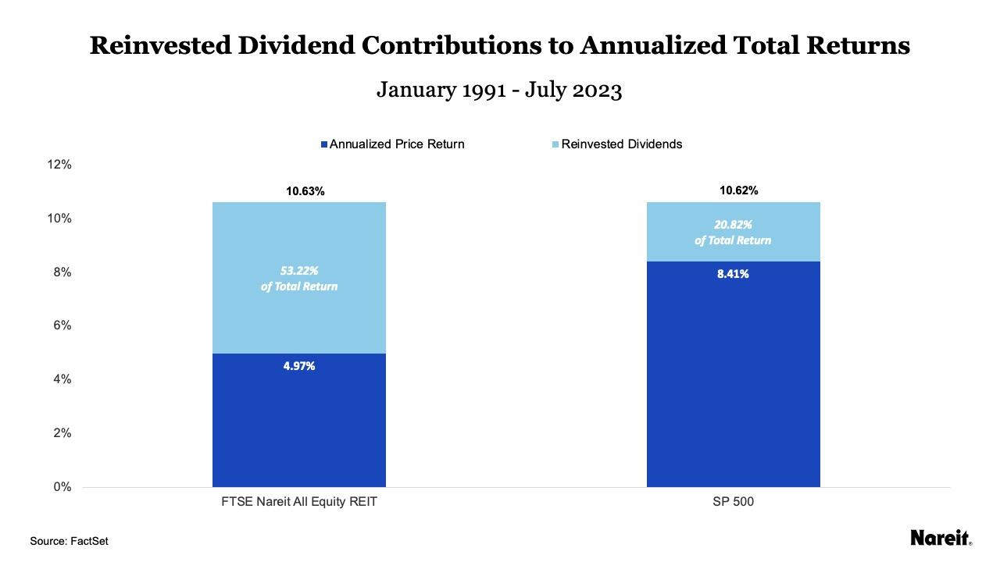

## Table of Contents

## What is a REIT?

A REIT, or Real Estate Investment Trust, is a company that owns, operates, or finances income-generating real estate. It's like a mutual fund for real estate, where people can invest their money and get a share of the profits. REITs usually focus on different types of properties like apartments, malls, offices, or hotels. By investing in a REIT, people can earn money from real estate without having to buy, manage, or finance properties themselves.

REITs are popular because they offer a way to invest in real estate with less money than buying a property outright. They also have to pay out at least 90% of their taxable income as dividends to shareholders, which can provide a steady income stream. This makes them attractive to people looking for regular income, like retirees. However, like any investment, REITs can go up or down in value, so it's important to understand the risks before investing.

## How do REITs generate income?

REITs make money mainly by renting out the properties they own. They buy buildings like apartments, shopping centers, or office spaces and then charge people or businesses rent to use these spaces. The rent money they collect is their main source of income. This income helps them pay for things like building upkeep, taxes, and other costs. Whatever money is left over after these expenses is profit, which they can then share with their investors as dividends.

Another way REITs can make money is by selling properties. If a REIT buys a property at a low price and then sells it later for more money, they can make a profit from the difference. This is called capital gains. Not all REITs focus on this, though. Some prefer to keep their properties and earn steady rental income instead. But when they do sell, the money they make can also be shared with investors or used to buy new properties to keep the cycle of income going.

## What are REIT dividends?

REIT dividends are the money that Real Estate Investment Trusts pay out to their investors. When a REIT makes money from renting out properties or selling them for a profit, they have to give at least 90% of their taxable income back to their shareholders. This money is called dividends, and it's like getting a share of the profits without having to do any of the work of managing properties yourself.

Dividends from REITs can be a good way to earn regular income. Many people, like retirees, like REITs because they can get a steady stream of money without having to sell their shares. But remember, the amount of dividends can change. It depends on how well the REIT is doing and how much money they make from their properties. So, while dividends can be a nice benefit, they're not always guaranteed and can go up or down.

## Why might someone want to reinvest REIT dividends?

Someone might want to reinvest REIT dividends to grow their investment over time. When you reinvest dividends, you use the money you get from the REIT to buy more shares of that REIT. This means you own more of the company, and if the REIT does well, your investment can get bigger. It's like planting a seed and watching it grow. The more shares you have, the more dividends you can earn in the future, which can lead to even more shares and more growth.

Another reason to reinvest REIT dividends is to take advantage of compound growth. When you reinvest, your dividends start [earning](/wiki/earning-announcement) their own dividends. This can make your investment grow faster than if you just took the money out. It's a way to make your money work harder for you without having to put in more money yourself. Over time, this can add up and help you build a bigger nest egg for the future.

## How can you reinvest dividends from REITs?

Reinvesting dividends from REITs means using the money you get from them to buy more shares of the same REIT. This can be done easily if the REIT offers a Dividend Reinvestment Plan, or DRIP. With a DRIP, the money from your dividends automatically buys more shares for you, without you having to do anything. This is a simple way to keep growing your investment over time.

If the REIT doesn't have a DRIP, you can still reinvest your dividends, but you'll need to do it yourself. When you get your dividend payment, you can use that money to buy more shares of the REIT. This might take a bit more work, but it gives you the same chance to grow your investment. Either way, reinvesting your dividends can help you own more of the REIT and possibly earn more money in the future.

## What are the tax implications of reinvesting REIT dividends?

When you reinvest dividends from a REIT, you still have to pay taxes on them, just like you would if you took the money out. The IRS sees reinvested dividends as income, so you'll need to report them on your tax return. The tax rate you pay depends on how much money you make overall. If you're in a higher tax bracket, you might pay more in taxes on your reinvested dividends.

There's another thing to keep in mind: when you reinvest dividends, you're increasing the number of shares you own. When you eventually sell those shares, you might have to pay capital gains tax on any profit you make. The tax rate for capital gains can be different from the tax rate on your dividends. It's a good idea to talk to a tax professional to understand how reinvesting REIT dividends will affect your taxes and plan accordingly.

## What are the potential benefits of reinvesting REIT dividends over time?

Reinvesting REIT dividends can help your investment grow bigger over time. When you reinvest, you use the money you get from dividends to buy more shares of the REIT. This means you own more of the company, and if the REIT does well, your investment can grow. It's like planting a seed and watching it grow into a bigger plant. The more shares you have, the more dividends you can earn in the future, which can lead to even more shares and more growth.

Another benefit of reinvesting REIT dividends is that it can help your money grow faster through something called compound growth. When you reinvest, your dividends start earning their own dividends. This can make your investment grow faster than if you just took the money out. It's a way to make your money work harder for you without having to put in more money yourself. Over time, this can add up and help you build a bigger nest egg for the future.

## How does compounding affect reinvested REIT dividends?

Compounding is like a snowball that gets bigger as it rolls down a hill. When you reinvest your REIT dividends, you're using the money you get to buy more shares. Those new shares then earn their own dividends, which you can reinvest again to buy even more shares. This cycle keeps going, and over time, your investment can grow much bigger than if you just took the money out.

The power of compounding is that it can make your money grow faster. Instead of just earning dividends on the shares you started with, you're earning dividends on all the new shares you've bought with your reinvested dividends. This means your investment can grow at a faster rate, helping you build more wealth over the long term.

## What are the risks associated with reinvesting in REITs?

Reinvesting in REITs can be a good way to grow your money, but it comes with risks. One big risk is that the value of the REIT can go down. If the real estate market has problems, or if the specific properties the REIT owns don't do well, the price of the REIT's shares can drop. If you're reinvesting dividends to buy more shares, and the share price goes down, your investment might lose value. This means you could end up with less money than you started with.

Another risk is that dividends are not always guaranteed. If the REIT doesn't make enough money from its properties, it might have to cut or stop paying dividends. This can be a problem if you're counting on that money to reinvest and grow your investment. Also, when you reinvest dividends, you're buying more shares, which means you're putting more of your money at risk. If the REIT's value drops a lot, you could lose more money because you own more shares.

## How do different types of REITs impact dividend reinvestment strategies?

Different types of REITs can affect your dividend reinvestment strategy because they focus on different kinds of properties and have different ways of making money. For example, equity REITs own and operate properties like apartments, malls, and office buildings. They make most of their money from renting these properties out. If you reinvest dividends from an equity REIT, you might be betting on the long-term growth of real estate and the steady income from rent. But if the real estate market has a downturn, the value of your shares might go down, affecting how much you can reinvest.

On the other hand, mortgage REITs invest in mortgages or mortgage-backed securities instead of owning physical properties. They earn money from the interest on these loans. Reinvesting dividends from a mortgage REIT might be riskier because it's tied to the health of the mortgage market and interest rates. If interest rates go up, the value of the mortgage REIT's investments might go down, which could hurt your reinvestment strategy. So, it's important to understand the type of REIT you're investing in and how its business model might affect your dividends and reinvestment plans.

## What are some advanced strategies for maximizing returns from reinvested REIT dividends?

One advanced strategy for maximizing returns from reinvested REIT dividends is to diversify your investments across different types of REITs. By spreading your money among equity REITs, which focus on owning and operating properties, and mortgage REITs, which invest in mortgages, you can balance the risks and rewards. Equity REITs might offer more stable income from rent, while mortgage REITs can provide higher returns but come with more risk due to [interest rate](/wiki/interest-rate-trading-strategies) changes. This mix can help you reinvest dividends in a way that keeps your portfolio growing, even if one type of REIT is not doing well.

Another strategy is to use dollar-cost averaging when you reinvest your dividends. This means you reinvest a fixed amount of money at regular intervals, regardless of the REIT's share price. Over time, this can help you buy more shares when prices are low and fewer when prices are high, which can lead to a lower average cost per share. This can be especially useful for REITs because their prices can go up and down with the real estate market. By sticking to a regular reinvestment plan, you can take advantage of these price swings and potentially increase your returns over the long run.

## How can portfolio diversification be achieved through reinvesting in various REITs?

Portfolio diversification through reinvesting in various REITs means spreading your money across different types of real estate investments. You can do this by choosing to reinvest dividends in both equity REITs, which own and operate properties like apartments or shopping centers, and mortgage REITs, which invest in mortgages. By doing this, you're not putting all your eggs in one basket. If one type of REIT doesn't do well, the other might still be doing okay, which can help keep your overall investment stable.

Another way to diversify is by [picking](/wiki/asset-class-picking) REITs that focus on different kinds of properties or different parts of the country. For example, you might reinvest dividends in a REIT that owns hotels in one part of the country and another that owns office buildings in a different area. This way, you're not just betting on one kind of real estate or one location. If the hotel market has a tough time, your office building REIT might still be doing well. This can help your portfolio grow more steadily over time by balancing out the ups and downs in different parts of the real estate market.

## References & Further Reading

[1]: Chan, E. (2009). ["Quantitative Trading: How to Build Your Own Algorithmic Trading Business."](https://github.com/ftvision/quant_trading_echan_book) Wiley.

[2]: Lopez de Prado, M. (2018). ["Advances in Financial Machine Learning."](https://www.amazon.com/Advances-Financial-Machine-Learning-Marcos/dp/1119482089) Wiley.

[3]: Aronson, D. (2006). ["Evidence-Based Technical Analysis: Applying the Scientific Method and Statistical Inference to Trading Signals."](https://www.amazon.com/Evidence-Based-Technical-Analysis-Scientific-Statistical/dp/0470008741) Wiley.

[4]: Jansen, S. (2020). ["Machine Learning for Algorithmic Trading: Predictive Models to Extract Signals from Market and Alternative Data for Systematic Trading Strategies with Python."](https://github.com/stefan-jansen/machine-learning-for-trading) Packt Publishing.

[5]: Chan, E. (2013). ["Algorithmic Trading: Winning Strategies and Their Rationale."](https://github.com/ftvision/quant_trading_echan_book) Wiley.