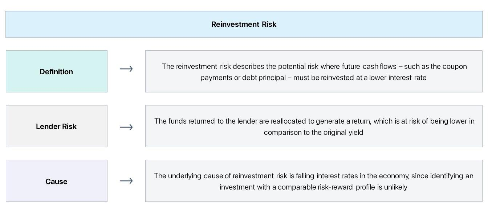

In the rapidly evolving financial landscape, understanding the nuances of investment, risk, and emerging technology is pivotal for investors. The financial markets are characterized by a constant state of flux, influenced by economic, political, and technological developments. This dynamic environment requires investors to be well-versed in various aspects of investment strategies to remain competitive and successful.

This article examines crucial facets of modern investment strategies, including financial risk management, reinvestment rates, and the impact of algorithmic trading. These elements are integral to constructing a robust investment portfolio that can withstand market volatility and generate sustainable returns. Financial risk management involves identifying, assessing, and prioritizing risks associated with financial assets. By employing a range of tools and strategies, investors can mitigate these risks and enhance the stability of their investments.



Reinvestment rates, which refer to the rate of return on reinvesting cash flows from an investment, are another key component of investment strategy. Changes in interest rates and market conditions can impact reinvestment rates, influencing the overall return on investment. Understanding these factors is essential for making informed decisions about how to allocate resources effectively.

The advent of algorithmic trading has transformed investment strategies, offering unprecedented speed and precision in executing trades. These computer-driven trading systems can analyze vast amounts of data and make decisions at a tempo impossible for human traders. While algorithmic trading presents opportunities for enhanced performance, it also introduces unique risks that require careful management.

By examining these elements, readers will gain insights into optimizing portfolios and maximizing returns while managing potential risks. A comprehensive understanding of financial risk management, reinvestment strategies, and the role of technology in investments is essential for navigating the complexities of today's financial markets.

## Table of Contents

## Understanding Financial Investment Risk

Investment risk is the possibility that the actual returns on an investment will be lower than the expected returns, often leading to a loss of principal. It encompasses several types, including market risk, credit risk, and liquidity risk.

Market risk arises from the [volatility](/wiki/volatility-trading-strategies) of financial markets and can affect stocks, bonds, commodities, and currencies. It is influenced by macroeconomic factors, geopolitical events, and investor sentiment, which can cause fluctuations in the value of investments. For example, a change in interest rates by a central bank can impact bond prices and equity markets.

Credit risk pertains to the probability that a borrower will default on a financial obligation, resulting in a loss to the lender. This type of risk is prevalent in fixed-income securities like bonds, where the borrower's credit rating significantly influences the investment's risk level. Higher-rated bonds (e.g., AAA) typically offer lower yields due to perceived lower risk, while lower-rated ones (e.g., junk bonds) provide higher yields to compensate for increased risk.

Liquidity risk refers to the difficulty of converting an asset into cash without a significant loss in value. This risk is pronounced in investments that do not have a ready market or are subject to restrictions, such as certain real estate or private equity assets. During periods of market stress, even traditionally liquid assets can become difficult to sell without impacting their price significantly.

Investors must evaluate these risks to create strategies that balance potential returns with their risk tolerance. Tools like value-at-risk (VaR) and stress testing are used to assess potential losses under various scenarios. Historical data analysis plays a crucial role in understanding market behaviors and volatility patterns, providing insights into potential future risks. By employing these methods, investors can anticipate unfavorable market conditions and adopt tactics to minimize losses.

For example, an investor might use Python to perform a historical analysis using the following code snippet:

```python
import pandas as pd
import numpy as np

# Load financial data
data = pd.read_csv('historical_data.csv')

# Calculate daily returns
data['returns'] = data['price'].pct_change()

# Calculate Value-at-Risk at 95% confidence level
VaR = np.percentile(data['returns'].dropna(), 5)

print(f"Value-at-Risk at 95% confidence level: {VaR:.2%}")
```

This script calculates the daily returns of an asset and computes the Value-at-Risk (VaR) at a 95% confidence level, indicating the maximum expected loss over a given period with a specified confidence.

In summary, understanding and managing investment risk requires a comprehensive approach that includes assessing market fluctuations, creditworthiness of counterparties, and the [liquidity](/wiki/liquidity-risk-premium) of assets. By leveraging risk assessment tools and historical analyses, investors can devise strategies that optimize returns while keeping risks within acceptable limits.

## Exploring Reinvestment Rate: Definition and Impact

The reinvestment rate is a crucial concept in the evaluation of investment returns, particularly for fixed-income securities such as bonds. It represents the rate at which an investor can reinvest cash flows—such as interest payments or dividends—received from current investments. The determination of this rate is profoundly influenced by the prevailing [interest rate](/wiki/interest-rate-trading-strategies) environment. For instance, if the market interest rates decline, investors may find themselves reinvesting cash flows at lower rates than those initially anticipated, thereby reducing the overall yield of their investment portfolios.

Fixed-income investors often focus on the reinvestment rate due to its significant impact on the total return. When interest rates are high, and expected to fall, the ability to lock in high reinvestment rates could potentially enhance returns. Conversely, if current market rates are lower than the coupon rate of a bond, the cash flows from the bond will likely be reinvested at a lower rate, leading to reinvestment risk.

Reinvestment risk is the concern that future cash flows, such as the interest and principal payments from a bond, will have to be reinvested at a rate that is lower than the rate of return originally expected. This risk is particularly pertinent to callable bonds, which are likely to be called back by the issuer when interest rates drop, compelling the investor to reinvest the proceeds at a less favorable rate.

Strategic planning is essential to manage reinvestment risk. Investors may consider various strategies such as laddering bonds, where they invest in bonds with different maturity dates to diversify reinvestment opportunities over time, thus reducing the impact of interest rate fluctuations. Additionally, utilizing investment-grade bonds with longer maturities can also be a tactic to lock in attractive interest rates before anticipated declines.

In mathematical terms, consider the future value of a series of cash flows $C$ reinvested at a reinvestment rate $r$ for $n$ periods. The future value, $FV$, can be calculated as:

$$
FV = C \times \frac{(1 + r)^n - 1}{r}
$$

This formula helps in estimating the accrued amount from reinvested cash flows over time, illustrating how variations in the reinvestment rate can significantly impact the closing value of an investment portfolio.

In conclusion, understanding the implications of the reinvestment rate and reinvestment risk is vital for investors aiming to optimize their return on investments. By being aware of interest rate fluctuations and strategically planning the reinvestment of cash flows, investors can mitigate downsides and enhance their investment strategy.

## Algorithmic Trading: Transforming Investment Strategies

Algorithmic trading utilizes sophisticated computer algorithms to conduct trades at speeds and efficiencies unattainable by human traders. By executing transactions based on prespecified parameters, this method minimizes human intervention and error, significantly enhancing trading execution quality. The primary advantages of [algorithmic trading](/wiki/algorithmic-trading) include precision, the ability to backtest strategies using historical data, reduced transaction costs, and the capacity to manage large volumes of trades efficiently.

One of the chief benefits of algorithmic trading is its ability to consistently and quickly execute orders at the best possible prices. Algorithms can scan multiple markets and exchanges rapidly to locate the most favorable trading opportunities. Additionally, they can perform "[backtesting](/wiki/backtesting)" by applying trading algorithms to historical market data to evaluate the trading idea's viability without putting actual capital at risk. This allows traders to fine-tune their strategies and improve decision-making.

However, algorithmic trading is not without risks. System failures, such as software bugs or hardware malfunctions, can lead to significant financial losses. For example, the inability of an algorithm to adapt to real-time market conditions can result in trades being executed at unfavorable prices. Furthermore, the high speed of algorithmic trading can contribute to market volatility, as seen during the 2010 "Flash Crash" when the Dow Jones Industrial Average plunged and then partially recovered within minutes.

To counteract these risks, robust risk management strategies are essential. This includes implementing failsafe mechanisms such as kill switches, which can halt trading activity during system anomalies. Additionally, regular audits and updates of trading algorithms are crucial to ensure they operate optimally in dynamic market conditions. A comprehensive risk management framework can integrate aspects such as portfolio diversification and setting appropriate stop-loss limits to mitigate potential adverse outcomes attributable to algorithmic trading. 

Through a balanced approach that leverages the benefits while addressing the challenges, algorithmic trading can play a pivotal role in transforming investment strategies, leading to more efficient and responsive financial markets.

## Integrated Risk Management Strategies

Integrated risk management strategies are essential components of successful investment practices, integrating various techniques to mitigate potential financial risks. One fundamental strategy is portfolio diversification. By spreading investments across different asset classes, sectors, or geographic regions, investors can reduce the impact of a poor performance of a single investment on their overall portfolio. This strategy lowers unsystematic risk, which pertains to individual assets or industries, while maintaining the potential for favorable returns.

Employing stop-loss orders is another pivotal technique. These orders allow investors to predefine a selling price for their securities, automatically executing trades when the market price reaches a specified threshold. Stop-loss orders help investors limit potential losses without having to constantly monitor market fluctuations. For instance, an investor might set a stop-loss order to sell a stock if its price falls 10% below the purchase price, thus capping the potential loss.

Hedging with derivatives provides another layer of risk management. Derivatives, including options and futures, are financial instruments whose value derives from an underlying asset. Investors use derivatives to protect against price fluctuations in their portfolios. For example, purchasing a put option gives the investor the right, but not the obligation, to sell a particular stock at a predetermined price, within a specific period. This technique can protect the portfolio against significant losses during market downturns.

Algorithmic trading systems frequently incorporate automated risk protocols, enhancing the ability to manage sudden market changes. These systems leverage high-speed data analysis and predefined criteria to execute trades, minimizing human error. Integrated risk management is achieved by implementing algorithms that monitor market conditions and adjust strategies in real-time. For example, algorithms can automatically rebalance portfolios or initiate stop-loss orders based on market signals, ensuring the investment strategy aligns with current risk assessments.

Overall, combining diversification, stop-loss orders, derivatives, and algorithmic risk protocols facilitates a comprehensive approach to financial risk management. By employing these strategies, investors can enhance portfolio resilience and safeguard against unexpected market events, securing better long-term performance.

## Case Studies: Successful Implementation of Risk Strategies

Renaissance Technologies and Two Sigma are prime examples of firms that have successfully implemented risk management and algorithmic trading strategies to optimize their investment outcomes. Both organizations have built reputations for leveraging quantitative approaches and technological innovations to gain competitive advantages in the financial markets.

**Renaissance Technologies** is known for its Medallion Fund, which has achieved remarkable returns by employing data-driven strategies. The firm utilizes sophisticated algorithms and models to analyze vast amounts of historical data, identifying patterns and inefficiencies in the market. By capitalizing on these insights, Renaissance Technologies can implement trades with a precision that significantly reduces exposure to risk. A key aspect of their strategy is diversification across numerous trading opportunities, which minimizes individual asset risk and enhances portfolio resilience. This method of risk management is akin to optimizing a mathematical function where the goal is to balance the risk-return trade-off effectively. 

**Two Sigma**, another leader in quantitative investing, also relies heavily on data science and mathematical modeling to inform its trading decisions. The firm employs machine learning algorithms that continuously learn and adapt to new market data, allowing for dynamic adjustments in trading strategies. This adaptability is crucial in rapidly changing financial environments, where static models might falter. Two Sigma’s approach highlights the significance of refining algorithms to account for evolving market conditions—this can be visualized as a feedback loop, where historical outcomes influence future decision-making processes, enhancing the robustness of their models.

Both Renaissance Technologies and Two Sigma exemplify the integration of risk management into algorithmic trading. Their strategies underscore the importance of using diversification as a tool to mitigate systemic risks while employing advanced computational techniques to exploit transient market opportunities. The success of these firms showcases the potential for sophisticated quantitative strategies to drive significant investment performance by effectively managing financial risks and adapting to market dynamics.

In summary, the case studies of Renaissance Technologies and Two Sigma illustrate how innovative use of data and technology can lead to successful risk strategy implementation. Their methodologies highlight the continuous need for evolution and refinement in trading algorithms, ensuring they remain effective in an ever-changing financial landscape.

## Conclusion

The convergence of investment risk management, reinvestment strategies, and algorithmic trading has emerged as a sophisticated approach to achieving optimal investment outcomes. This integration allows investors to navigate the complexities of modern financial markets effectively. As these markets continue to evolve, staying adaptive and informed about emerging technologies and risk mitigation techniques is crucial for maintaining a competitive edge. 

Investment risk management provides a foundation for understanding and mitigating potential losses associated with financial assets. By assessing various risks such as market, credit, and liquidity risks, investors can devise strategies that balance potential returns with tolerable risk levels. This foundational knowledge is pivotal when considering reinvestment strategies, particularly in environments where interest rates fluctuate. An understanding of reinvestment rates helps investors manage the risk that arises when cash flows cannot be reinvested at a rate comparable to initial returns.

Algorithmic trading further enhances investment strategies by employing computer programs to execute trades based on predefined criteria. It offers speed and efficiency, allowing for the handling of large volumes of trades with minimal human error. This technological advancement necessitates robust risk management strategies to address potential system failures and market volatility, ensuring algorithmic systems remain resilient to unexpected market changes.

Unified, these elements allow for the construction of robust investment strategies that can maximize returns while effectively managing associated risks. Investors who incorporate comprehensive risk assessment, strategic reinvestment planning, and advanced trading technologies are well-positioned to thrive in evolving financial landscapes. As such, it is imperative for investors to continuously refine their strategies and stay abreast of technological developments and risk management innovations to successfully navigate the financial markets and achieve desirable investment results.

## References & Further Reading

Bergstra, J., et al. “Algorithms for Hyper-Parameter Optimization.” This paper introduces sophisticated methods for optimizing hyper-parameters in [machine learning](/wiki/machine-learning) models, which are crucial for fine-tuning algorithmic trading systems.

Lopez de Prado, M. Advances in Financial Machine Learning. This book covers a wide range of machine learning techniques applicable to financial markets, including advanced methods for managing investment risk and optimizing trading strategies.

Chan, E. Quantitative Trading: How to Build Your Own Algorithmic Trading Business. This resource provides insights into the practical aspects of setting up an algorithmic trading business, with emphasis on coding strategies and risk management.

Jansen, S. Machine Learning for Algorithmic Trading. Jansen explores machine learning models and their application in developing predictive trading systems, emphasizing the importance of data-driven decision-making in modern finance.

Aronson, D. Evidence-Based Technical Analysis: Applying the Scientific Method and Statistical Inference to Trading Signals. Aronson applies rigorous statistical methods to evaluate trading signals, offering insights into more objective and scientifically grounded approaches to technical analysis.

