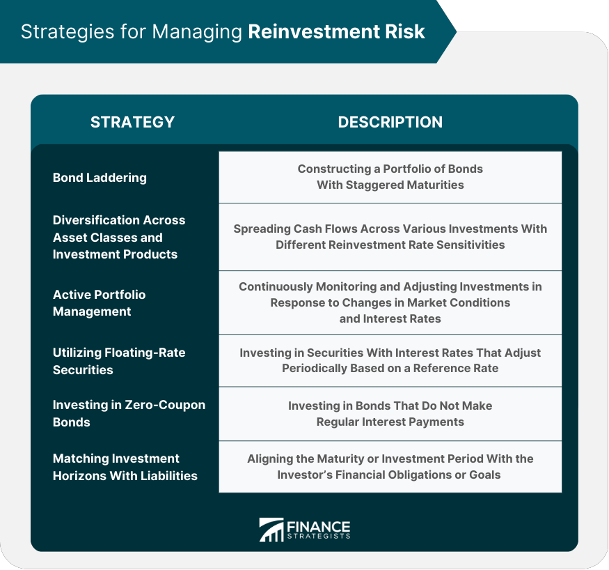

## Table of Contents

## What is reinvestment risk?

Reinvestment risk is the chance that you won't be able to put your money back into an investment that gives you the same level of return as before. Imagine you have a bond that pays you interest every year. When you get that interest, you want to put it into another investment. But what if the new investment doesn't give you as much money as the original bond did? That's reinvestment risk.

This risk is a big deal for people who rely on the income from their investments, like retirees. If they can't find good investments to put their money into, they might not have enough money to live on. It's important for investors to think about this risk when they plan their investments, especially if they are counting on regular income from those investments.

## How does reinvestment risk affect bond investors?

Reinvestment risk can be a big worry for people who invest in bonds. When a bond pays interest, the investor usually wants to put that money back into another investment. But if interest rates have gone down since they bought the original bond, they might not be able to find a new investment that pays as much. This means they could end up with less money over time because the new investment doesn't give them the same return.

This risk is especially important for people who rely on the income from their bonds, like retirees. If they can't reinvest their bond interest at a good rate, their income might not be enough to cover their needs. So, bond investors need to think carefully about reinvestment risk and maybe even plan to have different kinds of investments to help manage this risk better.

## What are the common causes of reinvestment risk?

Reinvestment risk happens a lot when interest rates go down. When you have a bond that pays you interest, you want to put that money into another investment. But if interest rates have dropped since you got your bond, you might not find a new investment that gives you as much money as before. This means you could end up with less money over time because the new investment doesn't pay as well.

Another cause of reinvestment risk is when bonds mature. When a bond reaches its maturity date, you get your money back. But if interest rates are lower at that time, you might have to put that money into a new bond or investment that doesn't pay as much. This can be a big problem if you were counting on that money to keep coming in at the same rate.

Sometimes, reinvestment risk can also come from changes in the economy or from actions taken by the government or central banks. For example, if the central bank decides to lower interest rates to help the economy, this can make it harder for investors to find good investments for their money. So, it's important for investors to keep an eye on these bigger economic factors and plan their investments carefully.

## Can you explain the difference between reinvestment risk and interest rate risk?

Reinvestment risk and [interest rate](/wiki/interest-rate-trading-strategies) risk are two different things that bond investors need to think about, but they can affect each other. Reinvestment risk happens when you can't put your money back into an investment that gives you the same return as before. For example, if you have a bond that pays interest and you want to put that interest into another investment, but interest rates have gone down, you might not find a new investment that pays as well. This can be a big problem if you're relying on that income, like if you're retired.

Interest rate risk, on the other hand, is about how changes in interest rates can affect the value of your bonds. If interest rates go up, the value of your existing bonds goes down because new bonds being issued will pay more interest. This means if you want to sell your bond before it matures, you might have to sell it for less than you paid for it. So, while reinvestment risk is about not being able to get the same return on your money, interest rate risk is about the value of your investment going down because of changes in interest rates.

Both types of risk are important for bond investors to think about. Reinvestment risk can affect your income, especially if you're counting on regular payments from your investments. Interest rate risk can affect the value of your bonds if you need to sell them before they mature. Understanding these risks can help you plan your investments better and maybe even find ways to manage them, like having a mix of different types of investments.

## What are some basic strategies to manage reinvestment risk for beginners?

One simple way to manage reinvestment risk is to spread out when your bonds mature. Instead of having all your bonds come due at the same time, you can buy bonds that mature at different times. This way, if interest rates go down, you won't have to reinvest all your money at once. You can put some of your money into new bonds at different times, which might help you find better rates.

Another strategy is to think about investing in bonds with different interest rates. Some bonds pay a fixed rate, while others might have rates that change over time. If you have a mix of both, you can protect yourself better. If interest rates go down, the bonds with changing rates might still give you a good return. This can help you keep getting income even when rates change.

Lastly, it's a good idea to talk to a financial advisor. They can help you understand reinvestment risk better and come up with a plan that fits your needs. They might suggest other types of investments that can help you manage this risk, like stocks or mutual funds. By working with someone who knows about investing, you can feel more confident about your money and how to keep it growing.

## How can laddering be used as a strategy to mitigate reinvestment risk?

Laddering is a smart way to manage reinvestment risk, especially for people who invest in bonds. It means buying bonds that will mature at different times instead of all at once. Imagine you have a ladder with rungs at different heights. Each rung is like a bond that matures at a different time. When one bond matures, you get your money back and can use it to buy a new bond. This way, you don't have to put all your money into new bonds at the same time, which can be risky if interest rates have gone down.

By spreading out when your bonds mature, you can better handle changes in interest rates. If rates go down, you only have to reinvest a little bit of your money at the lower rate. When rates go up, you can take advantage of the higher rates with the money from the bonds that are maturing. This strategy helps you keep a steady income coming in, even if interest rates change. It's like having a safety net for your investments, making sure you can still get good returns over time.

## What role do callable bonds play in increasing reinvestment risk?

Callable bonds can make reinvestment risk worse for investors. A callable bond is one that the issuer can decide to pay back early, before it's supposed to mature. If interest rates go down, the issuer might call the bond back because they can borrow money more cheaply now. When this happens, the investor gets their money back sooner than they expected. But now they have to find a new place to put that money, and if interest rates are lower, they might not find a new bond that pays as much as the old one did.

This can be a big problem for people who rely on the income from their bonds, like retirees. If they can't find a new investment that gives them the same amount of money, their income might go down. So, when thinking about buying callable bonds, investors need to be aware of this extra risk. They might want to look at other types of bonds or investments that don't have this problem, or they could talk to a financial advisor to find the best way to manage their money.

## How do changes in monetary policy impact reinvestment risk?

Changes in monetary policy can have a big effect on reinvestment risk. When the central bank, like the Federal Reserve, decides to change interest rates, it can make it harder or easier for investors to find good places to put their money. If the central bank lowers interest rates to help the economy, new bonds and other investments might not pay as much as the ones investors already have. This means when an investor's bond matures or pays interest, they might have to put that money into a new investment that doesn't give them the same return. This is a big problem for people who need regular income from their investments.

On the other hand, if the central bank raises interest rates to slow down the economy, it can also create reinvestment risk in a different way. When rates go up, the value of existing bonds goes down because new bonds will pay more interest. If an investor has to sell their bonds before they mature, they might get less money than they expected. But if they hold onto their bonds until they mature, they'll get their money back and can then reinvest it at the higher rates. This can be good for reinvestment, but it depends on when their bonds mature and how they plan their investments.

## What advanced techniques can be used to model and predict reinvestment risk?

To model and predict reinvestment risk, investors can use something called Monte Carlo simulations. This is a fancy way of saying they use a computer to run a lot of different scenarios to see what might happen. The computer can look at things like interest rates, how long bonds last, and how often they pay interest. By running these scenarios over and over, the simulation can show investors how likely it is that they'll face reinvestment risk and how bad it might be. This helps them plan better and maybe even find ways to avoid the risk.

Another advanced technique is using something called a cash flow matching model. This model helps investors make sure their money coming in from investments matches the money they need to spend. They can use this model to plan when their bonds will mature and when they'll get interest payments. By lining up these cash flows with their needs, they can lower the chance of having to reinvest money at a bad time. This can be really helpful for people like retirees who need a steady income and don't want to face big changes in their money because of reinvestment risk.

## How can portfolio diversification help in managing reinvestment risk?

Portfolio diversification can help manage reinvestment risk by spreading your investments across different types of assets. Instead of putting all your money into bonds, you can also invest in stocks, real estate, or even cash. This way, if interest rates go down and you can't find a good bond to reinvest your money in, you still have other investments that might be doing well. By having a mix of different investments, you can protect yourself better from the ups and downs of any one type of investment.

Diversification can also mean investing in bonds with different maturities and interest rates. If you have some bonds that mature soon and others that mature later, you can reinvest the money from the short-term bonds at different times. This can help you take advantage of higher interest rates when they come up, and it can also protect you if rates go down. By spreading out your bond investments, you're less likely to have to reinvest all your money at a bad time, which can help keep your income steady even when interest rates change.

## What are the implications of reinvestment risk in a low interest rate environment?

In a low interest rate environment, reinvestment risk becomes a bigger worry for people who invest in bonds. When interest rates are low, the money you get from your bonds, like when they pay interest or when they mature, can't be put back into new bonds that pay as much as the old ones did. This means you might end up with less money over time because the new investments don't give you the same return. This can be a real problem for people who need a steady income from their investments, like retirees, because their money might not go as far as they need it to.

To deal with reinvestment risk when interest rates are low, investors might need to think about other types of investments. They could look into stocks or real estate, which might give them better returns than bonds in a low interest rate environment. Another way to manage this risk is by spreading out their investments, so they have money coming in from different places. By doing this, they can protect themselves better and maybe even find ways to keep their income steady, even when interest rates are low.

## How do institutional investors approach reinvestment risk management differently from individual investors?

Institutional investors, like big pension funds or insurance companies, have a lot more money to invest than individual investors. Because of this, they can use more complex strategies to manage reinvestment risk. They might use something called a cash flow matching model to make sure the money they get from their investments matches the money they need to pay out. They can also use Monte Carlo simulations to run a lot of different scenarios and see how likely it is that they'll face reinvestment risk. By doing this, they can plan better and maybe even find ways to avoid the risk altogether. Institutional investors also often have teams of experts who can keep an eye on interest rates and make quick changes to their investments if needed.

Individual investors, on the other hand, usually don't have as much money or the same level of expertise as institutional investors. They might not have access to the same fancy tools and models. But they can still manage reinvestment risk in simpler ways. One way is by spreading out when their bonds mature, which is called laddering. This means they buy bonds that will come due at different times, so they don't have to reinvest all their money at once. They can also diversify their investments by putting money into different types of assets, like stocks or real estate. By doing this, they can protect themselves better from the ups and downs of any one type of investment.

## References & Further Reading

[1]: ["Advances in Financial Machine Learning"](https://www.amazon.com/Advances-Financial-Machine-Learning-Marcos/dp/1119482089) by Marcos Lopez de Prado

[2]: ["Quantitative Trading: How to Build Your Own Algorithmic Trading Business"](https://www.amazon.com/Quantitative-Trading-Build-Algorithmic-Business/dp/1119800064) by Ernest P. Chan

[3]: Bergstra, J., Bardenet, R., Bengio, Y., & Kégl, B. (2011). ["Algorithms for Hyper-Parameter Optimization."](https://proceedings.neurips.cc/paper/2011/file/86e8f7ab32cfd12577bc2619bc635690-Paper.pdf) Advances in Neural Information Processing Systems 24.

[4]: ["Machine Learning for Algorithmic Trading"](https://github.com/stefan-jansen/machine-learning-for-trading) by Stefan Jansen

[5]: ["Evidence-Based Technical Analysis: Applying the Scientific Method and Statistical Inference to Trading Signals"](https://www.amazon.com/Evidence-Based-Technical-Analysis-Scientific-Statistical/dp/0470008741) by David Aronson