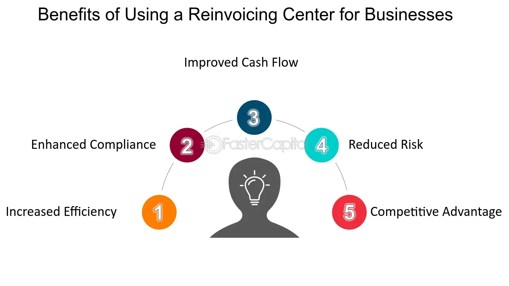

## Table of Contents

## What is a reinvoicing center?

A reinvoicing center is a company that helps other businesses manage their international sales and purchases. It does this by buying products from one country and then selling them to another country. This helps the original company save money on taxes and make their international transactions easier.

The reinvoicing center works by setting up in a country with good tax rules. When a company wants to sell its products to another country, the reinvoicing center buys the products first. Then, it sells the products to the final buyer in the other country. This way, the original company can focus on making and selling its products, while the reinvoicing center takes care of the complicated international part.

## How does a reinvoicing center work?

A reinvoicing center helps businesses sell their products to other countries more easily. When a company wants to sell its products abroad, the reinvoicing center buys the products from the company. This happens in a country where the tax rules are good for the company. The reinvoicing center then sells the products to the final buyer in the other country. This way, the original company can focus on making and selling its products without worrying about the complicated international parts.

The reinvoicing center makes the process smoother by handling the paperwork and taxes. It buys the products at a certain price and then sells them at a slightly higher price. The difference in price helps cover the costs of the reinvoicing center and can also help the original company save money on taxes. This system helps businesses save time and money, making it easier for them to sell their products all over the world.

## What are the primary functions of a reinvoicing center?

A reinvoicing center helps businesses sell their products to other countries by acting as a middleman. When a company wants to sell its products abroad, the reinvoicing center buys the products from the company. This happens in a country where the tax rules are good for the company. Then, the reinvoicing center sells the products to the final buyer in the other country. This way, the original company can focus on making and selling its products without worrying about the complicated international parts.

The reinvoicing center also takes care of the paperwork and taxes involved in international sales. It buys the products at a certain price and then sells them at a slightly higher price. The difference in price helps cover the costs of the reinvoicing center and can also help the original company save money on taxes. This system makes it easier for businesses to sell their products all over the world, saving them time and money.

## What are the benefits of using a reinvoicing center for a business?

Using a reinvoicing center helps a business save money on taxes. When a business sells its products to another country, it can face high taxes. But if a reinvoicing center buys the products first, it can do so in a country with better tax rules. Then, the reinvoicing center sells the products to the final buyer. This way, the business can pay less in taxes, which means more money stays with the business.

A reinvoicing center also makes selling products to other countries easier. It takes care of all the complicated paperwork and rules that come with international sales. This lets the business focus on making and selling its products without worrying about the hard parts of selling abroad. By using a reinvoicing center, a business can save time and effort, making it simpler to sell products all over the world.

## Can a reinvoicing center help in reducing costs? If so, how?

Yes, a reinvoicing center can help a business reduce costs, mainly by saving on taxes. When a business sells its products to another country, it might have to pay high taxes. But if a reinvoicing center buys the products first, it can do so in a country where the taxes are lower. Then, the reinvoicing center sells the products to the final buyer. This way, the business can pay less in taxes, which means more money stays with the business instead of going to taxes.

A reinvoicing center also helps by taking care of the complicated paperwork and rules that come with selling products to other countries. This saves the business time and effort, which can be costly. By letting the reinvoicing center handle these tasks, the business can focus on making and selling its products more efficiently. This makes it easier and cheaper for the business to sell products all over the world.

## What are the potential drawbacks or challenges associated with setting up a reinvoicing center?

Setting up a reinvoicing center can be tricky because it involves dealing with different countries' rules and taxes. Each country has its own laws about how businesses can buy and sell products. This means a business might need to spend a lot of time and money to learn and follow these rules. If the reinvoicing center makes a mistake, it could end up paying more in taxes or even breaking the law, which could lead to fines or other problems.

Another challenge is the cost of setting up and running a reinvoicing center. It takes money to start a new company, hire people to work there, and keep it running smoothly. Even though a reinvoicing center can help save on taxes, the business needs to make sure these savings are more than the costs of running the center. If the costs are too high, the business might not save any money at all, and it could even lose money.

## How does a reinvoicing center affect tax obligations and compliance?

A reinvoicing center can help a business save money on taxes by buying products in a country with lower taxes and then selling them to another country. This way, the business can pay less in taxes than if it sold the products directly to the other country. The reinvoicing center takes care of the tax paperwork, making sure everything is done correctly according to the rules of the country where it is set up. This can make things simpler for the business, but it needs to make sure the reinvoicing center follows all the tax laws.

However, setting up a reinvoicing center also means the business has to deal with more tax rules and laws. Each country has its own rules about taxes and how businesses can buy and sell products. If the reinvoicing center makes a mistake, it could end up paying more in taxes or even breaking the law. This could lead to fines or other problems for the business. So, while a reinvoicing center can help with taxes, it also adds more work to make sure everything is done right.

## What industries typically benefit the most from using a reinvoicing center?

Industries that make and sell products all over the world often benefit the most from using a reinvoicing center. This includes big companies in manufacturing, like those that make cars, electronics, and machinery. These companies can save a lot of money on taxes when they use a reinvoicing center to buy and sell their products in different countries. The reinvoicing center helps them handle the complicated tax rules and paperwork, making it easier for them to sell their products everywhere.

Another group that benefits a lot are companies in the pharmaceutical industry. These companies make medicines and other health products that they sell around the world. Using a reinvoicing center helps them save money on taxes and also makes it easier to deal with the different rules in each country. This can be really helpful for them because the rules about selling medicines can be very strict and hard to follow.

## What are the key considerations for choosing the location of a reinvoicing center?

When choosing where to set up a reinvoicing center, a business needs to think about the tax rules of different countries. Some countries have lower taxes, which can help the business save money. The business should pick a country with good tax rules that will help them pay less in taxes when they buy and sell their products. It's also important to make sure the country has clear and easy-to-follow rules about buying and selling products. This makes it simpler for the reinvoicing center to do its job without breaking any laws.

Another thing to consider is how easy it is to do business in the chosen country. The business should look for a place where it's not too hard to set up a company and where there are good services to help with things like paperwork and taxes. It's also good to pick a country that is easy to get to and has good connections to other countries where the business wants to sell its products. This can make it easier and cheaper to move products around the world.

## How do regulatory environments impact the operation of a reinvoicing center?

The rules and laws in different countries can make it hard or easy for a reinvoicing center to work. Each country has its own rules about taxes and how businesses can buy and sell things. If a reinvoicing center is set up in a country with strict rules, it might have to spend a lot of time and money to follow them. This can make it harder for the center to help the business save money on taxes. On the other hand, if the country has simple and clear rules, it can be easier for the reinvoicing center to do its job without any problems.

Also, the way a country checks and enforces its rules can affect a reinvoicing center. Some countries have strong groups that watch businesses closely to make sure they follow the rules. If a reinvoicing center makes a mistake or does something wrong, it could get in trouble and have to pay fines. This can be a big problem for the business that set up the center. But if the country is more relaxed about checking businesses, the reinvoicing center might have an easier time working without worrying about getting in trouble.

## What advanced strategies can be implemented to maximize the efficiency of a reinvoicing center?

To make a reinvoicing center work better, a business can use smart ways to handle taxes and paperwork. One way is to use special software that can quickly figure out taxes and fill out forms for different countries. This can save a lot of time and help avoid mistakes that could cause problems with the rules. Another way is to hire experts who know a lot about the tax rules in different countries. These experts can help make sure the reinvoicing center is always following the rules and finding the best ways to save money on taxes.

Another important thing is to always check and update the way the reinvoicing center works. The business can look at how much money it is saving on taxes and see if there are better places to set up the center. They can also talk to other businesses and learn new ways to make the center work better. By keeping an eye on everything and making changes when needed, the business can keep the reinvoicing center running smoothly and saving as much money as possible.

## How can technology be leveraged to enhance the operations of a reinvoicing center?

Technology can help a reinvoicing center work better by using special software to handle taxes and paperwork. This software can quickly figure out the taxes for different countries and fill out forms automatically. This saves a lot of time and helps avoid mistakes that could cause problems with the rules. The software can also keep track of all the buying and selling, making it easy to see how much money the business is saving on taxes. By using technology, the reinvoicing center can work faster and more accurately, which helps the business save more money.

Another way technology can help is by using online tools to talk and share information with other parts of the business. This makes it easier for everyone to work together, no matter where they are. The reinvoicing center can quickly get the information it needs to buy and sell products, and it can also share updates with the rest of the business. This helps the reinvoicing center stay up-to-date and make smart decisions about where to buy and sell products. By using technology to connect and share information, the reinvoicing center can work more efficiently and help the business save even more money.

## What are the advantages of integrating reinvoicing and algorithmic trading?

The intersection of reinvoicing and [algorithmic trading](/wiki/algorithmic-trading) offers considerable advantages in international trade, particularly in enhancing risk management and optimizing foreign exchange ([FX](/wiki/fx-anomaly)) processes for multinational enterprises. Through the integration of precise algorithmic strategies, firms can leverage data algorithms to streamline currency conversion rates within reinvoicing centers, ensuring that transactions are executed under the most favorable market conditions. 

Algorithmic trading automates the detection of optimal entry and [exit](/wiki/exit-strategy) points in the FX market. For instance, by employing strategies such as moving averages or mean reversion, companies can predict market trends and adjust currency conversions accordingly, maximizing their returns in real-time. The formula for a simple moving average (SMA) employed in such strategies is:

$$
\text{SMA} = \frac{P_1 + P_2 + \cdots + P_n}{n}
$$

Where $P$ represents the price points and $n$ is the number of periods.

This integration also has significant implications for cash flow management and risk reduction. By automating and centralizing operations, companies can reduce the costs associated with manual processes and mitigate risks inherent in foreign exchange transactions. The predictability and speed of automated transactions contribute to more reliable [liquidity](/wiki/liquidity-risk-premium) planning and financial forecasting.

Moreover, by centralizing trading operations, businesses gain a comprehensive view of their financial transactions, enhancing their ability to manage risks and maintain competitive exchange rates. Such a holistic approach supports the strengthening of financial portfolios by ensuring that assets and liabilities are efficiently aligned.

Automation of these processes is not only a cost-saving measure but also an insurance policy against human error and inconsistencies. It consolidates operations around a unified, data-driven system capable of adjusting to real-time market conditions quickly, allowing companies to navigate complex regulatory environments with greater agility. This adaptability is crucial as regulatory landscapes continue to evolve, and international trade grows increasingly intricate.

Thus, the synergy created by integrating reinvoicing and algorithmic trading not only fortifies risk management strategies but also provides a scalable platform for businesses to reduce operational expenses and foster secure, streamlined trading environments.

## References & Further Reading

[1]: Bergstra, J., Bardenet, R., Bengio, Y., & Kégl, B. (2011). ["Algorithms for Hyper-Parameter Optimization."](https://dl.acm.org/doi/10.5555/2986459.2986743) Advances in Neural Information Processing Systems 24.

[2]: ["Advances in Financial Machine Learning"](https://www.amazon.com/Advances-Financial-Machine-Learning-Marcos/dp/1119482089) by Marcos Lopez de Prado

[3]: ["Evidence-Based Technical Analysis: Applying the Scientific Method and Statistical Inference to Trading Signals"](https://www.amazon.com/Evidence-Based-Technical-Analysis-Scientific-Statistical/dp/0470008741) by David Aronson

[4]: ["Machine Learning for Algorithmic Trading"](https://github.com/stefan-jansen/machine-learning-for-trading) by Stefan Jansen

[5]: ["Quantitative Trading: How to Build Your Own Algorithmic Trading Business"](https://www.amazon.com/Quantitative-Trading-Build-Algorithmic-Business/dp/1119800064) by Ernest P. Chan