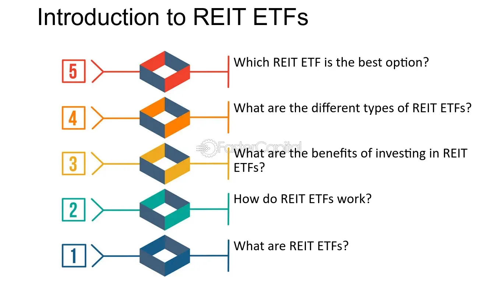

## Table of Contents

## What is a REIT ETF?

A REIT ETF is a type of investment fund that focuses on real estate. REIT stands for Real Estate Investment Trust, which is a company that owns, operates, or finances income-generating real estate. An ETF, or Exchange Traded Fund, is a type of fund that you can buy and sell on a stock exchange, just like a stock. When you invest in a REIT ETF, you're essentially investing in a collection of different real estate investment trusts all at once.

REIT ETFs are popular because they offer a way to invest in real estate without having to buy physical property. This can be easier and less expensive than buying a house or a building. Plus, REITs are required by law to pay out most of their income as dividends, which means that REIT ETFs can provide a regular income stream for investors. This makes them attractive for people looking for steady income from their investments.

## How does a REIT ETF function?

A REIT ETF works by pooling money from many investors to buy shares in different Real Estate Investment Trusts (REITs). These REITs own or finance properties like apartments, shopping centers, or office buildings. The ETF manager picks a mix of REITs to include in the fund, trying to spread out the risk and capture good returns. When you buy shares of the REIT ETF, you're buying a small piece of all those different REITs at once.

The income that the REITs earn from rent or property sales gets passed on to the ETF. The ETF then distributes this income to its shareholders as dividends. This means if you own shares in a REIT ETF, you can get regular dividend payments, which can be a nice source of income. Plus, because the ETF trades on a stock exchange, you can buy and sell your shares easily, just like you would with any other stock.

## What are the benefits of investing in a REIT ETF?

Investing in a REIT ETF can be a good choice because it lets you own a piece of many different real estate properties without having to buy them yourself. Instead of spending a lot of money to buy a single building, you can buy shares in a REIT ETF and own parts of many buildings at once. This spreads out your risk because if one property doesn't do well, you still have many others that might be doing great. It's like having a basket of different real estate investments, which can be safer than putting all your money into one place.

Another big benefit is that REIT ETFs can give you regular income. REITs are required by law to pay out most of their earnings as dividends, and when you invest in a REIT ETF, those dividends get passed on to you. This means you can get a steady stream of money from your investment, which can be really helpful if you're looking for income. Plus, since REIT ETFs trade on stock exchanges, you can easily buy or sell your shares whenever you want, giving you more control over your investment.

## What are the risks associated with REIT ETFs?

Investing in a REIT ETF can have some risks. One big risk is that the real estate market can go up and down. If the real estate market has a bad time, the value of the properties that the REITs own might go down, and that can make the value of your REIT ETF go down too. Also, if people aren't renting or buying as much, the REITs might not make as much money, and that can mean less money coming to you as dividends.

Another risk is that REIT ETFs can be affected by interest rates. When interest rates go up, it can be harder for REITs to borrow money to buy or improve properties. This can slow down their growth and affect how much money they make. Plus, if interest rates are high, other investments like bonds might look more attractive to people, and that could make the price of REIT ETFs drop.

Lastly, while a REIT ETF helps spread out your risk by owning many different properties, it's still important to remember that all the properties are in the real estate market. If something bad happens to the whole real estate market, like a big economic downturn, it could affect all the REITs in the ETF. So, even though a REIT ETF can be a good way to invest in real estate, it's not without its risks.

## How do REIT ETFs generate income for investors?

REIT ETFs generate income for investors by collecting rent and other earnings from the properties that the REITs own. These REITs are required by law to pay out at least 90% of their taxable income to shareholders as dividends. When you invest in a REIT ETF, you're buying shares in a bunch of different REITs at once. The money that these REITs earn from their properties gets passed on to the ETF, and then the ETF shares those earnings with you as dividends. This means you get a regular stream of income from your investment.

Another way REIT ETFs can generate income is through capital gains. Sometimes, REITs might sell a property for more than they paid for it. The profit from these sales can also be distributed to the ETF and then to you as an investor. However, most of the income from REIT ETFs comes from the rent and other regular earnings of the properties, not from selling them. So, if you're looking for steady income, a REIT ETF can be a good choice because it gives you regular dividends from the ongoing operations of the real estate.

## What are the tax implications of investing in REIT ETFs?

When you invest in a REIT ETF, the income you get can be taxed in different ways. Most of the money you get from a REIT ETF comes as dividends. These dividends can be taxed as ordinary income, which means they're taxed at your regular income tax rate. This can be higher than the tax rate for other types of dividends, like those from regular stocks. Also, some of the dividends from REIT ETFs might be classified as qualified dividends, which are taxed at a lower rate, but this is less common with REITs.

Another tax thing to think about is capital gains. If you sell your shares in a REIT ETF for more than you paid for them, you'll have to pay capital gains tax on the profit. If you hold the shares for more than a year, you'll pay long-term capital gains tax, which is usually lower than your regular income tax rate. If you hold them for less than a year, you'll pay short-term capital gains tax, which is the same as your regular income tax rate. So, it's a good idea to think about how long you plan to keep your investment when you're figuring out the tax part.

Lastly, some REIT ETFs might give you a special kind of dividend called a return of capital. This isn't taxed right away like regular dividends. Instead, it reduces your cost basis in the ETF, which can affect how much capital gains tax you pay when you sell your shares. It's a good idea to talk to a tax advisor to understand all the tax rules and how they apply to your situation, because taxes can be complicated and can change.

## How can one evaluate the performance of a REIT ETF?

To evaluate the performance of a REIT ETF, you need to look at a few key things. One important thing to check is the total return, which includes both the change in the price of the ETF and the dividends it pays out. You can compare this total return to other investments or to a benchmark like a real estate index to see if the ETF is doing well. Another thing to look at is the dividend yield, which tells you how much income you're getting from the ETF compared to its price. A higher yield might be good, but you also want to make sure the ETF can keep paying those dividends over time.

Another way to evaluate a REIT ETF is by looking at its expense ratio, which is how much it costs to manage the fund. A lower expense ratio means more of your money stays in your pocket, so it's usually better. You should also check the diversification of the ETF, which means seeing how many different REITs it holds and in what kinds of properties. A well-diversified ETF can help spread out your risk. Finally, consider the historical performance of the ETF over different time periods, like one year, three years, or five years, to see how it has done in the past. Remember, past performance doesn't guarantee future results, but it can give you a good idea of how the ETF has been doing.

## What are the key differences between REIT ETFs and individual REITs?

When you invest in a REIT ETF, you're buying a little bit of many different real estate investment trusts all at once. This is different from buying an individual REIT, where you're investing in just one company that owns or finances real estate. A REIT ETF spreads your money across a bunch of properties, which can be safer because if one property doesn't do well, you still have others that might be doing great. On the other hand, with an individual REIT, all your money is tied to how that one company does, which can be riskier but might also give you bigger rewards if that company does really well.

Another big difference is how easy it is to buy and sell. REIT ETFs trade on stock exchanges just like regular stocks, so you can buy or sell them anytime the market is open. This makes it easier to get in and out of your investment. With individual REITs, you're also buying and selling on stock exchanges, but you might need to do more research to pick the right one, and you might not have as many choices. Also, REIT ETFs often have lower costs because they're managed to follow an index, while individual REITs might have higher fees because they're managed more actively.

## How do interest rates affect REIT ETFs?

Interest rates can have a big impact on REIT ETFs. When interest rates go up, it becomes more expensive for REITs to borrow money to buy or improve properties. This can slow down their growth and reduce the amount of money they make. Also, when interest rates are high, other investments like bonds might look more attractive to people because they offer a safer way to earn money. This can cause the price of REIT ETFs to drop because fewer people want to buy them.

On the flip side, when interest rates go down, it's cheaper for REITs to borrow money, which can help them grow and make more money. Lower interest rates can also make REIT ETFs look more attractive compared to other investments like bonds, which might not offer as much income. So, the price of REIT ETFs can go up when interest rates are low because more people want to buy them. Keeping an eye on interest rates can help you understand how they might affect your investment in a REIT ETF.

## What role do REIT ETFs play in a diversified investment portfolio?

REIT ETFs can be a great way to add variety to your investment portfolio. When you invest in a REIT ETF, you're getting a piece of many different real estate properties all at once. This helps spread out your risk because if one property or one type of real estate doesn't do well, you still have many others that might be doing great. It's like having a basket of different investments instead of putting all your eggs in one basket. Plus, because REIT ETFs are traded on stock exchanges, you can easily buy and sell them, which gives you more control over your investments.

Another big benefit of including REIT ETFs in your portfolio is that they can give you a steady stream of income. REITs are required by law to pay out most of their earnings as dividends, and when you invest in a REIT ETF, those dividends get passed on to you. This can be really helpful if you're looking for regular income from your investments. By adding a REIT ETF to your portfolio, you're not just spreading out your risk, but you're also getting another source of income, which can make your overall investment strategy stronger and more balanced.

## How do global economic conditions impact REIT ETFs?

Global economic conditions can really affect REIT ETFs. When the world economy is doing well, people and businesses might have more money to spend on renting or buying properties. This can make the REITs in the ETF earn more money, which can lead to higher dividends for you and a higher price for the ETF. But if the global economy is struggling, like during a recession, people might not want to spend as much on real estate. This can make it harder for REITs to earn money, which might mean lower dividends and a lower price for the ETF.

Another way global economic conditions can impact REIT ETFs is through changes in interest rates. If many countries decide to raise interest rates to fight inflation, it can make it more expensive for REITs to borrow money to buy or improve properties. This can slow down their growth and affect how much money they make. On the other hand, if interest rates are low around the world, it can be easier for REITs to borrow money, which can help them grow and make more money. So, keeping an eye on what's happening in the global economy can help you understand how your investment in a REIT ETF might do.

## What advanced strategies can be used to optimize returns from REIT ETFs?

One advanced strategy to optimize returns from REIT ETFs is to use dollar-cost averaging. This means you invest a fixed amount of money into the ETF at regular intervals, like every month. By doing this, you buy more shares when the price is low and fewer shares when the price is high. Over time, this can help you get a better average price for your shares, which can lead to higher returns. Another strategy is to look at the sectors within the REIT ETF. Some REITs focus on different types of properties, like apartments, shopping centers, or warehouses. By understanding which sectors are doing well or might do well in the future, you can pick REIT ETFs that focus on those sectors to potentially get better returns.

Another way to optimize returns is to use a strategy called tax-loss harvesting. This means you sell shares of the REIT ETF that have gone down in value to get a tax benefit, and then you buy similar but not identical REIT ETFs to keep your investment going. This can help you lower your taxes and keep your investment strategy on track. Also, keeping an eye on interest rates and economic cycles can help you decide when to buy or sell. For example, if you think interest rates are going to go down, it might be a good time to buy more shares of a REIT ETF because lower rates can help REITs grow and make more money. By using these strategies, you can try to get the most out of your investment in REIT ETFs.

## References & Further Reading

[1]: Bergstra, J., Bardenet, R., Bengio, Y., & Kégl, B. (2011). ["Algorithms for Hyper-Parameter Optimization."](https://dl.acm.org/doi/10.5555/2986459.2986743) Advances in Neural Information Processing Systems 24.

[2]: ["Advances in Financial Machine Learning"](https://www.amazon.com/Advances-Financial-Machine-Learning-Marcos/dp/1119482089) by Marcos Lopez de Prado

[3]: ["Evidence-Based Technical Analysis: Applying the Scientific Method and Statistical Inference to Trading Signals"](https://www.amazon.com/Evidence-Based-Technical-Analysis-Scientific-Statistical/dp/0470008741) by David Aronson

[4]: ["Machine Learning for Algorithmic Trading"](https://github.com/stefan-jansen/machine-learning-for-trading) by Stefan Jansen

[5]: ["Quantitative Trading: How to Build Your Own Algorithmic Trading Business"](https://www.amazon.com/Quantitative-Trading-Build-Algorithmic-Business/dp/1119800064) by Ernest P. Chan