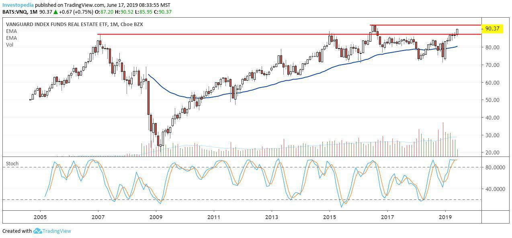

Real Estate Investment Trusts (REITs) have gained substantial popularity as investment vehicles, providing individuals with the opportunity to invest in diverse real estate portfolios without the direct responsibility of property management. As publicly traded entities, REITs must adhere to specific regulations, including the requirement to distribute at least 90% of their taxable income to shareholders, which makes them particularly appealing to investors focused on regular income streams.

A REIT Exchange-Traded Fund (ETF) expands upon this concept by offering the combined benefits of both REITs and ETFs. REIT ETFs enable investors to achieve diversification across various real estate sectors while enjoying the liquidity associated with stock market transactions. These funds aim to replicate the performance of real estate indexes, thereby providing a passive investment strategy that mirrors broader market movements.



With the growing complexity of financial markets, algorithmic trading has emerged as a transformative force. In the context of REIT ETFs, algorithmic trading utilizes sophisticated algorithms and data-driven approaches to execute trades based on pre-defined criteria such as price, timing, and volume. This integration of technology allows investors to capitalize on potential market inefficiencies and achieve superior returns by optimizing trading strategies.

This article explores the intersection of REIT ETFs and algorithmic trading, offering insights into their functioning, advantages, and the strategies employed by investors and fund managers. It seeks to elucidate how the convergence of real estate investment through REIT ETFs and the advancements in algorithmic trading technology create compelling opportunities for enhancing portfolio performance and managing risks in a dynamic market environment.

## Table of Contents

## Understanding REITs and REIT ETFs

Real Estate Investment Trusts (REITs) are specialized investment vehicles that allow investors to partake in real estate ventures without directly owning or managing properties. These entities own, operate, or finance income-producing real estate across various sectors, such as residential, commercial, and industrial properties. The primary advantage of investing in REITs lies in their obligation to distribute at least 90% of their taxable income as dividends to shareholders, which makes them particularly attractive for those seeking consistent income streams.

REITs are either publicly traded on major exchanges or privately held, and they primarily fall into three categories: equity REITs, mortgage REITs, and hybrid REITs. Equity REITs, for instance, own and manage properties, generating revenue mostly from leasing spaces and collecting rents. In contrast, mortgage REITs lend money directly to real estate owners and operators or acquire mortgage-backed securities, profiting from the interest on these financial instruments.

A Real Estate Investment Trust Exchange-Traded Fund (REIT [ETF](/wiki/etf-trading-strategies)) is a financial product that provides exposure to the real estate sector through a diversified portfolio of publicly traded equity REITs and related securities. By investing in REIT ETFs, investors gain access to a basket of underlying real estate investments, often tracking established indexes like the MSCI U.S. REIT Index. Such ETFs embody a passive investment strategy, allowing investors to mirror the performance of real estate indexes and achieve broad market exposure without the need to actively manage individual REIT stocks.

The passive nature of REIT ETFs offers numerous advantages, particularly in terms of diversification and [liquidity](/wiki/liquidity-risk-premium). Diversification is achieved as these ETFs often encompass a wide array of REITs, spanning different locations and property types, thus mitigating risks associated with individual property investments. Furthermore, as ETFs are traded on stock exchanges, they provide high liquidity, enabling investors to buy and sell shares with relative ease during trading hours, akin to traditional stocks.

Investors often favor REIT ETFs not only for their broad exposure to the real estate market but also for their ability to provide regular income through dividend distributions. Since these ETFs invest primarily in equity REITs, which are mandated to distribute a significant portion of their income, they naturally yield consistent dividend payouts. Additionally, the ETF structure adds an additional layer of operational and cost efficiency, often resulting in lower management fees compared to actively managed real estate funds.

## The Role of Algorithmic Trading in REIT ETFs

Algorithmic trading employs computer algorithms to automate the execution of trades based on predefined criteria such as price, timing, and [volume](/wiki/volume-trading-strategy). Within the framework of Real Estate Investment Trust Exchange-Traded Funds (REIT ETFs), [algorithmic trading](/wiki/algorithmic-trading) offers numerous advantages in managing sophisticated portfolios. 

A primary benefit of algorithmic trading in REIT ETFs is the enhancement of trading speed and efficiency. Algorithms can analyze vast datasets rapidly, allowing for the quick execution of trades. This speed is particularly crucial in financial markets where prices can fluctuate in milliseconds. By automating the trading process, these algorithms reduce the likelihood of human error, providing a more reliable method of handling trades in complex portfolios.

Algorithms can optimize trading strategies using advanced data analytics. For instance, they can identify and exploit [arbitrage](/wiki/arbitrage) opportunities that arise due to temporary pricing inefficiencies between REIT ETFs and their underlying assets. Additionally, algorithms are capable of dynamically adjusting asset allocations based on real-time market conditions. This adaptability ensures that portfolios remain aligned with predefined investment objectives even in volatile market conditions.

In volatile markets, rapid adjustments to portfolio positions can be critical. Algorithms can process and react to market data nearly instantaneously, enhancing decision-making processes where swift actions are required. The utilization of algorithms facilitates informed decision-making by integrating multiple data sources and market indicators, enhancing the potential for improved investment outcomes.

Overall, algorithmic trading in REIT ETFs offers a sophisticated toolset for optimizing portfolio management, facilitating rapid and accurate trading while leveraging the latest data analytics techniques. The application of these algorithms not only augments market efficiency but also empowers investors to navigate the complexities of modern financial markets with greater confidence.

## Benefits of Algo Trading in REIT ETFs

Algorithmic trading introduces considerable benefits for Real Estate Investment Trust Exchange-Traded Funds (REIT ETFs), enhancing operational efficiencies and strategic effectiveness in several ways.

**Enhanced Efficiency:** Algorithms execute trades at a pace and frequency that are beyond human capabilities. These automated systems can quickly identify favorable trading opportunities and execute trades at optimal prices, leveraging high-speed computer processing. This rapid execution enables REIT ETF managers to capitalize on fleeting market opportunities, particularly in fast-paced trading environments.

**Data-Driven Insights:** Algorithms thrive on data, utilizing extensive datasets to produce insights that inform trading strategies. By continuously analyzing large volumes of market data, these systems can adapt to emerging trends and shifts, enhancing the fund's ability to respond proactively. Machine learning techniques can further enhance this adaptability by refining predictive models based on historical patterns and current market conditions. For instance, algorithms can use regression analysis or neural networks to forecast future price movements of REIT ETFs, thus aligning trading actions with anticipated market dynamics.

**Cost-Effectiveness:** Automation inherently reduces transaction costs by minimizing the need for manual intervention. The precision and speed of algorithms decrease slippage—the price difference between the expected price of a trade and the actual price—thus reducing the cost per transaction. Moreover, algorithmic trading can streamline operations by reducing human errors and associated rectification costs, leading to an overall improvement in the fund's net returns. 

**Risk Management:** Algorithms enhance risk management by utilizing real-time data to implement sophisticated strategies that mitigate market exposure. These systems can conduct scenario analysis and stress testing to identify potential risks and adjust positions accordingly. For example, algorithms can dynamically adjust the portfolio composition based on interest rate changes or market volatility indices, thereby maintaining optimal risk levels. They can also apply hedging strategies, such as creating synthetic positions to offset potential losses from adverse market movements. This real-time adjustment capability ensures that portfolios remain aligned with the investors' risk tolerance, even as market conditions fluctuate.

By integrating algorithmic trading into REIT ETFs, fund managers can significantly optimize performance, manage risks more effectively, and leverage data-driven strategies, thus securing a competitive edge in the rapidly evolving real estate investment landscape.

## Developing a REIT ETF Trading Algorithm

The foundation of a successful trading algorithm for REIT ETFs is rooted in precise design and implementation, encapsulating a well-defined set of rules and conditions for execution. This begins with careful consideration of strategies that effectively integrate REIT ETFs with various economic indicators and technical analysis tools. 

A conventional strategy involves correlating REIT ETFs with [interest rate](/wiki/interest-rate-trading-strategies) trends. Interest rates significantly influence real estate investments given their impact on borrowing costs and thus on property valuations. Algorithms can utilize these relationships by tracking changes in rates and adjusting positions in REIT ETFs accordingly. This could involve a simple heuristic where ETF exposure is increased as interest rates drop, potentially leading to higher property valuations, and decreased as rates rise.

Technical indicators serve as cornerstone tools for defining entry and [exit](/wiki/exit-strategy) points in algorithmic strategies. Indicators such as Bollinger Bands or Donchian Channels can provide signals based on the [volatility](/wiki/volatility-trading-strategies) and price levels of the ETF. For instance, a strategy might be formulated where an ETF is bought when its price falls below the lower Bollinger Band (indicating potential under-valuation or overselling) and sold when the price exceeds the upper band, exploiting mean reversion tendencies.

```python
import pandas as pd
import numpy as np
import talib

# Example of using Bollinger Bands in a trading algorithm
def bollinger_band_strategy(prices):
    # Calculate Bollinger Bands
    upperband, middleband, lowerband = talib.BBANDS(prices, timeperiod=20, nbdevup=2, nbdevdn=2, matype=0)

    # Generate signals
    buy_signals = prices < lowerband
    sell_signals = prices > upperband

    return buy_signals, sell_signals

# Example price data for testing
prices = pd.Series(np.random.randn(100) + 100)
buy, sell = bollinger_band_strategy(prices)
```

Integration of Treasury yield indices as proxies to refine entry signals involves observing the dynamics of yield movements and their correlations with market activity. When Treasury yields rise, this may signal increasing rates, possibly negatively impacting REITs due to higher financing costs; the algorithm might [factor](/wiki/factor-investing) these scenarios to adjust ETF positions dynamically.

Backtesting forms the backbone of validating algorithmic performance. By employing historical data, ideally a robust time series spread across various market conditions, one can simulate the strategy's outcomes, ensuring its resilience and profitability. During [backtesting](/wiki/backtesting), one must account for transaction costs, slippage, and market impact to achieve realistic results. Metrics such as the Sharpe Ratio, drawdowns, and annualized returns become pivotal in assessing the algorithm's viability. 

This comprehensive approach, incorporating interest rate sensitivity, technical indicators, and meticulous backtesting, cultivates algorithms capable of navigating the complexities of REIT ETF markets, aligning with diverse investor objectives.

## Potential Challenges and Considerations

Market Sensitivity: Real Estate Investment Trust Exchange-Traded Funds (REIT ETFs) exhibit sensitivity to fluctuations in interest rates due to the underlying nature of real estate investments. Interest rates influence the cost of borrowing, affecting property values and, subsequently, the performance of REIT ETFs. An increase in interest rates can lead to higher capitalization rates, thus reducing real estate valuations and potentially impacting the income and capital appreciation potential of these funds. For algorithmic trading systems, this necessitates incorporating interest rate changes into predictive models to manage trading strategies effectively. Traders often use interest rate indices or futures as part of their algorithms to hedge against these fluctuations. 

Data Quality: The precision and success of algorithmic trading heavily rely on the quality of data used for decision-making. Poor data quality can lead to incorrect trading signals and suboptimal execution. Therefore, establishing robust data collection and processing systems is imperative. This includes sourcing accurate and real-time financial data, cleansing and normalizing data feeds, and implementing [machine learning](/wiki/machine-learning) techniques to enhance predictive analytics. Trading algorithms might also make use of sophisticated techniques like natural language processing to analyze unstructured data, such as news or financial reports, which can provide insights into market sentiments.

Regulatory Compliance: Algorithmic trading within REIT ETFs must adhere to specific regulatory requirements, which vary by jurisdiction. Regulations often aim to ensure market integrity and protect investors from excessive risk exposure. Compliance involves monitoring changes in legislation, such as those concerning market manipulation, high-frequency trading, or systemic risk management. Additionally, transparency and auditability of trading algorithms are critical, requiring systems to maintain detailed logs and audit trails of all trades executed. Investors and fund managers must ensure their algorithms conform to these regulatory standards to avoid legal repercussions and protect investor interests.

Diversification: While algorithmic trading can optimize trades for efficiency and potential returns, maintaining diversification within a portfolio remains crucial to minimize exposure to market-specific risks. REIT ETFs focus on varying sectors like commercial, residential, or industrial properties. Algorithms must be designed to ensure balanced asset allocation across these sectors, mitigating the potential impact of sector-specific downturns. Portfolio diversification can be achieved through strategic asset class allocation and the incorporation of derivatives or hedging techniques. 

Traders could incorporate this into their algorithms using the following pseudocode as a basic approach:

```python
def optimize_portfolio(REIT_ETFs, interest_rate, sectors):
    adjusted_return = {}
    # Adjust expected returns based on interest rate sensitivity
    for etf in REIT_ETFs:
        adjusted_return[etf] = calculate_expected_return(etf) * (1 - interest_rate_sensitivity(etf, interest_rate))

    # Calculate sector exposure
    sector_exposure = calculate_sector_exposure(REIT_ETFs, sectors)

    # Rebalance portfolio
    diversified_portfolio = rebalance_based_on_sector(adjusted_return, sector_exposure)

    return diversified_portfolio

def interest_rate_sensitivity(etf, interest_rate):
    # Dummy function for calculating interest rate impact
    return rate_impact_factor(etf) * interest_rate

def rebalance_based_on_sector(adjusted_return, sector_exposure):
    # Dummy function to balance portfolio based on sector exposure
    return balance_allocation(adjusted_return, sector_exposure)
```

In conclusion, while algorithmic trading in REIT ETFs presents opportunities for enhanced efficiency and returns, understanding and addressing these challenges are essential for optimized performance and risk management.

## Conclusion

Real Estate Investment Trust Exchange-Traded Funds (REIT ETFs) present a compelling investment option by merging real estate investments with the liquidity advantages of stock markets. This hybrid approach attracts a diverse range of investors seeking the stability and income potential of real estate, coupled with the flexibility and accessibility of equity markets. 

Incorporating algorithmic trading into REIT ETF strategies further enhances this offering by leveraging technology to optimize returns and manage risks effectively. Algorithms provide the capability to analyze vast datasets, adapt to market changes, and execute trades with precision. This automation not only improves operational efficiency but also minimizes human error, offering a more seamless investment experience.

As technological advancements continue, the scope for algorithmic trading to improve market efficiencies and enhance investor outcomes expands significantly. Algorithms can process data at unprecedented speeds, identifying and exploiting market opportunities that would be difficult for human traders to detect. For instance, models can be constructed to recognize patterns related to interest rate shifts or property market cyclicality, allowing the algorithms to anticipate market movements and adjust positions accordingly.

Investors and fund managers embracing algorithmic trading strategies can thereby secure substantial competitive advantages. By automating complex trading decisions and incorporating sophisticated risk management techniques, they are better equipped to navigate the volatile and dynamic real estate investment landscape. Consequently, those who integrate algorithmic capabilities into their REIT ETF strategies position themselves favorably for enhanced portfolio performance and strategic capital allocation.

## References & Further Reading

[1]: Bergstra, J., Bardenet, R., Bengio, Y., & Kégl, B. (2011). ["Algorithms for Hyper-Parameter Optimization."](https://dl.acm.org/doi/10.5555/2986459.2986743) Advances in Neural Information Processing Systems 24.

[2]: ["Advances in Financial Machine Learning"](https://www.amazon.com/Advances-Financial-Machine-Learning-Marcos/dp/1119482089) by Marcos Lopez de Prado

[3]: ["Evidence-Based Technical Analysis: Applying the Scientific Method and Statistical Inference to Trading Signals"](https://www.amazon.com/Evidence-Based-Technical-Analysis-Scientific-Statistical/dp/0470008741) by David Aronson

[4]: ["Machine Learning for Algorithmic Trading"](https://github.com/stefan-jansen/machine-learning-for-trading) by Stefan Jansen

[5]: ["Quantitative Trading: How to Build Your Own Algorithmic Trading Business"](https://www.amazon.com/Quantitative-Trading-Build-Algorithmic-Business/dp/1119800064) by Ernest P. Chan