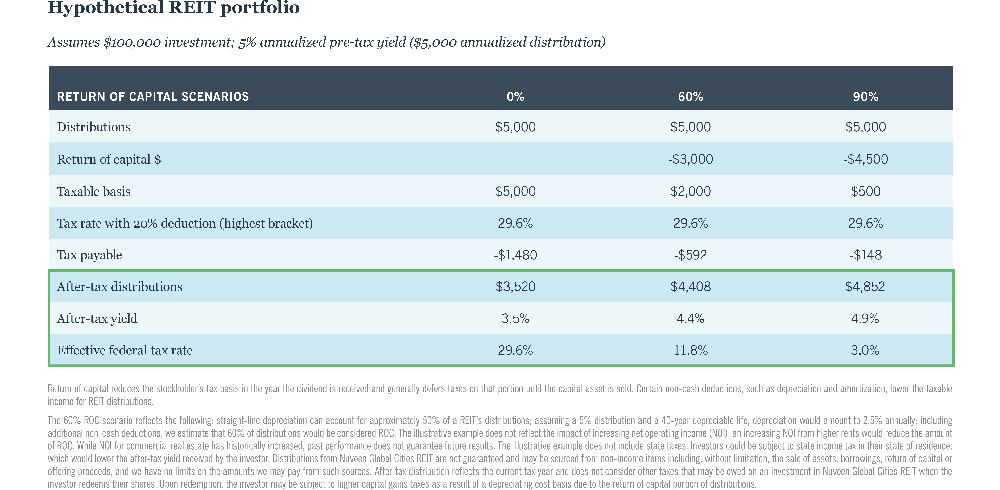

## Table of Contents

## What is a REIT and how does it differ from other types of investments?

A REIT, or Real Estate Investment Trust, is a company that owns, operates, or finances income-generating real estate. It's like a mutual fund for real estate, where investors can buy shares and earn dividends from the rental income or property sales. REITs are popular because they allow people to invest in large-scale real estate without having to buy and manage properties themselves.

REITs differ from other investments like stocks or bonds in a few ways. Unlike stocks, which represent ownership in a company, REITs focus specifically on real estate. They must pay out at least 90% of their taxable income as dividends to shareholders, which can provide a steady income stream. Compared to bonds, which are loans to a company or government, REITs offer the potential for both income and property value growth. However, they can also be riskier than bonds because real estate markets can be volatile.

## How are REITs taxed at the corporate level?

REITs are special because they don't pay federal income tax at the corporate level. The government made this rule to help people invest in real estate more easily. But to get this tax break, REITs have to follow some strict rules. They must give at least 90% of their taxable income back to shareholders as dividends every year. This is different from regular companies, which pay taxes on their profits before giving any money to shareholders.

If a REIT follows these rules and gives out 90% of its income, it doesn't have to pay corporate income tax. But if it doesn't meet these rules, it will have to pay taxes just like any other company. This setup is good for investors because they get more money back as dividends, but it means REITs have to be careful to keep up with the rules to keep their tax benefits.

## What are the tax benefits of investing in REITs for individual investors?

Investing in REITs can offer some nice tax benefits for individual investors. One big advantage is that dividends from REITs are often taxed at a lower rate than regular income. Instead of being taxed as ordinary income, which can be as high as 37%, many REIT dividends qualify for a lower tax rate, which tops out at 20%. This can save investors a lot of money on their taxes.

Another tax benefit is that you can use losses from REITs to offset gains from other investments. If you sell a REIT at a loss, you can use that loss to reduce taxes on profits from selling other investments like stocks or bonds. This is called tax-loss harvesting, and it's a smart way to manage your tax bill. Plus, if you hold onto your REIT shares for more than a year, any gains you make when you sell them are taxed at the long-term capital gains rate, which is usually lower than the rate for short-term gains.

## How does the dividend distribution requirement affect REIT taxation?

The dividend distribution requirement is a big deal for REITs when it comes to taxes. To avoid paying corporate income tax, REITs must give at least 90% of their taxable income back to shareholders as dividends every year. If they do this, they don't have to pay federal income tax on that income. This rule helps REITs because it lets them pass more money directly to investors without the government taking a cut first.

But, if a REIT doesn't meet this 90% rule, it has to pay corporate income tax just like any other company. This can be a big problem because it means less money for shareholders. So, REITs have to be careful to make sure they meet this requirement every year. It's a good thing for investors though, because it means they get more dividends, which can be taxed at a lower rate than regular income.

## What is the difference between ordinary dividends and qualified dividends from REITs?

When you get dividends from a REIT, they can be either ordinary dividends or qualified dividends. Ordinary dividends are taxed as regular income, which means they can be taxed at a higher rate, up to 37%. This is because ordinary dividends from REITs don't meet the special rules that allow them to be taxed at a lower rate. So, if you get ordinary dividends from a REIT, you'll pay taxes on them just like you would on your salary or wages.

Qualified dividends, on the other hand, are taxed at a lower rate, with a maximum of 20%. To be considered qualified, the dividends need to meet certain conditions set by the IRS. But, most dividends from REITs don't meet these conditions, so they end up being ordinary dividends. If you do get qualified dividends from a REIT, it's a good deal because you'll pay less in taxes. But it's important to check with your tax advisor to make sure you know which type of dividends you're getting and how they'll be taxed.

## How are capital gains from selling REIT shares taxed?

When you sell your REIT shares and make a profit, you have to pay taxes on that profit. This profit is called a capital gain. If you've held onto your REIT shares for more than a year before selling them, the profit is considered a long-term capital gain. Long-term capital gains are taxed at a lower rate than regular income, with a maximum rate of 20%. This is good news because it means you'll pay less in taxes on your profit.

If you sell your REIT shares within a year of buying them, the profit is a short-term capital gain. Short-term capital gains are taxed at the same rate as your regular income, which can be as high as 37%. So, if you can, it's better to hold onto your REIT shares for at least a year to get the lower tax rate on your gains. Always check with a tax advisor to make sure you understand how your specific situation will be taxed.

## Can REIT investors use losses to offset other income, and if so, how?

Yes, REIT investors can use losses to help reduce taxes on other income. If you sell your REIT shares at a loss, you can use that loss to offset any capital gains you made from selling other investments like stocks or bonds. This is called tax-loss harvesting. It's a smart way to lower your tax bill because it lets you balance out your wins and losses across different investments.

If your losses are more than your gains, you can use up to $3,000 of those losses to reduce your regular income for the year. If you still have losses left over after that, you can [carry](/wiki/carry-trading) them forward to future years. This means you can use them to offset gains or income in those years too. It's a good strategy for managing your taxes, but it's always a good idea to talk to a tax advisor to make sure you're doing it right.

## What are the tax implications of investing in REITs through retirement accounts like IRAs?

When you invest in REITs through a retirement account like an IRA, the tax rules change a bit. Inside an IRA, any dividends you get from REITs aren't taxed right away. This means you don't have to pay taxes on the dividends each year like you would if you owned the REITs outside of an IRA. This can be a big advantage because it lets your investment grow without the government taking a cut every year.

However, when you take money out of your IRA later on, you'll have to pay taxes on it. If it's a traditional IRA, you'll pay taxes on the money as regular income, which could be at a higher rate. If it's a Roth IRA, you won't have to pay taxes on the withdrawals if you follow the rules, which can be a big plus. So, investing in REITs through an IRA can help you avoid taxes now, but you need to think about what the taxes will be like when you take the money out in the future.

## How do state and local taxes impact REIT investments?

State and local taxes can affect your REIT investments in different ways depending on where you live. Some states don't tax income from REITs at all, while others do. If your state does tax REIT dividends, it might be at the same rate as your regular income or at a special rate. This means you could end up paying more in taxes if you live in a state that taxes REIT dividends.

On top of state income taxes, some places have local taxes that can also impact your REIT investments. For example, certain cities might have their own income tax. This adds another layer of taxes you need to think about. It's important to check the rules in your specific area because they can change how much you get to keep from your REIT dividends.

## What are the international tax considerations for non-U.S. investors in U.S. REITs?

Non-U.S. investors in U.S. REITs need to think about a few international tax rules. The U.S. has a special tax called the Foreign Account Tax Compliance Act (FATCA). This law says that non-U.S. investors might have to pay a 30% withholding tax on their dividends from U.S. REITs. But, if the country where the investor lives has a tax treaty with the U.S., the tax rate might be lower. It's important for non-U.S. investors to check if their country has a tax treaty with the U.S. to see if they can pay less in taxes.

Another thing to think about is capital gains tax. If a non-U.S. investor sells their U.S. REIT shares and makes a profit, they might have to pay capital gains tax in the U.S. But, many countries have rules that let you take credit for taxes paid in another country. This means you might be able to use the U.S. taxes you paid to lower the taxes you owe in your home country. It can get complicated, so it's a good idea for non-U.S. investors to talk to a tax advisor who knows about international taxes to make sure they understand all the rules and can plan their investments the best way.

## How do the rules for UPREITs and DOWNREITs affect taxation?

UPREITs, or Umbrella Partnership Real Estate Investment Trusts, and DOWNREITs are special kinds of REITs. In an UPREIT, property owners can swap their real estate for units in a partnership that the REIT owns. This swap isn't taxed right away, which is a big benefit. It's called a tax-deferred exchange. But, when the owner later sells the units or gets dividends, they'll have to pay taxes on the gains or income. In a DOWNREIT, property owners can also swap their property for units in a partnership, but this partnership might own just a few properties instead of a whole portfolio like in an UPREIT. The tax rules are similar, with the swap being tax-deferred, but the taxes on any future gains or income will depend on the specific setup of the DOWNREIT.

Both UPREITs and DOWNREITs let property owners delay paying taxes on their real estate until they decide to cash out or get dividends. This can be a smart move for people looking to manage their taxes better. But, when they do decide to sell their units or get income, they'll have to pay taxes on it. The exact tax rates and rules can be different depending on the investor's situation and the specific details of the UPREIT or DOWNREIT. It's always a good idea to talk to a tax advisor to make sure you understand how these rules will affect you.

## What recent changes in tax legislation have impacted REITs and their investors?

Recent changes in tax legislation, like the Tax Cuts and Jobs Act of 2017, have had a big impact on REITs and their investors. One big change was a new rule that lets investors deduct up to 20% of their qualified business income from REIT dividends. This means investors can pay less in taxes on the money they get from REITs. The law also lowered the corporate tax rate, which can help REITs that have taxable income because they might pay less in taxes.

Another change that affected REITs was the CARES Act in 2020. This law let REITs delay paying some of their taxes to help them through tough times caused by the COVID-19 pandemic. It also changed some rules about how REITs can use their losses to lower their taxes in future years. These changes can help REITs keep more money, which might mean more dividends for investors. But, tax laws can be tricky, so it's always a good idea to talk to a tax advisor to understand how these changes affect you.

## What are the tax implications for investors?

Real Estate Investment Trusts (REITs) pay out dividends to their investors, providing an attractive income stream. However, understanding the tax implications of these dividends is essential for optimizing the investment returns. 

REIT dividends can be classified differently for tax purposes: ordinary income, capital gains, and returns of capital. The largest portion of REIT dividends generally falls under ordinary income, which is taxed at the investor's marginal income tax rate. This rate can be substantially higher than the rates applied to qualified dividends, making it imperative for investors to be cognizant of their tax bracket to estimate tax liabilities accurately.

Capital gains distributed by REITs, whether from the sale of properties or shares, are subject to capital gains tax rates, which are typically lower than ordinary income rates. Long-term capital gains, arising from the sale of assets held for more than one year, benefit from these reduced rates. Short-term capital gains, however, are taxed at the investor's ordinary income tax rate, making asset holding periods a critical planning consideration.

Returns of capital occur when a REIT pays out more than its taxable income. These distributions are not immediately taxable but serve to reduce the investor's cost basis in the investment. This adjustment increases the potential taxable gain upon the eventual sale of the REIT shares. For example, if an investor initially purchases a REIT share for $100, and receives a return of capital distribution of $5, the cost basis is adjusted to $95. This adjustment becomes significant when calculating future capital gains: 

$$
\text{Capital Gain} = \text{Selling Price} - \text{Adjusted Cost Basis}
$$

Each component of a REIT’s dividend has distinctive tax treatment, necessitating careful tracking and reporting by investors. Investors should consider consulting tax professionals to navigate the complexities of REIT dividends and develop strategies tailored to their individual financial situations. Additionally, keeping abreast of legislative changes related to taxation can further help investors optimize their tax positions concerning REIT investments.

## References & Further Reading

[1]: Reid, L. P., & Kelly, L. M. (2021). ["Taxation of Real Estate Investment Trusts: A Guide for Investors and Advisors."](https://journals.sagepub.com/doi/full/10.1177/2059799120937242) National Association of Real Estate Investment Trusts.

[2]: Chan, E. P. (2008). ["Quantitative Trading: How to Build Your Own Algorithmic Trading Business."](https://github.com/ftvision/quant_trading_echan_book) Wiley Trading Series.

[3]: Lavin, M. (2020). ["Algorithmic Trading Strategies."](https://www.researchgate.net/publication/378548435_Algorithmic_Trading_and_AI_A_Review_of_Strategies_and_Market_Impact) Investopedia.

[4]: Investopedia. (2023). ["Introduction to Real Estate Investment Trusts (REITs)."](https://www.investopedia.com/terms/r/reit.asp) Investopedia.

[5]: Prindle, M. (2020). ["Advances in REIT Investing: From Basics to Advanced Strategies."](https://en.wikipedia.org/wiki/Pennsylvania_Avenue-West_Side_Historic_District) Financial Experts Library.

[6]: Official Website of the National Association of Real Estate Investment Trusts (NAREIT), ["Reit Basics and Benefits."](https://www.reit.com/) NAREIT.

[7]: Phillips, J. T. (2019). ["Algorithmic and High-Frequency Trading: Mathematics, Finance, and Modeling."](https://assets.cambridge.org/97811070/91146/frontmatter/9781107091146_frontmatter.pdf) Cambridge University Press.

[8]: Ramaswamy, K., & Bhargava, V. (2021). ["Machine Learning and Data Science Blueprints for Finance."](https://scholar.google.com/citations?user=P12ERk0AAAAJ) Packt Publishing.

