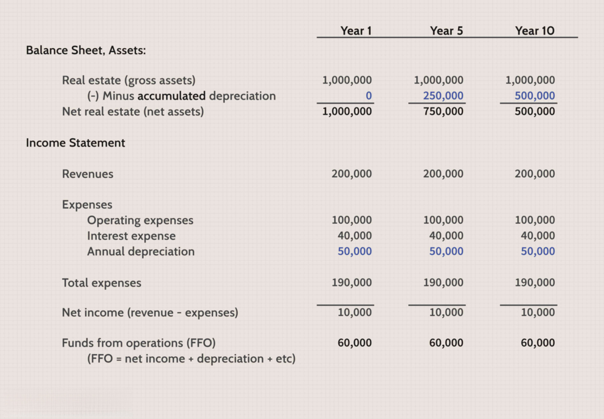

Real Estate Investment Trusts (REITs) provide investors a straightforward method of gaining exposure to the real estate market without the responsibilities associated with direct property management. By pooling capital from numerous investors, REITs allow for the acquisition and management of income-generating real estate and real estate-related assets. This structure offers diversification that individual property ownership might not, mitigating certain investment risks.

The primary attraction of REITs lies in their ability to pay out relatively high dividends. This stems from their status as passthrough entities, which exempts them from corporate income tax provided they distribute at least 90% of their taxable income to shareholders. As a result, the income generated by their real estate investments is primarily returned to investors rather than being retained by the trust.



This article examines the tax implications and operational mechanics of REITs, emphasizing how investors can benefit from these structures while understanding the associated tax responsibilities. In addition, the article will delve into the role of algorithmic trading in enhancing REIT investment strategies. Algorithmic trading leverages technology to execute trades based on predefined criteria, potentially increasing the efficiency and profitability of REIT investments by optimizing entry and exit points. This combination of tax efficiencies and advanced trading strategies offers a compelling opportunity for maximizing real estate returns.

## Table of Contents

## Understanding REITs and Their Taxation

Real Estate Investment Trusts (REITs) are structured to allow investors to gain exposure to real estate markets without directly managing properties. A crucial aspect of REITs is their tax structure. By meeting specific distribution requirements, REITs can sidestep corporate income taxes. In compliance with the Internal Revenue Code, REITs must distribute at least 90% of their taxable income to shareholders. This mandatory distribution serves as a conduit, allowing the income to be taxed at the shareholder level rather than the corporate level, thus offering a unique tax advantage.

The dividends distributed by REITs can be categorized into three major types: ordinary income, capital gains, or return of capital. Each of these classes has distinct tax implications for investors:

1. **Ordinary Income**: The majority of REIT dividends are typically classified as ordinary income. These dividends are taxed at the individual’s marginal tax rate, which could be as high as 37% depending on the taxpayer's overall income. As a result, investors should be prepared for these dividends to potentially impact their annual tax liabilities robustly.

2. **Capital Gains**: Capital gains distributions occur when the REIT sells properties at a profit. Such gains are taxed at a lower preferential rate compared to ordinary income. For long-term capital gains (assets held for more than one year), the tax rates are generally 0%, 15%, or 20%, based on the investor’s taxable income and filing status. This treatment provides a tax benefit for investors, encouraging long-term engagement with REITs.

3. **Return of Capital**: This component is not considered taxable income upon receipt. Instead, it reduces the investor’s cost basis in the REIT shares. When the shares are eventually sold, the adjusted cost basis will result in either a higher capital gain or loss. The return of capital allows for tax deferment until the actual sale of the investment, which can be advantageous for tax planning.

Understanding these distinctions is essential for investors, as the tax consequences can significantly influence net returns. By judiciously analyzing and planning for these tax outcomes, investors can enhance their overall investment strategy in REITs. Such considerations are especially relevant when formulating decisions about holding REIT shares within different types of investment accounts, such as tax-deferred retirement accounts versus taxable brokerage accounts.

## Types of REITs

Real Estate Investment Trusts (REITs) are classified primarily into three types: Equity REITs, Mortgage REITs, and Hybrid REITs, each offering distinct avenues for income generation and investment strategy diversification.

**Equity REITs** are the most common type and primarily generate revenue through owning and operating income-producing real estate properties. These trusts acquire commercial real estate such as shopping malls, office buildings, and apartment complexes, focusing on profits from leasing space to tenants. Equity REITs provide investors with income in the form of dividends sourced from rental income and potential capital appreciation from property sales. Given their focus, these REITs are subject to the volatility of property market cycles, making asset selection and management critical to sustained profitability.

**Mortgage REITs (mREITs)** differ as they do not own physical real estate but instead earn income from the interest on debt instruments secured by real estate holdings. These REITs provide financing by originating or purchasing mortgages and mortgage-backed securities. The primary appeal of mortgage REITs lies in their potential for high dividend yields, stemming from the interest spreads between borrowed capital and loaned funds. However, they are also sensitive to interest rate fluctuations, which can affect borrowing costs and the value of mortgage assets, impacting overall returns.

**Hybrid REITs** incorporate elements from both Equity and Mortgage REITs, combining ownership of property and investment in mortgage loans. This dual strategy aims to balance income stability from property leasing with the potentially higher yields from mortgage investments. By diversifying across these two streams, hybrid REITs seek to mitigate risks associated with market fluctuations in either sector while providing diversified income sources to investors.

Each REIT type demands a different evaluation approach regarding performance, risk exposure, and yield potential, making it essential for investors to carefully assess their individual investment objectives and risk tolerance when choosing among these REIT categories.

## Tax Implications for Investors

Real Estate Investment Trusts (REITs) pay out dividends to their investors, providing an attractive income stream. However, understanding the tax implications of these dividends is essential for optimizing the investment returns. 

REIT dividends can be classified differently for tax purposes: ordinary income, capital gains, and returns of capital. The largest portion of REIT dividends generally falls under ordinary income, which is taxed at the investor's marginal income tax rate. This rate can be substantially higher than the rates applied to qualified dividends, making it imperative for investors to be cognizant of their tax bracket to estimate tax liabilities accurately.

Capital gains distributed by REITs, whether from the sale of properties or shares, are subject to capital gains tax rates, which are typically lower than ordinary income rates. Long-term capital gains, arising from the sale of assets held for more than one year, benefit from these reduced rates. Short-term capital gains, however, are taxed at the investor's ordinary income tax rate, making asset holding periods a critical planning consideration.

Returns of capital occur when a REIT pays out more than its taxable income. These distributions are not immediately taxable but serve to reduce the investor's cost basis in the investment. This adjustment increases the potential taxable gain upon the eventual sale of the REIT shares. For example, if an investor initially purchases a REIT share for $100, and receives a return of capital distribution of $5, the cost basis is adjusted to $95. This adjustment becomes significant when calculating future capital gains: 

$$
\text{Capital Gain} = \text{Selling Price} - \text{Adjusted Cost Basis}
$$

Each component of a REIT’s dividend has distinctive tax treatment, necessitating careful tracking and reporting by investors. Investors should consider consulting tax professionals to navigate the complexities of REIT dividends and develop strategies tailored to their individual financial situations. Additionally, keeping abreast of legislative changes related to taxation can further help investors optimize their tax positions concerning REIT investments.

## Algorithmic Trading in REIT Investments

Algorithmic trading involves the use of computer algorithms to execute trades according to pre-defined strategies and criteria. This approach has gained significant traction in recent years due to its potential to offer efficiency and speed advantages, particularly in volatile markets like real estate. The application of [algorithmic trading](/wiki/algorithmic-trading) in REIT investments can significantly enhance an investor's ability to capitalize on market dynamics and optimize tax outcomes.

One of the primary benefits of algorithmic trading is its ability to process vast amounts of market data rapidly and execute trades at optimal prices. In the context of REITs, which are sensitive to fluctuations in interest rates and macroeconomic trends, the speed and precision provided by algorithmic trading can be crucial. Algorithms can be programmed to monitor specific market signals or events, triggering buy or sell orders almost instantaneously when criteria are met. This capability can help investors minimize the impact of market [volatility](/wiki/volatility-trading-strategies) on their portfolios.

Moreover, algorithmic trading can assist investors in maximizing tax advantages by timing their entry and [exit](/wiki/exit-strategy) strategies effectively. By pre-programming algorithms to account for tax considerations such as the holding period of REIT shares, investors can aim to benefit from favorable tax treatments on capital gains. For instance, long-term capital gains are taxed at a lower rate than short-term gains. An algorithm can be set to hold positions long enough to qualify for these lower rates, optimizing the tax efficiency of the investment.

Additionally, algorithmic trading can reduce human error in decision-making and emotional biases that may affect investment performance. The systematic and disciplined approach inherent in algorithmic strategies allows for consistent application of investment rules, potentially increasing the reliability of returns.

To illustrate a simple algorithmic trading strategy in Python for REIT investments, consider the following pseudo-code snippet:

```python
import yfinance as yf
import pandas as pd

# Define a simple moving average strategy
def moving_average_strategy(ticker, short_window, long_window):
    data = yf.download(ticker, start="2020-01-01", end="2023-01-01")
    data['Short_MA'] = data['Close'].rolling(window=short_window).mean()
    data['Long_MA'] = data['Close'].rolling(window=long_window).mean()

    # Generate buy/sell signals
    data['Signal'] = 0
    data['Signal'][short_window:] = np.where(data['Short_MA'][short_window:] > data['Long_MA'][short_window:], 1, -1)

    # Calculate positions
    data['Position'] = data['Signal'].shift(1)

    # Calculate returns
    data['Return'] = data['Position'] * data['Close'].pct_change()

    return data

# Example execution for a REIT ticker
result = moving_average_strategy('VNQ', short_window=50, long_window=200)
print(result[['Close', 'Short_MA', 'Long_MA', 'Signal', 'Position', 'Return']])
```

In this example, a moving average crossover strategy is used to generate trading signals for the Vanguard Real Estate [ETF](/wiki/etf-trading-strategies) (VNQ), a popular REIT. The algorithm buys when the short-term moving average crosses above the long-term moving average and sells when the opposite occurs, aligning the strategy with potential investment goals and tax planning.

In conclusion, adopting algorithmic trading can empower REIT investors to respond swiftly to market fluctuations and strategize for tax efficiency, enhancing the overall success and sustainability of their investment portfolios.

## Planning for Tax Efficiency

Holding Real Estate Investment Trusts (REITs) in tax-advantaged accounts is a strategy that can defer tax liabilities and leverage the power of compounding interest. Accounts such as Individual Retirement Accounts (IRAs) and Roth IRAs are designed to allow investments to grow either tax-free or tax-deferred, which is particularly beneficial when dealing with REITs that produce high dividend yields and potential capital gains.

When holding REITs within a Traditional IRA, investors benefit from tax-deferred growth, meaning they will not pay taxes on credits or gains until they withdraw funds, typically during retirement when they might be in a lower tax bracket. Roth IRAs are another strategic choice since they allow for tax-free withdrawals, provided certain conditions are met.

Algorithmic trading can further enhance tax efficiency when investing in REITs. This method uses computer algorithms to monitor market conditions and execute trades based on predefined strategies, which can be particularly useful in optimizing the timing of buying and selling. Algorithms can [factor](/wiki/factor-investing) in economic indicators, interest rates, and housing market trends, allowing for precise entry and exit from the market. For example, implementing a moving average crossover strategy may help identify optimal buy and sell signals, potentially improving returns and aligning transactions within tax-advantaged windows.

```python
# Example: A simple moving average crossover strategy
def moving_average_crossover(prices, short_window=40, long_window=100):
    signals = pd.DataFrame(index=prices.index)
    signals['price'] = prices
    signals['short_mavg'] = prices.rolling(window=short_window, min_periods=1).mean()
    signals['long_mavg'] = prices.rolling(window=long_window, min_periods=1).mean()

    signals['signal'] = 0.0
    signals['signal'][short_window:] = np.where(signals['short_mavg'][short_window:] 
                                                > signals['long_mavg'][short_window:], 1.0, 0.0)
    signals['positions'] = signals['signal'].diff()

    return signals
```

Beyond using tax-advantaged accounts and algorithmic strategies, consulting with a financial advisor is highly recommended for customizing strategies to individual circumstances. Advisors can offer insights into tax law changes, current best practices, and help to construct a diversified REIT portfolio that aligns with second specific goals while minimizing tax liabilities. For instance, advisors could recommend the strategic harvesting of losses, where investments are sold at a loss to offset capital gains elsewhere in the portfolio.

Overall, thoughtful planning regarding tax efficiency not only helps preserve investor wealth but also enhances the potential for significant long-term growth within REIT investments.

## Conclusion

Real Estate Investment Trusts (REITs) stand as a distinctive investment vehicle, offering investors the dual benefits of high dividend yields and potential tax efficiencies. These investment trusts enable individuals to gain exposure to real estate markets without the complexities of direct property ownership, primarily due to their structural obligation to distribute at least 90% of their taxable income in dividends. This feature often results in substantial, regular income streams for investors while allowing REITs to maintain a tax-efficient status by bypassing corporate income taxes.

A comprehensive understanding of the tax implications associated with REIT investments is crucial for investors aiming to maximize their financial returns. The taxation of REIT dividends, which can be classified as ordinary income, capital gains, or return of capital, necessitates careful tax planning. Ordinary income dividends are typically taxed at higher marginal rates, whereas capital gains enjoy preferential, lower tax rates. Additionally, a return of capital impacts an investor’s cost basis, influencing future capital gains tax calculations. Awareness and strategic planning around these tax aspects can significantly enhance an investor’s net returns from REIT investments.

Algorithmic trading presents another dimension of optimization in REIT investments. By employing computer programs to automate trading decisions based on specific criteria, investors can capitalize on market efficiencies and speed—particularly important in the often volatile real estate sector. Such systems can process vast amounts of data swiftly, ensuring timely entry and exit points that align with optimal tax scenarios, thus enhancing overall investment returns while maintaining compliance with tax regulations. This strategic implementation allows investors to better manage tax liabilities and improve their net income from REIT investments.

In conclusion, REITs offer a unique avenue for investment, characterized by their substantial dividend yields and potential for tax efficiency. To fully harness these benefits, investors must thoroughly comprehend the associated tax implications and employ strategic mechanisms, such as algorithmic trading, to manage their portfolios effectively. By combining these elements with prudent financial planning, investors can enhance their real estate investment returns while adeptly navigating the complexities of tax obligations.

## References & Further Reading

[1]: Reid, L. P., & Kelly, L. M. (2021). ["Taxation of Real Estate Investment Trusts: A Guide for Investors and Advisors."](https://journals.sagepub.com/doi/full/10.1177/2059799120937242) National Association of Real Estate Investment Trusts.

[2]: Chan, E. P. (2008). ["Quantitative Trading: How to Build Your Own Algorithmic Trading Business."](https://github.com/ftvision/quant_trading_echan_book) Wiley Trading Series.

[3]: Lavin, M. (2020). ["Algorithmic Trading Strategies."](https://www.researchgate.net/publication/378548435_Algorithmic_Trading_and_AI_A_Review_of_Strategies_and_Market_Impact) Investopedia.

[4]: Investopedia. (2023). ["Introduction to Real Estate Investment Trusts (REITs)."](https://www.investopedia.com/terms/r/reit.asp) Investopedia.

[5]: Prindle, M. (2020). ["Advances in REIT Investing: From Basics to Advanced Strategies."](https://en.wikipedia.org/wiki/Pennsylvania_Avenue-West_Side_Historic_District) Financial Experts Library.

[6]: Official Website of the National Association of Real Estate Investment Trusts (NAREIT), ["Reit Basics and Benefits."](https://www.reit.com/) NAREIT.

[7]: Phillips, J. T. (2019). ["Algorithmic and High-Frequency Trading: Mathematics, Finance, and Modeling."](https://assets.cambridge.org/97811070/91146/frontmatter/9781107091146_frontmatter.pdf) Cambridge University Press.

[8]: Ramaswamy, K., & Bhargava, V. (2021). ["Machine Learning and Data Science Blueprints for Finance."](https://scholar.google.com/citations?user=P12ERk0AAAAJ) Packt Publishing.

