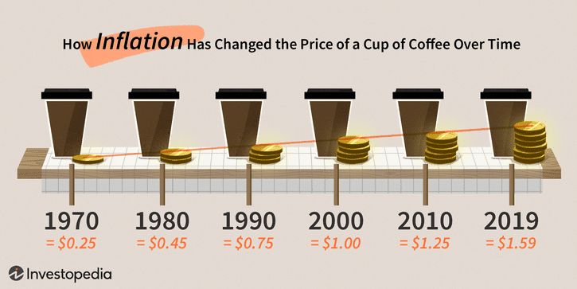

Relapse rate is a critical measure used to evaluate the effectiveness of rehabilitation programs. It refers to the frequency at which individuals return to unwanted behaviors after undergoing treatment. This concept is vital for assessing the success of such programs, as a lower relapse rate indicates greater program efficacy. Rehabilitation programs aim to provide long-lasting change, and understanding relapse rates helps program developers improve strategies and allocate resources effectively.

Algorithmic trading, on the other hand, is a method of executing orders using automated, pre-programmed trading instructions considering variables such as time, price, and volume. This approach significantly impacts financial markets by increasing the speed and frequency of trade execution, thereby enhancing market liquidity and efficiency. As algorithms are designed to identify trading opportunities across various asset classes, algorithmic trading has become a dominant force within the trading industry, accounting for a large percentage of trading volume in major exchanges.



Both the concept of relapse rate in rehabilitation programs and the application of algorithmic trading strategies share an underlying commonality: the reliance on data analysis and prediction of outcomes. In rehabilitation, this involves predicting the likelihood of behavioral recurrence, while in trading, it involves forecasting market trends and executing trades accordingly. Understanding these processes is crucial for stakeholders in both fields, whether they are policymakers attempting to reduce relapse rates in social programs or investors seeking to capitalize on automated trading mechanisms.

In the modern financial landscape, grasping the implications and applications of relapse rates and algorithmic trading is vital. As societies increasingly depend on data-driven insights, the interplay between these fields offers opportunities to leverage analytical tools and methodologies for enhanced decision-making. This intersection not only aids in optimizing rehabilitation and trading outcomes but also prompts discussions around ethical considerations, predictive accuracy, and the future trajectory of both industries.

## Table of Contents

## Understanding Relapse Rate

Relapse rate is a crucial metric in evaluating the efficacy of rehabilitation programs. It quantifies the frequency with which individuals return to previous negative behaviors or conditions after undergoing a recovery process. This rate is particularly significant for measuring the success of interventions in fields such as substance abuse treatment, criminal justice reform, and chronic disease management. A lower relapse rate often indicates a more successful program, suggesting participants are maintaining positive outcomes over time. In contrast, a high relapse rate may signal the need for program reassessment or enhancement.

Social impact bonds (SIBs) are innovative financing tools that link financial returns to social outcomes. In the context of SIBs, relapse rate is a critical [factor](/wiki/factor-investing) in assessing program success and determining the financial viability of these instruments. SIBs involve collaboration among governments, service providers, and investors, where investors fund social programs upfront. The government only repays the investors if predefined social outcomes are achieved, such as reduced relapse rates among participants. Thus, the performance of a rehabilitation program, as measured by relapse rates, directly affects the financial returns to investors. A lower relapse rate not only signifies program success but also translates into increased returns, thereby incentivizing investors to support effective interventions.

The implications of relapse rates extend beyond individual programs, influencing broader social and financial outcomes. Lower relapse rates contribute to reduced societal costs associated with healthcare, criminal justice, and welfare systems. By achieving desirable social outcomes, such programs foster community well-being and economic stability. Moreover, they appeal to socially conscious investors looking for both financial returns and social impact, thereby attracting more capital to address critical societal challenges. 

In summary, understanding and managing relapse rates is essential for the effectiveness of rehabilitation programs. These rates serve as benchmarks for success, influencing funding strategies via SIBs and driving positive social and financial outcomes. By optimizing relapse rates, stakeholders can enhance program efficacy, attract investment, and contribute to sustainable social progress.

## Basics of Algorithmic Trading

Algorithmic trading refers to the use of computer algorithms to automate trading decisions and execute orders in the financial markets. These algorithms can process vast amounts of market data and execute trades at speeds and frequencies that are impossible for human traders. The fundamental components of [algorithmic trading](/wiki/algorithmic-trading) include data input, decision-making algorithms, and execution systems.

The core function of algorithmic trading is to utilize predefined rules and guidelines to make trading decisions. These rules might be based on factors such as timing, price, quantity, or any mathematical model. For example, a simple algorithm to buy a stock could be:

```python
def buy_signal(stock_price, moving_average):
    if stock_price < moving_average:
        return True
    return False
```

Such rules help in eliminating human emotions from trading decisions, providing consistency and objectivity.

High-frequency trading ([HFT](/wiki/high-frequency-trading-strategies)) is a specialized form of algorithmic trading characterized by the high speed and [volume](/wiki/volume-trading-strategy) of trades executed. HFT systems rely on low-latency infrastructures to capitalize on small price discrepancies. These trades often occur within microseconds. The dependency of HFT on algorithmic systems is extreme, as these trades are impossible without automation.

The advantages of algorithmic trading are manifold. Automated trading systems offer increased efficiency, as they can analyze market conditions and make instant decisions without human intervention. This process can reduce transaction costs and improve market [liquidity](/wiki/liquidity-risk-premium). Moreover, the ability to backtest trading strategies on historical data empowers traders to refine their models for improved performance.

Overall, algorithmic trading transforms financial markets by leveraging the speed and power of computing, thus enabling traders to execute strategies with high precision and efficiency.

## Examples of Relapse Rate in SIB Programs

Social Impact Bonds (SIBs) serve as a financial mechanism where private investment is utilized to fund public social programs, with repayment contingent upon the success of these programs. In evaluating the effectiveness of SIB-funded initiatives, the relapse rate is a crucial metric. It measures the rate at which individuals revert to undesirable behaviors after initially succeeding in rehabilitation programs.

The use of relapse rates in SIB programs is exemplified by the case study of Peterborough Prison in the United Kingdom. Initiated in 2010, the Peterborough Prison SIB aimed to reduce reoffending rates among short-term prisoners. The project's success was evaluated based on the reduction in relapse rates, specifically through the decrease in the frequency of reconvictions for those who received support under the program.

A notable aspect of the Peterborough SIB was its multi-sector collaboration, involving the government, private investors, and service providers working together towards the shared goal of reducing reoffending. The program offered intensive support to offenders upon their release, including assistance with housing, employment, and substance abuse treatment.

Preliminary results from the Peterborough SIB indicated a 9% reduction in reoffending compared to a control group not participating in the program. This initial success was pivotal for investors, as repayment was linked to the achievement of specified reoffending reduction targets. Consequently, investors received returns proportionate to the measurable social outcomes facilitated by the SIB.

This reduction in relapse rate not only benefitted the investors but also had broader implications for the community. By lowering reoffending rates, the program contributed to improved social stability, reducing the burden on the criminal justice system and fostering safer communities.

Analyzing the results from the Peterborough SIB highlights the potential for relapse rate metrics to guide investment decisions and evaluate program effectiveness. Furthermore, it exemplifies how SIBs can align financial and social objectives, generating returns for investors while addressing pressing societal issues. This case underscores the importance of accurately measuring and managing relapse rates to enhance the efficacy of SIB-funded programs and maximize their social impact.

## Algorithmic Trading: Strategies and Examples

Algorithmic trading encompasses a range of strategies utilized to automate and optimize trading activities in financial markets. Central to these strategies are predefined algorithms that analyze market data to execute trades at speed and volume unattainable by human traders. Among the most prominent strategies are trend-following and [arbitrage](/wiki/arbitrage).

**Trend-Following Strategy**

The trend-following strategy is based on the premise that prices tend to move in observable trends due to market [momentum](/wiki/momentum). Algorithms designed for trend-following examine historical price data to identify these trends, entering trades that align with the overall direction of the market. For example, an algorithm might buy assets when their prices break above a historical average and sell when they fall below a certain threshold. This approach relies on technical indicators such as moving averages, the relative strength index (RSI), and the moving average convergence divergence (MACD).

Python Example of Trend-Following Algorithm:
```python
import pandas as pd

# Load price data (example)
prices = pd.read_csv('price_data.csv')

# Calculate moving averages
prices['SMA_50'] = prices['Close'].rolling(window=50).mean()
prices['SMA_200'] = prices['Close'].rolling(window=200).mean()

# Determine trading signals
prices['Signal'] = 0
prices['Signal'][50:] = np.where(prices['SMA_50'][50:] > prices['SMA_200'][50:], 1, 0)

# Generate buy/sell signals
prices['Position'] = prices['Signal'].diff()
```

**Arbitrage Strategy**

Arbitrage strategies exploit price discrepancies of the same asset in different markets or forms. This strategy necessitates sophisticated algorithms capable of rapidly identifying and executing trades to capitalize on even minor price differences before they vanish. For instance, a classic form of arbitrage involves buying an underpriced stock on one exchange and simultaneously selling it on another where it is overpriced. This requires precise timing and extensive market access, fundamentals provided by algorithmic systems.

Example Scenario for Arbitrage:
Consider two futures contracts pricing slightly differently due to market inefficiencies. An algorithm can execute simultaneous buying and selling operations across exchanges to lock in a risk-free profit. This process demands algorithms with high-frequency trading capabilities, often involving complex mathematical models and substantial computational resources.

**Data and Pre-Set Rules Driving Decisions**

The success of algorithmic trading largely depends on data quality and the precision of pre-set rules that govern trading actions. Algorithms are designed to process large volumes of real-time data feeds that include market prices, volumes, and other relevant financial indicators. By continuously analyzing this data, algorithms can make informed decisions on buying and selling positions.

These trading algorithms utilize a wealth of historical data to backtest their strategies and improve their predictive capabilities. For instance, a regression model might predict future price movements by identifying patterns within the data, while [machine learning](/wiki/machine-learning) algorithms could adapt to changing market conditions by refining their rules over time. This data-driven approach allows for rapid, unbiased decision-making that minimizes human error and exploits fleeting market opportunities.

In summary, algorithmic trading strategies like trend-following and arbitrage leverage sophisticated algorithms to enhance trading efficiency. These strategies rely heavily on processing vast amounts of data and adhering to pre-defined rules, enabling them to capitalize on market trends and discrepancies effectively.

## The Intersection of Relapse Rates and Algo Trading

The intersection of relapse rates in social programs and algorithmic trading strategies lies in their shared reliance on data analysis, predictive modeling, and outcome monitoring. Both fields utilize quantitative metrics to evaluate performance and make informed decisions, aiming to optimize success rates and returns on investment.

In social programs, particularly those funded by Social Impact Bonds (SIBs), relapse rates are critical indicators used to measure the effectiveness of rehabilitation initiatives. These programs employ statistical models to analyze past performance data and predict future outcomes. This approach is mirrored in algorithmic trading, where algorithms process historical market data to forecast price movements and execute trades based on predefined strategies.

Shared methodologies across these domains include the use of statistical analysis, machine learning models, and data visualization tools. For instance, regression analysis might be used in both fields to identify key variables influencing outcomes, whether they be relapse rates or stock price trends. Machine learning algorithms, such as decision trees or neural networks, can also be applied to identify patterns and predict future states.

Opportunities for leveraging algorithmic tools in social impact analytics include using predictive analytics to tailor interventions in real time, enhancing program efficacy. Conversely, the techniques used in social program evaluations could inform more human-centered approaches in algorithmic trading, such as incorporating socio-economic factors into trading models.

Overall, the integration of data science techniques between these fields has the potential to foster innovative solutions, improve predictive accuracy, and contribute to both social and financial success.

## Challenges and Ethical Considerations

When examining the ethical implications of relapse rate monitoring and algorithmic trading, several critical challenges and considerations arise. Both fields rely heavily on accurate predictions and data-driven decisions, yet they operate in very different contexts with unique ethical challenges.

In the context of relapse rate monitoring, ethical concerns primarily revolve around privacy, consent, and the potential misuse of data. Collecting and analyzing data on individuals who participate in rehabilitation programs often involves handling sensitive information. Ensuring privacy and obtaining informed consent is vital to protect individuals from stigma and discrimination. Additionally, there is a risk of data being used punitively against individuals rather than for their benefit.

Another challenge in relapse rate monitoring is the potential bias in data collection and interpretation. Data from social programs might disproportionately represent certain demographics, leading to skewed outcomes and subsequent decisions. This can result in funding being allocated inefficiently, reinforcing existing social inequalities rather than addressing them.

In the realm of algorithmic trading, ethical concerns center around fairness, market manipulation, and transparency. High-frequency trading, a subset of algorithmic trading, can lead to market distortions and unfair advantages for those with access to superior technology, information, or capital. These activities can create a market environment that favors a small group of wealthy participants at the expense of less well-equipped investors, raising issues of equity and accessibility.

Predictive accuracy poses a significant challenge in both domains. In social programs, accurately forecasting relapse rates is complex due to the myriad of factors influencing human behavior. Incomplete or inaccurate data can lead to suboptimal funding decisions, potentially affecting vulnerable populations negatively. Similarly, in trading, while algorithms can process vast amounts of data to predict market movements, they are not infallible. Factors such as unexpected geopolitical events or natural disasters introduce elements of uncertainty that algorithms may not fully account for, leading to significant financial risks.

To address these challenges, ensuring fairness and transparency is crucial. In social programs, implementing robust data governance frameworks can help protect individual privacy and reduce bias. Transparency in data collection methods and program outcomes, alongside community engagement, fosters trust and accountability.

In algorithmic trading, regulations play a vital role in leveling the playing field. Measures such as enforcing order-to-trade ratios, implementing speed limits, and requiring disclosure of trading algorithms can help mitigate unethical practices. Additionally, adopting ethical guidelines within firms to guide algorithm development and deployment can align technological advancements with societal values.

Ultimately, balancing innovation with ethical responsibility remains a central issue in both fields. Continual dialogue between stakeholders—ranging from policymakers and financial institutions to social workers and community advocates—is essential to ensure that data-driven approaches serve the broader interests of society.

## Conclusion

In conclusion, the exploration of relapse rates and algorithmic trading reveals deep insights into how quantitative measures and strategic applications can transform both social impact assessments and financial markets. Understanding relapse rates is crucial for evaluating the effectiveness of rehabilitation programs and determining the financial returns on social impact bonds (SIBs). Algorithmic trading, on the other hand, illustrates how predefined rules and data-driven strategies significantly enhance trading efficiency and success in financial markets.

The integration of data-driven strategies is vital for success in both domains. In social programs, accurate monitoring and analysis of relapse rates can guide better allocation of resources and optimization of intervention strategies. Similarly, in financial markets, algorithmic trading harnesses vast amounts of data to create predictive models that can adapt to market conditions, enhancing trading decisions and profitability.

Looking ahead, both fields are poised for further evolution and convergence. The application of advanced analytics and machine learning in monitoring social outcomes can offer new opportunities to utilize algorithmic tools to improve intervention strategies and maximize social returns. Conversely, the insights generated from social impact analytics may contribute to the development of more socially responsible trading algorithms.

This potential convergence highlights the importance of fostering interdisciplinary approaches that leverage technological advancements to produce beneficial outcomes across diverse sectors. As both fields continue to innovate and integrate, stakeholders will need to ensure that ethical considerations, transparency, and fairness remain at the forefront of their applications. The future thus holds promising avenues for enhancing both social and financial value through the sophisticated use of data and algorithms.

## References & Further Reading

[1]: Lopez de Prado, M. (2018). ["Advances in Financial Machine Learning."](https://www.amazon.com/Advances-Financial-Machine-Learning-Marcos/dp/1119482089) Wiley.

[2]: Aronson, D. R. (2006). ["Evidence-Based Technical Analysis: Applying the Scientific Method and Statistical Inference to Trading Signals."](https://www.amazon.com/Evidence-Based-Technical-Analysis-Scientific-Statistical/dp/0470008741) Wiley.

[3]: Jansen, S. (2020). ["Machine Learning for Algorithmic Trading, 2nd Edition."](https://www.amazon.com/Machine-Learning-Algorithmic-Trading-alternative/dp/1839217715) Packt Publishing.

[4]: Chan, E. P. (2009). ["Quantitative Trading: How to Build Your Own Algorithmic Trading Business."](https://github.com/ftvision/quant_trading_echan_book) Wiley.

[5]: Bergstra, J., Bardenet, R., Bengio, Y., & Kégl, B. (2011). ["Algorithms for Hyper-Parameter Optimization."](https://dl.acm.org/doi/10.5555/2986459.2986743) Advances in Neural Information Processing Systems.