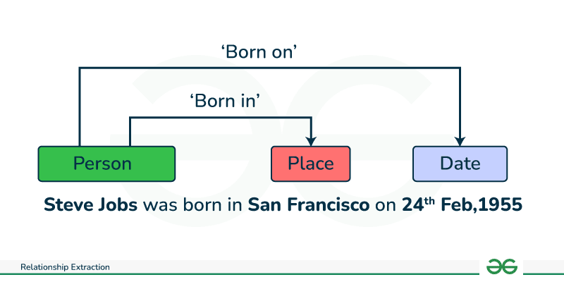

## Table of Contents

## What is Relation Extraction in the context of Machine Learning?

Relation Extraction is a task in machine learning where we try to find and understand the relationships between different pieces of information in text. Imagine you are reading a sentence like "Albert Einstein was born in Ulm." Here, the relation we want to extract is that Ulm is the birthplace of Albert Einstein. This task is important because it helps computers understand and organize information in a way that is similar to how humans do it.

To do relation extraction, machine learning models are trained on lots of text examples. These models learn to recognize patterns that indicate certain relationships. For example, they might learn that phrases like "was born in" often signal a birthplace relationship. Once trained, these models can then be used to analyze new texts and identify similar relationships automatically. This can be very useful in areas like information retrieval, where you might want to quickly find out facts about a person or place without reading through lots of text.

## How do Relation Extraction models help in understanding text?

Relation Extraction models help computers understand text by figuring out how different pieces of information are connected. When you read a sentence, you naturally understand relationships like "who did what" or "where something happened." Relation Extraction models do the same thing but for computers. They look at words and phrases to find these connections, like knowing that "was born in" means someone's birthplace. By doing this, the models can turn plain text into structured information that is easier for computers to use and for people to search through.

For example, if you have a lot of news articles, a Relation Extraction model can go through them and pick out facts like which company bought another company or who the new CEO of a company is. This makes it much easier to find specific information quickly without reading every article. By understanding these relationships, the model helps create a more organized and useful way to handle large amounts of text, which is very helpful in fields like journalism, research, and data analysis.

## What are some common applications of Relation Extraction models?

Relation Extraction models are used in many areas where understanding the connections between pieces of information is important. One common application is in information retrieval and search engines. When you search for something on the internet, these models help by pulling out facts and relationships from web pages. For example, if you search for "Who founded Apple?", the model can find and show you that Steve Jobs and Steve Wozniak founded Apple. This makes it easier and faster for you to get the information you need without reading through lots of text.

Another important use of Relation Extraction is in the field of knowledge graph construction. Knowledge graphs are like big maps of information where things are connected by their relationships. For instance, a knowledge graph might show that "Albert Einstein" is connected to "Ulm" by the relationship "born in." Relation Extraction models help build these graphs by automatically finding and adding these connections from text sources. This is useful for organizing and searching large amounts of data in areas like research, business intelligence, and even social media analysis.

In the world of healthcare and biomedical research, Relation Extraction models are also very helpful. They can read through scientific papers and medical records to find out important relationships like which genes are linked to certain diseases or which drugs treat specific conditions. By doing this, these models help researchers and doctors quickly find and use the information they need to make better decisions and discover new treatments.

## Can you explain the basic architecture of a Relation Extraction model?

A Relation Extraction model usually has a few main parts that work together to understand relationships in text. The first part is the text encoder, which turns words into numbers that the computer can understand. This is often done using techniques like word embeddings, which give each word a set of numbers based on its meaning. The encoder might use a simple method like a recurrent [neural network](/wiki/neural-network) (RNN) or a more advanced one like a transformer, which looks at the whole sentence at once to capture the context better. After encoding the text, the model uses a relation classifier to decide what kind of relationship exists between the pieces of information it's looking at. This classifier could be a simple neural network that takes the encoded text and outputs a probability for each possible relationship type.

The second part of the architecture is the way the model learns to extract relationships. This is usually done through supervised learning, where the model is trained on lots of examples where the relationships are already labeled. For example, if the model sees the sentence "Albert Einstein was born in Ulm," it will be told that "born in" indicates a birthplace relationship. The model adjusts its internal parameters to get better at predicting the correct relationship based on these examples. During training, the model might use a loss function like cross-entropy to measure how wrong its predictions are and then use an optimization algorithm like gradient descent to make its predictions more accurate over time. Once trained, the model can then be used on new text to find and label relationships automatically.

## What is the Partition Filter Network and how does it work in Relation Extraction?

The Partition Filter Network is a special type of model used in Relation Extraction to help computers understand relationships between pieces of information in text. It works by breaking down the problem into smaller parts, making it easier for the model to focus on the most important parts of the text. Imagine you are trying to find the relationship between "Albert Einstein" and "Ulm" in the sentence "Albert Einstein was born in Ulm." The Partition Filter Network would look at different parts of the sentence and decide which parts are most important for understanding the relationship, like focusing on "was born in" because it tells us about the birthplace.

To do this, the Partition Filter Network uses a technique called partitioning, where it divides the text into smaller sections. Each section is then analyzed to see if it contains clues about the relationship. The model uses a filter to decide which sections are relevant and which ones can be ignored. This helps the model work more efficiently because it doesn't have to look at every single word in the sentence. By focusing on the right parts, the Partition Filter Network can more accurately identify relationships like "born in," making it a useful tool in understanding and extracting information from text.

## How does HEGCN (Heterogeneous Graph Convolutional Network) improve Relation Extraction?

HEGCN, or Heterogeneous Graph Convolutional Network, helps make Relation Extraction better by using graphs to understand how different pieces of information are connected. Imagine you have a big map where people, places, and events are all connected by lines showing their relationships. HEGCN looks at this map and learns from it, figuring out patterns that help it understand new relationships. It's especially good at handling different types of information, like text and numbers, all at once. This means it can use more clues from the text to find the right relationships, making it more accurate than models that only look at words.

For example, if you're trying to find out who founded a company, HEGCN can look at not just the words in a sentence but also other information like the company's history or the person's job titles. By putting all this information together in a graph, HEGCN can see the bigger picture and make better guesses about the relationships. This makes it really helpful for tasks where you need to understand complex connections, like in research or business analysis.

## What makes CubeRE unique among Relation Extraction models?

CubeRE is unique among Relation Extraction models because it uses a special way to look at sentences from different angles, kind of like how you might look at a cube. Instead of just reading the sentence from left to right, CubeRE breaks the sentence into smaller parts and looks at them in different ways. This helps the model see relationships that might be hard to notice if you just read the sentence normally. For example, if you have the sentence "Albert Einstein was born in Ulm," CubeRE might look at "Albert Einstein," "was born in," and "Ulm" separately and together to understand that "Ulm" is the birthplace of "Albert Einstein."

Another thing that makes CubeRE special is how it combines different methods to understand text better. It uses a technique called multi-view learning, which means it looks at the sentence in multiple ways to get a fuller picture. This helps CubeRE be more accurate because it can pick up on different clues that other models might miss. By doing this, CubeRE can handle complex sentences and find relationships more reliably, making it a powerful tool for tasks where understanding text is important.

## How do these models handle different types of relations in text?

Relation Extraction models handle different types of relations in text by learning patterns from lots of example sentences. They are trained to recognize specific phrases or words that indicate certain relationships, like "was born in" for birthplace or "is the CEO of" for job titles. For example, if the model sees the sentence "Marie Curie won the Nobel Prize," it knows that "won" signals an award relationship between Marie Curie and the Nobel Prize. By looking at many examples, the model gets better at figuring out what kind of relationship is being described in new sentences.

Some models, like HEGCN and CubeRE, are even smarter because they look at text in different ways. HEGCN uses graphs to connect different pieces of information, helping it understand complex relationships by seeing the bigger picture. For instance, it can link a person's name to their job titles and the companies they work for, making it easier to find out who the CEO of a company is. CubeRE, on the other hand, breaks sentences into smaller parts and looks at them from multiple angles, like the sides of a cube. This helps it catch relationships that might be hard to see if you just read the sentence from left to right. By using these special techniques, both models can handle a wide variety of relationships in text more accurately.

## What are the challenges faced when training Relation Extraction models?

Training Relation Extraction models can be tricky because they need to understand a lot of different relationships from text. One big challenge is that the same words can mean different things depending on the context. For example, "was born in" usually means someone's birthplace, but in a different sentence, it might not. This makes it hard for the model to always get it right. Also, there are so many types of relationships to learn, like who founded a company, who is married to whom, or what someone's job is. The model needs to see lots of examples of each type to learn well, but collecting and labeling all these examples takes a lot of time and effort.

Another challenge is dealing with sentences that are long or complicated. When sentences have a lot of information, it's harder for the model to figure out which parts are important for the relationship. Sometimes, the important parts are far away from each other in the sentence, which makes it even tougher. Models like HEGCN and CubeRE try to solve this by looking at the text in different ways, but it's still a big problem. Plus, the model needs to be good at understanding different languages and styles of writing, because what works for one type of text might not work for another. All these challenges make training Relation Extraction models a complex task that requires a lot of careful work.

## How do you evaluate the performance of Relation Extraction models?

To evaluate how well a Relation Extraction model works, we use special measures like precision, recall, and F1 score. Precision tells us how many of the relationships the model found are correct. If the model says there are 10 relationships and 8 are right, the precision is 80%. Recall tells us how many of the actual relationships the model found. If there were 12 real relationships and the model found 8, the recall is about 67%. The F1 score is a way to combine precision and recall into one number. It's calculated with this formula: $$ F1 = 2 \times \frac{precision \times recall}{precision + recall} $$. A higher F1 score means the model is doing a good job at both finding the right relationships and not missing any.

Another way to check how good a Relation Extraction model is by using a confusion matrix. This is like a table that shows how often the model gets things right or wrong. It helps us see if the model is confused between different types of relationships. We can also look at how the model does on different kinds of text, like news articles or scientific papers, to see if it works well in all situations. By using these methods, we can tell if the model needs more training or if it's ready to use in real life.

## What are some advanced techniques used to enhance the accuracy of Relation Extraction?

One advanced technique to boost the accuracy of Relation Extraction is using transformer models like BERT (Bidirectional Encoder Representations from Transformers). These models look at the whole sentence at once, not just one word at a time, which helps them understand the context better. For example, if you have the sentence "Albert Einstein was born in Ulm," BERT can see how "was born in" connects Einstein and Ulm, making it easier to spot the birthplace relationship. By training on huge amounts of text, these models learn to recognize patterns that indicate different relationships, leading to more accurate results. Another technique is using graph-based methods, like HEGCN (Heterogeneous Graph Convolutional Networks), which create a map of information where different pieces are connected by their relationships. This helps the model see the bigger picture and find relationships that might be missed by looking at text alone.

Another way to improve accuracy is by using multi-view learning, as seen in models like CubeRE. This technique looks at the text from different angles, kind of like how you might look at a cube. By breaking down the sentence into smaller parts and analyzing them in various ways, the model can catch relationships that are hard to see if you just read the sentence from left to right. For example, if you have the sentence "Marie Curie won the Nobel Prize," CubeRE might look at "Marie Curie," "won," and "Nobel Prize" separately and together to understand the award relationship. By combining these different views, the model can be more accurate and reliable in identifying various types of relationships in text.

## How can Relation Extraction models be integrated into larger NLP systems?

Relation Extraction models can be added to bigger natural language processing (NLP) systems to help them understand text better. Imagine you have a system that reads news articles to find important facts. By adding a Relation Extraction model, the system can pick out relationships like who started a company or which city someone was born in. This makes the system smarter because it can organize information in a way that's easy to search and use. The model can work together with other parts of the system, like those that understand the meaning of sentences or those that find names and places, to make the whole system more useful.

To make sure the Relation Extraction model works well with other parts of the NLP system, you can connect it through shared data structures or use what's called an API (Application Programming Interface). For example, after the system finds names and places, it can send this information to the Relation Extraction model. The model then figures out the relationships and sends them back to the system, which can use this new information to answer questions or build a knowledge graph. By working together like this, the different parts of the NLP system can help each other do their jobs better, making the whole system more powerful and accurate.

## References & Further Reading

[1]: Jurafsky, D., & Martin, J. H. (2023). ["Speech and Language Processing"](https://web.stanford.edu/~jurafsky/slp3/). Prentice Hall. This book provides foundational insights into natural language processing, including techniques used in relation extraction.

[2]: Zhang, L., Nickel, M., & Kazemi, S. M. (2019). ["Relation Embedding with Dihedral Group in Knowledge Graphs."](https://dl.acm.org/doi/abs/10.5555/3327144.3327341) This paper explores novel embedding techniques for knowledge graphs, relevant to relation extraction processes.

[3]: Yao, L., Mao, C., & Luo, Y. (2019). ["Graph Convolutional Networks for Text Classification."](https://dl.acm.org/doi/10.1609/aaai.v33i01.33017370) Neurocomputing, 10, 426-435. Discusses graph-based models like HEGCN used for relation extraction.

[4]: Devlin, J., Chang, M. W., Lee, K., & Toutanova, K. (2019). ["BERT: Pre-training of Deep Bidirectional Transformers for Language Understanding."](https://aclanthology.org/N19-1423/) NAACL 2019 - North American Chapter of the Association for Computational Linguistics.

[5]: Lin, Y., Liu, Z., Sun, M., Liu, Y., & Zhu, X. (2015). ["Learning Entity and Relation Embeddings for Knowledge Graph Completion."](https://dl.acm.org/doi/10.5555/2886521.2886624) Proceedings of the Twenty-Ninth AAAI Conference on Artificial Intelligence. This paper lays out methodologies for modeling and extracting relational data for knowledge bases.