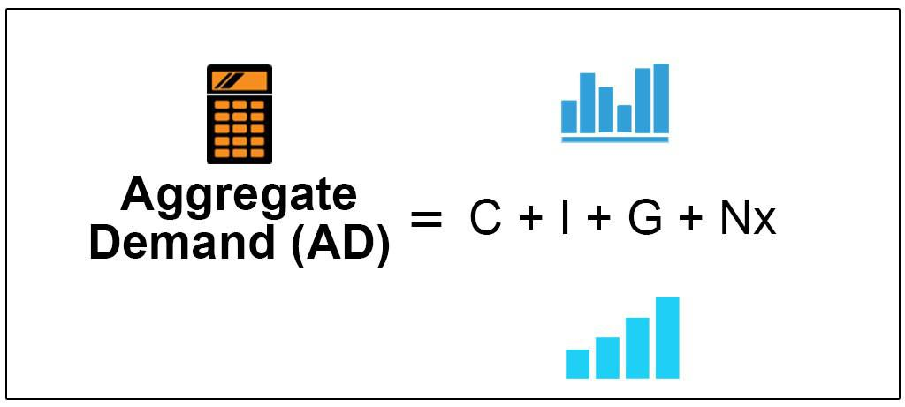

## Table of Contents

## What is aggregate demand?

Aggregate demand is the total amount of goods and services that people in an economy want to buy at a certain time. It includes everything from daily necessities like food and clothes to big purchases like cars and houses. When you add up all these demands from households, businesses, and the government, you get the aggregate demand. It's like a big picture of what everyone in the country wants to spend their money on.

This demand can change based on several things. For example, if people feel confident about their jobs and the economy, they might spend more money, which increases aggregate demand. On the other hand, if people are worried about losing their jobs or if prices are going up too fast, they might spend less, which decreases aggregate demand. Governments and economists watch aggregate demand closely because it helps them understand how the economy is doing and what they might need to do to keep it healthy.

## What is GDP?

GDP stands for Gross Domestic Product. It's a way to measure the total value of all the goods and services produced in a country during a specific time, usually a year or a quarter. Think of it like adding up everything that's made or done in a country, from cars and computers to haircuts and hamburgers. If the GDP is going up, it usually means the country's economy is growing and people are producing and buying more stuff.

GDP can be calculated in different ways, but one common method is to add up all the spending in the economy. This includes what consumers spend on goods and services, what businesses spend on investments, what the government spends, and the difference between what a country exports and imports. Economists use GDP to understand how well an economy is doing and to compare the economic performance of different countries. It's an important tool for making decisions about economic policies and for planning the future.

## How is aggregate demand related to GDP?

Aggregate demand and GDP are closely related because they both help us understand how much an economy is producing and spending. Aggregate demand is all the money that people, businesses, and the government want to spend on goods and services in a country. GDP, on the other hand, is the total value of all the goods and services that are actually produced in that country. When you add up all the spending in the economy, which is what aggregate demand represents, you get a number that's very close to the GDP.

If aggregate demand goes up, it usually means more people are buying things, which can lead to an increase in GDP because businesses will produce more to meet the higher demand. On the flip side, if aggregate demand goes down, people are buying less, and this can lead to a decrease in GDP because businesses might produce less. So, keeping an eye on aggregate demand helps economists predict changes in GDP and understand how the economy is doing.

## What components make up aggregate demand?

Aggregate demand is made up of four main parts: what consumers spend, what businesses invest, what the government spends, and the difference between what a country exports and imports. The first part, consumer spending, is all the money people spend on things like food, clothes, and cars. It's the biggest piece of aggregate demand because most of what's bought in an economy comes from everyday people spending their money. The second part, business investment, is what companies spend on things like new factories, machines, and buildings to help them grow and make more stuff.

The third part of aggregate demand is government spending. This includes all the money the government uses to pay for things like schools, roads, and defense. It's important because it can help boost the economy, especially when people and businesses aren't spending as much. The last part is net exports, which is the difference between what a country sells to other countries (exports) and what it buys from them (imports). If a country exports more than it imports, net exports add to aggregate demand. If it imports more than it exports, net exports take away from aggregate demand. Together, these four parts give us a full picture of what everyone in the economy wants to spend their money on.

## How do changes in aggregate demand affect GDP?

Changes in aggregate demand can have a big impact on GDP. When aggregate demand goes up, it means more people, businesses, and the government are spending money on goods and services. This increase in spending encourages businesses to produce more to meet the higher demand. As a result, the total value of what's produced in the country, which is the GDP, also goes up. It's like a chain reaction: more spending leads to more production, which leads to a higher GDP.

On the other hand, if aggregate demand goes down, people, businesses, and the government are spending less. This decrease in spending can make businesses produce less because there's less demand for their goods and services. When businesses produce less, the total value of what's produced in the country, or the GDP, goes down. So, changes in how much everyone wants to spend can really affect how much the economy produces and grows.

## What is the difference between real GDP and nominal GDP in relation to aggregate demand?

Real GDP and nominal GDP are two ways to measure the total value of goods and services produced in a country, and both are related to aggregate demand. Nominal GDP is the total value of everything produced using the current prices. So, if prices go up because of inflation, nominal GDP will go up too, even if the actual amount of stuff produced stays the same. This means that changes in nominal GDP can be influenced by both changes in aggregate demand and changes in prices.

Real GDP, on the other hand, takes out the effect of inflation. It measures the total value of goods and services produced using prices from a base year. This way, real GDP shows the true growth in what's being produced, without the ups and downs of prices getting in the way. When looking at how aggregate demand affects the economy, economists often use real GDP because it gives a clearer picture of how much more or less people are actually buying and producing, without the confusion from changing prices.

## How does the aggregate demand curve illustrate the relationship with GDP?

The aggregate demand curve is a graph that shows how the total amount of goods and services people want to buy changes with different price levels. It slopes downward, which means that when prices are lower, people want to buy more stuff, and when prices are higher, they want to buy less. This curve is closely related to GDP because the total spending shown on the curve is what helps determine the total value of what's produced in the economy, which is the GDP.

When the aggregate demand curve shifts to the right, it means that at every price level, people want to buy more goods and services. This increase in demand can lead to more production by businesses, which raises the GDP. On the other hand, if the aggregate demand curve shifts to the left, it means people want to buy less at every price level. This decrease in demand can lead to less production and a lower GDP. So, the movement and position of the aggregate demand curve give us a clear picture of how changes in what people want to spend can affect the overall economy's output.

## What economic theories explain the relationship between aggregate demand and GDP?

One important economic theory that explains the relationship between aggregate demand and GDP is called the Keynesian theory. This theory, named after the economist John Maynard Keynes, says that in the short run, changes in what people want to spend can have a big effect on the economy's output. If people, businesses, and the government spend more, businesses will make more things to meet the demand, and this can lead to a higher GDP. But if spending goes down, businesses might make less, and GDP could drop. Keynesians believe that the government can help by spending more money or cutting taxes to boost demand and keep the economy growing.

Another theory that looks at this relationship is the classical theory. Classical economists believe that in the long run, the economy will always find a way to balance itself out. They think that if demand goes up or down, prices and wages will adjust to bring things back to normal. So, even if aggregate demand changes, the economy will eventually produce the same amount of stuff, and GDP won't change much in the long run. Classical economists don't think the government needs to step in to fix things because the market will fix itself.

Both theories offer different views on how aggregate demand affects GDP. Keynesian theory focuses on the short-term effects and suggests government action to manage demand, while classical theory looks at the long-term and believes in the self-correcting nature of the market. Understanding these theories helps economists and policymakers make decisions about how to keep the economy stable and growing.

## How do fiscal and monetary policies influence the relationship between aggregate demand and GDP?

Fiscal policy and monetary policy are two big ways that governments and central banks can change how much people want to spend, which is called aggregate demand, and this can affect the total value of what's made in the country, or GDP. Fiscal policy is all about how the government spends its money and collects taxes. If the government spends more money on things like building roads or giving out money to people, it can make people feel like they have more money to spend, which can increase aggregate demand. On the other hand, if the government raises taxes or cuts spending, people might have less money to spend, and this can lower aggregate demand. When aggregate demand goes up or down because of these changes, it can lead to more or less stuff being made, which changes the GDP.

Monetary policy is what central banks do to control the amount of money in the economy and the cost of borrowing it. If the central bank wants to boost spending and increase aggregate demand, it might lower interest rates. Lower interest rates make it cheaper for people and businesses to borrow money, so they might spend more on things like houses or new equipment. This can lead to more stuff being made and a higher GDP. But if the central bank raises interest rates to cool down spending, borrowing becomes more expensive, and people might spend less, lowering aggregate demand and possibly the GDP. Both fiscal and monetary policies are tools that can help manage the economy by changing how much people want to spend and what gets produced.

## What are the short-term versus long-term effects of aggregate demand on GDP?

In the short term, changes in aggregate demand can have a big impact on GDP. If people, businesses, and the government start spending more money, businesses will make more stuff to meet the higher demand. This means more goods and services are produced, which can lead to a higher GDP. On the other hand, if everyone starts spending less, businesses might make less because there's less demand for their products. This can lead to a lower GDP. So, in the short run, what everyone wants to spend can really move the economy up or down.

In the long term, the effect of aggregate demand on GDP can be different. Some economists believe that over time, the economy will find a way to balance itself out. They think that if demand changes, prices and wages will adjust to bring things back to normal. This means that even if aggregate demand goes up or down, the economy will eventually produce the same amount of stuff, and GDP won't change much in the long run. But other economists think that even in the long term, changes in aggregate demand can still affect GDP, especially if the government keeps using policies to manage spending. So, the long-term effects can depend on a lot of things, like how the economy reacts and what the government does.

## How can shifts in aggregate demand lead to economic cycles?

Shifts in aggregate demand can cause economic cycles, which are times when the economy grows and shrinks. When aggregate demand goes up, people, businesses, and the government spend more money. This makes businesses produce more stuff to meet the higher demand, and more jobs are created. As more people work and earn money, they spend even more, which can keep the economy growing. This is called an economic boom. But if aggregate demand keeps growing too fast, it can lead to inflation, where prices go up a lot, and this can slow down the economy.

On the other hand, when aggregate demand goes down, people, businesses, and the government spend less money. This can make businesses produce less because there's less demand for their products. When businesses make less, they might have to lay off workers, and fewer people working means less money being spent. This can lead to an economic slowdown or even a recession, where the economy shrinks for a while. So, changes in what everyone wants to spend can make the economy go through ups and downs, creating economic cycles.

## What are the limitations of using aggregate demand to predict changes in GDP?

Using aggregate demand to predict changes in GDP isn't perfect because there are a lot of things that can affect the economy that aren't part of aggregate demand. For example, if a big company goes bankrupt, it can cause a lot of people to lose their jobs, even if aggregate demand hasn't changed much. Also, things like natural disasters or big changes in other countries can mess up the economy in ways that are hard to see just by looking at how much people want to spend. So, while aggregate demand is important, it doesn't tell the whole story of what's going on with the economy.

Another problem is that the data we use to measure aggregate demand can be a bit off. It takes time to collect and put together all the numbers about what people, businesses, and the government are spending. By the time we have a good idea of what's happening, things might have already changed. Plus, people's spending can be unpredictable. Sometimes, people might spend more or less than we thought they would because of things like new trends or changes in how confident they feel about the economy. So, while aggregate demand can give us clues about where GDP might be headed, it's not always a perfect guide.

## What is Gross Domestic Product (GDP) and how is it explained?

Gross Domestic Product (GDP) is a fundamental measure of a nation's economic performance, quantifying the total monetary value of all finished goods and services produced within a country over a specific period, usually annually or quarterly. GDP serves as a paramount indicator of economic health, providing a comprehensive overview that allows for the comparison of economic productivity across different countries.

Mathematically, GDP can be calculated using three primary approaches: the production approach, the income approach, and the expenditure approach. Among these, the expenditure approach is most commonly used and is expressed as follows:

$$

GDP = C + I + G + (X - M) 
$$

where $C$ represents consumption, $I$ denotes investment, $G$ signifies government spending, $X$ stands for exports, and $M$ indicates imports. Each component reflects a crucial aspect of economic activity, contributing to the overall calculation of GDP.

Changes in GDP are pivotal as they can signal economic expansion or contraction. An increasing GDP typically indicates economic growth, often associated with rising employment levels, improving trade balances, and heightened inflationary pressures. Conversely, a declining GDP suggests economic contraction, potentially leading to higher unemployment rates, worsening trade deficits, and deflationary challenges.

A deep understanding of GDP and its components is essential for analyzing economic conditions and making informed investment decisions. Investors and policymakers alike use GDP data to gauge the economic landscape and align their strategies accordingly. By interpreting GDP trends, businesses and governments can make decisions that foster economic stability and growth.

Market reactions to GDP data releases are evident, particularly in [algorithmic trading](/wiki/algorithmic-trading) strategies. Algorithmic trading, which relies on pre-defined criteria set by complex computer programs, frequently incorporates GDP data to predict market movements and adjust trading strategies. For instance, significant deviations from expected GDP figures often lead to increased market [volatility](/wiki/volatility-trading-strategies) and trading volumes as algorithms rapidly buy or sell assets to capitalize on the new economic information.

Thus, understanding GDP is not merely an academic exercise but a practical tool that assists in navigating the complexities of global financial markets. The effective interpretation and utilization of GDP data allow for more strategic and informed decision-making in both economic policy and investment realms.

## What is the economic relationship between aggregate demand and GDP?

Aggregate demand is a critical determinant of the total output in an economy, as it reflects the demand for goods and services at different price levels. The link between aggregate demand and Gross Domestic Product (GDP) is fundamental in economic theory; GDP is essentially the monetary measure of the market value of all final goods and services produced in an economy during a particular period. Thus, fluctuations in aggregate demand can have significant impacts on GDP levels.

**Aggregate Demand and GDP Dynamics**

When aggregate demand increases, it encourages higher production levels to meet this demand, leading to an increase in GDP. This relationship is a fundamental concept in Keynesian economics, which asserts that demand drives production. The basic equation for GDP can be expressed as:

$$
\text{GDP} = C + I + G + (X - M)
$$

where:
- $C$ is consumer spending,
- $I$ is investment by businesses,
- $G$ represents government spending,
- $X$ stands for exports,
- $M$ denotes imports.

An increase in any of these components can lead to an increase in GDP, provided other factors remain constant. For instance, a surge in consumer confidence may lead to higher spending, amplifying $C$ and thus boosting GDP.

Conversely, a decrease in aggregate demand results in lower production, culminating in reduced GDP. This decrease can signal a potential economic decline, often associated with rising unemployment and reduced consumer and business confidence.

**Influences of Monetary and Fiscal Policies**

Monetary and fiscal policies are powerful tools that can influence aggregate demand, thereby affecting GDP. For example, a central bank might lower interest rates (a form of monetary policy) to make borrowing cheaper, encouraging businesses and consumers to spend and invest more. This increased spending can shift the aggregate demand curve to the right, consequently raising GDP.

Fiscal policies, such as tax cuts or increased government spending, also directly impact aggregate demand. A government might implement tax cuts to increase disposable income for households, which can lead to increased consumer spending and investment, elevating GDP.

**Interpreting Economic Conditions and Market Signals**

Understanding the interplay between aggregate demand and GDP is crucial for interpreting broader economic conditions and market moves. For policymakers, recognizing these dynamics aids in formulating strategies to stabilize or stimulate the economy. In financial markets, perceiving shifts in aggregate demand can provide insights into future GDP trends, helping investors and traders make informed decisions.

An accurate assessment of this relationship can ultimately serve as a predictive tool for economic forecasts. These insights are essential for stakeholders across various sectors to adapt to changing economic climates efficiently.

## References & Further Reading

[1]: Bergstra, J., Bardenet, R., Bengio, Y., & Kégl, B. (2011). ["Algorithms for Hyper-Parameter Optimization."](https://papers.nips.cc/paper/4443-algorithms-for-hyper-parameter-optimization) Advances in Neural Information Processing Systems 24.

[2]: ["Advances in Financial Machine Learning"](https://www.amazon.com/Advances-Financial-Machine-Learning-Marcos/dp/1119482089) by Marcos Lopez de Prado

[3]: ["Evidence-Based Technical Analysis: Applying the Scientific Method and Statistical Inference to Trading Signals"](https://www.amazon.com/Evidence-Based-Technical-Analysis-Scientific-Statistical/dp/0470008741) by David Aronson

[4]: ["Machine Learning for Algorithmic Trading"](https://github.com/stefan-jansen/machine-learning-for-trading) by Stefan Jansen

[5]: ["Quantitative Trading: How to Build Your Own Algorithmic Trading Business"](https://www.amazon.com/Quantitative-Trading-Build-Algorithmic-Business/dp/1119800064) by Ernest P. Chan