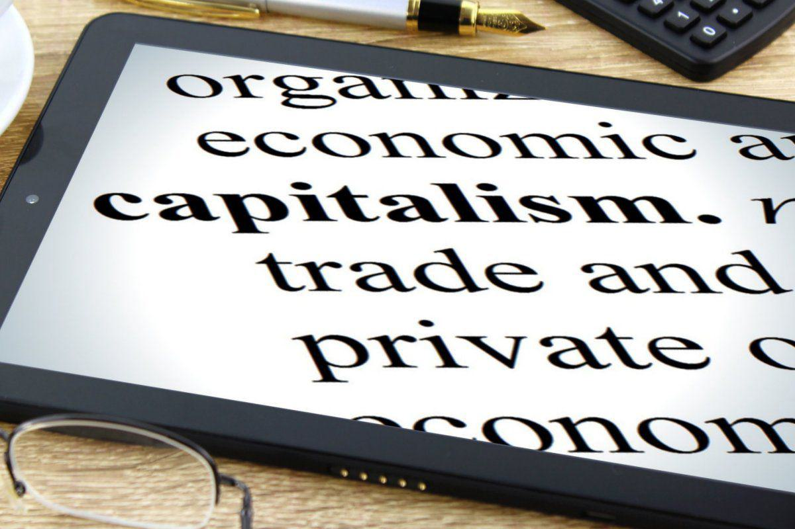

## Table of Contents

## What is capitalism?

Capitalism is an economic system where people and businesses own things and make money by selling them. In this system, the government does not control what people can buy or sell. Instead, people can start their own businesses and decide what to make and sell. The idea is that if people are free to make their own choices, it will help the economy grow and everyone will benefit.

In capitalism, the price of things is decided by how much people want them and how many are available. If lots of people want something and there isn't much of it, the price goes up. If there is a lot of something and not many people want it, the price goes down. This is called supply and demand. People who own businesses try to make money by selling things for more than it costs to make them. This can lead to competition, where businesses try to make better or cheaper products to attract more customers.

## What is private property?

Private property is when something belongs to a person or a group of people, not to the government or everyone. It can be things like a house, a car, or even land. When you own private property, you have the right to use it, sell it, or give it away as you want. This is different from public property, which is owned by the government and used by everyone, like parks or roads.

In a system like capitalism, private property is very important. It gives people the freedom to own things and use them to make money. For example, if you own a farm, you can grow crops and sell them. This can help you make a living and improve your life. The idea is that when people can own private property, they will work harder and be more creative, which helps the whole economy grow.

## How does private property function within a capitalist system?

In a capitalist system, private property is really important. It means that people can own things like houses, cars, and land. When you own something, you can decide what to do with it. You can use it, sell it, or give it away. This is different from things owned by the government, like parks, which everyone can use. In capitalism, owning private property gives people the freedom to make their own choices about what they own.

Private property helps the economy grow in a capitalist system. If you own a farm, for example, you can grow crops and sell them to make money. This encourages people to work hard and come up with new ideas. When people can own things and make money from them, they are more likely to start businesses and create jobs. This can help everyone in the economy because more goods and services are available, and people have more choices about what to buy and sell.

## What role does private property play in the accumulation of capital?

Private property plays a big role in how people build up their wealth, or capital, in a capitalist system. When someone owns private property, like a piece of land or a factory, they can use it to make money. For example, if you own a factory, you can make things there and sell them for more than it costs to make them. The extra money you make is called profit. You can use this profit to buy more property or to improve what you already own, which helps you make even more money in the future.

This cycle of using private property to make money and then using that money to buy more property is how people accumulate capital. It's like a snowball that gets bigger as it rolls down a hill. The more property you own, the more money you can make, and the more money you make, the more property you can buy. This is why private property is so important in capitalism. It gives people the chance to grow their wealth over time, which can help the whole economy grow too.

## How does the concept of private property influence economic freedom in capitalism?

In a capitalist system, private property is really important for economic freedom. When people can own things like land, houses, or businesses, they get to decide what to do with them. This means they can use their property to start a business, sell it, or even rent it out to make money. Having this kind of control over what you own gives people the freedom to make their own choices about how to earn a living and improve their lives.

This freedom to own and use private property helps the whole economy. When people know they can keep what they earn from their property, they are more likely to work hard and come up with new ideas. This can lead to more businesses, more jobs, and more things for people to buy. So, private property not only gives individuals the freedom to make their own economic choices, but it also helps the economy grow by encouraging people to be more productive and innovative.

## What are the historical origins of the relationship between capitalism and private property?

The relationship between capitalism and private property goes back to the early days of trade and commerce. In Europe, during the Middle Ages, people started to see the benefits of owning land and goods privately. This was different from the feudal system, where lords owned the land and peasants worked on it. As trade grew, merchants and craftsmen began to accumulate wealth by owning and trading goods. This laid the groundwork for the idea that private property could drive economic growth.

By the time of the Enlightenment in the 17th and 18th centuries, thinkers like John Locke argued that people had a natural right to own property. Locke's ideas helped shape the belief that private property was essential for a free and prosperous society. As the Industrial Revolution took off in the 18th and 19th centuries, the importance of private property became even clearer. Factories and machines were owned by individuals or companies, and this private ownership fueled the rapid growth of industry and trade. This period solidified the link between capitalism and private property, making it a key feature of modern economies.

## How do property rights in capitalism affect social inequality?

Property rights in capitalism can make social inequality bigger. When people can own things like land and businesses, those who start with more money can buy more property. They can then use this property to make even more money. This means that rich people can keep getting richer, while poor people might find it hard to buy any property at all. Over time, this can create a big gap between the rich and the poor, making social inequality worse.

However, property rights can also help reduce inequality in some ways. When everyone has the right to own property, people can start their own businesses and work their way up. If someone has a good idea and works hard, they might be able to buy property and improve their life. This can give people a chance to move up in society. But for this to happen, everyone needs to have a fair chance to own property, which is not always the case in reality.

## What are the criticisms of private property in capitalist societies?

Some people say that private property in capitalist societies makes things unfair. They argue that when a few people own a lot of property, it can make the gap between rich and poor even bigger. Rich people can use their property to make more money, while poor people might not have any property at all. This can make it hard for poor people to get ahead, because they don't have the same opportunities as the rich. Critics say this leads to a society where the rich keep getting richer, and the poor stay poor.

Others worry that private property can hurt the environment. When people own land, they might use it in ways that harm nature, like cutting down forests or polluting rivers, just to make more money. They might not think about the long-term effects on the environment because they want to make a profit now. Some critics believe that if land and resources were owned by everyone, people might take better care of them. They think that private property encourages people to focus on their own gain instead of the good of the community and the planet.

## How does the protection of private property influence business innovation and entrepreneurship in capitalism?

In capitalism, protecting private property helps people feel safe to start new businesses and come up with new ideas. When people know that what they own is safe, they are more likely to take risks. They can use their property, like land or money, to start a business. If they come up with a new invention or a better way to do things, they can own it and make money from it. This encourages people to be creative and try new things, because they know they can keep what they earn.

This protection of private property also makes it easier for people to get loans to start or grow their businesses. Banks are more willing to lend money if they know the borrower's property is safe. This means people can borrow money to buy equipment, hire workers, or expand their business. When people can do this, it leads to more businesses starting up and more new ideas being tried. This can help the whole economy grow, because more businesses mean more jobs and more things for people to buy.

## What are the legal frameworks that support private property in capitalist economies?

In capitalist economies, the legal framework that supports private property is really important. It starts with laws that say people can own things like land, houses, and businesses. These laws make it clear that what you own is yours, and no one else can take it away without a good reason. For example, there are rules about buying and selling property, so people know how to do it the right way. There are also laws about inheritance, which let people pass on their property to their family when they die. All these laws help make sure that private property is protected and respected.

Another important part of the legal framework is the court system. If someone tries to take your property or use it without your permission, you can go to court to protect your rights. The courts can help solve disagreements about who owns what and make sure that property laws are followed. This makes people feel safe about owning things, because they know the law is there to help them. Together, these laws and the court system create a strong foundation for private property in capitalist economies, encouraging people to work hard and invest in their property.

## How do different schools of economic thought view the relationship between capitalism and private property?

Different schools of economic thought have different views on the relationship between capitalism and private property. Classical economists, like Adam Smith, see private property as the heart of capitalism. They believe that when people can own things, they work harder and come up with new ideas. This leads to more businesses, more jobs, and a growing economy. They think that private property is what makes capitalism work well.

On the other hand, Marxist economists, following the ideas of Karl Marx, see private property in capitalism as a problem. They argue that when a few people own most of the property, it creates big gaps between rich and poor. They believe that this leads to unfairness and can even cause conflicts in society. Marxists think that private property should be owned by everyone, not just a few, to make things more equal.

## What are the future implications of the relationship between capitalism and private property in the context of global economic changes?

As the world changes, the relationship between capitalism and private property will keep being important. More and more, countries are becoming part of the global economy. This means that ideas about private property and how it works in capitalism will spread to more places. Countries that used to have different ways of doing things might start to see the benefits of letting people own property and start businesses. This could lead to more economic growth around the world, as people use private property to create new businesses and jobs.

But there are also challenges. As more people own property and try to make money, it might make the gap between rich and poor even bigger. Some worry that if only a few people own most of the property, it could lead to problems like inequality and even harm to the environment. In the future, it will be important for countries to find ways to balance the benefits of private property with making sure everyone has a fair chance. This might mean new laws and rules to help everyone share in the growth that comes from capitalism.

## References & Further Reading

[1]: Hardin, G. (1968). ["The Tragedy of the Commons."](https://pages.mtu.edu/~asmayer/rural_sustain/governance/Hardin%201968.pdf) Science, 162(3859), 1243-1248.

[2]: Menkveld, A. J. (2013). ["High frequency trading and the new market makers."](https://www.sciencedirect.com/science/article/pii/S1386418113000281) Journal of Financial Markets, 16(4), 712-740.

[3]: Hendershott, T., Jones, C. M., & Menkveld, A. J. (2011). ["Does Algorithmic Trading Improve Liquidity?"](https://onlinelibrary.wiley.com/doi/full/10.1111/j.1540-6261.2010.01624.x) The Review of Financial Studies, 24(1), 1-27.

[4]: Domowitz, I., & Steil, B. (1999). ["Automation, trading costs, and the structure of the securities trading industry."](https://www.nomurafoundation.or.jp/en/wordpress/wp-content/uploads/2014/09/19971011_Ian_Domowitz_-_Benn_Steil.pdf) The Journal of Finance, 54(3), 1295-1303.

[5]: ["Capitalism, Socialism and Democracy"](https://en.wikipedia.org/wiki/Capitalism,_Socialism_and_Democracy) by Joseph A. Schumpeter

[6]: ["Flash Boys: A Wall Street Revolt"](https://en.wikipedia.org/wiki/Flash_Boys) by Michael Lewis