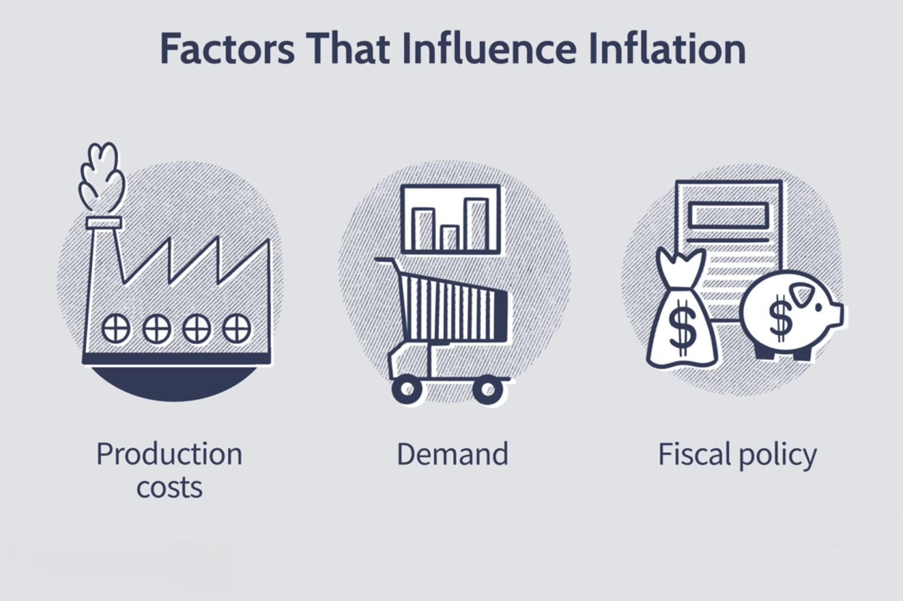

In the volatile world of financial markets, recognizing the intricate dynamics between commodities, inflation, and economic indicators is crucial for investors and policymakers. Commodities, which include resources like oil, gold, and agricultural products, form the backbone of global trade and economic activity. Their prices often reflect broader economic conditions, acting as both indicators of and hedges against inflation. Inflation, the general increase in prices and the subsequent fall in the purchasing value of money, can be influenced by various factors, including but not limited to, supply and demand dynamics of these commodities. 

Economic indicators such as Gross Domestic Product (GDP), Consumer Price Index (CPI), and employment statistics provide essential signals about the health and direction of an economy. These indicators can significantly influence commodity prices as they inform market expectations about future economic conditions. For instance, an increase in the CPI can signal rising inflation, prompting shifts in commodity prices as investors seek to preserve purchasing power through physical assets.



Algorithmic trading has emerged as a transformative force in navigating these complex market dynamics. By leveraging data and technology, algorithmic trading enhances the ability to execute trades with greater speed and precision than traditional methods. Automated systems process vast amounts of information, integrating economic indicators and commodity price trends to generate actionable insights and execute trades. This method also minimizes human biases, often resulting in more efficient pricing and larger-scale market analysis than traditionally possible.

This article aims to explore the intersection of commodities, inflation, economic indicators, and algorithmic trading, shedding light on how their collective impact can inform investment strategies. Through a nuanced understanding of these elements, investors can better navigate the financial markets' complexities, leveraging technological advancements to optimize their investment decisions.

## Table of Contents

## Understanding Commodities and Inflation

Commodities, encompassing precious metals, agricultural products, and oil, are integral components of the global economy. As tangible assets, they possess intrinsic value and are affected by supply and demand dynamics, geopolitical factors, and broader economic trends. Their prices have a symbiotic relationship with inflation, both influencing and being influenced by it.

Inflation is the rate at which the general level of prices for goods and services rises, eroding purchasing power. Commodities often serve as a hedge against inflation because their prices tend to increase when inflation accelerates. This occurs because the cost of raw materials is a significant component of production costs, which are passed onto consumers in the form of higher prices for finished goods. Therefore, investors flock to commodities during inflationary periods to preserve value.

The Consumer Price Index (CPI) is a primary measure of inflation, quantifying changes in the price level of a market basket of consumer goods and services. A rise in the CPI can lead to increased commodity costs, as producers adjust prices to maintain profit margins. Conversely, rising commodity prices, such as spikes in oil, can lead to higher transportation and production costs, feeding back into the CPI and driving inflation higher.

A classic example is the oil market. As a precursor in the production of fuel and energy, a rise in oil prices can cascade through the economy, impacting the costs of goods and services. For instance, airlines adjust ticket prices in response to fuel cost fluctuations. Similarly, agricultural commodities are directly affected by input costs, such as fertilizers and machinery maintenance, both linked to global oil prices.

To quantify these relationships, analysts often use econometric models. Consider a simple linear relationship in Python to explore the connection between commodity prices and inflation:

```python
import pandas as pd
from statsmodels.regression.linear_model import OLS
from statsmodels.tools import add_constant

# Example data with commodity prices and CPI
data = pd.DataFrame({
    'commodity_price': [50, 55, 60, 65, 70],
    'cpi': [100, 105, 110, 115, 120]
})

X = add_constant(data['commodity_price'])
Y = data['cpi']

model = OLS(Y, X).fit()
print(model.summary())
```

In the above model, a positive coefficient for `commodity_price` would indicate that as commodity prices increase, the CPI also rises, supporting the notion of commodities as inflation indicators. However, this relationship is not unidirectional—monetary policy, technological change, and supply chain disruptions can alter dynamics.

Understanding commodities and inflation requires appreciating the nuanced interplay between these variables and how they affect economic stability. This understanding is crucial for investors seeking to protect their assets in volatile financial environments.

## Economic Indicators and Their Impact on Commodities

Economic indicators are vital tools for assessing the health and direction of an economy, influencing financial markets, including commodities. Key indicators such as Gross Domestic Product (GDP), Consumer Price Index (CPI), and employment rates directly impact commodity prices, reflecting changes in supply and demand dynamics or perceived economic strength.

GDP, a measure of economic activity, affects commodity markets through its indication of growth or contraction. An expanding GDP typically suggests increased industrial production and consumer spending, driving demand for raw materials like oil, metals, and agricultural products. Conversely, a contracting GDP usually signals reduced demand, leading to falling commodity prices. For example, during periods of economic expansion, metals like copper might see a price increase due to heightened construction activity.

The CPI, which gauges average changes in consumer prices, directly impacts commodities due to its role in inflationary trends. Rising CPI often corresponds to increased prices for goods and services, including commodities, thus affecting investment and hedging strategies. For instance, investors might turn to gold as a hedge against inflation when CPI figures rise, pushing gold prices upward.

Employment rates provide insights into overall economic health and consumer purchasing power. High employment rates signal strong economic activity, enhancing commodity demand, especially in consumer-centric sectors like food and energy. Conversely, rising unemployment can signal economic weakness, leading to reduced demand for commodities as consumer spending declines.

Commodity markets are highly sensitive to these economic indicators, and prices can fluctuate significantly in response to economic news. A stronger-than-expected GDP report might lead to a surge in commodity prices due to anticipated increased demand, while a higher-than-expected CPI might increase gold prices due to inflation fears. Similarly, employment data releases often result in immediate price adjustments in commodity markets as traders reassess market conditions and adjust their positions accordingly.

Understanding the interplay between economic indicators and commodity markets is crucial for investors seeking to make informed decisions. Traders often use [algorithmic trading](/wiki/algorithmic-trading) systems to respond quickly to economic news, leveraging data to execute trades based on anticipated market movements. By aligning trading strategies with current economic conditions, investors can optimize their portfolios and capitalize on the opportunities presented by changes in economic indicators.

## Algorithmic Trading in Commodities Markets

Algorithmic trading has significantly transformed commodities markets by employing sophisticated computer algorithms to [carry](/wiki/carry-trading) out trades at unprecedented speed and accuracy. This technology-driven approach leverages predefined rules and strategies based on various market indicators, enabling traders to capitalize on minute price fluctuations, improve the efficiency of trade execution, and manage inherent risks associated with market [volatility](/wiki/volatility-trading-strategies).

Such algorithms are designed to process vast amounts of data in real-time, facilitating rapid decision-making and execution of trades without human intervention. This not only streamlines operations but also allows for the exploitation of [arbitrage](/wiki/arbitrage) opportunities that might be missed by human traders due to the sheer velocity at which markets operate.

A cornerstone of algorithmic trading involves the integration of technical indicators like moving averages and the Relative Strength Index (RSI). Moving averages, such as the simple moving average (SMA), are employed to smooth out price data by creating a constantly updated average price. The formula for an N-period simple moving average is:

$$
\text{SMA}_N = \frac{P_1 + P_2 + \ldots + P_N}{N}
$$

where $P_1, P_2, \ldots, P_N$ are the closing prices of a commodity over the last $N$ periods. This provides a clearer view of price trends over time, and traders program algorithms to react to crossovers of these moving averages as potential buy or sell signals.

The RSI, on the other hand, is a [momentum](/wiki/momentum) oscillator that measures the speed and change of price movements. It oscillates between zero and 100, indicating potential overbought or oversold conditions of commodities. The RSI is defined by the formula:

$$
\text{RSI} = 100 - \left( \frac{100}{1 + \frac{\text{average gain}}{\text{average loss}}} \right)
$$

By incorporating these indicators, algorithmic trading systems can optimize trading strategies, identifying entry and [exit](/wiki/exit-strategy) points based on data rather than emotion, thus improving the chances of profitable trades.

Risk management is another critical facet where algorithmic trading shines. By utilizing various algorithms that adapt to real-time data, traders can assess and mitigate risks more effectively. For example, stop-loss orders can be programmed to execute automatically when prices reach a certain level, thus minimizing potential losses.

Furthermore, advancements in [machine learning](/wiki/machine-learning) and [artificial intelligence](/wiki/ai-artificial-intelligence) are paving the way for even more sophisticated algorithmic trading systems. These technologies make it possible to predict market movements with greater accuracy by learning from historical data and adjusting strategies accordingly. As a result, traders can address the challenges posed by market volatility more adeptly.

In summary, algorithmic trading revolutionizes commodity trading by injecting speed, precision, and data-driven strategies into the markets. By managing risks and exploiting new technologies, traders can navigate the complexities of commodities trading more effectively.

## Developing Effective Trading Strategies

Creating robust trading algorithms necessitates a comprehensive understanding of both commodity markets and relevant economic indicators. The development of effective trading strategies is contingent on multiple factors, including the use of advanced statistical tools and computational methods to enhance decision-making processes.

Backtesting is a critical component in the development of trading strategies. By applying historical data to trading algorithms, [backtesting](/wiki/backtesting) provides insights into the potential effectiveness of a strategy. This approach allows traders to assess the viability of their strategies by simulating trades and analyzing performance metrics without financial commitment in actual markets. Crucial parameters evaluated during backtesting may include return on investment, maximum drawdowns, and the Sharpe ratio. Such analyses facilitate the refinement of algorithms, highlighting weaknesses and optimizing decision parameters for future trades.

Machine learning plays a pivotal role in refining these strategies by harnessing large datasets to improve predictive accuracy. Algorithms can identify patterns and correlations within historical market data that may not be apparent through traditional analyses. For instance, predictive models like random forests or neural networks can forecast commodity price movements by considering a multitude of variables, such as supply chain disruptions or geopolitical tensions. Consider the following Python snippet illustrating a basic predictive model using a simple linear regression framework as an introduction to more complex machine learning models:

```python
from sklearn.model_selection import train_test_split
from sklearn.linear_model import LinearRegression

# Sample data preparation
# Assuming 'data' is a pandas DataFrame with historical commodity prices and economic indicators
# features include relevant indicators like interest rates, and target is the price movement

features = data[['interest_rate', 'unemployment_rate', 'GDP_growth']]
target = data['commodity_price']

# Splitting data into training and testing sets
X_train, X_test, y_train, y_test = train_test_split(features, target, test_size=0.2, random_state=42)

# Initializing and training the model
model = LinearRegression()
model.fit(X_train, y_train)

# Predicting commodity prices
predictions = model.predict(X_test)
```

Real-world examples underscore the effective deployment of these strategies. For example, hedge funds have successfully utilized machine learning to tackle challenges posed by rapidly shifting markets. These implementations adopt sophisticated models capable of processing high-frequency trading data, adjusting trade executions in milliseconds based on real-time market conditions.

However, challenges persist. The dynamic nature of financial markets means trading models must continually evolve to account for emerging trends and unforeseen events. For instance, a strategy effective during one economic cycle may underperform during another due to changing market dynamics or regulatory environments. Additionally, machine learning models can be susceptible to overfitting, where the model performs well on historical data but poorly on new, unseen data.

In conclusion, developing effective trading strategies requires an iterative process of model testing and adaptation. Through rigorous backtesting and the incorporation of machine learning, traders can create robust, adaptive strategies that navigate the volatility of commodity markets. Nonetheless, the continual evolution of these strategies is paramount as market landscapes and economic indicators remain in a state of flux.

## Risk Management and Future Trends

Effective risk management in commodities trading necessitates a strategic approach that encompasses diversification and vigilant monitoring of economic indicators and market trends. Diversification involves spreading investments across various asset classes, including commodities, to mitigate risk. This approach helps cushion the impact of price volatility and adverse market movements. Additionally, actively monitoring economic indicators such as inflation rates, employment data, and geopolitical developments is vital for anticipating market shifts and making informed decisions.

Emerging trends are reshaping the landscape of commodities trading. Environmental, Social, and Governance ([ESG](/wiki/esg-investing)) factors are increasingly integrated into trading strategies. ESG considerations impact commodity demand and supply, influencing market prices. Traders incorporating ESG criteria can identify opportunities and potential risks associated with environmental policies, social practices, and governance standards. This approach aligns with the growing investor preference for sustainable investments.

The use of Artificial Intelligence (AI) in trading systems marks another transformative trend. AI technologies enable the analysis of large datasets to identify patterns and predict market movements. Machine learning algorithms optimize trading strategies by rapidly processing complex information, offering a significant advantage in fast-paced markets. AI's predictive capabilities improve the accuracy of market forecasts, enhancing decision-making for traders.

To adapt to these trends, traders must embrace continuous learning and technological advancements. Keeping abreast of market innovations and incorporating new tools into trading strategies enables traders to maintain a competitive edge. Being informed about regulatory changes and ethical considerations associated with ESG and AI further enhances risk management and investment outcomes.

As the trading environment evolves, flexibility and proactive adaptation are crucial. Traders who leverage diversification, ESG criteria, and AI technologies will be better positioned to navigate risks and capitalize on opportunities. By staying informed and agile, traders can optimize their strategies for improved performance in the dynamic world of commodities trading.

## Conclusion

The interplay between commodities, inflation, economic indicators, and algorithmic trading is a complex yet rewarding landscape for investors. These elements collectively shape the investment strategies that navigate the volatile terrains of financial markets. By harnessing the power of data and technology, traders can make informed decisions, optimize their portfolios, and mitigate risks associated with market fluctuations.

Algorithmic trading, with its ability to process vast amounts of data at exceptional speed, becomes a crucial tool in this environment. It allows for the integration of various economic indicators, such as Gross Domestic Product (GDP), Consumer Price Index (CPI), and employment rates, enabling traders to react swiftly to changing market conditions. The algorithms can be designed to identify patterns and trends, leading to more precise predictions and timely investment actions.

In addition to algorithmic trading, understanding the intrinsic relationship between commodities and inflation is essential for developing robust trading strategies. Commodity prices often move in response to changes in inflationary pressures, acting as a barometer for economic health. As commodities serve both as indicators and hedges against inflation, maintaining updated strategies is indispensable for capitalizing on these trends.

Furthermore, the investment landscape is continuously evolving, with emerging trends such as Environmental, Social, and Governance (ESG) factors and the increasing integration of Artificial Intelligence (AI) in trading systems. These advancements are not only changing how trades are executed but also introducing new dimensions to risk management and strategic planning.

Investors and traders are thus encouraged to maintain a dynamic approach by continuously evolving their strategies. This involves staying informed about the latest technological innovations and market developments and being adaptable to these changes. By doing so, they can effectively leverage the opportunities presented by the intersection of commodities, inflation, economic indicators, and algorithmic trading while navigating the challenges that accompany this dynamic landscape.

## References & Further Reading

[1]: Bergstra, J., Bardenet, R., Bengio, Y., & Kégl, B. (2011). ["Algorithms for Hyper-Parameter Optimization."](https://dl.acm.org/doi/10.5555/2986459.2986743) Advances in Neural Information Processing Systems 24.

[2]: ["Advances in Financial Machine Learning"](https://www.amazon.com/Advances-Financial-Machine-Learning-Marcos/dp/1119482089) by Marcos Lopez de Prado

[3]: ["Evidence-Based Technical Analysis: Applying the Scientific Method and Statistical Inference to Trading Signals"](https://www.amazon.com/Evidence-Based-Technical-Analysis-Scientific-Statistical/dp/0470008741) by David Aronson

[4]: ["Machine Learning for Algorithmic Trading"](https://github.com/stefan-jansen/machine-learning-for-trading) by Stefan Jansen

[5]: ["Quantitative Trading: How to Build Your Own Algorithmic Trading Business"](https://github.com/LucindaYa/quant-resources/blob/master/Quantitative%20Trading%20How%20to%20Build%20Your%20Own%20Algorithmic%20Trading%20Business.pdf) by Ernest P. Chan