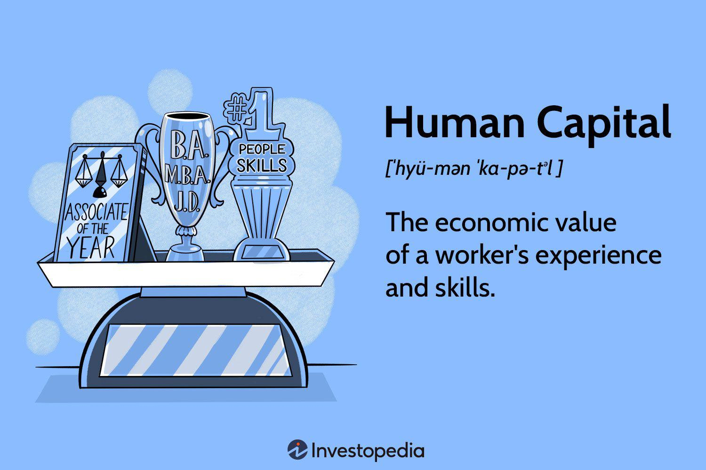

This article explores the complex interconnection between human capital and economic growth, highlighting the essential role of algorithmic trading. Human capital, which encompasses the skills, knowledge, and experience of individuals, serves as a fundamental driver of economic productivity. A well-developed human capital base enhances a nation's efficiency and ability to innovate across various sectors, directly contributing to increased economic output.

Algorithmic trading stands at the forefront of technological advancement, a domain where human capital is pivotal in optimizing trading strategies and enhancing market efficiency. By integrating advanced data analysis, financial theory, and technology, algorithmic trading utilizes human expertise to operate at speeds and levels of intricacy beyond traditional methods. This convergence of skills not only amplifies the capabilities of trading systems but also maximizes financial returns and market stability.



The interaction between nurturing human capital and advancing algorithmic trading technologies highlights a dynamic element of contemporary economic growth. As industries and markets progressively rely on technology-driven solutions, the importance of developing a skilled workforce through education and continuous learning becomes increasingly apparent. This synergy between human capital development and technological application is crucial for maintaining a competitive edge in the fast-paced economic landscape.

## Table of Contents

## Understanding Human Capital and Economic Growth

Human capital plays a foundational role in driving economic productivity through the aggregation of skills, knowledge, and experience possessed by individuals. These intangible assets are crucial for enhancing the efficiency and effectiveness of labor, directly influencing a nation's economic growth. Economic growth, traditionally quantified by the increase in a nation's capacity to produce goods and services, is often reflected in Gross Domestic Product (GDP) growth. The intrinsic value of human capital is pivotal in this regard, primarily by advancing innovation and productivity across various sectors.

Investments in human capital, such as education, training, and health, significantly contribute to improved economic outcomes. These investments result in a more skilled and adaptable labor force, which is better equipped to respond to technological changes and market demands. Education enhances an individual's employment prospects and [earning](/wiki/earning-announcement) potential, leading to higher income levels and, consequently, increased consumer spending that stimulates further economic growth.

The positive correlation between education and economic growth is well-documented, with studies indicating that countries investing more in higher education tend to experience faster economic growth rates. For instance, each additional year of schooling is estimated to raise a person’s income by about 10% per year, according to research from the World Bank. Moreover, the Organisation for Economic Co-operation and Development (OECD) highlights that higher education levels lead to higher employment rates, reinforcing the importance of human capital investment to sustain economic performance.

The economic value of human capital extends beyond individual sectors, boosting overall societal welfare through innovation and technological advancements. Skilled individuals are more likely to engage in entrepreneurial activities, promoting industry competitiveness and facilitating the development of new products and services. This innovation, fueled by a well-educated workforce, contributes to increased productivity and opens new markets, further propelling economic growth.

In summary, human capital is a vital determinant of economic growth, influencing productivity and innovation. Investments in education and skills acquisition enhance labor market outcomes, drive economic development, and ensure nations remain competitive in an increasingly globalized economy.

## The Role of Human Capital in Algorithmic Trading

Algorithmic trading, a sophisticated method of executing large orders using automated pre-programmed trading instructions, relies heavily on human capital to function effectively. This modern trading technique necessitates a blend of specialized skills, particularly in quantitative analysis, programming, and a thorough understanding of financial markets.

The design, optimization, and execution of trading algorithms are impossible without the human capital encompassing the necessary expertise. Quantitative analysts, or "quants," employ mathematical models to identify profitable opportunities. Their proficiency in statistical methods, calculus, and computer science is crucial for analyzing large datasets and constructing predictive models. A typical algorithm might involve statistical [arbitrage](/wiki/arbitrage) or market-making strategies, which require robust statistical and predictive modeling skills.

Programming skills are another critical component of human capital in [algorithmic trading](/wiki/algorithmic-trading). Developers in this field typically use programming languages like Python or C++ to build and optimize trading systems. For instance, a straightforward implementation of a moving average crossover strategy in Python might look as follows:

```python
import pandas as pd

# Assume df is a DataFrame with historical price data
short_window = 40
long_window = 100

# Calculate short and long moving averages
short_ma = df['Close'].rolling(window=short_window, min_periods=1).mean()
long_ma = df['Close'].rolling(window=long_window, min_periods=1).mean()

# Identify signals
df['Signal'] = 0
df['Signal'][short_window:] = np.where(short_ma[short_window:] > long_ma[short_window:], 1, 0)

# Generate trading orders
df['Position'] = df['Signal'].diff()
```

Financial market knowledge is indispensable for contextualizing algorithm development and understanding market behaviors and anomalies. Human capital in this sphere is vital in interpreting market trends, economic indicators, and regulatory developments, all of which influence trading strategies.

Data scientists, financial engineers, and IT professionals contribute significantly to algorithmic trading, bringing together diverse skills to develop sophisticated models. These professionals often draw from fields such as mathematics, physics, and computer science, blending them into innovative trading strategies that operate at speeds unachievable by humans alone.

In summary, the success of algorithmic trading is inherently tied to the depth and diversity of human capital. It thrives on the innovative application of specialized skills by highly trained professionals who continuously adapt to the evolving demands of financial markets and technology.

## Investments in Human Capital for Economic Growth

Investments in human capital are essential for fostering economic growth and ensuring economic prosperity. Both public and private sectors play pivotal roles in enhancing the skill set of the workforce, thereby driving productivity and innovation.

Governments are instrumental in shaping the educational landscape. By investing in educational infrastructure and programs, they establish a foundation for a skilled workforce. Policies that prioritize access to quality education and vocational training contribute significantly to improving national productivity levels. Education is not only a social equalizer but also a vital economic driver. Systematically providing educational opportunities enables individuals to acquire the necessary skills and knowledge to participate effectively in the economy. Moreover, government initiatives that support continuous professional development help maintain a workforce adaptable to technological and market changes.

Companies also recognize the economic advantages of investing in human capital. By allocating resources to employee training and development, they enhance productivity and spur innovation. Training programs in advanced technologies, management skills, and specific industry-related competences have demonstrated positive impacts on both employee performance and company profitability. Such investments are not only beneficial for the individual careers of employees but also translate into competitive advantages for businesses in the global market.

Empirical research consistently shows a strong correlation between higher education levels and increased earnings, as well as improved employment opportunities. According to studies by the OECD, individuals with tertiary education tend to have significantly higher income levels and employment rates than those with lower education levels. This, in turn, influences consumer spending patterns, as higher earnings increase disposable income, allowing for greater consumption and stimulating economic growth.

The economic value of investing in human capital is supported by various studies. For instance, a report by Hanushek and Woessmann (2010) found that countries investing more in education tend to experience faster economic growth. Such findings underscore the importance of aligning educational systems with economic objectives to create a workforce that meets modern labor market demands.

In summary, investing in human capital through education and professional development is a cornerstone of economic prosperity. By fostering a skilled and adaptable workforce, both governments and companies lay the groundwork for sustained economic growth and competitiveness in an ever-evolving global landscape.

## Case Studies: Human Capital Impact on Algo Trading

Firms such as Renaissance Technologies and Two Sigma epitomize the symbiotic relationship between diverse skill sets and algorithmic trading success. Founded by mathematician James Simons, Renaissance Technologies is renowned for its extensive use of complex mathematical models and algorithms to invest in the financial markets. This firm employs professionals with advanced degrees in disciplines like mathematics, physics, and computer science, which are directly applicable to developing sophisticated trading strategies. Their approach emphasizes the role of human capital, where the integration of quantitative research and data-driven analysis drives their trading operations.

Similarly, Two Sigma focuses on the application of cutting-edge technology and statistical models in trading. The firm employs experts in fields such as data science, computer programming, and finance to create models that predict market movements and optimize trading execution. The integration of diverse expertise and innovative thinking is central to Two Sigma's operational success, underscoring the importance of human capital in algorithmic trading.

Educational institutions play a pivotal role in preparing professionals for careers in this sector. Universities and colleges are increasingly offering specialized programs that combine finance, technology, and quantitative analysis, equipping students with the skills required for algorithmic trading. Institutions like the Massachusetts Institute of Technology (MIT) and Stanford University offer courses that bridge the gap between theoretical understanding and practical application, fostering a new generation of professionals ready to contribute to this field.

Moreover, industry partnerships and experiential learning opportunities are crucial in bridging theoretical knowledge with practical application. Initiatives such as internships, collaborative projects, and hackathons facilitate hands-on learning, enabling students to apply their theoretical understanding in real-world scenarios. This collaboration between academia and industry not only enhances the skills of future professionals but also ensures that educational curricula remain aligned with the evolving demands of the algorithmic trading landscape.

## Challenges and Opportunities in Human Capital Development

A significant challenge in the field of algorithmic trading is the skills gap, which calls for a proficient blend of finance, technology, and analytical capabilities. This skills gap arises from the specialized knowledge required to operate effectively in algorithmic trading environments, where financial theory must be complemented by technical proficiency in programming and data analysis. 

To address this challenge, education and training programs must evolve to better integrate these diverse skill sets. Traditional curricula, which often emphasize theoretical aspects of finance, must incorporate practical elements such as coding, mathematics, and statistical analysis. This evolution can help bridge the gap between supply and demand for skilled professionals capable of designing and implementing sophisticated trading algorithms.

Online courses and coding bootcamps offer crucial opportunities for upskilling, especially for finance professionals transitioning into algorithmic trading roles. Platforms like Coursera, Udacity, and edX provide specialized courses in Python programming, [machine learning](/wiki/machine-learning), and quantitative analysis, equipping professionals with the necessary technical skills. For instance, a Python script to calculate moving averages, a common technique in algorithmic trading, can be easily learned through these resources:

```python
def moving_average(data, window_size):
    """Calculate the moving average using a specified window size."""
    results = []
    for i in range(len(data) - window_size + 1):
        window = data[i:i + window_size]
        results.append(sum(window) / window_size)
    return results

# Example usage
prices = [100, 102, 101, 104, 106, 105]
window_size = 3
print(moving_average(prices, window_size))  # Output: [101.0, 102.33333333333333, 103.66666666666667, 105.0]
```

Continuous learning and adaptation are crucial as technological advancements rapidly change industry demands. The rapid pace of innovation in technologies such as [artificial intelligence](/wiki/ai-artificial-intelligence) and machine learning necessitates that professionals remain abreast of new developments. Organizations and professionals alike must adopt a mindset of lifelong learning to not only keep up with current trends but to also anticipate future needs. This can be facilitated by engaging in professional development programs, participating in industry seminars, and joining relevant professional networks to share insights and experiences.

In conclusion, while the skills gap presents a challenge, it also opens various opportunities for enriching human capital through targeted education and training interventions. By aligning educational efforts with industry requirements and promoting ongoing learning, the workforce can be better prepared to tackle the complexities of algorithmic trading.

## Future Trends in Human Capital and Algorithmic Trading

Emerging technologies such as artificial intelligence (AI) and machine learning are significantly transforming the human capital landscape within algorithmic trading. These technologies are driving a paradigm shift, requiring professionals to adopt a more interdisciplinary approach that merges financial expertise with computational proficiency. The integration of AI and machine learning allows for more sophisticated data analysis, predictive modeling, and automated decision-making processes, thereby enhancing the efficiency and effectiveness of trading strategies.

The demand for interdisciplinary skills is increasing, necessitating a hybrid skill set that combines financial knowledge with computational and analytical abilities. Professionals in this field must be equipped with a robust understanding of programming languages such as Python and R, as well as proficiency in statistical analysis and quantitative modeling. This shift highlights the importance of educational programs evolving to incorporate these advanced skills, ensuring that future professionals are well-prepared to navigate the complexities of modern trading environments.

Educational institutions are responding to these demands by expanding their curricula to include courses that focus on the latest technological advancements. Programs are integrating machine learning techniques, data science methodologies, and AI applications into their syllabi. This evolution is crucial for preparing students to meet the needs of the continuously evolving financial markets.

Furthermore, there is a growing emphasis on lifelong learning and adaptive skill development, which are essential to keeping pace with rapid technological innovations. Professionals are encouraged to engage in continuous education, utilizing resources such as online courses, workshops, and professional certifications to keep their skills relevant. Platforms such as Coursera, edX, and specialized coding bootcamps provide opportunities for individuals to upskill and transition into algorithmic trading roles effectively.

In a significantly dynamic industry influenced by disruptive technologies, maintaining a forward-thinking approach towards skill development is vital for sustaining a competitive advantage. As AI and machine learning continue to evolve, the fusion of human capital development with technological prowess will remain a critical driver of success in algorithmic trading.

## Conclusion

The synergy between human capital development and algorithmic trading emphasizes the critical role of investing in skills and education to drive economic growth. Human capital, which encompasses the collective skills, knowledge, and experiences of individuals, acts as a catalyst for innovation and a competitive edge in the rapidly evolving trading environment. As algorithmic trading continues to advance, leveraging human capital becomes essential for developing and deploying sophisticated trading systems that exploit new opportunities presented by technological advancements.

Stakeholders, including governments, educational institutions, and corporations, must prioritize investments in human capital to fully utilize technological innovations and promote sustainable economic growth. This involves creating educational programs that integrate financial acumen with computational skills, thus preparing a workforce capable of handling complex trading scenarios and adapting to future market demands.

Amid ongoing changes in technology and the economy, maintaining a proactive approach to human capital development is crucial. By continuously updating skill sets to align with emerging technological trends and by fostering a culture of lifelong learning, societies can ensure that their workforce remains relevant and effective. Such an approach not only addresses current industry requirements but also anticipates future challenges, thereby sustaining economic prosperity.

## References & Further Reading

1. Becker, G. S. (1993). *Human Capital: A Theoretical and Empirical Analysis with Special Reference to Education* (3rd ed.). University of Chicago Press. This foundational work explores the concept of human capital and its role in economic productivity, emphasizing the importance of education.

2. OECD. (2019). *Education at a Glance 2019: OECD Indicators*. OECD Publishing. This report provides a comprehensive analysis of education systems around the world and examines the correlations between education levels and economic outcomes.

3. OECD. (2022). *Skills Outlook 2022: The Digital Transformation of Education and Skills*. OECD Publishing. This publication investigates the evolving educational requirements in the digital age and their implications for economic growth and employment.

4. Chan, E. (2017). *Algorithmic Trading: Winning Strategies and Their Rationale*. Wiley. This book investigates into various algorithmic trading strategies and discusses the technological and mathematical principles behind them.

5. Narang, R. K. (2013). *Inside the Black Box: A Simple Guide to Quantitative and High-Frequency Trading* (2nd ed.). Wiley. This book provides insights into the world of quantitative and high-frequency trading, explaining the role of human capital in developing and managing trading algorithms.

6. Dumas, B. (2014). *Dynamic Asset Pricing Theory*. Princeton University Press. This text gives an advanced perspective on asset pricing, including algorithms and quantitative approaches that impact trading strategies.

7. Acemoglu, D., & Autor, D. (2011). *Skills, Tasks and Technologies: Implications for Employment and Earnings* in Handbook of Labor Economics, Vol. 4. North Holland. This work explores the relationship between skills, technology, and economic variables such as employment and wage levels.

8. Easley, D., López de Prado, M. M., & O’Hara, M. (2012). *The Volume Clock: Insights into the High-Frequency Paradigm*. *Journal of Portfolio Management*, 39(1), 19-29. This research article dives into the changes in trading paradigms brought by increased volume and speed, emphasizing the skills needed for algorithmic trading.

9. Schwab, K. (2016). *The Fourth Industrial Revolution*. Crown Business. This book discusses how emerging technologies, including AI and machine learning, are reshaping industries and the need for continuous education and skill adaptation.

10. Brynjolfsson, E., & McAfee, A. (2014). *The Second Machine Age: Work, Progress, and Prosperity in a Time of Brilliant Technologies*. W.W. Norton & Company. This book examines the impacts of digital technology on work and economic growth, underlining the significance of human capital in adapting to technological changes.

