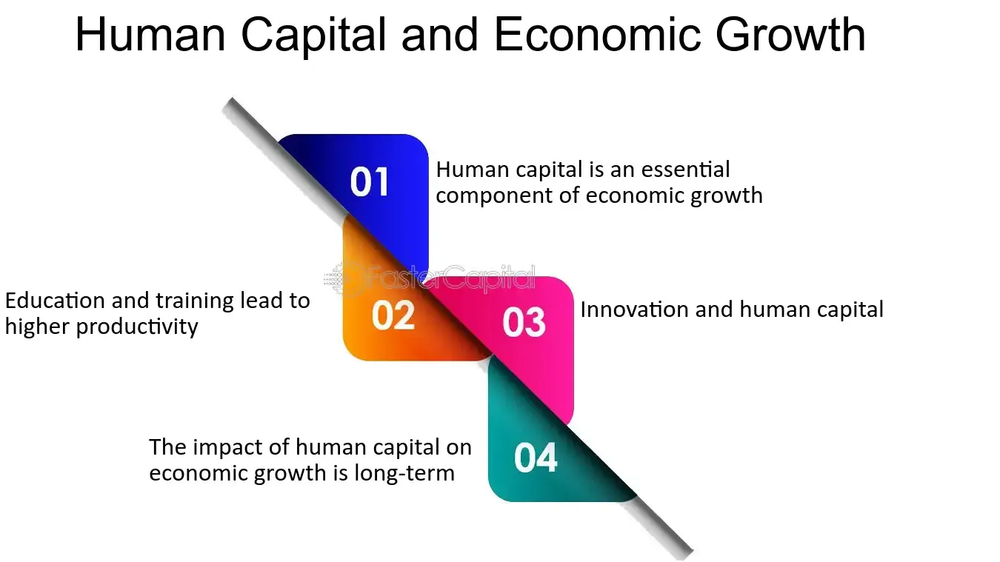

## Table of Contents

## What is human capital?

Human capital refers to the skills, knowledge, and experience that people have, which makes them valuable to businesses and economies. It includes things like education, training, and health, which can help people do their jobs better and be more productive. When people improve their skills or learn new things, they increase their human capital, which can lead to better job opportunities and higher wages.

Investing in human capital is important for both individuals and countries. For individuals, gaining more education or skills can lead to better jobs and higher income. For countries, a workforce with high human capital can lead to more innovation, higher productivity, and stronger economic growth. Governments and businesses often invest in education and training programs to help build human capital and improve the economy.

## What is economic growth?

Economic growth means that a country's economy is getting bigger over time. It happens when people make and buy more things, or when businesses create new products or find better ways to work. When the economy grows, it usually means more jobs and more money for people. Governments often try to help this happen by making rules that help businesses and by spending money on things like roads and schools.

But economic growth is not always good for everyone. Sometimes, it can make the rich richer and leave the poor behind. Also, if a country grows too fast, it might use up resources too quickly or harm the environment. So, it's important for countries to try to grow in a way that helps everyone and takes care of the planet.

## How is human capital measured?

Human capital is measured by looking at things like how much education people have, what skills they have learned, and how healthy they are. Education can be measured by the number of years people go to school or the degrees they earn. Skills can be measured by what people can do, like using a computer or speaking another language. Health can be measured by how often people get sick or how long they live.

These measures help us understand how good people are at their jobs and how much they can help the economy grow. For example, if a country has a lot of people with college degrees, it might have a lot of human capital. But if many people are sick and can't work, the human capital might be lower. By looking at these different things, we can get a good idea of the human capital in a country or a company.

## How is economic growth measured?

Economic growth is measured by looking at how much more money a country makes over time. The most common way to do this is by figuring out the Gross Domestic Product (GDP). GDP is the total value of all the goods and services made in a country in a year. If the GDP goes up from one year to the next, it means the economy is growing.

But GDP is not the only way to measure economic growth. Sometimes, people also look at how much more people are making, or how many more jobs there are. These other ways can show if the growth is helping everyone, not just making the country richer overall. By using different measures, we can get a better picture of how the economy is doing and if it's growing in a good way.

## What are the basic theories linking human capital to economic growth?

One basic theory linking human capital to economic growth is the idea that people with more skills and knowledge can do their jobs better and create more value. When people get more education or training, they become more productive. This means they can make more things or provide better services. As more people in a country become more productive, the whole economy grows because there's more stuff being made and more money being earned. This theory says that investing in things like schools and training programs is important because it helps build human capital, which leads to economic growth.

Another theory is that human capital helps create new ideas and technology. When people are educated and skilled, they are more likely to come up with new inventions or better ways of doing things. These new ideas can lead to new businesses and jobs, which helps the economy grow. This theory suggests that countries should focus on creating a workforce that is good at thinking and solving problems, because this can lead to more innovation and, in turn, more economic growth. Both theories show that human capital is a key part of making an economy stronger and more successful.

## Can you provide examples of countries where human capital has significantly influenced economic growth?

In South Korea, human capital has played a big role in economic growth. After the Korean War, the country focused on education. They made sure that many people could go to school and get good education. This helped create a workforce that was smart and skilled. These workers helped South Korea become good at making things like cars and electronics. As a result, South Korea's economy grew a lot and became one of the strongest in the world.

Another example is Finland. Finland has always put a lot of effort into education. They made sure their schools were good and that everyone could go to them. This led to a lot of people in Finland having high levels of education. These educated people helped Finland become good at technology and innovation. As a result, Finland's economy grew and became known for being advanced and successful. Both South Korea and Finland show how focusing on human capital can lead to big economic growth.

## What role does education play in the development of human capital?

Education is a key part of building human capital. It helps people learn new things and get better at what they do. When people go to school, they learn important skills like reading, writing, and math. They also learn about different subjects like science and history. This knowledge helps them do their jobs better and be more productive. For example, a person who learns how to use a computer in school can use that skill to work in an office or start a business.

But education is not just about learning facts. It also helps people think critically and solve problems. This is important because it lets people come up with new ideas and find better ways to do things. When a country has a lot of people who can think and solve problems, it can grow its economy. For instance, educated people might invent new technology or start new companies. So, by focusing on education, countries can build up their human capital and help their economies grow.

## How does health affect human capital and, consequently, economic growth?

Health is a big part of human capital because it affects how well people can work and learn. When people are healthy, they can go to school and learn new things without getting sick. They can also work more hours and do their jobs better because they have more energy. If a country has a lot of healthy people, it means there are more people who can work and help the economy grow. For example, if workers are healthy, they can make more things and provide better services, which helps the country's economy.

On the other hand, if people are often sick, it can hurt human capital and slow down economic growth. Sick people might miss a lot of school or work. This means they can't learn as much or be as productive. When many people in a country are sick, it can make the whole economy weaker because there are fewer people who can work and help the country grow. So, making sure people stay healthy is important for building human capital and helping the economy get stronger.

## What are the challenges in quantifying the impact of human capital on economic growth?

One challenge in figuring out how human capital affects economic growth is that it's hard to measure. Human capital includes things like education, skills, and health, but these things are not easy to put a number on. For example, how do you measure how smart someone is or how good they are at their job? Different people might have different ideas about what counts as being educated or skilled. This makes it hard to compare human capital across different countries or over time.

Another challenge is that there are many other things that can affect economic growth, not just human capital. Things like technology, government policies, and even the weather can make a big difference. It's hard to separate the effect of human capital from all these other things. For example, if a country's economy grows, is it because people are more educated, or is it because the government made new laws that helped businesses? Trying to figure this out can be tricky and often leads to different opinions about how important human capital really is for economic growth.

## How do technological advancements influence the relationship between human capital and economic growth?

Technological advancements change how human capital affects economic growth. When new technology comes out, people need to learn new skills to use it. This means that education and training become even more important. Countries that focus on teaching people about new technology can grow their economies faster because their workers can use the new tools to make more things or provide better services. For example, if a country's workers learn how to use computers and the internet, they can start new businesses online or work more efficiently.

But technology can also make some skills less important. If a machine can do a job that used to need a person, then the human capital needed for that job might not be as valuable anymore. This can lead to changes in what kinds of education and training are most important for economic growth. Countries need to keep up with these changes and make sure their workers are learning the right skills. If they do, technology can help human capital lead to even more economic growth. But if they don't, it might slow down growth instead.

## What policies can governments implement to enhance the positive effects of human capital on economic growth?

Governments can help grow the economy by making sure people get a good education. They can do this by spending money on schools and making sure everyone can go to them. They can also offer programs that help people learn new skills, especially ones that are needed for new jobs created by technology. By doing this, more people can find good jobs and help the economy grow. For example, if a government starts a program to teach people how to use computers, those people can get better jobs and make more money, which helps the economy.

Another way governments can help is by making sure people stay healthy. They can do this by providing good healthcare and encouraging people to live healthy lives. When people are healthy, they can work more and learn more, which makes them more valuable to the economy. For instance, if a government makes sure everyone can see a doctor when they're sick, fewer people will miss work or school, and the economy can grow faster. By focusing on education and health, governments can make sure their people have the skills and energy to help the economy get stronger.

## How does the global economy and international trade affect the dynamics between human capital and economic growth?

The global economy and international trade change how human capital helps economic growth. When countries trade with each other, they need people who know about different cultures and can speak different languages. This means that education becomes even more important because it helps people learn these skills. Countries that focus on teaching their people about the world can do better in international trade. For example, if a country's workers can speak many languages, they can sell things to more countries and help the economy grow.

But international trade can also make some skills less important. If a country can buy things from other countries more cheaply than making them at home, it might not need as many workers with certain skills. This can make it harder for people with those skills to find good jobs. Countries need to pay attention to what skills are needed in the global market and make sure their people are learning them. If they do, human capital can still help their economy grow, even with international trade.

## References & Further Reading

1. Becker, G. S. (1993). *Human Capital: A Theoretical and Empirical Analysis with Special Reference to Education* (3rd ed.). University of Chicago Press. This foundational work explores the concept of human capital and its role in economic productivity, emphasizing the importance of education.

2. OECD. (2019). *Education at a Glance 2019: OECD Indicators*. OECD Publishing. This report provides a comprehensive analysis of education systems around the world and examines the correlations between education levels and economic outcomes.

3. OECD. (2022). *Skills Outlook 2022: The Digital Transformation of Education and Skills*. OECD Publishing. This publication investigates the evolving educational requirements in the digital age and their implications for economic growth and employment.

4. Chan, E. (2017). *Algorithmic Trading: Winning Strategies and Their Rationale*. Wiley. This book investigates into various algorithmic trading strategies and discusses the technological and mathematical principles behind them.

5. Narang, R. K. (2013). *Inside the Black Box: A Simple Guide to Quantitative and High-Frequency Trading* (2nd ed.). Wiley. This book provides insights into the world of quantitative and high-frequency trading, explaining the role of human capital in developing and managing trading algorithms.

6. Dumas, B. (2014). *Dynamic Asset Pricing Theory*. Princeton University Press. This text gives an advanced perspective on asset pricing, including algorithms and quantitative approaches that impact trading strategies.

7. Acemoglu, D., & Autor, D. (2011). *Skills, Tasks and Technologies: Implications for Employment and Earnings* in Handbook of Labor Economics, Vol. 4. North Holland. This work explores the relationship between skills, technology, and economic variables such as employment and wage levels.

8. Easley, D., López de Prado, M. M., & O’Hara, M. (2012). *The Volume Clock: Insights into the High-Frequency Paradigm*. *Journal of Portfolio Management*, 39(1), 19-29. This research article dives into the changes in trading paradigms brought by increased volume and speed, emphasizing the skills needed for algorithmic trading.

9. Schwab, K. (2016). *The Fourth Industrial Revolution*. Crown Business. This book discusses how emerging technologies, including AI and machine learning, are reshaping industries and the need for continuous education and skill adaptation.

10. Brynjolfsson, E., & McAfee, A. (2014). *The Second Machine Age: Work, Progress, and Prosperity in a Time of Brilliant Technologies*. W.W. Norton & Company. This book examines the impacts of digital technology on work and economic growth, underlining the significance of human capital in adapting to technological changes.

