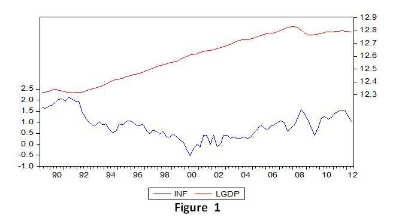

In today's dynamic financial landscape, the intricate interplay between inflation and GDP growth serves as a fundamental pillar in understanding economic stability and market behavior. These economic indicators are not only reflective of a nation's economic health but also influence investment strategies within financial markets, where algorithmic trading has become increasingly prominent.

Inflation, characterized by a sustained increase in the general price level of goods and services, directly affects purchasing power and cost structures within an economy. On the other hand, GDP growth signifies economic expansion and increased production capabilities over time. The relationship between these two indicators is complex, as GDP growth can spur inflation through heightened demand and consumption. This interconnectedness necessitates a balanced approach in economic policy-making to foster stable economic growth without triggering excessive inflationary pressures.



Algorithmic trading, which relies on sophisticated computational algorithms, utilizes these economic indicators to inform data-driven investment decisions. By integrating GDP and inflation data, traders can optimize strategies, accurately forecast trends, and swiftly adapt to market changes. These algorithms leverage vast datasets, applying advanced techniques to execute precise trading actions, thereby enhancing decision-making processes in fast-paced financial environments.

Understanding this relationship is crucial for both economists and investors. By analyzing how inflation and GDP growth influence market conditions, stakeholders can make informed predictions and strategic choices that capitalize on emerging opportunities while mitigating potential risks. As technology and economic models continue to evolve, algorithmic trading will likely further refine the interpretation and utilization of these critical indicators, providing enhanced capabilities for navigating the complexities of modern financial markets.

## Table of Contents

## Understanding Inflation and GDP Growth

Inflation and GDP growth are pivotal indicators of a nation's economic health. Gross Domestic Product (GDP) growth reflects the increase in a country's production capabilities and the overall expansion of its economy. When GDP grows, it indicates that the economy is producing more goods and services compared to the previous period, which is generally perceived as a sign of economic prosperity. Conversely, inflation is characterized by rising prices, which can erode purchasing power if wages do not keep pace with the increase in the cost of living.

These two indicators are often interrelated. GDP growth can lead to inflation, primarily through increased demand and consumption. As an economy expands and individuals have more disposable income, the demand for goods and services typically rises. This surge in demand can result in higher prices, subsequently causing inflation. This phenomenon is particularly evident in situations where supply does not keep up with demand, leading to upward pressure on prices.

The relationship between GDP growth and inflation is delicate and has significant implications for economic policy and financial markets. Policymakers aim to foster a balanced environment where GDP growth is robust enough to improve living standards while keeping inflation at a controlled level to maintain purchasing power. Excessive GDP growth that accelerates inflation can undermine economic stability, prompting central banks to implement measures such as [interest rate](/wiki/interest-rate-trading-strategies) adjustments to curb inflationary pressures.

For instance, if an economy shows signs of overheating—where rapid GDP growth is leading to high inflation—central banks might raise interest rates to decelerate spending and investment, thus tempering the growth rate. This action, reflected in monetary policy, underscores the intricate balance required to maintain economic stability and prevent conditions such as stagflation, where stagnant economic growth is accompanied by high inflation.

Understanding the interplay between inflation and GDP growth is crucial for economists and policymakers as they navigate economic cycles. This knowledge helps in formulating policies that support sustainable economic growth, protect consumer purchasing power, and maintain a stable economic environment conducive to long-term prosperity.

## The Economic Relationship Between Inflation and GDP Growth

The relationship between inflation and GDP growth has been a focal point of economic analysis due to its complexities and implications for policy-making. Historically, there has been a notable association between GDP growth and inflation rates. A growing economy often results in increased demand for goods and services, which can outstrip supply and lead to higher prices, or inflation. This phenomenon is explained by the demand-pull theory of inflation, where aggregate demand in an economy surpasses aggregate supply, causing price levels to rise.

However, this positive relationship between GDP growth and inflation is not linear or straightforward. Excessive GDP growth can lead to an overheating economy, causing inflationary pressures to mount excessively. This can destabilize the economic balance, necessitating intervention by central banks or government bodies. For instance, a central bank might raise interest rates to curb inflation, which can, in turn, slow down economic growth—a delicate act of balancing economic stability.

The Phillips Curve is a foundational concept illustrating the trade-off between inflation and unemployment, often linked to GDP growth. It suggests that with economic expansion and reduced unemployment, inflation tends to increase. However, the relationship outlined in the Phillips Curve has been contested, particularly during periods such as the stagflation of the 1970s, when high inflation and unemployment coexisted, challenging traditional economic theories.

Modern economic analysis often looks beyond simplistic correlations and considers structural factors and expectations. The concept of the Non-Accelerating Inflation Rate of Unemployment (NAIRU) illustrates this by pointing to a specific level of unemployment below which inflation would rise. Moreover, adaptive expectations and rational expectations models offer insights into how past experiences and future forecasts influence inflation dynamics.

Empirical examples abound: in the late 1990s in the United States, strong GDP growth was accompanied by low inflation, partly due to productivity gains and technological advancements. Conversely, in some developing nations, rapid GDP growth has led to significant inflation due to supply constraints and less efficient market structures.

In conclusion, while there is a historical association between GDP growth and inflation, the relationship is nuanced and influenced by various factors including economic policies, external shocks, and market dynamics. Understanding these complexities is crucial for devising effective monetary and fiscal policies that aim to promote sustainable economic growth while maintaining price stability.

## Algorithmic Trading and Economic Indicators

Algorithmic trading involves the use of computational algorithms designed to perform data-driven trading decisions with minimal human intervention. These algorithms are highly reliant on a variety of economic indicators, particularly Gross Domestic Product (GDP) and inflation, which serve as critical inputs. Such indicators provide insights into the broader economic environment, assisting algorithms in optimizing trading strategies by forecasting trends and effectively responding to market fluctuations.

Economic indicators are quantifiable metrics that describe the overall health and trajectory of an economy. GDP reflects the total economic output and is indicative of economic expansion or contraction, while inflation measures the rate at which the general level of prices for goods and services rises, influencing the purchasing power of money. These metrics influence the supply and demand dynamics in financial markets and thus play an essential role in [algorithmic trading](/wiki/algorithmic-trading) strategies.

The integration of economic data into algorithmic trading systems allows for more accurate and efficient market predictions. Traders use these indicators to refine their trading models, employing them in complex financial models and simulations. For instance, in a Python-based trading algorithm, real-time GDP and inflation data can be utilized as follows:

```python
import pandas as pd
import numpy as np

# Example of integrating GDP and inflation data
def trading_algorithm(gdp_data, inflation_data, stock_data):
    # Simple trading logic based on GDP growth and inflation trends
    economic_growth = np.mean(gdp_data) > 0
    inflation_pressure = np.mean(inflation_data) > 2  # assuming 2% as a threshold

    if economic_growth and not inflation_pressure:
        # Example strategy: buy stocks if the economy is growing and inflation is stable
        decision = 'buy'
    elif not economic_growth or inflation_pressure:
        # Example strategy: sell stocks if there's economic contraction or high inflation
        decision = 'sell'
    else:
        # No action taken during uncertain economic signals
        decision = 'hold'

    return decision

# Sample data
gdp_data_sample = pd.Series([2.2, 2.5, 2.7, 2.3, 2.8])
inflation_data_sample = pd.Series([1.8, 2.0, 2.3, 1.9, 2.1])
stock_data_sample = pd.Series([101, 103, 107, 105, 110])

# Execute the trading algorithm
trading_decision = trading_algorithm(gdp_data_sample, inflation_data_sample, stock_data_sample)
print(f"Trading decision: {trading_decision}")
```

Advanced techniques in algorithmic trading leverage substantial datasets to make precise decisions. For example, [machine learning](/wiki/machine-learning) models can analyze historical data along with real-time updates to predict future market movements. These algorithms are adaptive, constantly recalibrating based on new data inputs to enhance predictive accuracy.

In conclusion, the use of economic indicators such as GDP and inflation in algorithmic trading allows investors and financial institutions to fine-tune their strategies, maximizing returns while minimizing risks. The algorithms employ both macro and microeconomic data to predict market trends, resulting in informed investment decisions that align with economic shifts. As technology evolves, the capability to process larger datasets and incorporate more nuanced economic variables will further enhance the effectiveness of algorithmic trading models.

## Impact of Inflation and GDP on Financial Markets

Financial markets exhibit significant sensitivity to fluctuations in inflation and GDP indicators. These economic metrics play a critical role in shaping investor sentiment and market dynamics. An increase in GDP is generally viewed as a positive signal, indicative of economic prosperity and expansion. It typically bolsters market confidence, often leading to enhanced investment activities and rising asset prices. However, this optimism can be offset by pronounced inflation, which introduces [volatility](/wiki/volatility-trading-strategies) and uncertainty into the markets.

Inflation erodes purchasing power, increasing the cost of living and impacting consumer spending. This can lead to a tightening of monetary policies by central banks, such as increasing interest rates to curb excessive inflation. These measures can affect market [liquidity](/wiki/liquidity-risk-premium) and lending rates, further influencing asset prices. Financial markets react dynamically to such changes, with prices reflecting both anticipated and unexpected shifts in these economic indicators.

Algorithmic trading models leverage both historical and real-time economic data to make informed forecasts about these fluctuations. These algorithms operate by analyzing vast datasets to identify patterns and predict potential market movements. They assess various factors including GDP growth rates and inflationary pressures to adjust trading strategies accordingly. The implementation of these models helps optimize trading performance by providing timely insights into market trends and potential reversals.

For instance, an algorithm might detect an upward trend in GDP coupled with moderate inflation, signaling a robust economic environment conducive to stock market growth. Conversely, if sustained high inflation is predicted, the model might suggest adopting risk aversion strategies such as diversifying investments into commodities or inflation-protected securities.

Investors capitalize on these insights to hedge against potential risks and seize opportunities. For instance, they might increase equity holdings in anticipation of economic expansion as indicated by rising GDP, or conversely, shift assets to bonds or alternative investments as a cushion against inflation-induced volatility. Such strategies underscore the importance of algorithmically precise predictions in minimizing risks and maximizing returns.

In conclusion, the interplay between inflation and GDP within financial markets necessitates a sophisticated approach to analyzing and responding to economic indicators. The application of algorithmic models not only sharpens investment strategies but also enhances market stability by enabling informed decision-making amidst economic changes.

## Practical Application in Algorithmic Trading

Renaissance Technologies, a prominent [hedge fund](/wiki/hedge-fund-trading-strategies) known for its [quantitative trading](/wiki/quantitative-trading) strategies, exemplifies the effective use of economic indicators in algorithmic trading. The firm's Medallion Fund is particularly renowned for its integration of sophisticated mathematical models and vast datasets to forecast market movements. By incorporating economic indicators such as inflation rates and GDP growth, Renaissance Technologies capitalizes on economic shifts to make informed trading decisions.

Algorithms developed and employed by firms like Renaissance Technologies are dynamic and require constant recalibration. As economic data is continuously updated, algorithms must be adjusted to maintain their predictive accuracy and relevance. This iterative process involves refining model parameters and updating the datasets used for analysis. High-frequency data releases, such as monthly inflation reports or quarterly GDP growth figures, are vital inputs that ensure the algorithms remain precise and timely.

Machine learning and data analytics play a crucial role in these processes. For instance, regression models and neural networks can be utilized to identify patterns related to inflationary trends and economic cycles. By training these models on historical data, traders can anticipate market responses based on current economic conditions. An example of a simple machine learning model in Python to predict market trends based on inflation data might look like this:

```python
from sklearn.model_selection import train_test_split
from sklearn.ensemble import RandomForestRegressor
from sklearn.metrics import mean_squared_error
import pandas as pd

# Load and preprocess the data
data = pd.read_csv('economic_data.csv') # Example dataset
features = data[['inflation_rate', 'GDP_growth']]
target = data['market_trend']

x_train, x_test, y_train, y_test = train_test_split(features, target, test_size=0.2, random_state=42)

# Train a random forest model
model = RandomForestRegressor(n_estimators=100, random_state=42)
model.fit(x_train, y_train)

# Predict and evaluate the model
y_pred = model.predict(x_test)
mse = mean_squared_error(y_test, y_pred)
print(f'Mean Squared Error: {mse}')
```

Firms engage in best practices that ensure robust trading strategies amidst economic volatility. These include the continuous refinement of predictive models and retaining a diversified portfolio to mitigate risk. Diversification allows firms to balance potential losses in one segment with gains in another, effectively reducing overall risk exposure.

Moreover, firms can employ sentiment analysis through natural language processing (NLP) to gauge market sentiment by analyzing news articles, economic reports, and social media feeds. This further refines their trading strategies by providing a comprehensive understanding of market dynamics beyond traditional economic indicators.

The strategic application of algorithmic trading using economic indicators underscores the importance of technology in modern financial markets. By leveraging machine learning and data analytics, traders can adapt to economic changes, predict market behavior, and optimize their positions effectively.

## Conclusion

The intricate interplay between inflation and GDP growth is a critical component of economic analysis and investment strategy. The relationship dictates how economies expand and adjust, influencing purchasing power and overall economic stability. Algorithmic trading, leveraging these indicators, has evolved to optimize decision-making within dynamic market environments. By employing computational techniques and vast datasets, algorithmic trading systems can predict market movements with greater accuracy, enabling traders and investors to respond swiftly to economic fluctuations.

Understanding this relationship is not only beneficial for traders but is also essential for economists who aim to predict and model economic cycles. Accurate predictions allow for more informed investment choices, as they offer a glimpse into potential future market conditions. Advanced economic models, including those used in algorithmic trading, often incorporate machine learning and [artificial intelligence](/wiki/ai-artificial-intelligence) to interpret complex datasets. These models can identify patterns and correlations between inflationary trends and GDP growth, guiding strategic trading decisions.

Ongoing technological advancements continue to refine these processes. Enhancements in data processing speeds, computational power, and modeling techniques promise further improvements in how trading algorithms analyze economic indicators. As these tools become more sophisticated, they will undoubtedly enhance decision-making accuracy, offering businesses and traders a competitive edge in fast-paced, ever-changing financial markets.

Continual innovation in economic modeling, combined with strategic implementation in algorithmic trading, ensures that the financial industry remains adaptive and resilient to economic changes. This synergy between technology and economic indicators underscores the importance of understanding inflation and GDP growth as foundational elements in the pursuit of optimized investment strategies and economic stability.

## References & Further Reading

[1]: Bergstra, J., Bardenet, R., Bengio, Y., & Kégl, B. (2011). ["Algorithms for Hyper-Parameter Optimization."](https://papers.nips.cc/paper/4443-algorithms-for-hyper-parameter-optimization) Advances in Neural Information Processing Systems 24.

[2]: ["Advances in Financial Machine Learning"](https://www.amazon.com/Advances-Financial-Machine-Learning-Marcos/dp/1119482089) by Marcos Lopez de Prado

[3]: ["Evidence-Based Technical Analysis: Applying the Scientific Method and Statistical Inference to Trading Signals"](https://www.amazon.com/Evidence-Based-Technical-Analysis-Scientific-Statistical/dp/0470008741) by David Aronson

[4]: ["Machine Learning for Algorithmic Trading"](https://github.com/stefan-jansen/machine-learning-for-trading) by Stefan Jansen

[5]: ["Quantitative Trading: How to Build Your Own Algorithmic Trading Business"](https://www.amazon.com/Quantitative-Trading-Build-Algorithmic-Business/dp/1119800064) by Ernest P. Chan