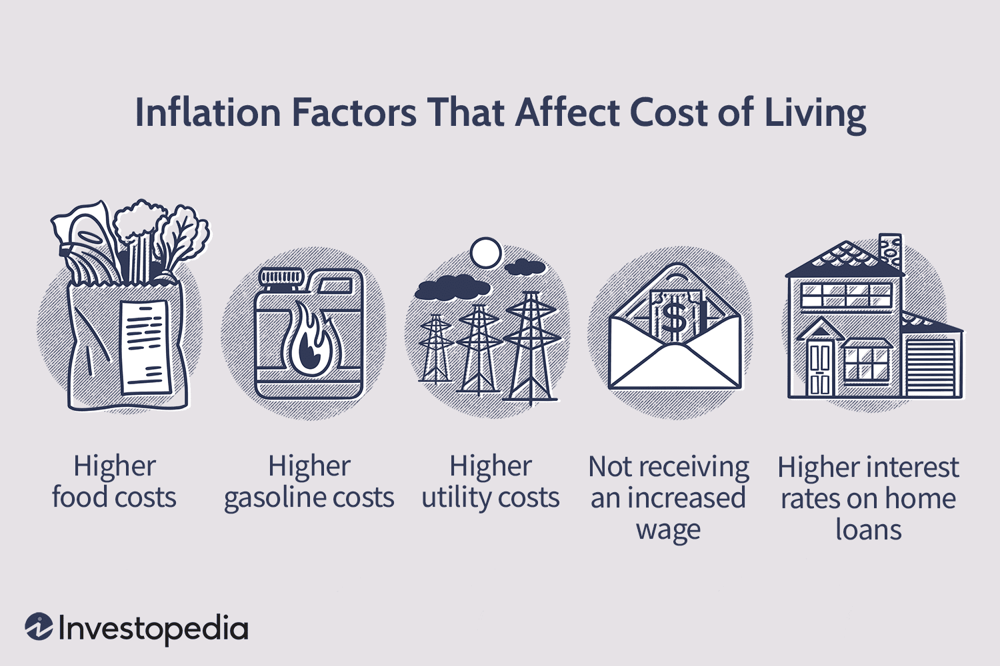

The housing market, inflation, and home prices have become increasingly intertwined in the current economic landscape. This entanglement is largely due to macroeconomic factors, such as inflation, which plays a pivotal role in dictating market conditions. Inflation refers to the general increase in prices and the corresponding decrease in purchasing power within an economy. As inflation rates climb, they invariably affect various economic sectors, with the housing market being significantly impacted. As inflation rates soar, homebuyers and investors alike are concerned about the impacts on housing affordability. Rising inflation usually results in increased interest rates, which directly influence mortgage costs and ultimately, housing affordability. Higher borrowing costs can deter potential buyers, reducing demand and potentially suppressing home price appreciation.

In parallel, algorithmic trading (algo trading) is transforming how housing market investments are approached. Algo trading uses advanced algorithms and quantitative analysis for decision-making in trading activities, allowing for swift reactions to market changes. In the context of real estate, algorithmic trading can offer insights into market trends, enabling investors to make informed decisions even in volatile conditions. This technological advancement provides a strategic edge by considering numerous economic indicators, including inflation metrics.



The relationship between housing market inflation, home prices, and the role of algorithmic trading is critical for understanding modern real estate dynamics. As these variables interact, they shape the opportunities and challenges faced by both individual buyers and institutional investors. Exploring these links helps clarify how economic pressures influence housing affordability and investment strategies within the real estate sector. Understanding these dynamics is essential for staying ahead in a rapidly evolving market environment, where data-driven approaches and economic realities converge.

## Table of Contents

## Understanding Housing Market Inflation

Inflation has pervasive effects across various economic segments, and the housing market is particularly susceptible to such fluctuations. Historical analysis indicates that home prices frequently increase at rates exceeding those of general inflation. This trend is driven by several interrelated factors that uniquely impact housing markets.

One primary [factor](/wiki/factor-investing) contributing to housing market inflation is the imbalance between supply and demand. When demand for housing outstrips supply, prices tend to rise, often at rates higher than general inflation. This scenario has been prevalent in numerous urban centers where population growth and urbanization outpace the construction of new housing units. Consequently, the limited availability of homes pushes prices upward.

Material costs significantly affect housing market inflation as well. The prices of construction materials such as lumber, steel, and concrete directly influence the cost of building new homes. When these material costs rise, either due to inflationary pressures or supply chain disruptions, builders may transfer these increased costs to buyers, resulting in higher home prices.

Zoning regulations also play a crucial role in housing market dynamics. These regulations determine what can be built and where, often limiting the development of new housing units. Strict zoning laws can constrain supply, leading to heightened competition for available homes and, therefore, increased prices. While zoning is critical for organized urban development, overly restrictive regulations can contribute to price surges.

Recent trends highlight a growing disparity between housing prices and average income increases, further exacerbating affordability challenges. In many regions, the rate at which home prices have escalated far outpaces income growth, making it increasingly difficult for average earners to purchase homes. This divergence is particularly pronounced in economically prosperous areas, where high demand and limited supply drive prices to levels that many potential buyers find prohibitive.

Understanding these factors is essential for grasping the broader implications of inflation on the housing market. This knowledge equips stakeholders—including policymakers, investors, and homebuyers—with insights necessary to navigate the complexities of housing economics in inflationary periods.

## How Inflation Impacts Home Prices

Inflation plays a critical role in the housing market, primarily through its influence on construction costs and purchasing power. As inflation rates rise, so do the costs of building materials, labor, and land, leading to increased construction expenses. These heightened costs are typically transferred to homebuyers, manifesting in elevated home prices. This upward pressure on prices diminishes the purchasing power of potential buyers. When consumers have to spend more on basic goods and services due to inflation, their ability to afford home purchases is compromised, reducing demand.

The impact of inflation on home prices can vary significantly across different regions. These regional disparities are often driven by local economic conditions, including variations in income growth, employment rates, and availability of housing stock. For example, areas with limited housing supply and strong demand may experience more pronounced price increases than regions with more balanced housing markets. This variance can result in significant differences in housing market trends and affordability.

Monetary policies set by the Federal Reserve are crucial in managing inflation's effects. To combat high inflation, the Federal Reserve may implement [interest rate](/wiki/interest-rate-trading-strategies) hikes. While these actions aim to stabilize the economy, they can have a substantial impact on mortgage rates. As interest rates increase, borrowing costs for homebuyers rise, which can suppress housing demand further. This interplay between inflation, monetary policy, and home prices underlines the complexity of the housing market's response to economic changes. Understanding these dynamics is essential for both market participants and policymakers in navigating the challenges posed by inflation in the housing sector.

## Algorithmic Trading in the Real Estate Market

Algorithmic trading is reshaping the landscape of real estate markets by employing sophisticated algorithms and quantitative models to expedite trading decisions. This technique leverages high-speed computing to analyze extensive datasets, thereby enabling precise trend prediction and informed investment choices.

In real estate, the application of [algorithmic trading](/wiki/algorithmic-trading) is steadily increasing, particularly within real estate investment trusts (REITs) and large-scale property ventures. Algorithms are crafted to process diverse variables such as market trends, economic indicators, and property valuations. By analyzing these elements comprehensively, the algorithms can forecast market movements, which guides investment strategies.

The incorporation of algo trading in real estate facilitates portfolio optimization. Investors can achieve a well-balanced portfolio by systematically targeting assets that align with their investment goals and risk tolerance. The ability to swiftly react to market [volatility](/wiki/volatility-trading-strategies) is fortified through algorithmic strategies, allowing for more agile responses to fluctuations in market conditions.

One core aspect of algorithmic trading is its efficiency in managing and executing trades across various real estate assets. This efficiency stems from advanced computational methods that aggregate and interpret data faster than traditional methods. High-frequency trading, a subset of algo trading, can exploit small price discrepancies across markets, thus enhancing potential returns.

Additionally, as computational power and data analytics evolve, the precision and applications of algorithmic trading in real estate continue to broaden. Algorithms are now incorporating [artificial intelligence](/wiki/ai-artificial-intelligence) and [machine learning](/wiki/machine-learning) techniques to refine predictions and further augment investment performance. This technological synergy is crucial in maintaining competitive advantage and optimizing investment outcomes in fluctuating market environments.

Through algorithmic trading, investors can not only mitigate risks through diversification but also capitalize on short-term opportunities without being swayed by emotional biases that often influence human decision-making. As such, algorithmic trading stands as a formidable tool, crucial for navigating the complexities and volatilities inherent in the real estate market.

## The Intersection of Housing Market and Algo Trading

Real estate investors utilize algorithmic trading to profit from short-term market movements while hedging against potential risks. This involves the use of sophisticated algorithms and quantitative models that analyze vast data sets rapidly. By integrating economic indicators, such as inflation data and interest rate changes, these models can refine property investment strategies, offering a competitive edge in a fluctuating market environment.

As algorithmic trading becomes more sophisticated, its influence on market [liquidity](/wiki/liquidity-risk-premium) and price efficiency also grows. Algorithms execute trades at high speeds and volumes, ensuring that any discrepancies in asset pricing are swiftly corrected. This continual adjustment contributes to a more liquid and efficient market, which benefits all participants. The algorithms are designed to adapt to varying market conditions, thus providing dynamic strategies that can pivot with economic changes.

Moreover, the technology-driven approach intrinsic to algorithmic trading aids investors in optimizing outcomes by making data-informed decisions. The integration of detailed market analytics, predictive modeling, and automated decision-making processes allows investors to quickly respond to emerging trends. For instance, if inflation data indicates a potential rise in housing costs, algorithmic strategies can adjust investment portfolios to mitigate potential losses or capitalize on possible gains.

In Python, the integration of economic indicators into a trading algorithm might look like this:

```python
def adjust_portfolio(inflation_rate, current_holdings):
    """
    Adjusts investment portfolio based on inflation rate.

    :param inflation_rate: Current inflation rate as a decimal (e.g., 0.03 for 3%)
    :param current_holdings: Dictionary of current asset holdings with asset names as keys and values as amount.
    :return: Adjusted holdings
    """
    adjustment_factor = 1 + inflation_rate

    # Hypothetical adjustment logic:
    adjusted_holdings = {asset: amount * adjustment_factor for asset, amount in current_holdings.items()}

    return adjusted_holdings

# Sample execution with current inflation rate of 4% and sample holdings
inflation_rate = 0.04
portfolio = {'Residential Properties': 100000, 'Commercial Estates': 150000}
new_portfolio = adjust_portfolio(inflation_rate, portfolio)

print("Adjusted Portfolio:", new_portfolio)
```

As algorithms continue evolving, they offer unprecedented opportunities to exploit market inefficiencies, ultimately driving more strategic and safer investments in the housing market. Harnessing the power of algo trading provides an invaluable toolset for investors seeking to navigate the complexities and volatility inherent in real estate markets.

## Challenges and Opportunities

One key challenge associated with algorithmic trading in the housing market is the potential to exacerbate market volatility if it is not managed meticulously. Algorithmic trading systems, by their nature, can execute vast volumes of trades in a fraction of a second, potentially leading to rapid market swings. Should these algorithms misinterpret data or act on erroneous inputs, their actions could lead to unintended and significant fluctuations in market prices. This risk underscores the importance of establishing robust risk management protocols and oversight mechanisms to mitigate adverse effects on the housing market.

Conversely, the opportunities for retail investors to access algorithmic trading tools are growing, effectively democratizing investment strategies historically reserved for large institutions. Platforms offering algorithmic trading capabilities are increasingly becoming user-friendly and accessible, allowing retail investors to harness data-driven strategies to optimize their portfolios. This democratization enables smaller investors to take advantage of the same market efficiencies and analytical prowess that institutional investors have leveraged for years.

Another significant opportunity lies in the synergy between inflation analytics and algorithmic trading, which could potentially stabilize price movements within the housing market. By integrating comprehensive inflation data and economic indicators into algorithmic models, investors can gain a more nuanced understanding of market dynamics. This integration allows for more precise predictions and investment strategies that account for inflation's impact on housing prices, ultimately leading to a more stable and efficient market environment.

Technological advancements continually reshape the dynamics between inflation metrics and housing investments, unveiling new avenues for profitability. Machine learning and artificial intelligence play pivotal roles in enhancing the sophistication of algorithmic models, allowing them to adapt quickly to changing economic conditions. These technologies can process vast datasets in real-time, offering insights that can lead to more informed decision-making and optimized investment outcomes in the housing market.

Overall, while challenges remain in managing algorithmic trading's potential impacts on market volatility, embracing these advanced technological tools can empower investors with unprecedented opportunities for growth and stability in an inflation-impacted housing landscape.

## Conclusion

Understanding the impact of inflation on the housing market is crucial for both buyers and investors as it directly affects purchasing power and affordability. Inflation typically leads to increased construction costs, which developers often pass onto homebuyers. This can result in a surge in home prices, further aggravating affordability issues for potential homeowners. For investors, inflation can present both challenges and opportunities by influencing demand dynamics and altering the investment landscape.

Algorithmic trading offers a powerful tool to navigate these complexities within real estate investment amidst inflationary pressures. This technology leverages advanced algorithms and quantitative models to analyze large datasets, allowing for accurate predictions and strategic decision-making. Algo trading enables investors to optimize their portfolios by efficiently managing risks and capitalizing on short-term market movements. This is particularly beneficial in volatile environments characterized by rapidly changing inflation rates.

As the housing market continues to evolve, the integration of advanced trading algorithms and economic indicators will remain pivotal. By incorporating economic indicators like Consumer Price Index (CPI) and Producer Price Index (PPI) into their models, algorithmic traders can refine their investment strategies to account for inflationary trends. This enhances the ability to foresee market shifts and adjust investment portfolios accordingly.

Staying informed and adaptive is key to capitalizing on opportunities within the housing and investment sectors. Both buyers and investors need to keep abreast of economic developments and embrace technological advancements to remain competitive. As algorithmic trading tools become more accessible, they are democratizing investment strategies, enabling a broader range of participants to effectively manage inflation threats and exploit market opportunities efficiently.

## References & Further Reading

[1]: "Inflation and Housing Prices" by Case, K.E., & Shiller, R.J. (2004). Journal of Real Estate Finance and Economics. [Journal Link](https://link.springer.com/article/10.1007/s11146-006-0335-2)

[2]: "House Prices, Interest Rates, and the Mortgage Market Meltdown" by Himmelberg, C., Mayer, C., & Sinai, T. (2005). National Bureau of Economic Research. [NBER Working Paper](https://conference.nber.org/confer/2008/cff08/mayer.pdf)

[3]: "The Stock Market and Housing Prices: A Macroeconomic Approach" by Goodhart, C., & Hofmann, B. (2008). Oxford Review of Economic Policy. [Journal Link](https://sciendo.com/pdf/10.2478/ie-2024-0057)

[4]: "Algorithmic Trading and Information" by Hendershott, T., & Riordan, R. (2013). Journal of Financial and Quantitative Analysis. [Journal Link](https://www.jstor.org/stable/43303831)

[5]: "Algorithmic Trading: Winning Strategies and Their Rationale" by Ernest P. Chan (2013). [Book Link](https://www.wiley.com/en-us/Algorithmic+Trading%3A+Winning+Strategies+and+Their+Rationale-p-9781118460146)

[6]: "The Role of High-Frequency Trading in Stock Market Crashes" by Kirilenko, A.A., Kyle, A.S., Samadi, M., & Tuzun, T. (2017). Journal of Portfolio Management. [Journal Link](https://link.springer.com/chapter/10.1007/978-3-031-71503-7_1)

[7]: "Housing Markets and the Economy: Risk, Regulation, and Policy" edited by Edward L. Glaeser & John M. Quigley (2009). [Book Link](https://business.columbia.edu/sites/default/files-efs/pubfiles/3066/Housing_Markets_and_the_Economy_Chp_6.pdf)