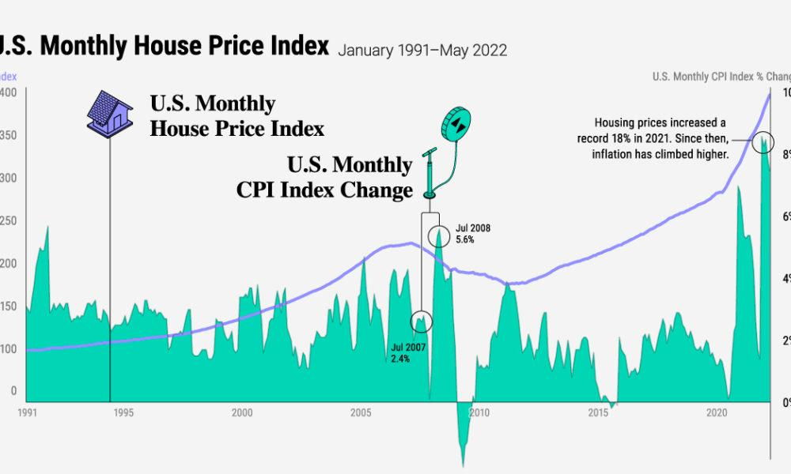

## Table of Contents

## What is inflation and how is it measured?

Inflation is when the prices of things we buy, like food and clothes, go up over time. It means that the money we have can buy less stuff than before. Imagine if a candy bar cost $1 last year, but now it costs $1.10. That's inflation. It happens for many reasons, like when there's more money around than there are things to buy, or when it costs more to make things.

To measure inflation, people use something called the Consumer Price Index, or CPI. The CPI looks at the prices of a bunch of different things that people buy every day, like groceries, gas, and rent. Every month, experts check these prices and see how much they've changed from last month or last year. If the prices have gone up a lot, then inflation is high. If they haven't changed much, then inflation is low. This helps us understand how fast our money is losing its value.

## What are housing prices and how are they typically tracked?

Housing prices are what people have to pay to buy a home. These prices can change a lot depending on where the house is, how big it is, and what it's like inside. In some places, houses might be really expensive because a lot of people want to live there and there aren't many houses for sale. In other places, houses might be cheaper because fewer people want to live there or there are more houses available.

To keep track of housing prices, people use something called a housing price index. This index looks at the prices of houses that have been sold in a certain area over time. By comparing these prices, experts can see if housing prices are going up, going down, or staying the same. One popular index is the S&P/Case-Shiller Home Price Index, which tracks home prices in different cities across the United States. This helps people understand trends in the housing market and make better decisions about buying or selling a home.

## How does inflation affect the general economy?

Inflation can have a big impact on the economy. When prices go up, people's money doesn't go as far as it used to. This means they might have to spend more on things like food and gas, and have less money left over for other things. Businesses might also have to raise their prices to cover the higher costs of making their products. If prices keep going up quickly, people might start to worry and spend less money, which can slow down the economy.

On the other hand, a little bit of inflation can be good for the economy. It can encourage people to spend money now instead of saving it, because they know prices will be higher later. This can help businesses grow and create more jobs. But if inflation gets too high, it can cause problems. The government and the central bank try to keep inflation at a level that helps the economy grow without causing too many problems.

## Can inflation directly influence housing prices? If so, how?

Yes, inflation can directly influence housing prices. When inflation goes up, the cost of building materials and labor usually goes up too. This means it costs more for builders to make new houses or fix up old ones. Because of this, the price of new houses can go up. Also, if people expect prices to keep going up because of inflation, they might want to buy houses now instead of later. This can make more people want to buy houses, which can push prices up even more.

Inflation can also affect the money people use to buy houses. When inflation is high, the value of money goes down. This means that the money people have saved up for a down payment might not be worth as much as before. At the same time, if interest rates go up to try to control inflation, it can make loans more expensive. This can make it harder for people to afford to buy a house, which might slow down the housing market. But if the economy is strong and people feel confident, they might still be willing to pay more for houses, even with higher interest rates.

## What is the relationship between interest rates, inflation, and housing prices?

Interest rates, inflation, and housing prices are all connected. When inflation goes up, it often leads to higher interest rates. The central bank might raise interest rates to try to slow down inflation. Higher interest rates make it more expensive for people to borrow money, including for buying a house. This can make monthly mortgage payments go up, which might make it harder for people to afford to buy a home. At the same time, higher interest rates can make saving money more attractive, so some people might decide to wait before buying a house.

Inflation also affects housing prices directly. When the cost of building materials and labor goes up because of inflation, it costs more to build new houses or fix up old ones. This can push up the price of new homes. If people expect prices to keep going up because of inflation, they might want to buy a house sooner rather than later, which can increase demand and drive prices even higher. But if interest rates go up too much, it might slow down the housing market because fewer people can afford to buy, even if they want to.

## How do housing market trends correlate with inflation rates over time?

Over time, housing market trends and inflation rates often go up and down together. When inflation goes up, the cost of things like building materials and labor goes up too. This means it costs more to build new houses or fix up old ones, which can make housing prices go up. At the same time, if people think prices will keep going up because of inflation, they might want to buy a house sooner. This can make more people want to buy houses, which pushes prices even higher.

But if inflation gets too high, the central bank might raise interest rates to try to slow it down. Higher interest rates make it more expensive to borrow money, including for buying a house. This can make monthly mortgage payments go up, which might make it harder for people to afford to buy a home. If interest rates go up a lot, it can slow down the housing market because fewer people can afford to buy, even if they want to. So, while inflation can push housing prices up, high interest rates can sometimes push them back down.

## What role do government policies play in moderating the effects of inflation on housing prices?

Government policies can help control how inflation affects housing prices. One way they do this is by setting interest rates through the central bank. If inflation is going up too fast, the government might tell the central bank to raise interest rates. This makes it more expensive for people to borrow money, like for a mortgage. When it's harder to get a loan, fewer people might buy houses, which can help keep housing prices from going up too fast. On the other hand, if the economy is slowing down, the government might lower interest rates to make borrowing cheaper, which can help more people buy homes and keep the housing market moving.

Another way the government can help is by making rules about how houses are built and sold. They can give money to builders to make more houses, which can help keep prices down if there are more homes for people to buy. The government can also make rules to stop people from buying too many houses just to rent them out or sell them later for a higher price. This can help make sure there are enough homes for everyone and keep prices from going up too much. By using these kinds of policies, the government tries to balance inflation and housing prices to keep the economy stable.

## How do expectations of future inflation impact current housing market dynamics?

When people think that prices will go up a lot in the future because of inflation, it can change what they do in the housing market right now. If people expect inflation to be high, they might want to buy a house sooner rather than later. They think that if they wait, the house they want might cost more money. This can make more people want to buy houses now, which can push up the prices of houses today. It's like a race to buy before things get even more expensive.

But if people think inflation will be really high and that interest rates will go up a lot to control it, they might decide to wait. Higher interest rates make loans more expensive, so people might think it's better to save their money until things calm down. This can slow down the housing market because fewer people are buying houses. So, what people think will happen with inflation in the future can make them either rush to buy a house now or wait and see what happens, which affects housing prices today.

## What economic theories explain the link between inflation and housing prices?

One important economic theory that helps explain the link between inflation and housing prices is the Quantity Theory of Money. This theory says that when there's more money in the economy, prices go up. If the government prints more money, people have more money to spend. But if the number of houses stays the same, more money chasing the same number of houses can make housing prices go up. This is because people are willing to pay more for houses when they have more money.

Another theory is the Phillips Curve, which looks at the relationship between inflation and unemployment. When unemployment is low, people have more money to spend, which can push up prices, including housing prices. But if inflation gets too high, the government might raise interest rates to slow it down. Higher interest rates make loans more expensive, which can make it harder for people to buy houses. So, the Phillips Curve helps explain how trying to control inflation with interest rates can affect the housing market.

A third theory is the Asset Market Approach, which says that houses are not just places to live but also investments. When people expect inflation to go up, they might want to put their money into things like houses because they think the value of houses will go up faster than the value of money. This can make more people want to buy houses, which pushes up housing prices. So, the idea that houses are investments can help explain why expectations of future inflation can change what people do in the housing market today.

## How do different types of inflation (demand-pull, cost-push) affect housing prices differently?

Demand-pull inflation happens when there's more money chasing the same amount of stuff. Imagine a lot of people wanting to buy houses, but there aren't many houses for sale. This can make housing prices go up because people are willing to pay more to get a house. When people have more money to spend, they might decide to buy a house sooner, which makes more people want to buy houses at the same time. This can push up housing prices even more. So, demand-pull inflation can make housing prices go up because there are more buyers than houses.

Cost-push inflation happens when it costs more to make things, like when the price of wood or bricks goes up. When it's more expensive to build a house, builders might have to charge more for new houses. This can make the price of new houses go up. But, if it's only the cost of building that's going up, and not how much people want to buy houses, it might not affect the prices of old houses as much. So, cost-push inflation can make new houses more expensive, but it might not change the prices of houses that are already built as much as demand-pull inflation does.

## What are the long-term effects of sustained inflation on housing affordability and market stability?

When inflation stays high for a long time, it can make it harder for people to afford houses. As prices keep going up, the money people have saved might not be enough to buy a house anymore. Even if people's salaries go up because of inflation, it might not be enough to keep up with the rising cost of houses. This means that fewer people can afford to buy a home, and more people might have to rent instead. Over time, this can make the dream of owning a home feel out of reach for many families.

Sustained inflation can also make the housing market less stable. When prices keep going up, some people might buy houses just to sell them later for more money. This can create a housing bubble, where prices go up really fast but aren't based on what houses are really worth. If the bubble bursts, housing prices can drop suddenly, which can hurt the whole economy. The government and the central bank try to control inflation to keep the housing market stable, but it can be hard to do this without causing other problems.

## How can investors and policymakers use the relationship between inflation and housing prices to make informed decisions?

Investors and policymakers can use the link between inflation and housing prices to make smart choices. When inflation goes up, investors might see that housing prices will go up too. They can decide to buy houses now to sell them later for more money. But they also need to think about interest rates. If the government raises interest rates to slow down inflation, it might be harder for people to borrow money to buy houses. So, investors need to watch both inflation and interest rates to decide when to buy or sell houses.

Policymakers use the relationship between inflation and housing prices to keep the economy stable. If they see that inflation is making housing prices go up too fast, they might raise interest rates to slow things down. This can help keep houses affordable for more people. But they have to be careful not to raise rates too much, or it could slow down the whole economy. By watching how inflation affects housing prices, policymakers can make rules and set interest rates to help more people own homes and keep the housing market from getting too wild.

## References & Further Reading

[1]: "Inflation and Housing Prices" by Case, K.E., & Shiller, R.J. (2004). Journal of Real Estate Finance and Economics. [Journal Link](https://link.springer.com/article/10.1007/s11146-006-0335-2)

[2]: "House Prices, Interest Rates, and the Mortgage Market Meltdown" by Himmelberg, C., Mayer, C., & Sinai, T. (2005). National Bureau of Economic Research. [NBER Working Paper](https://conference.nber.org/confer/2008/cff08/mayer.pdf)

[3]: "The Stock Market and Housing Prices: A Macroeconomic Approach" by Goodhart, C., & Hofmann, B. (2008). Oxford Review of Economic Policy. [Journal Link](https://sciendo.com/pdf/10.2478/ie-2024-0057)

[4]: "Algorithmic Trading and Information" by Hendershott, T., & Riordan, R. (2013). Journal of Financial and Quantitative Analysis. [Journal Link](https://www.jstor.org/stable/43303831)

[5]: "Algorithmic Trading: Winning Strategies and Their Rationale" by Ernest P. Chan (2013). [Book Link](https://www.wiley.com/en-us/Algorithmic+Trading%3A+Winning+Strategies+and+Their+Rationale-p-9781118460146)

[6]: "The Role of High-Frequency Trading in Stock Market Crashes" by Kirilenko, A.A., Kyle, A.S., Samadi, M., & Tuzun, T. (2017). Journal of Portfolio Management. [Journal Link](https://link.springer.com/chapter/10.1007/978-3-031-71503-7_1)

[7]: "Housing Markets and the Economy: Risk, Regulation, and Policy" edited by Edward L. Glaeser & John M. Quigley (2009). [Book Link](https://business.columbia.edu/sites/default/files-efs/pubfiles/3066/Housing_Markets_and_the_Economy_Chp_6.pdf)