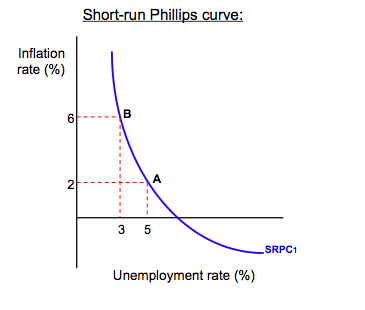

## Table of Contents

## What is inflation?

Inflation is when the prices of things we buy, like food and toys, go up over time. It means that the money we have can buy less stuff than before. Imagine if a candy bar cost $1 last year, but this year it costs $1.10. That's inflation happening.

Inflation can happen for many reasons. Sometimes, it's because there's more money around, so people can spend more, and prices go up. Other times, it's because it costs more to make things, like if the price of sugar goes up, then candy might cost more too. Governments and banks watch inflation closely because it affects everyone's life.

Even though inflation can make things more expensive, a little bit of it is normal and can be good. It can mean the economy is growing and people are buying more. But if inflation gets too high, it can be a problem because it makes it hard for people to afford what they need.

## What is unemployment?

Unemployment is when people who want to work can't find a job. It's like when you want to play a game, but no one else wants to play with you right now. It can happen for many reasons, like when businesses don't need as many workers or when the economy is not doing well. When a lot of people are unemployed, it can be tough because they don't have money to buy things they need.

Governments and economists keep an eye on unemployment because it's important for the health of the country. They try to create jobs and help people find work. Sometimes, they start big projects or give money to businesses to hire more people. When unemployment goes down, it's usually a good sign that the economy is getting better, and people feel happier because they can work and earn money.

## How are inflation and unemployment measured?

Inflation is measured by looking at the prices of a bunch of things people buy, like food, clothes, and toys. They put all these prices together into something called the Consumer Price Index (CPI). Every month, people check how much the CPI has gone up or down. If it goes up, that means inflation is happening because things are getting more expensive. The government and banks use this information to see if they need to do something to keep prices from going too high.

Unemployment is measured by counting how many people are looking for a job but can't find one. Every month, the government asks a lot of people if they have a job or if they're looking for one. If someone says they're looking but can't find a job, they're counted as unemployed. Then, they take the number of unemployed people and divide it by the total number of people who could be working. This gives them the unemployment rate, which tells them what percentage of people who want to work can't find a job.

## What is the Phillips Curve and how does it relate inflation to unemployment?

The Phillips Curve is a way to show how inflation and unemployment are connected. It was named after an economist named A.W. Phillips who noticed that when unemployment was low, inflation tended to be high, and when unemployment was high, inflation was low. Imagine a seesaw: on one side, you have unemployment, and on the other side, you have inflation. When one side goes up, the other side goes down.

This idea suggests that if the government wants to lower unemployment, it might have to accept higher inflation. For example, if the government spends more money to create jobs, people might have more money to spend, which can push prices up. But it's not always so simple. Sometimes, both inflation and unemployment can be high or low at the same time, which can make the Phillips Curve tricky to use. Still, it's a useful tool for understanding how these two big parts of the economy can affect each other.

## Can you explain the concept of stagflation?

Stagflation is when two bad things happen in the economy at the same time: high inflation and high unemployment. Normally, if inflation is high, you'd expect unemployment to be low because people are spending more money, and businesses need more workers. But with stagflation, prices go up while lots of people can't find jobs. It's like trying to play a game where the rules keep changing and getting harder.

Stagflation can be really tough for everyone because it makes things more expensive and harder to find work. It often happens when something big goes wrong, like a sudden increase in the price of oil or other important resources. Governments find it tricky to fix because the usual ways of helping the economy, like spending more money, might make inflation even worse. So, they have to be careful and think of new ways to help people and businesses during these tough times.

## How do central banks use monetary policy to influence inflation and unemployment?

Central banks use something called monetary policy to help control inflation and unemployment. They do this mainly by changing interest rates. When they want to fight inflation, they might raise interest rates. This makes borrowing money more expensive, so people and businesses spend less. When people spend less, prices don't go up as fast, which helps slow down inflation. But, higher interest rates can also make it harder for businesses to grow and hire more people, which might lead to higher unemployment.

On the other hand, if the central bank wants to lower unemployment, they might lower interest rates. This makes borrowing money cheaper, so people and businesses can spend more. When they spend more, businesses might need to hire more workers, which can help lower unemployment. But, if people spend too much, prices can go up faster, leading to higher inflation. So, central banks have to find a balance, trying to keep both inflation and unemployment under control.

Sometimes, central banks use other tools too, like buying or selling government bonds. This can also affect how much money is in the economy. If they buy bonds, they put more money into the economy, which can help lower unemployment but might increase inflation. If they sell bonds, they take money out of the economy, which can help fight inflation but might increase unemployment. It's a tricky balance, but central banks are always working to keep the economy healthy.

## What role does fiscal policy play in managing inflation and unemployment?

Fiscal policy is when the government uses its spending and taxes to help the economy. If the government wants to lower unemployment, it can spend more money on things like building roads or schools. This creates jobs and puts more money in people's pockets, which can help them spend more and keep the economy going. But, if the government spends too much, it can make prices go up faster, leading to more inflation. So, they have to be careful not to spend too much.

On the other hand, if the government wants to fight inflation, it can raise taxes or spend less money. When taxes go up, people have less money to spend, which can slow down how fast prices are rising. If the government spends less, it takes money out of the economy, which can also help keep inflation in check. But, if they do this too much, it can make it harder for people to find jobs, leading to higher unemployment. So, like with monetary policy, the government has to find a balance to keep both inflation and unemployment under control.

## How does the natural rate of unemployment affect the relationship between inflation and unemployment?

The natural rate of unemployment is like a special number that shows how many people would be out of work even if the economy was doing really well. It's not zero because there are always some people moving between jobs or looking for new ones. This rate can change over time because of things like how easy it is to find a job, how many people are looking for work, and how the government helps people find jobs. When unemployment is at this natural rate, inflation stays pretty steady because the economy is balanced.

If unemployment goes below the natural rate, it can cause inflation to go up. This happens because there are more jobs than people looking for work, so businesses have to offer higher wages to get workers. When workers get more money, they spend more, which can make prices go up faster. On the other hand, if unemployment is above the natural rate, inflation might go down because people aren't spending as much, and businesses don't have to raise prices as quickly. So, the natural rate of unemployment is important because it helps explain why inflation and unemployment move together in certain ways.

## What are the long-term versus short-term effects of inflation on unemployment?

In the short term, when inflation goes up, it can actually help lower unemployment. This happens because when prices go up, businesses might make more money and need more workers to keep up with demand. Also, if the government or central bank wants to fight inflation, they might lower interest rates, which makes it cheaper for businesses to borrow money and grow. This can lead to more jobs and lower unemployment. But, if inflation gets too high too quickly, it can cause problems because people might start expecting prices to keep going up, which can make it harder for businesses to plan and hire.

In the long term, the relationship between inflation and unemployment can be more complicated. If inflation stays high for a long time, it can make people and businesses less sure about the future. This uncertainty can make businesses less likely to invest and hire new workers, which can lead to higher unemployment. Also, if inflation is too high, the central bank might raise interest rates to try to slow it down, which can make borrowing more expensive and slow down the economy. So, while a little bit of inflation might help in the short term, too much inflation over a long time can hurt the economy and lead to more unemployment.

## How do expectations of inflation influence the unemployment rate?

When people expect inflation to go up, it can change how they act and affect the unemployment rate. If everyone thinks prices will keep going up, workers might ask for higher wages to keep up with the rising costs. Businesses might then have to raise prices even more to pay for these higher wages, which can make inflation worse. But if businesses see that costs are going up a lot, they might be less willing to hire new workers because they're not sure if they can keep making enough money. This can lead to higher unemployment as businesses hold back on hiring.

In the long run, if people keep expecting high inflation, it can make the economy less stable. When people and businesses are unsure about what prices will do, they might spend less and invest less. This uncertainty can slow down the economy and make it harder for people to find jobs. So, if everyone expects inflation to stay high, it can make unemployment worse over time because businesses become more cautious about growing and hiring new workers.

## What are the criticisms of the Phillips Curve in explaining the relationship between inflation and unemployment?

Some people think the Phillips Curve doesn't always work well to explain how inflation and unemployment are connected. One big problem is that it doesn't always show what happens in the real world. For example, sometimes both inflation and unemployment can be high at the same time, like during stagflation. The Phillips Curve says this shouldn't happen because when unemployment is high, inflation should be low. But in the 1970s, many countries saw high inflation and high unemployment together, which made people question if the Phillips Curve was really useful.

Another criticism is that the Phillips Curve can change over time. People's expectations about inflation can affect how the curve works. If everyone expects prices to go up a lot, they might act differently, like asking for higher wages or spending less. This can make the relationship between inflation and unemployment more complicated than the Phillips Curve suggests. So, while the Phillips Curve can be a helpful way to think about these things, it's not perfect and doesn't always explain what's happening in the economy.

## How have recent economic theories and empirical studies evolved the understanding of the inflation-unemployment relationship?

Recent economic theories and studies have shown that the relationship between inflation and unemployment is more complex than what the Phillips Curve suggests. One big change is the idea of the Non-Accelerating Inflation Rate of Unemployment (NAIRU), which is like an updated version of the natural rate of unemployment. NAIRU says there's a certain level of unemployment where inflation stays steady. If unemployment goes below this level, inflation might start to go up faster. But finding out what this level is can be tricky because it changes over time and depends on lots of things, like how the economy is doing and what people expect about the future.

Empirical studies have also looked at how expectations about inflation can change the relationship between inflation and unemployment. If people expect prices to go up a lot, they might act differently, like asking for higher wages or saving more money instead of spending. This can make it harder for the Phillips Curve to predict what will happen because people's actions can affect both inflation and unemployment in ways that the old model didn't think about. So, economists now know that they need to think about more than just the simple trade-off between inflation and unemployment when trying to understand how the economy works.

## What is the economic relationship between unemployment and inflation?

Economists have long debated the interplay between unemployment and inflation, with a significant portion of the discourse centered on the Phillips Curve. This curve posits an inverse relationship between unemployment and inflation, suggesting that low unemployment rates are often accompanied by higher inflation, while high unemployment typically coincides with lower inflation. The traditional Phillips Curve model is expressed as follows:

$$
\pi_t = \pi_{t-1} - \beta(u_t - u^*) + \varepsilon_t
$$

where:
- $\pi_t$ is the inflation rate at time $t$,
- $\pi_{t-1}$ is the past inflation rate,
- $\beta$ is a positive coefficient,
- $u_t$ is the unemployment rate at time $t$,
- $u^*$ is the natural rate of unemployment,
- $\varepsilon_t$ is an error term.

Despite its foundational presence in economic theory since the 1950s, the Phillips Curve's applicability has been challenged over time, especially with shifts in macroeconomic conditions. Several periods, notably the stagflation of the 1970s, demonstrated scenarios where high inflation and high unemployment occurred simultaneously, defying the classic Phillips Curve.

Modern interpretations suggest that the relationship between unemployment and inflation is influenced by additional factors such as globalization and technological advancement. Globalization has introduced competitive pressures that can keep inflation low, even in scenarios of low unemployment. This has been observed as global trade and labor markets have expanded, enabling economies to outsource production and tap into cheaper labor resources, thereby moderating wage pressures domestically.

Technological advancements also play a critical role. Automation and digitalization have increased productivity and reduced costs, which can dampen inflationary pressures even when unemployment is low. These innovations have shifted the labor market dynamics, as technologies often require different skill sets, potentially leading to structural unemployment while maintaining control over inflation levels.

Additionally, central bank policies have evolved, focusing on inflation targeting and managing expectations, which further complicates the simplistic interpretation of the Phillips Curve. Monetary authorities, equipped with tools like [interest rate](/wiki/interest-rate-trading-strategies) adjustments and quantitative easing, can influence inflation separately from the employment landscape.

In summary, while the Phillips Curve provides a foundational framework for understanding the relationship between unemployment and inflation, economic realities necessitate a more nuanced approach. Modern economic conditions, framed by globalization and technological change, require an understanding that transcends the traditional linear interpretations of this relationship.

## References & Further Reading

[1]: Samuelson, P. A., & Solow, R. M. (1960). ["Analytical Aspects of Anti-Inflation Policy."](https://www.jstor.org/stable/1815021) The American Economic Review, 50(2), 177-194.

[2]: Friedman, M. (1968). ["The Role of Monetary Policy."](https://www.aeaweb.org/aer/top20/58.1.1-17.pdf) The American Economic Review, 58(1), 1-17.

[3]: ["Advances in Financial Machine Learning"](https://www.amazon.com/Advances-Financial-Machine-Learning-Marcos/dp/1119482089) by Marcos Lopez de Prado

[4]: Blanchard, O. J., & Katz, L. F. (1997). ["What We Know and Do Not Know About the Natural Rate of Unemployment."](https://www.aeaweb.org/articles?id=10.1257/jep.11.1.51) Journal of Economic Perspectives, 11(1), 51-72.

[5]: Brynjolfsson, E., & McAfee, A. (2014). ["The Second Machine Age: Work, Progress, and Prosperity in a Time of Brilliant Technologies."](https://psycnet.apa.org/record/2014-07087-000) W.W. Norton & Company.

[6]: ["Quantitative Trading: How to Build Your Own Algorithmic Trading Business"](https://www.amazon.com/Quantitative-Trading-Build-Algorithmic-Business/dp/0470284889) by Ernest P. Chan

[7]: Phillips, A. W. (1958). ["The Relation between Unemployment and the Rate of Change of Money Wage Rates in the United Kingdom, 1861–1957."](https://onlinelibrary.wiley.com/doi/full/10.1111/j.1468-0335.1958.tb00003.x) Economica, 25(100), 283-299.

[8]: ["Machine Learning for Algorithmic Trading"](https://github.com/PacktPublishing/Machine-Learning-for-Algorithmic-Trading-Second-Edition) by Stefan Jansen