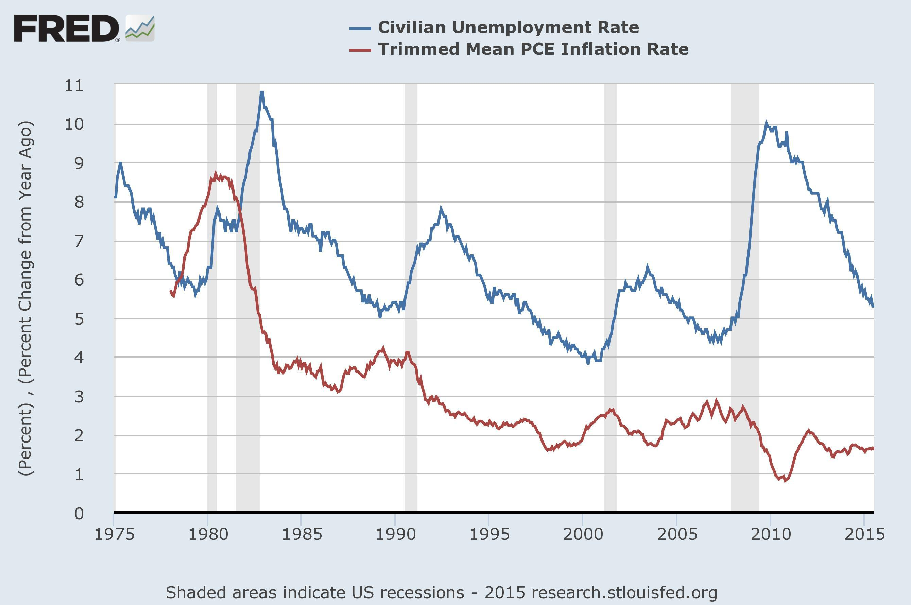

Understanding the relationship between unemployment and inflation has been a seminal focus in economic theory and policy-making for decades. These two critical economic indicators often shape the contours of economic stability and growth by influencing aggregate demand, monetary policy, and input costs within an economy. The traditional Phillips Curve posits an inverse relationship between unemployment and inflation, suggesting that low unemployment can lead to higher inflation and vice versa. However, the empirical robustness of this model has been debated, with modern economic dynamics such as globalization and technological advances introducing complexities that challenge the classical interpretation.

Amidst this evolving economic landscape, algorithmic trading has become an increasingly potent force in financial markets, affecting how economic indicators like unemployment and inflation are perceived and acted upon. Algorithmic trading utilizes complex computer programs to execute trades at high speed and volume, often based on sophisticated models that process economic data. This approach allows for rapid reactions to changes in economic indicators, potentially affecting liquidity and volatility within financial markets.



This article examines the intricate relationship between unemployment, inflation, and algorithmic trading strategies, scrutinizing traditional economic theories, current market trends, and the evolving impact on trading algorithms. By integrating perspectives from economic theory with the practical realities of financial markets, we aim to illuminate how these dynamics interact and influence each other in contemporary financial environments.

## Table of Contents

## The Economic Relationship Between Unemployment and Inflation

Economists have long debated the interplay between unemployment and inflation, with a significant portion of the discourse centered on the Phillips Curve. This curve posits an inverse relationship between unemployment and inflation, suggesting that low unemployment rates are often accompanied by higher inflation, while high unemployment typically coincides with lower inflation. The traditional Phillips Curve model is expressed as follows:

$$
\pi_t = \pi_{t-1} - \beta(u_t - u^*) + \varepsilon_t
$$

where:
- $\pi_t$ is the inflation rate at time $t$,
- $\pi_{t-1}$ is the past inflation rate,
- $\beta$ is a positive coefficient,
- $u_t$ is the unemployment rate at time $t$,
- $u^*$ is the natural rate of unemployment,
- $\varepsilon_t$ is an error term.

Despite its foundational presence in economic theory since the 1950s, the Phillips Curve's applicability has been challenged over time, especially with shifts in macroeconomic conditions. Several periods, notably the stagflation of the 1970s, demonstrated scenarios where high inflation and high unemployment occurred simultaneously, defying the classic Phillips Curve.

Modern interpretations suggest that the relationship between unemployment and inflation is influenced by additional factors such as globalization and technological advancement. Globalization has introduced competitive pressures that can keep inflation low, even in scenarios of low unemployment. This has been observed as global trade and labor markets have expanded, enabling economies to outsource production and tap into cheaper labor resources, thereby moderating wage pressures domestically.

Technological advancements also play a critical role. Automation and digitalization have increased productivity and reduced costs, which can dampen inflationary pressures even when unemployment is low. These innovations have shifted the labor market dynamics, as technologies often require different skill sets, potentially leading to structural unemployment while maintaining control over inflation levels.

Additionally, central bank policies have evolved, focusing on inflation targeting and managing expectations, which further complicates the simplistic interpretation of the Phillips Curve. Monetary authorities, equipped with tools like [interest rate](/wiki/interest-rate-trading-strategies) adjustments and quantitative easing, can influence inflation separately from the employment landscape.

In summary, while the Phillips Curve provides a foundational framework for understanding the relationship between unemployment and inflation, economic realities necessitate a more nuanced approach. Modern economic conditions, framed by globalization and technological change, require an understanding that transcends the traditional linear interpretations of this relationship.

## Understanding Algorithmic Trading

Algorithmic trading is a sophisticated trading strategy that employs computer programs to execute a large number of trades at minimal intervals and high volumes. This modern approach relies heavily on mathematical models and statistical analyses to determine the optimal timing and pricing of trades. These pre-set rules are designed to identify trading opportunities that may be difficult for human traders to spot, allowing for rapid execution in financial markets.

Economic indicators, market trends, and historical data are foundational elements in developing these trading algorithms. Programmers and quantitative analysts design algorithms that can assess vast amounts of data almost instantaneously. A crucial aspect of [algorithmic trading](/wiki/algorithmic-trading) is its ability to react to economic data releases much faster than human traders. For instance, when unemployment figures or inflation rates are announced, these algorithms can adjust their strategies accordingly, buying or selling assets in response to shifts in expected market conditions.

This accelerated response time has led to significant changes in the dynamics of financial markets. Algorithmic trading has increased market [liquidity](/wiki/liquidity-risk-premium), as these systems often provide continuous buy and sell orders, narrowing the bid-ask spread. However, it has also contributed to increased market [volatility](/wiki/volatility-trading-strategies). Rapid-fire transactions based on short-lived data can lead to swift market actions that may exacerbate price fluctuations.

Understanding the mechanics of algorithmic trading is crucial for integrating economic indicators such as unemployment and inflation into these strategies. The algorithms typically employ a variety of statistical and [machine learning](/wiki/machine-learning) models to predict price movements and generate trade signals. Simple moving average crossovers, [momentum](/wiki/momentum) indicators, and mean reversion strategies are common examples of the types of models used.

Consider a basic Python implementation to illustrate a simple algorithmic trading strategy: a moving average crossover strategy.

```python
import pandas as pd
import numpy as np

# Example: Moving Average Crossover Strategy
# Fetch historical data of a financial instrument
data = pd.read_csv('historical_data.csv')  # Assume 'historical_data.csv' contains 'Date', 'Close' columns
data['Date'] = pd.to_datetime(data['Date'])
data.set_index('Date', inplace=True)

# Calculate short and long-term moving averages
short_window = 40
long_window = 100

data['Short_MA'] = data['Close'].rolling(window=short_window, min_periods=1).mean()
data['Long_MA'] = data['Close'].rolling(window=long_window, min_periods=1).mean()

# Signal Generation: Buy = 1, Sell = -1
data['Signal'] = 0
data['Signal'][short_window:] = np.where(data['Short_MA'][short_window:] > data['Long_MA'][short_window:], 1, -1)

# Example signals visualization
import matplotlib.pyplot as plt

plt.figure(figsize=(14, 7))
plt.plot(data['Close'], label='Close Price')
plt.plot(data['Short_MA'], label=f'Short MA ({short_window} days)', color='blue')
plt.plot(data['Long_MA'], label=f'Long MA ({long_window} days)', color='red')
plt.plot(data[data['Signal'] == 1].index, data['Short_MA'][data['Signal'] == 1], '^', markersize=10, color='g', label='Buy Signal')
plt.plot(data[data['Signal'] == -1].index, data['Short_MA'][data['Signal'] == -1], 'v', markersize=10, color='r', label='Sell Signal')
plt.title('Moving Average Crossover Strategy')
plt.legend()
plt.show()
```

This example highlights how algorithmic trading can systematically apply predefined rules to evaluate market conditions and execute trades. Such strategies emphasize the importance of historical data analysis, real-time processing, and robust computational capabilities. As algorithmic trading evolves, it continues to reshape financial markets, driving both opportunities and challenges in the integration of economic indicators into trading strategies.

## Impact of Unemployment and Inflation on Financial Markets

Economic indicators such as unemployment and inflation have profound impacts on the stock and bond markets, influencing investors' perceptions of economic health and driving market fluctuations. Understanding these impacts is crucial for both traditional and algorithmic trading strategies.

When inflation rates rise, central banks typically respond by increasing interest rates to control price levels. This action generally leads to a decline in bond prices due to the inverse relationship between bond prices and interest rates. For instance, as yields on newly issued bonds increase, the older bonds with lower yields become less attractive, causing their market prices to drop. This presents a challenging landscape for investors holding long-term bonds, prompting many to adjust their portfolios in response to changing interest rates.

Unemployment rates, on the other hand, affect consumer confidence and spending. High unemployment often signals economic distress, which can lead to decreased consumer spending. This reduction in spending can dampen corporate revenues and profitability, particularly for consumer-focused companies. In the stock market, this can lead to lower stock prices as investors anticipate weaker corporate earnings.

Algorithmic trading strategies leverage these economic fluctuations to identify opportunities and mitigate risks. For example, an algorithm might be programmed to buy bonds when unemployment data signals a potential economic slowdown, anticipating lower interest rates in the future. Similarly, inflation metrics can trigger algorithms to adjust equity positions based on expected shifts in consumer spending and corporate profitability.

The adaptability of algo trading is critical; such systems can process vast amounts of economic data in real-time, offering a competitive edge in reacting to announcements on unemployment or inflation. However, the rapid market movements that often follow significant economic releases can also pose risks, necessitating sophisticated risk management protocols within these systems. 

Thus, the interplay between unemployment, inflation, and financial markets presents both challenges and opportunities for investors, particularly those utilizing algorithmic strategies to capitalize on shifting economic landscapes.

## Incorporating Economic Indicators into Algorithmic Trading Strategies

Successful trading algorithms incorporate macroeconomic indicators such as unemployment and inflation to enhance their predictive capabilities and efficiency. These indicators offer crucial insights into the economic environment, influencing financial market movements and providing traders with opportunities to optimize their strategies.

Traders can develop sophisticated models to predict market movements by leveraging economic data. For example, the relationship between unemployment and inflation can be incorporated into models by using historical data to identify patterns and trends. The use of statistical models, such as regression analysis, can help quantify these relationships. One common approach is to use the Phillips Curve, which suggests an inverse relationship between unemployment and inflation. By understanding how changes in these indicators affect market behavior, traders can build models that anticipate futures prices or stock movements.

Robust data analysis and real-time processing capabilities are essential for algorithmic trading strategies based on economic indicators. Advances in technology, including high-performance computing and cloud-based solutions, enable the processing of large datasets at high speeds. The ability to analyze data in real-time is crucial, as market conditions can change rapidly following economic data releases. For example, Python libraries like Pandas and NumPy can be used to manipulate and analyze datasets efficiently. Real-time data feeds from economic news agencies also support quick adjustments to trading algorithms based on newly released unemployment or inflation figures.

Effective strategies must account for both short-term market reactions to economic data releases and long-term economic trends. Short-term reactions, such as market volatility following an unexpected unemployment report, can be capitalized upon by utilizing high-frequency trading algorithms. Meanwhile, long-term trends, like a gradual increase in inflation, may inform strategic asset allocation and risk management decisions. For instance, a gradual increase in inflation could lead to expectations of rising interest rates, impacting bond markets.

Testing these models against historical data is critical for fine-tuning trading algorithms. Backtesting involves running the algorithm with past data to evaluate its performance, which helps in identifying potential flaws and ensuring the model's robustness. It is crucial to use a diverse range of historical data that captures different economic cycles to mitigate the risk of overfitting the model to a specific period. This process can be done using various platforms and software, such as Python's [backtrader](/wiki/backtrader) library, which allows traders to simulate trading strategies and measure performance metrics.

In summary, the integration of macroeconomic indicators like unemployment and inflation into algorithmic trading strategies requires careful model construction, data analysis, and testing. By leveraging these elements, traders can improve their market predictions, enhance strategy effectiveness, and mitigate potential risks.

## Challenges and Risks

Incorporating economic indicators such as unemployment and inflation into algorithmic trading strategies presents numerous challenges and risks that traders must strategically navigate to maintain effective systems. One significant challenge is the potential for data inaccuracies. Economic data, often subject to revisions and inaccuracies, can lead to erroneous decisions if algorithms are trained or executed on faulty inputs. This necessitates robust data validation processes and error-checking mechanisms to minimize such risks.

Unforeseen market events pose another challenge, introducing volatility that existing algorithms might not be equipped to handle. Events like geopolitical developments or sudden economic policy changes can cause abrupt market shifts, highlighting the need for adaptive algorithms capable of responding to such unexpected occurrences. Additionally, model overfitting is a critical risk when integrating economic indicators. Overfitting occurs when a model is excessively complex and captures noise rather than the underlying trend, leading to poor performance on new, unseen data. Traders need to employ strategies such as regularization and cross-validation to combat overfitting.

The non-linear and dynamic nature of financial markets renders economic predictions inherently unreliable. Economic indicators do not always have a straightforward or consistent effect on asset prices, and the interactions between various indicators can be complex. This complexity requires models that can accommodate non-linear relationships and adapt to changing market conditions. Quantitative methods such as machine learning can be employed, but they demand extensive historical data and computational power for effective deployment.

Regulatory changes represent an additional challenge. The financial industry is heavily regulated, and new regulations can swiftly alter market dynamics or deem certain trading practices infeasible. Traders must stay informed about regulatory developments and their potential impacts on algorithmic strategies. This requires continuous monitoring and updating of algorithms to ensure compliance and efficiency.

Finally, balancing automation with human oversight is crucial. While algorithmic trading carries the advantage of executing trades at high speed and [volume](/wiki/volume-trading-strategy), it is vital to incorporate human judgment to oversee algorithmic operations and intervene when necessary. This balance helps mitigate errors due to unforeseen algorithmic behavior and can prevent significant financial losses. Traders should maintain a hybrid approach, allowing for automated decision-making complemented by human analysis and supervision to navigate the complexities and uncertainties inherent in financial markets effectively.

## Future Trends

The future of algorithmic trading is becoming increasingly intertwined with economic analysis, offering new avenues for enhancing trading strategies. A pivotal development in this field is the advancement of AI and machine learning technologies. These tools are revolutionizing the understanding of complex economic relationships by identifying patterns and trends that were previously difficult to discern. Machine learning algorithms, particularly those using [deep learning](/wiki/deep-learning) techniques, allow for the processing of vast amounts of data to model economic dynamics accurately.

Real-time data processing is playing a crucial role in enhancing the adaptability of trading algorithms. By utilizing technologies capable of ingesting and analyzing data as soon as it becomes available, trading systems can respond almost instantaneously to market changes. This capability is indispensable in markets affected by rapid economic fluctuations driven by unemployment and inflation trends. Real-time data streams combined with predictive analytics empower traders to make informed decisions with reduced latency, thereby improving the effectiveness of algorithmic strategies.

Economic volatility associated with shifts in unemployment and inflation presents both significant opportunities and challenges for algorithmic traders. High volatility can lead to increased market activity, offering opportunities for algorithms optimized for such conditions to capitalize on rapid price movements. However, it also introduces risk, necessitating robust risk management frameworks within algorithmic models to mitigate potential losses.

Continued research and technological innovation will significantly shape future strategies for algo traders. Advances in natural language processing (NLP) are enabling algorithms to better interpret and respond to qualitative data from financial news and social media, further enriching the informational landscape available to traders. Moreover, as quantum computing progresses, it promises to further accelerate complex computations, potentially leading to more sophisticated models capable of deeper analysis of economic indicators.

In summary, the future of algorithmic trading is poised for substantial transformation as AI, machine learning, and real-time data technologies evolve. Economic indicators like unemployment and inflation will continue to play a crucial role in shaping trading strategies, requiring traders to remain vigilant and adaptive in a rapidly changing landscape.

## Conclusion

The relationship between unemployment, inflation, and algorithmic trading highlights the interconnectedness and complexity of modern economic systems. By effectively integrating economic indicators such as unemployment rates and inflation levels into algorithmic trading strategies, traders can enhance their market responsiveness, enabling more informed decision-making processes. This integration potentially leads to more stable and profitable trading outcomes.

Despite the inherent challenges, such as data inaccuracy and model overfitting, technological advancements in [artificial intelligence](/wiki/ai-artificial-intelligence) and machine learning offer promising new tools for effective trading strategies. These technologies facilitate the development of algorithms capable of real-time data processing and predictive analytics, thereby improving the adaptability of trading systems amidst fluctuating economic conditions.

A critical component for success in algorithmic trading involves maintaining an up-to-date understanding of economic trends. Being informed about shifts in unemployment and inflation dynamics allows traders to anticipate market movements and adjust their strategies accordingly. This proactive approach minimizes risks and maximizes potential gains.

As these fields continue to evolve, the interplay between economic indicators and trading algorithms promises sustained growth and adaptation within financial markets. Ongoing research and technological innovation will likely produce new methodologies and tools, further refining the interaction between macroeconomic factors and algorithmic trading strategies. Consequently, participants in financial markets can expect a future where increased efficiency and insight are achieved through the continual alignment of economic theory with algorithmic practice.

## References & Further Reading

[1]: Samuelson, P. A., & Solow, R. M. (1960). ["Analytical Aspects of Anti-Inflation Policy."](https://www.jstor.org/stable/1815021) The American Economic Review, 50(2), 177-194.

[2]: Friedman, M. (1968). ["The Role of Monetary Policy."](https://www.aeaweb.org/aer/top20/58.1.1-17.pdf) The American Economic Review, 58(1), 1-17.

[3]: ["Advances in Financial Machine Learning"](https://www.amazon.com/Advances-Financial-Machine-Learning-Marcos/dp/1119482089) by Marcos Lopez de Prado

[4]: Blanchard, O. J., & Katz, L. F. (1997). ["What We Know and Do Not Know About the Natural Rate of Unemployment."](https://www.aeaweb.org/articles?id=10.1257/jep.11.1.51) Journal of Economic Perspectives, 11(1), 51-72.

[5]: Brynjolfsson, E., & McAfee, A. (2014). ["The Second Machine Age: Work, Progress, and Prosperity in a Time of Brilliant Technologies."](https://psycnet.apa.org/record/2014-07087-000) W.W. Norton & Company.

[6]: ["Quantitative Trading: How to Build Your Own Algorithmic Trading Business"](https://www.amazon.com/Quantitative-Trading-Build-Algorithmic-Business/dp/0470284889) by Ernest P. Chan

[7]: Phillips, A. W. (1958). ["The Relation between Unemployment and the Rate of Change of Money Wage Rates in the United Kingdom, 1861–1957."](https://onlinelibrary.wiley.com/doi/full/10.1111/j.1468-0335.1958.tb00003.x) Economica, 25(100), 283-299.

[8]: ["Machine Learning for Algorithmic Trading"](https://github.com/PacktPublishing/Machine-Learning-for-Algorithmic-Trading-Second-Edition) by Stefan Jansen