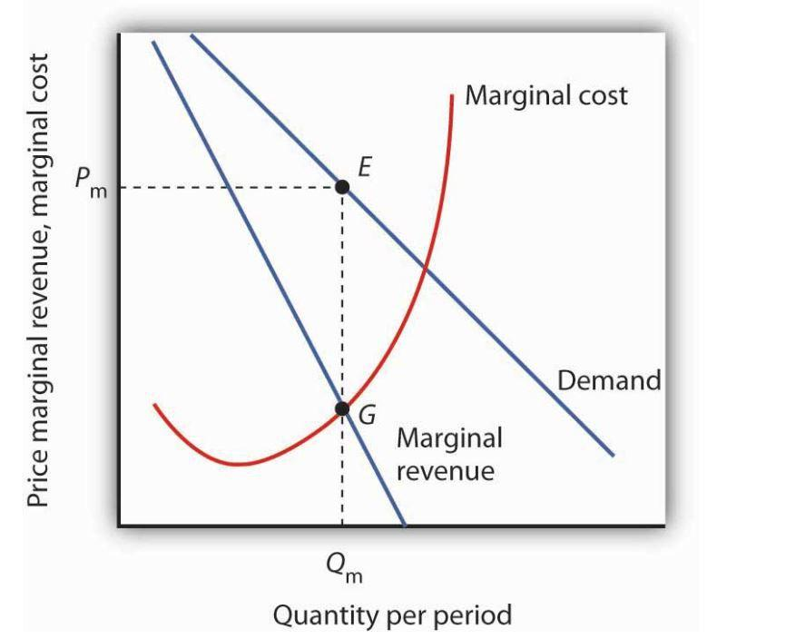

In the ever-evolving landscape of modern finance and economics, staying ahead means grasping complex concepts that influence market behavior. Among these concepts, the intricacies of marginal revenue and total revenue hold substantial importance for businesses aiming to maximize profitability. Marginal revenue refers to the additional income obtained from the sale of one more unit of a product or service. This metric is essential for determining optimal pricing and production levels, allowing businesses to make informed decisions that align with profit maximization goals. On the other hand, total revenue is the total income generated from all units sold and serves as a fundamental measure of market performance and business growth.

Simultaneously, the rise of algorithmic trading (algo trading) has ushered in a new era of efficiency and complexity in trading practices. Utilizing advanced algorithms, these trading strategies operate at high speeds, executing trades based on predefined criteria. Algo trading leverages minimal market inefficiencies, providing traders with opportunities for profit that are often inaccessible through traditional trading methodologies.



This article aims to explore the foundational economic concepts of marginal revenue and total revenue while bridging their relevance in the context of algorithmic trading. By understanding the dynamics of these concepts, traders and businesses can develop more effective strategies to optimize trade outcomes and profitability. Algorithmic trading's reliance on precise calculations and predictive models can be enhanced by integrating these economic principles, offering a robust framework for strategic decision-making.

Whether you're a seasoned trader, a business owner, or an economics student, understanding these elements can provide valuable insights into strategic decision-making. As the interface between economic theory and modern trading practices continues to evolve, a comprehensive grasp of these concepts becomes crucial in navigating the complexities of today's financial markets.

## Table of Contents

## Understanding Marginal Revenue

Marginal revenue is a critical economic concept defined as the additional income generated from the sale of one more unit of a product. It serves as a fundamental tool for businesses in establishing effective production levels and pricing strategies. Understanding marginal revenue is essential for firms aiming to determine the output level at which profits are maximized.

The mathematical representation of marginal revenue can be expressed as the derivative of total revenue (TR) with respect to quantity (Q), or:

$$
MR = \frac{dTR}{dQ}
$$

Where MR stands for marginal revenue, TR denotes total revenue, and Q represents the quantity of goods sold.

A key [factor](/wiki/factor-investing) in marginal revenue calculation is its relationship with price elasticity of demand. Price elasticity measures how the quantity demanded of a product responds to changes in price. When demand is elastic, a price decrease can lead to an increase in total revenue as consumers buy more of the product. Conversely, if demand is inelastic, a price reduction might decrease total revenue as the increase in quantity demanded may not compensate for the lower price.

For instance, let's consider a company selling widgets. Suppose the price of a widget is $10, and the marginal cost of producing one additional widget is constant at $6. If the elasticity of demand indicates that a slightly reduced price will significantly boost sales, the company might adjust its price to increase marginal revenue. However, if the demand is inelastic, maintaining or raising the price could be more beneficial for maximization of revenue.

Practical application of marginal revenue is observed in various business scenarios, such as:

1. A tech company launching a new gadget analyses the potential marginal revenue to set a competitive price point that maximizes both sales volume and profitability.
2. A local bakery uses marginal revenue analysis to decide how many additional cupcakes to bake each day, ensuring production aligns with consumer demand patterns.
3. A car manufacturer evaluates changes in marginal revenue to determine the feasibility of adding new features to enhance its vehicle lineup without excessively increasing costs.

In real-world applications, businesses often utilize software to compute and analyze marginal revenue, facilitating data-driven decision-making. Here's a simple Python code snippet that calculates marginal revenue for a given set of quantities and prices:

```python
def calculate_marginal_revenue(prices, quantities):
    marginal_revenue = []
    for i in range(1, len(prices)):
        delta_tr = (prices[i] * quantities[i]) - (prices[i-1] * quantities[i-1])
        delta_q = quantities[i] - quantities[i-1]
        marginal_revenue.append(delta_tr / delta_q if delta_q != 0 else 0) # Avoid division by zero
    return marginal_revenue

prices = [100, 95, 90]
quantities = [10, 15, 20]

mr = calculate_marginal_revenue(prices, quantities)
print("Marginal Revenue:", mr)
```

In summary, understanding marginal revenue is crucial in making informed decisions about production and pricing. By carefully analyzing how marginal revenue interacts with price elasticity of demand, businesses can optimize their outputs and enhance profitability.

## Exploring Total Revenue

Total revenue, often abbreviated as TR, is the total income a business generates from selling its goods or services. It is calculated by multiplying the price per unit by the quantity of units sold, expressed as $TR = P \times Q$, where $P$ is the price and $Q$ is the quantity. As a key performance indicator, total revenue provides insights into a company's ability to generate sales and serves as a foundational measure for assessing financial health and potential growth.

Understanding total revenue is crucial when comparing it to other financial indicators such as total cost and profit margin. Total cost encompasses all expenses incurred in producing goods or services, including fixed and variable costs. The difference between total revenue and total cost results in either profit or loss, making it essential for businesses to monitor these metrics closely. Profit margin, expressed as a percentage, is calculated by dividing net profit by total revenue and reflects the efficiency of a company in generating profit from sales.

Shifts in total revenue trends can indicate changes in market demand and competitive positioning. For instance, a consistent increase in total revenue might suggest strong market demand or successful market penetration strategies, whereas a decline could signal competitive threats or reduced consumer interest. Businesses must be vigilant in analyzing these trends to remain competitive and adapt strategies accordingly. Timely responses to total revenue changes might include adjusting pricing strategies, optimizing marketing efforts, or expanding product offerings to capture greater market share.

Case studies provide valuable insights into how businesses respond to fluctuating total revenue. For example, consider a tech company that experiences a significant drop in total revenue due to increased competition and market saturation. In response, the company may diversify its product line, invest in innovation to enhance product features, or implement targeted marketing campaigns to regain consumer attention and stimulate sales growth. Conversely, a retail chain experiencing rising total revenue may choose to expand geographically or invest in supply chain improvements to sustain and leverage its upward trajectory.

In conclusion, total revenue is more than just a measure of sales performance; it is a vital tool for evaluating a company's market stance and future growth potential. By understanding and analyzing total revenue, alongside other financial indicators, businesses can make informed decisions to optimize performance and navigate shifting market dynamics effectively.

## The Synergy Between Economic Concepts and Algo Trading

In the fast-paced world of trading, leveraging economic concepts is vital for developing efficient [algorithmic trading](/wiki/algorithmic-trading) strategies. Algorithmic trading, commonly known as algo trading, employs automated, pre-set rules to execute trades. By utilizing even the slightest market inefficiencies, algo trading becomes an essential tool for optimizing trading operations and enhancing profitability.

Understanding marginal and total revenue is crucial in informing these algorithms. Marginal revenue, the additional revenue from selling one more unit of a good, aids in determining the optimal production and pricing strategies. This understanding can be translated into algorithms that adjust trading strategies based on the potential revenue impact. For instance, if a trader can ascertain that an additional trade will contribute positively to the marginal revenue, an algorithm can be fine-tuned to capitalize on this insight, thereby increasing overall profitability.

Similarly, total revenue, which represents the aggregate income from all units sold, serves as a key indicator of market performance. Algorithms can utilize this metric to assess the financial health of traded assets and make informed decisions on entry and [exit](/wiki/exit-strategy) points. By monitoring total revenue trends, traders can anticipate shifts in market demand and adjust their strategies through algorithmic simulations, thereby optimizing trade outcomes.

Economic indicators and models play a significant role in refining algorithmic trading rules and decision trees. By incorporating variables such as market [volatility](/wiki/volatility-trading-strategies), interest rates, and economic forecasts into their algorithms, traders can enhance their strategies to respond effectively to real-time market conditions. For example, a decision tree can be constructed to evaluate different market scenarios based on these indicators, allowing traders to automate responses to various economic situations.

Python is a preferred language for implementing these simulations due to its versatility and the availability of libraries such as NumPy and pandas for quantitative analysis. A simple Python script can illustrate how economic concepts can be integrated into an algorithmic trading strategy:

```python
import numpy as np
import pandas as pd

# Sample market data
market_data = pd.DataFrame({
    'price': [100, 101, 102, 101, 99],
    'volume': [200, 220, 250, 230, 210]
})

# Calculate total revenue
market_data['total_revenue'] = market_data['price'] * market_data['volume']

# Calculate marginal revenue
market_data['marginal_revenue'] = market_data['total_revenue'].diff().fillna(0)

# Algorithmic trading decision based on marginal revenue
market_data['trade_signal'] = market_data['marginal_revenue'].apply(lambda x: 'Buy' if x > 0 else 'Sell')

print(market_data[['price', 'total_revenue', 'marginal_revenue', 'trade_signal']])
```

This script demonstrates the integration of marginal and total revenue into a simple algorithmic model. Here, each price change's impact on total and marginal revenue is computed, and a trading signal is generated based on the marginal revenue trend. Through such simulations, traders can anticipate the outcome of their strategies and make adjustments to maximize efficacy. As algorithmic trading evolves, continuously integrating economic principles will be vital in adapting to changing market conditions and achieving strategic financial goals.

## The Impact of Algorithmic Trading on Market Dynamics

Algorithmic trading, often referred to as algo trading, has transformed the landscape of financial markets through its capabilities of high-speed data processing, precision in execution, and overall efficiency. However, while it introduces substantial benefits, it also exerts unique influences on market dynamics, notably in terms of price volatility and [liquidity](/wiki/liquidity-risk-premium).

### High-Frequency Trading and Market Volatility

High-frequency trading ([HFT](/wiki/high-frequency-trading-strategies)), a subset of algorithmic trading, has garnered significant attention due to its ability to execute multitude trades in fractions of a second. This speed enables traders to capitalize on tiny price discrepancies that might exist for only milliseconds. While this ability can result in tighter bid-ask spreads and, consequently, more efficient markets, it can also contribute to increased price volatility. Microsecond-level market operations may amplify pricing errors and lead to rapid fluctuations, which are characteristic of high-volatility scenarios. For example, during events known as "flash crashes," markets can experience severe price movements within short periods, causing systemic instability. Researchers like Kirilenko et al. (2017) have investigated these phenomena, highlighting how automation can both stabilize and destabilize financial markets simultaneously.

### Liquidity Impacts

Liquidity, the ease with which an asset can be bought or sold without affecting its price, is another critical factor influenced by algo trading. On one hand, algorithmic trading can provide liquidity to the markets by engaging in a large number of trades. However, during periods of market stress or uncertainty, these algorithms might withdraw from the market, exacerbating liquidity shortages and leading to heightened volatility.

### Ethical and Regulatory Considerations

The rapid proliferation of algorithmic trading has raised numerous ethical and regulatory challenges. The potential for market manipulation, as algorithms might exploit small, advantageous trading positions, has prompted regulators globally to implement stringent trading rules. For instance, the European Union's Markets in Financial Instruments Directive (MiFID II) and the U.S. Securities and Exchange Commission (SEC) have imposed regulations aimed at increasing transparency and reducing the risks associated with algorithmic trading.

Moreover, there is an ongoing debate about the fairness of HFT practices and their impact on traditional investors. Critics argue that the technological edge held by large institutions disadvantages smaller investors, prompting discussions about market accessibility and equality.

### Risk Management: Mitigating Flash Crashes

To mitigate the risks of flash crashes and other rapid market disruptions, traders and exchanges have implemented various risk management strategies. These include circuit breakers, which halt trading for specific time periods when prices fall too quickly, and kill switches, which allow traders to disable algorithms swiftly if they deviate from expected behavior.

### Emerging Trends

The future of algorithmic trading is likely to be shaped by advances in technology such as [machine learning](/wiki/machine-learning) and [artificial intelligence](/wiki/ai-artificial-intelligence), enabling even more sophisticated trading strategies. Understanding economic principles remains crucial as these technologies evolve, ensuring that traders can adapt algorithms to shift market conditions effectively. Furthermore, emerging trends emphasize the integration of [alternative data](/wiki/best-alternative-data) sources, such as social media sentiment analysis and real-time news, into trading algorithms, thus refining their predictive capabilities.

In conclusion, while algorithmic trading presents several advantages, its impact on market dynamics requires careful oversight and a deep understanding of economic fundamentals. Successfully navigating these complexities involves balancing innovation with prudence, fostering a trading environment that benefits all market participants.

## Conclusion

Navigating the complexities of modern economics and trading requires a solid understanding of both marginal and total revenue. These concepts enable traders to make informed decisions that optimize profitability and efficiency. Marginal revenue, which measures the additional income from selling one more unit, is crucial in determining the optimal level of production and pricing strategies. Meanwhile, total revenue provides an overarching view of a company's financial performance and market engagement.

Integrating these economic principles with algorithmic trading strategies offers traders an edge in a competitive market. Algorithmic trading facilitates executing trades with speed and precision, leveraging the smallest market inefficiencies for maximum gain. By aligning algorithms with economic indicators like marginal and total revenue, traders can refine their strategies to respond effectively to market shifts.

The integration of these fields, however, is not without its challenges. The rapid development of technology continually redefines the methods used in trading and market analysis. Balancing the benefits of algorithmic trading with its potential risks, such as increased market volatility and ethical concerns, requires a careful and informed approach.

As financial markets and technologies evolve, the ability to anticipate changes and adapt strategies becomes increasingly important. Staying informed and proactive allows traders and businesses to capitalize on emerging trends and maintain a competitive advantage. Through continuous learning and adaptation, the synergy between economic understanding and algorithmic trading can unlock significant opportunities for success in a dynamic trading environment.

## References & Further Reading

[1]: Kirilenko, A. A., Kyle, A. S., Samadi, M., & Tuzun, T. (2017). ["The Flash Crash: High-Frequency Trading in an Electronic Market."](https://onlinelibrary.wiley.com/doi/abs/10.1111/jofi.12498) The Quarterly Journal of Economics.

[2]: De Prado, M. L. (2018). ["Advances in Financial Machine Learning."](https://www.amazon.com/Advances-Financial-Machine-Learning-Marcos/dp/1119482089) Wiley.

[3]: Aronson, D. R. (2006). ["Evidence-Based Technical Analysis: Applying the Scientific Method and Statistical Inference to Trading Signals."](https://www.amazon.com/Evidence-Based-Technical-Analysis-Scientific-Statistical/dp/0470008741) Wiley.

[4]: Jansen, S. (2018). ["Machine Learning for Algorithmic Trading."](https://github.com/stefan-jansen/machine-learning-for-trading) Packt Publishing.

[5]: Chan, E. P. (2009). ["Quantitative Trading: How to Build Your Own Algorithmic Trading Business."](https://github.com/ftvision/quant_trading_echan_book) Wiley.