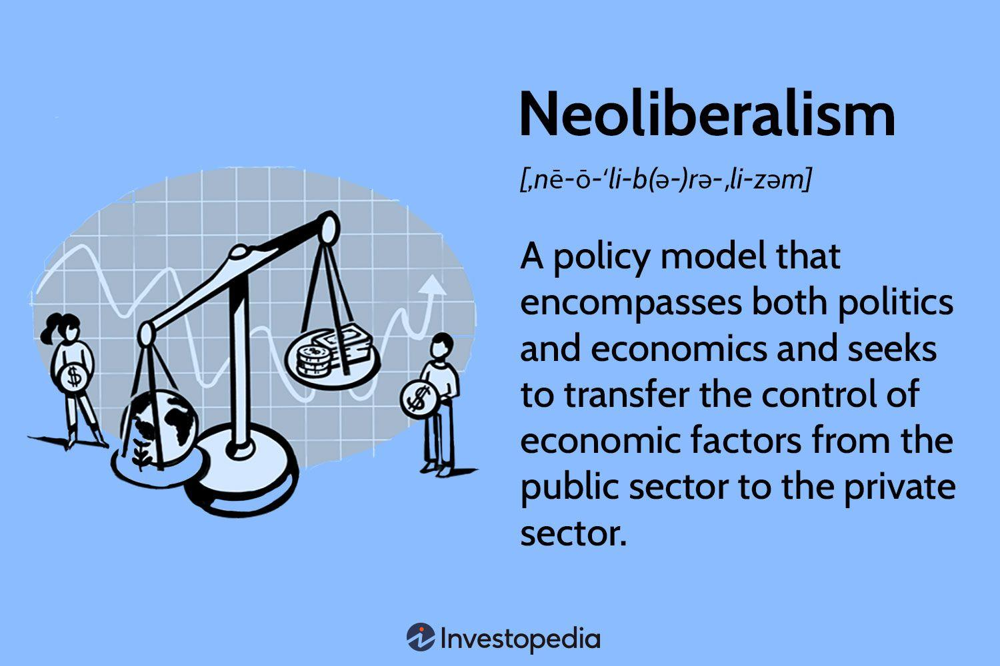

Economic theories such as neoclassical economics and neoliberalism are intricately linked to the evolution of modern financial systems. Neoclassical economics, with its focus on supply and demand equilibrium, and neoliberalism, advocating for free markets and minimal government intervention, have both shaped key economic principles that underpin today's financial markets. These theories are not merely academic constructs but have practical implications that resonate throughout various economic activities, including algorithmic trading.

Algorithmic trading represents a technological advancement that has been influenced by these prevailing theories. By utilizing mathematical models and analytics, it seeks to enhance market efficiency—a core tenet of neoclassical economics which prioritizes equilibrium and rational behavior. Neoliberalism aligns well with the principles of algorithmic trading through its emphasis on deregulation and the empowerment of individual decision-making in economic activities. Together, these theories help explain the mechanisms that drive the automated trading systems and the strategic temptations to minimize human intervention.

The relevance of understanding these economic theories extends beyond algorithmic trading, as they provide a framework for analyzing broader economic phenomena and policy decisions. For instance, by comprehending the interplay between supply and demand, as well as the role of competition, policymakers can better predict market dynamics and devise strategies that accommodate both economic growth and stability.

As the article progresses, it will aim to illuminate the key concepts of neoclassical economics and neoliberalism, exploring their respective roles and influences in shaping contemporary economic activities. This will help demystify the implications of these theories in real-world contexts, such as policy formulation, market structure, and regulatory challenges, all while considering the dynamic landscape of financial innovation. This foundational understanding creates a pathway for robust economic strategies and informed policy decisions that align with evolving modern financial systems.

## Table of Contents

## Understanding Neoclassical Economics

Neoclassical economics is a dominant intellectual framework that primarily focuses on the equilibrium of supply and demand as the central mechanism for the allocation of resources in an economy. It serves as the foundational backbone for much of contemporary economic thought, particularly in microeconomics.

At its core, neoclassical economics posits that individuals act rationally, optimizing their utility—a measure of satisfaction or preference—within the constraints of their circumstances. This rational behavior implies that consumers aim to maximize their welfare, while firms strive to maximize profits. In mathematical terms, this optimization can be expressed as a problem of utility maximization under budget constraints for consumers or profit maximization given production cost functions for firms.

The origins of neoclassical economics can be traced back to the late 19th century, with significant contributions from economists like Alfred Marshall. Marshall's work, "Principles of Economics," first published in 1890, synthesized various strands of economic theory prevalent at the time, thereby cementing neoclassical economics as a systematic framework. One of Marshall's key contributions was the concept of price elasticity of demand, which measures the responsiveness of the quantity demanded to changes in prices, encapsulating the theory's emphasis on market dynamics.

Furthermore, neoclassical theory has deeply influenced the construction of microeconomic models, particularly those concerning perfect competition. In a model of perfect competition, numerous small firms and consumers interact in a market, ensuring that no single participant can influence the price of goods or services. This scenario culminates in a state where supply equals demand, establishing market equilibrium. The neoclassical model assumes that resources in such an environment are allocated efficiently, with minimal waste, reflecting the optimal usage of the economy's resources.

The assumptions and models derived from neoclassical economics have provided tools for analyzing how markets function under various conditions, influencing both theoretical explorations and practical policy-making. Despite its prominence, neoclassical economics has faced critique, particularly regarding its assumptions of rationality and the neglect of factors like power dynamics and institutional influences, which are seen as significant in real-world economic scenarios. Nevertheless, it remains a pivotal part of the economic discipline, shaping how contemporary economic phenomena are understood and addressed.

## Neoliberalism: Evolution and Principles

Neoliberalism is a political and economic philosophy emphasizing the efficacy of free markets and advocating minimal governmental intervention in the economy. It roots itself in classical liberal economic theories but adapts them to the complexities of the modern global economy. Neoliberalism champions private enterprise, deregulation, and the reduction of state influence in market activities, arguing that these conditions lead to more efficient allocation of resources, innovation, and overall economic growth.

Neoliberalism gained prominence in the latter half of the 20th century, during a period marked by economic stagnation and dissatisfaction with Keynesian economic policies, which had been dominant since the post-World War II era. The 1970s economic crises, characterized by stagflation—a simultaneous stagnation in economic growth and inflation—created fertile ground for alternative economic theories. Neoliberalism's rise can largely be traced to its adoption by influential policymakers and governments, like Margaret Thatcher's administration in the United Kingdom and Ronald Reagan's presidency in the United States.

Notable proponents of neoliberal thought include economists Milton Friedman and Friedrich Hayek. Milton Friedman was instrumental in articulating neoliberal principles, particularly through his advocacy for monetarism—a focus on controlling the money supply to combat inflation. His work, "Capitalism and Freedom," argued for individual liberty through free markets as a basis for political freedom and criticized government intervention as inefficient and potentially oppressive. Friedrich Hayek's influential work, "The Road to Serfdom," warned against the tyranny of centralized economic planning and made a strong case for free-market capitalism as a bulwark of personal and political freedom.

Despite its influence, neoliberalism is not without its critics. Detractors argue that it tends to concentrate wealth in the hands of a few, exacerbating income inequality and allowing excessive corporate power. Critics highlight that neoliberal policies can undermine social welfare systems and fail to account for market failures that require government intervention. The 2008 global financial crisis, stemming partially from deregulation in financial markets, has been pointed to as evidence of neoliberalism's limitations, prompting calls for better regulatory frameworks to prevent economic instability.

In summary, neoliberalism advocates for market-oriented policies informed by a belief in the self-regulating nature of markets. While it has significantly shaped global economic policy in recent decades, debates continue regarding its impact on social equality and economic stability.

## Interrelation of Neoclassical Economics and Neoliberalism

Neoclassical economics and neoliberalism, though distinct in their origins and primary objectives, share several philosophical and practical intersections that have shaped their collective influence on modern economic thought and policy-making. Both frameworks, although developed at different times and under different circumstances, converge on the central tenet of prioritizing market mechanisms as the most efficient means of allocating resources.

Neoclassical economics, with its roots in the late 19th century, forms the bedrock of many classical and modern economic doctrines. It emphasizes the importance of supply and demand equilibrium in determining price levels, advocating that markets naturally reach a state of equilibrium when left undisturbed. This theory heavily relies on mathematical modeling and assumptions of rational behavior, where individuals and firms operate to maximize utility and profit, respectively. Key figures like Alfred Marshall contributed significantly to this framework, promoting concepts of marginalism and the notion of perfect competition. Such models often portray an idealized version of markets where numerous buyers and sellers act freely and competition leads to efficient outcomes. 

Neoliberalism, which gained prominence in the late 20th century, particularly after the stagflation crisis of the 1970s, extends the principles of neoclassical economics into public policy. This philosophy, advanced by economists such as Milton Friedman and Friedrich Hayek, espouses minimal government intervention, deregulation, and the expansion of free trade. The neoliberal approach argues that government should reduce its role to merely ensuring property rights, enforcing contracts, and maintaining currency stability, allowing markets to adjust freely and allocate resources efficiently.

The philosophical and practical overlaps between neoclassical economics and neoliberalism are evident in their mutual advocacy for deregulation and free trade. Neoclassical economic theories provide the intellectual justification for neoliberal policy prescriptions, arguing that reducing government interference allows for optimal market functionality. For instance, the theory of comparative advantage from neoclassical economics underlies neoliberal arguments for free trade, positing that such trade arrangements lead to an increase in overall economic welfare by allowing nations to specialize in production activities where they have relative efficiency.

However, there are notable differences between these schools of thought. Neoclassical economics is primarily theoretical, often relying on abstract models that assume perfect information and competition. It is more concerned with understanding economic mechanisms through rigorous analytical methods and mathematical representations. In contrast, neoliberalism is a policy-oriented approach focused on real-world application, advocating tangible changes in government policy and economic management to reflect its pro-market tenets.

In conclusion, while neoclassical economics and neoliberalism share a common foundation in advocating for free markets and minimal interference, their distinctions lie in the emphasis on theoretical frameworks versus policy implementation. Together, they have significantly influenced contemporary economic policies and debates, shaping the discourse on economic efficiency, government intervention, and the scope of market regulation.

## The Role of Algorithmic Trading in Modern Economics

Algorithmic trading represents a significant technological advancement in financial markets, leveraging computer algorithms to automate trading processes. These systems execute orders at speeds and frequencies that are impossible for human traders, analyzing vast datasets to identify trading opportunities. Rooted in economic theories, [algorithmic trading](/wiki/algorithmic-trading) utilizes principles from neoclassical economics and neoliberalism, shaping its development and application.

Neoclassical economics, with its focus on supply and demand equilibrium and rational behavior, underpins the algorithms' decision-making processes. Neoclassical theory's emphasis on market efficiency and the principle of utility maximization resonate with the objectives of algorithmic systems, which aim to optimize returns and minimize losses. The ideal of perfect competition, a key tenet of neoclassical economics, encourages a market environment where information is efficiently priced, which aligns with the goals of algorithmic trading to exploit price discrepancies.

Neoliberalism, advocating for free markets and minimal government interference, further supports the proliferation of algorithmic trading. The neoliberal focus on deregulation and the promotion of open markets has facilitated an environment where algorithmic trading can thrive. By reducing barriers and allowing technology-driven financial activities, neoliberal policies enable trading systems to function with minimal restrictions, maximizing their operational efficiency.

The impact of algorithmic trading on market efficiency is significant. By rapidly processing information and executing trades, algorithms contribute to more efficient price discovery. They enhance [liquidity](/wiki/liquidity-risk-premium) and tighten bid-ask spreads, theoretically leading to fairer market pricing. However, their impact on market [volatility](/wiki/volatility-trading-strategies) is contentious. While some argue that algorithmic trading stabilizes markets by providing liquidity, others contend that it may exacerbate volatility, especially during market stress, due to automated reactions to price movements and herd behavior among similar algorithms.

Regulatory challenges associated with algorithmic trading are considerable. The rapid execution speeds and complex strategies of these systems complicate traditional regulatory frameworks. Ensuring market integrity and investor protection in this high-frequency environment is a priority for regulators. Potential reforms might include implementing speed bumps to slow down trading, enhancing transparency requirements, and imposing stricter controls on the use of leverage by algorithms.

In conclusion, the integration of algorithmic trading into modern financial markets highlights the influence of economic theories, particularly neoclassical and neoliberal ideas, on technological advancements. While algorithmic trading offers potential benefits in terms of efficiency and liquidity, it also poses challenges that require careful regulatory navigation to ensure stable and equitable markets.

## Implications for Policy and Economic Strategy

Integrating economic theories like neoclassical economics and neoliberalism with modern trading systems such as algorithmic trading poses significant policy implications. These economic theories provide a foundational framework that emphasizes market efficiency, deregulation, and free-market principles. Algorithmic trading, defined by the use of complex algorithms to manage and execute trades at high speeds and volumes, benefits from these theories which advocate minimal interference and promote self-regulating markets.

A key strategy for balancing market efficiency with regulatory oversight involves imposing adaptive regulatory frameworks. These frameworks should recognize the benefits of technological advancements while addressing the risks associated with high-frequency trading, such as increased market volatility and systemic risks. Regulatory bodies like the U.S. Securities and Exchange Commission (SEC) have explored initiatives such as implementing circuit breakers and speed bumps to mitigate these risks without stifling innovation.

The debate on the government's role in managing economic growth and stability in this era centers on striking a balance between fostering innovation and ensuring financial stability. Proponents of minimal intervention assert that markets, guided by the invisible hand, will self-correct and adapt to technological changes. Critics, however, raise concerns about income inequality, market manipulation, and the potential for catastrophic errors, advocating for a more active governmental role in regulating and guiding market evolution.

Moreover, the integration of algorithmic trading into the broader economy necessitates a reevaluation of traditional economic models. The speed and complexity of algorithmic trades challenge the assumptions of rational behavior and equilibrium posited by neoclassical economics. Policymakers must consider how modern trading practices shift economic power dynamics and influence market outcomes.

In conclusion, the implications for policy and economic strategy in the context of integrating economic theories with algorithmic trading are profound. They require thoughtful deliberation on issues of market integrity, stability, and the appropriate level of regulatory intervention. These strategies not only aim to protect investors but also strive to enhance the overall efficiency and robustness of global financial markets.

## Conclusion

The intersection of economic theories like neoclassical economics and neoliberalism with modern financial systems presents a complex landscape. Neoclassical economics, with its focus on supply and demand equilibrium and individual rationality, provides a theoretical framework for understanding market dynamics. Its influence on microeconomic models, particularly the assumption of perfect competition, remains pervasive. In parallel, neoliberalism, as an economic philosophy advocating for free markets and limited government intervention, has shaped policy directions, emphasizing deregulation and free trade.

Algorithmic trading is a technological manifestation of these economic ideologies. It leverages the principles of market efficiency, much like those espoused in neoclassical economics, and aligns with neoliberal policy preferences for minimal market interference. While algorithmic trading can enhance market efficiency by increasing transaction speeds and liquidity, it also introduces challenges, such as market volatility and regulatory gaps.

The practical applications of these economic theories underscore their relevance in contemporary financial strategies, yet they are not without criticism. Concerns about income inequality and the outsized influence of corporate power under neoliberalism, along with the potential destabilizing effects of algorithmic trading, invite ongoing scrutiny.

Looking forward, it is imperative to examine how these theories can inform future policies. Balancing market efficiency with effective oversight requires innovative regulatory approaches that account for rapidly evolving technologies. There remains considerable scope for scholarly debate and empirical research to refine these economic models and policies, ensuring they address the complexities of modern economies. In doing so, we lay the groundwork for a more equitable and resilient financial future.

## References & Further Reading

[1]: Marshall, A. (1890). ["Principles of Economics."](https://archive.org/details/principlesecono00marsgoog) London: Macmillan.

[2]: Friedman, M. (1962). ["Capitalism and Freedom."](https://ctheory.sitehost.iu.edu/resources/fall2020/Friedman_Capitalism_and_Freedom.pdf) University of Chicago Press.

[3]: Hayek, F. A. (1944). ["The Road to Serfdom."](https://en.wikipedia.org/wiki/The_Road_to_Serfdom) University of Chicago Press.

[4]: Jovanovic, F., & Le Gall, P. (2001). ["Does God Practice a Random Walk? The 'Financial Physics' of a Nineteenth-Century Forerunner, Jules Regnault."](https://spip.teluq.ca/fjovanovic/IMG/pdf/ejhet2001_version_publiee.pdf) American Economic Review.

[5]: Lopez de Prado, M. (2018). ["Advances in Financial Machine Learning."](https://www.amazon.com/Advances-Financial-Machine-Learning-Marcos/dp/1119482089) Wiley.

[6]: Jansen, S. (2018). ["Machine Learning for Algorithmic Trading: Predictive Models to Extract Signals from Market and Alternative Data for Systematic Trading Strategies with Python."](https://github.com/stefan-jansen/machine-learning-for-trading) Packt Publishing.