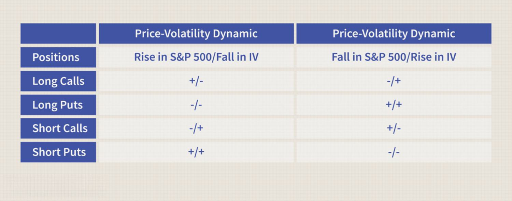

The complex world of financial markets often involves the interplay of various sophisticated instruments, among which financial derivatives hold significant importance. These financial derivatives, especially options, are integral to the strategies deployed in risk management and speculative ventures. Options are contracts that provide the holder with the right, but not the obligation, to buy or sell an underlying asset at a predetermined price within a set timeframe. This flexibility makes options a powerful tool for traders seeking to leverage market conditions.

A vital factor influencing option pricing is volatility, which measures the degree of variation in a financial instrument's price. This might be represented mathematically through statistical measures like standard deviation or variance of returns. Volatility's impact on option pricing is captured by models such as the Black-Scholes model, which is widely used for evaluating European-style options. The Black-Scholes formula is:



$$
C = S_0N(d_1) - Xe^{-rt}N(d_2)
$$

Where:
- $C$ is the call option price
- $S_0$ is the current price of the stock
- $X$ is the strike price of the option
- $r$ is the risk-free interest rate
- $t$ is the time to expiration
- $N(d)$ is the normal cumulative distribution function

Volatility significantly affects $d_1$ and $d_2$ in the formula, impacting the option's theoretical value. An increase in volatility typically results in higher option premiums due to the increased uncertainty, reflecting potential broader price swings of the underlying asset.

Moreover, the emergence of [algorithmic trading](/wiki/algorithmic-trading) has transformed how traders approach option pricing. Algorithmic trading utilizes complex algorithms and computer systems to execute trades at speeds and volumes beyond human capability, offering an edge in exploiting market inefficiencies and fluctuations swiftly and systematically. Algorithms in trading can adapt to changing patterns and data inputs, making it possible to align trading strategies with real-time [volatility](/wiki/volatility-trading-strategies) predictions.

The objective of this article is to examine the intricate relationship between option pricing, volatility, and algorithmic trading dynamics. Through this exploration, the article highlights how these elements interact to impact trading strategies, offering insights into optimized practices in modern financial markets.

## Table of Contents

## Understanding Financial Derivatives and Options

Financial derivatives represent a broad category of financial instruments whose value is not intrinsic but is derived from the performance of an underlying asset, index, or [interest rate](/wiki/interest-rate-trading-strategies). These instruments are primarily used for hedging risk, speculation, or increasing leverage. The primary types of financial derivatives include futures, options, swaps, and forward contracts.

Futures contracts are standardized agreements to buy or sell an asset at a predetermined price at a specified time in the future. They are commonly traded on exchanges and are used for hedging against price changes.

Options differ from futures in that they provide the holder the right, but not the obligation, to buy or sell the underlying asset at a predetermined strike price within a specific time frame. There are two main types of options: calls and puts. A call option gives the holder the right to buy the asset, while a put option grants the right to sell the asset. 

The value of an option is influenced by several factors, including the underlying asset's price, the strike price, time to expiration, interest rates, dividends, and volatility of the underlying asset. The Black-Scholes model, a widely-used method for pricing European style options, captures some of these variables in its formula:

$$
C = S_0 N(d_1) - X e^{-rT} N(d_2)
$$

Where:
- $C$ is the call option price,
- $S_0$ is the current stock price,
- $X$ is the strike price,
- $r$ is the risk-free rate,
- $T$ is the time to expiration,
- $N(\cdot)$ is the cumulative distribution function of the standard normal distribution,
- $d_1 = \frac{\ln(S_0/X) + (r + \sigma^2/2)T}{\sigma\sqrt{T}}$,
- $d_2 = d_1 - \sigma\sqrt{T}$,
- $\sigma$ is the volatility of the stock.

The importance of options in trading is vast, providing investors with strategic opportunities in both hedging and speculation. Options can be used to hedge against potential losses in a portfolio, as a means to generate additional income through writing options, or to leverage investment capital, making them highly versatile financial tools.

Swaps are derivatives in which two parties exchange cash flows or liabilities from different financial instruments, such as interest rates, currencies, or commodities. The most common type is the interest rate swap.

Forward contracts are similar to futures but are non-standardized and typically traded over-the-counter (OTC), allowing customization of contract terms between parties.

The flexibility and leverage provided by options make these instruments popular among traders looking to maximize their strategic positioning within the financial markets. They allow traders to capitalize on expected changes in the underlying asset's price, hedge against adverse price movements, or enhance portfolio yield through sophisticated trading strategies.

## The Intricate Relationship Between Option Pricing and Volatility

Volatility plays a pivotal role in the pricing of options, as it directly affects the valuation of these financial instruments. The uncertainty or the degree of variation in the price of the underlying asset is encapsulated in the concept of volatility, making it a fundamental parameter when determining option premiums. Among the types of volatility, implied volatility is particularly significant because it reflects the market's expectations of future volatility. It serves as a critical input for models like the Black-Scholes Model, a widely used framework for option pricing.

An inverse relationship typically exists between the price levels of underlying securities and implied volatility. When the price of an underlying asset decreases, implied volatility often increases, leading to higher option premiums. This phenomenon occurs because declining asset prices are associated with increased market uncertainty, prompting traders to expect larger future price swings. Conversely, when asset prices rise, implied volatility generally decreases, resulting in lower option premiums.

Mathematically, the impact of implied volatility on option pricing can be understood through the Black-Scholes equation, which, in its simplest form for a call option, is expressed as:

$$
C = S_0N(d_1) - Xe^{-rt}N(d_2)
$$

where:
- $C$ is the call option price
- $S_0$ is the current price of the underlying asset
- $X$ is the strike price of the option
- $r$ is the risk-free interest rate
- $t$ is the time to expiration
- $N$ is the cumulative distribution function of the standard normal distribution
- $d_1$ and $d_2$ are calculated as:

$$
d_1 = \frac{\ln(S_0/X) + (r + \sigma^2 / 2)t}{\sigma \sqrt{t}}
$$

$$
d_2 = d_1 - \sigma \sqrt{t}
$$

In these equations, $\sigma$ represents the volatility of the underlying asset. An increase in $\sigma$ leads to higher values of $d_1$ and $d_2$, thus raising the option's price due to higher expected future volatility.

Traders leverage changes in volatility to make strategic decisions. For instance, a rise in implied volatility signals potential for higher option premiums, making it advantageous to implement strategies that profit from increased volatility, such as buying calls or puts to anticipate larger market movements. Conversely, when implied volatility is low, strategies such as selling options might become more appealing due to lower premiums and reduced expectations of significant price changes.

Understanding these dynamics allows traders to better manage risk and capitalize on market conditions, whether through speculative or hedging strategies. Accurate volatility predictions can significantly optimize option trading strategies, influencing decisions on whether to enter, hold, or [exit](/wiki/exit-strategy) positions based on changing market sentiments.

## Algorithmic Trading: Enhancing Precision in Option Strategies

Algorithmic trading, a technological innovation in the financial markets, involves the use of complex algorithms to automate trading strategies. These algorithms allow traders to make swift decisions, executing orders at speeds and frequencies beyond human capability. This speed is achieved by exploiting low-latency infrastructures that connect directly to exchanges, ensuring rapid response to market dynamics.

Incorporating algorithmic systems into derivatives trading, particularly in options, significantly enhances both efficiency and precision. These systems are adept at processing vast datasets, which are crucial in predicting market patterns and trends. The ability to analyze and act on these large sets of data enables traders to optimize their decision-making processes, ultimately leading to improved outcomes.

A primary advantage of algorithmic trading in options is its capacity to capitalize on the volatility-price dynamics. Volatility, a measure of price variation over time, is pivotal in option pricing as it influences the premiums paid for these derivatives. By integrating predictive models of volatility changes into trading algorithms, traders can execute strategies tailored to the anticipated movements in market volatility. This alignment maximizes the potential for profit while managing risk effectively.

Several algorithmic strategies are effectively employed in options trading to optimize payouts based on volatility forecasts. One such strategy is the use of statistical models like GARCH (Generalized Autoregressive Conditional Heteroskedasticity) which are designed to model and predict volatility. These models help in formulating strategies wherein options are bought or sold based on expected changes in volatility. As an example, here is a Python snippet demonstrating a simple GARCH model to forecast volatility:

```python
from arch import arch_model

# Sample returns data for a financial asset
returns = [0.01, -0.02, 0.015, -0.005, 0.02]

# Fit a GARCH(1, 1) model to the returns
model = arch_model(returns, vol='Garch', p=1, q=1)
model_fit = model.fit(disp='off')

# Forecast the next period volatility
forecast = model_fit.forecast(horizon=1)
print("Forecasted Volatility:", forecast.variance.values[-1, :])
```

Moreover, algorithms can execute complex strategies like straddles, strangles, and spreads, which are designed to benefit from large price swings in either direction with limited risk exposure. For instance, a straddle purchase involves buying both a call and a put option at the same strike price and expiration date, which profits from significant price movements regardless of direction. Algorithmic trading systems can quickly identify the optimal times to enter or exit such positions based on real-time market data analyses.

In conclusion, integrating algorithmic trading with options strategies not only enhances precision and decision-making accuracy but also allows for the effective management of volatility-driven opportunities. As market conditions evolve, the adaptability and speed of algorithmic systems provide traders with the tools necessary to maintain a competitive edge in the fast-paced financial environment.

## Practical Applications and Case Studies

Case studies have illustrated the substantial role of volatility predictions combined with algorithmic trading in options strategies, leading to tangible trading successes. Options traders frequently turn to strategies like straddles and strangles to capitalize on considerable price oscillations in either direction. These strategies benefit from their ability to harness the volatility of financial markets without needing to predict a specific market direction.

### Straddles and Strangles: Core Concepts

**Straddle Strategy** involves purchasing both a call and a put option with the same strike price and expiration date. This strategy is effective when traders anticipate significant price movements but are uncertain about the direction. For instance, if a stock is anticipated to react dramatically to an upcoming earnings announcement, a straddle allows traders to profit from increased volatility regardless of whether the stock price rises or falls.

Mathematically, the profit for a long straddle at expiration can be expressed as:

$$
\text{Profit} = \max(S_T - K, 0) + \max(K - S_T, 0) - C - P
$$

Where:
- $S_T$ is the stock price at expiration
- $K$ is the strike price
- $C$ is the cost of the call option
- $P$ is the cost of the put option

**Strangle Strategy** is similar to a straddle, but involves purchasing out-of-the-money call and put options. This approach generally involves a lower initial cost due to cheaper premiums compared to at-the-money options used in straddles. A strangle typically requires a more significant price move to be profitable but offers reduced upfront costs.

### Algorithmic Trading Enhancements

With the advent of algorithmic trading, these strategies have been fortified by computational prowess that swiftly identifies high-volatility periods conducive to such strategies. Algorithms process extensive market data more efficiently than manual analysis. For instance, [machine learning](/wiki/machine-learning) models can predict future volatility more accurately by analyzing historical data and identifying patterns invisible to human traders.

Consider a basic Python implementation employing historical volatility to gauge favorable conditions for executing a straddle:

```python
import numpy as np
import pandas as pd
from sklearn.linear_model import LinearRegression

# Load historical prices
data = pd.read_csv('historical_data.csv')
data['Returns'] = data['Close'].pct_change()

# Calculate historical volatility
volatility = np.std(data['Returns']) * np.sqrt(252)  # Annualize volatility

# Use linear regression to identify potential predictors
X = data[['Volume', 'Open']]
y = data['Returns']

model = LinearRegression().fit(X, y)
predicted_volatility = model.predict(X.tail(1))

# Decision to implement a straddle based on predicted volatility
if predicted_volatility > threshold:
    print("Consider implementing a straddle strategy")
```

### Case Studies in Volatility and Algorithmic Trading

Historical cases have shown impressive results using these advanced strategies:

1. **Earnings Announcements**: Traders have successfully leveraged earnings announcement periods where implied volatility typically surges, making straddles and strangles profitable due to the pronounced market response. Algorithms predicting volatility spikes have boosted the precision of these implementations, improving outcomes over traditional methods.

2. **Major Economic Events**: Events such as Federal Reserve meetings or geopolitical uncertainties present ideal conditions for strangle strategies. Algorithms that incorporate news analytics and sentiment data to anticipate volatility shifts have proven highly effective in preempting the market's response to such events.

In conclusion, the integration of algorithmic trading with option strategies like straddles and strangles has demonstrably increased success in markets characterized by volatility. By refining predictions and execution precision, traders significantly amplify their capacity to profit under uncertain conditions.

## Conclusion

Understanding the relationship between option pricing and volatility is a cornerstone of successful derivatives trading. Volatility is a key determinant of option prices, influencing premiums through the market's expectations of future price fluctuations. The integration of algorithmic trading into this space offers substantial advancements, allowing traders to enhance their strategic execution of option trades. By leveraging computational algorithms, traders can swiftly respond to changes in volatility, optimizing trade outcomes through precise and efficient execution.

Algorithmic trading systems can process vast amounts of market data, enabling traders to identify and exploit small inefficiencies in the market that may arise due to changes in volatility. These systems can implement complex strategies that adapt to real-time data, accurately predicting movements and adjusting positions to maximize profits. Such capabilities are particularly useful in managing strategies that capitalize on significant price swings, like option straddles or strangles, where volatility is a major [factor](/wiki/factor-investing).

Despite the advantages offered by algorithmic trading, traders must remain vigilant about the accompanying risks. Unpredictable market shifts can impact the effectiveness of strategies, as even well-modeled algorithms may struggle with sudden changes. Furthermore, the phenomenon of 'fat tails'—extreme variations in market prices—can introduce unexpected challenges to algorithm-driven approaches. These risks highlight the need for robust risk management practices and a thorough understanding of market conditions.

For traders aiming to advance their effectiveness in derivatives trading, a comprehensive understanding of these components—derivatives, volatility, and algorithmic strategies—can significantly improve decision-making processes and trade outcomes. Balancing the sophisticated capabilities of algorithmic trading with a keen awareness of associated risks enables traders to better navigate the complexities of the financial markets.

## References & Further Reading

[1]: Black, F. & Scholes, M. (1973). ["The Pricing of Options and Corporate Liabilities."](https://www.cs.princeton.edu/courses/archive/fall09/cos323/papers/black_scholes73.pdf) Journal of Political Economy, 81(3), 637-654.

[2]: Hull, J. (2018). ["Options, Futures, and Other Derivatives"](https://www.semanticscholar.org/paper/Options%2C-Futures%2C-and-Other-Derivatives-Hull/89bdee500c8623864fc9eb7a471546aa713acc44) (10th ed.). Pearson.

[3]: Engle, R. F. (1982). ["Autoregressive Conditional Heteroscedasticity with Estimates of the Variance of United Kingdom Inflation."](https://www.semanticscholar.org/paper/Autoregressive-conditional-heteroscedasticity-with-Engle/2ee6cb87fc81ecd78d161c4a92c9dfce00c8961c) Econometrica, 50(4), 987-1007.

[4]: Lopez de Prado, M. (2018). ["Advances in Financial Machine Learning"](https://www.amazon.com/Advances-Financial-Machine-Learning-Marcos/dp/1119482089). Wiley.

[5]: Jorion, P. (2007). ["Value at Risk: The New Benchmark for Managing Financial Risk"](https://link.springer.com/article/10.1007/s11408-007-0057-3) (3rd ed.). McGraw-Hill.

[6]: Wilmott, P. (2006). ["Paul Wilmott Introduces Quantitative Finance"](https://www.amazon.com/Paul-Wilmott-Introduces-Quantitative-Finance/dp/0470319585) (2nd ed.). Wiley.

[7]: Chan, E. P. (2009). ["Quantitative Trading: How to Build Your Own Algorithmic Trading Business"](https://github.com/ftvision/quant_trading_echan_book). Wiley.

[8]: Jansen, S. (2020). ["Machine Learning for Algorithmic Trading"](https://github.com/stefan-jansen/machine-learning-for-trading). Packt Publishing.