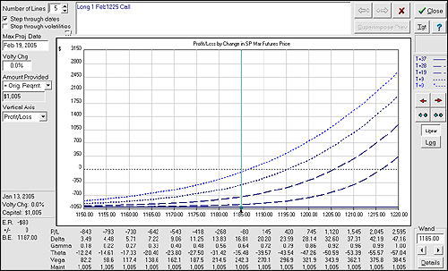

## Table of Contents

## What is an option in financial markets?

An option in financial markets is a contract that gives the buyer the right, but not the obligation, to buy or sell an asset at a specific price on or before a certain date. The asset could be stocks, commodities, or currencies. The specific price is called the strike price, and the date is known as the expiration date. Options are popular because they can be used for various purposes, such as speculation, hedging, or income generation.

There are two main types of options: calls and puts. A call option gives the buyer the right to buy the underlying asset at the strike price. For example, if you think the price of a stock will go up, you might buy a call option to purchase the stock at today's lower price. On the other hand, a put option gives the buyer the right to sell the underlying asset at the strike price. If you think the price of a stock will go down, you might buy a put option to sell the stock at today's higher price. Both types of options can help investors manage risk or make profits based on their predictions about market movements.

## What is volatility and how is it measured?

Volatility is a measure of how much the price of an asset, like a stock or a commodity, goes up and down over time. It shows how unpredictable or stable the price is. If an asset's price moves a lot in a short time, it has high volatility. If the price stays pretty much the same, it has low volatility. High volatility can mean more risk but also more chance for big gains or losses.

Volatility is usually measured using something called standard deviation. This is a way to see how spread out the prices are from the average price. A higher standard deviation means higher [volatility](/wiki/volatility-trading-strategies). Another common way to measure volatility is by using the VIX, which is also called the "fear index." The VIX looks at the prices of options on the S&P 500 to estimate how much the market expects prices to move in the next 30 days. Both methods help investors understand and manage the risks they face.

## How does volatility affect the price of an option?

Volatility plays a big role in deciding how much an option costs. When an asset's price moves a lot, which means it has high volatility, options on that asset become more expensive. This happens because options give you the right to buy or sell at a set price. If the price of the asset is jumping around a lot, there's a bigger chance the option will be worth something at the end. So, people are willing to pay more for that chance.

On the other hand, if an asset's price doesn't move much, and it has low volatility, options on that asset will be cheaper. This is because there's less chance the option will end up being valuable. When prices are stable, the option is less likely to be in a good spot at the end. So, people don't need to pay as much for it. Understanding volatility helps traders decide if an option is a good deal or not.

## What is the difference between historical and implied volatility?

Historical volatility is a measure of how much the price of an asset has moved in the past. It looks at the actual ups and downs in the price over a certain time, like the last month or year. Traders use historical volatility to understand how wild or calm the price has been. It's like looking in the rearview mirror to see how bumpy the road was.

Implied volatility, on the other hand, is a guess about how much the price of an asset might move in the future. It's not based on past prices but on what people think will happen next. Traders get this number from the prices of options in the market. High implied volatility means people expect big price swings, while low implied volatility means they expect the price to stay pretty steady. It's like looking ahead to see what kind of road you might be driving on.

## What role does the Black-Scholes model play in understanding option pricing and volatility?

The Black-Scholes model is a famous formula used to figure out how much an option should cost. It was made by economists Fischer Black and Myron Scholes in the early 1970s. The model takes into account things like the current price of the stock, the option's strike price, the time left until the option expires, the risk-free interest rate, and the volatility of the stock's price. By putting all these pieces together, the Black-Scholes model gives traders a way to guess the fair price of an option. This helps them decide if an option is a good deal or not.

One of the key parts of the Black-Scholes model is how it uses volatility. The model needs a number for volatility to work, and this number is usually the implied volatility, which is what people think the stock's price will do in the future. If the implied volatility goes up, the price of the option goes up too, because there's a bigger chance the option will end up being worth something. The Black-Scholes model helps traders see how sensitive the option's price is to changes in volatility. This is really useful for understanding and managing the risks that come with trading options.

## How does an increase in volatility impact call and put options differently?

When volatility goes up, both call and put options usually get more expensive. This is because higher volatility means there's a bigger chance that the price of the stock will move a lot. For a call option, which gives you the right to buy the stock at a set price, higher volatility means there's a better chance the stock price will jump above that set price before the option expires. So, people are willing to pay more for the call option because it might end up being worth more.

For a put option, which gives you the right to sell the stock at a set price, higher volatility also means there's a better chance the stock price will drop below that set price. This makes the put option more valuable too, because there's a bigger chance it will end up in the money. So, both call and put options see their prices go up when volatility increases, but it's because of the different ways they can benefit from big price swings.

## What are volatility smiles and smirks, and what do they indicate about market perceptions?

Volatility smiles and smirks are patterns you see when you plot the implied volatility of options against their strike prices. A volatility smile looks like a smile because the implied volatility is higher for options that are far away from the current stock price, both for options that let you buy the stock at a high price (out-of-the-money calls) and options that let you sell the stock at a low price (out-of-the-money puts). This pattern suggests that traders think there's a bigger chance of big price moves in either direction, which makes these options more valuable.

A volatility smirk, on the other hand, is when the implied volatility is higher for options that let you sell the stock at a low price (out-of-the-money puts) than for options that let you buy the stock at a high price (out-of-the-money calls). The smirk looks like a lopsided smile, with one side higher than the other. This pattern shows that traders are more worried about the stock price dropping a lot than it going up a lot. It reflects a market where people are more scared of big losses than excited about big gains.

## How can traders use the VIX index to gauge market volatility and its impact on option prices?

The VIX index, often called the "fear index," is a tool that traders use to understand how much the stock market might move in the next 30 days. It looks at the prices of options on the S&P 500 to figure out how much volatility people expect. When the VIX goes up, it means traders think the market will be more jumpy, with bigger price swings. When it goes down, it means they expect the market to be calmer, with smaller price changes. By watching the VIX, traders can get a sense of how nervous or confident people are feeling about the market.

This information is really helpful for traders who are buying and selling options. If the VIX is high, it usually means that options will be more expensive because there's a bigger chance the stock prices will move a lot. This can make options a good way to protect against big drops in the market, but it also means they cost more to buy. On the other hand, if the VIX is low, options might be cheaper because people expect the market to stay pretty steady. Traders can use the VIX to decide if options are a good deal at the current price and to plan their trades based on how much they think the market will move.

## What are the limitations of using volatility as a sole predictor of option prices?

Using volatility as the only way to guess option prices has some big problems. Volatility tells us how much the price of a stock might jump around, but it doesn't tell us everything. Other things like the overall mood of the market, news about the company, and what's happening in the world can change how much people are willing to pay for options. Also, just looking at volatility might make traders miss out on other important details, like how long the option lasts or what the interest rates are doing. So, relying only on volatility can lead to wrong guesses about how much an option should cost.

Another problem is that there are two types of volatility: historical and implied. Historical volatility looks at what's happened in the past, but that doesn't always help predict what will happen next. Implied volatility is what people think will happen, but it's just a guess and can be wrong. If traders only use volatility without thinking about these differences, they might end up paying too much or too little for an option. So, it's smart to use volatility along with other information to get a better picture of what might happen to option prices.

## How do professional traders adjust their strategies based on changes in volatility?

Professional traders keep a close eye on volatility because it tells them how much the price of a stock or other asset might move. When volatility goes up, they know that prices might jump around a lot. So, they might buy options to protect their other investments from big drops in the market. They could also sell options to take advantage of the higher prices that come with more volatility. On the other hand, when volatility goes down, traders might think the market will be calmer. They might sell options they own because they won't be worth as much, or they might buy cheaper options to bet on smaller price changes.

Traders also use different strategies based on whether they think volatility will keep going up or down. If they think it will keep going up, they might use strategies like straddles or strangles, where they buy both call and put options to make money no matter which way the price moves. If they think volatility will go down, they might use strategies like selling options or using spreads to make money from the falling prices of options. By watching volatility and adjusting their plans, traders can try to make the most of the market's ups and downs.

## What advanced models beyond Black-Scholes account for volatility in option pricing?

Besides the Black-Scholes model, there are other models that traders use to figure out how much options should cost, especially when it comes to dealing with volatility. One of these is the Binomial model. This model breaks down the time until the option expires into smaller pieces and looks at what might happen at each step. It's good for understanding how the price of an option can change with different levels of volatility over time. Another model is the Heston model, which is a bit more complicated. It looks at how volatility itself can change and move around, not just the price of the stock. This is helpful because in real life, volatility isn't always the same; it can go up and down, and the Heston model tries to take that into account.

These models help traders get a better picture of how options might behave in different situations. The Binomial model is useful because it can handle things like early exercise of options, which the Black-Scholes model can't do as well. The Heston model is good for traders who want to understand how changes in volatility can affect their options. Both models give traders more tools to work with, so they can make smarter choices about buying and selling options. By using these advanced models, traders can better manage the risks and opportunities that come with trading in a world where prices and volatility are always moving.

## How can one use volatility arbitrage to profit from discrepancies in option pricing?

Volatility [arbitrage](/wiki/arbitrage) is a way traders try to make money by finding differences between what the market thinks about how much a stock's price will move and what they think. They do this by looking at options, which are contracts that give you the right to buy or sell a stock at a set price. If traders think the market's guess about how much the stock's price will jump around (called implied volatility) is wrong, they can buy or sell options to take advantage of this. For example, if they think the market is too scared and expects too much jumping around, they might sell options because these will be overpriced. If they think the market is too calm and not expecting enough movement, they might buy options because these will be underpriced.

To do volatility arbitrage, traders often use fancy math models to figure out if options are priced right. They might use models like the Black-Scholes model or more advanced ones like the Heston model to guess how much options should cost based on how much they think the stock's price will move. If their guess is different from what the market is saying, they can make trades to profit from this difference. This kind of trading can be risky because guessing wrong about volatility can lead to losses, but it can also be rewarding if the trader's guess is right and they can spot the right opportunities.

## What is the understanding of Financial Derivatives and Options?

Financial derivatives represent a broad category of financial instruments whose value is not intrinsic but is derived from the performance of an underlying asset, index, or [interest rate](/wiki/interest-rate-trading-strategies). These instruments are primarily used for hedging risk, speculation, or increasing leverage. The primary types of financial derivatives include futures, options, swaps, and forward contracts.

Futures contracts are standardized agreements to buy or sell an asset at a predetermined price at a specified time in the future. They are commonly traded on exchanges and are used for hedging against price changes.

Options differ from futures in that they provide the holder the right, but not the obligation, to buy or sell the underlying asset at a predetermined strike price within a specific time frame. There are two main types of options: calls and puts. A call option gives the holder the right to buy the asset, while a put option grants the right to sell the asset. 

The value of an option is influenced by several factors, including the underlying asset's price, the strike price, time to expiration, interest rates, dividends, and volatility of the underlying asset. The Black-Scholes model, a widely-used method for pricing European style options, captures some of these variables in its formula:

$$
C = S_0 N(d_1) - X e^{-rT} N(d_2)
$$

Where:
- $C$ is the call option price,
- $S_0$ is the current stock price,
- $X$ is the strike price,
- $r$ is the risk-free rate,
- $T$ is the time to expiration,
- $N(\cdot)$ is the cumulative distribution function of the standard normal distribution,
- $d_1 = \frac{\ln(S_0/X) + (r + \sigma^2/2)T}{\sigma\sqrt{T}}$,
- $d_2 = d_1 - \sigma\sqrt{T}$,
- $\sigma$ is the volatility of the stock.

The importance of options in trading is vast, providing investors with strategic opportunities in both hedging and speculation. Options can be used to hedge against potential losses in a portfolio, as a means to generate additional income through writing options, or to leverage investment capital, making them highly versatile financial tools.

Swaps are derivatives in which two parties exchange cash flows or liabilities from different financial instruments, such as interest rates, currencies, or commodities. The most common type is the interest rate swap.

Forward contracts are similar to futures but are non-standardized and typically traded over-the-counter (OTC), allowing customization of contract terms between parties.

The flexibility and leverage provided by options make these instruments popular among traders looking to maximize their strategic positioning within the financial markets. They allow traders to capitalize on expected changes in the underlying asset's price, hedge against adverse price movements, or enhance portfolio yield through sophisticated trading strategies.

## What is the intricate relationship between option pricing and volatility?

Volatility plays a pivotal role in the pricing of options, as it directly affects the valuation of these financial instruments. The uncertainty or the degree of variation in the price of the underlying asset is encapsulated in the concept of volatility, making it a fundamental parameter when determining option premiums. Among the types of volatility, implied volatility is particularly significant because it reflects the market's expectations of future volatility. It serves as a critical input for models like the Black-Scholes Model, a widely used framework for option pricing.

An inverse relationship typically exists between the price levels of underlying securities and implied volatility. When the price of an underlying asset decreases, implied volatility often increases, leading to higher option premiums. This phenomenon occurs because declining asset prices are associated with increased market uncertainty, prompting traders to expect larger future price swings. Conversely, when asset prices rise, implied volatility generally decreases, resulting in lower option premiums.

Mathematically, the impact of implied volatility on option pricing can be understood through the Black-Scholes equation, which, in its simplest form for a call option, is expressed as:

$$
C = S_0N(d_1) - Xe^{-rt}N(d_2)
$$

where:
- $C$ is the call option price
- $S_0$ is the current price of the underlying asset
- $X$ is the strike price of the option
- $r$ is the risk-free interest rate
- $t$ is the time to expiration
- $N$ is the cumulative distribution function of the standard normal distribution
- $d_1$ and $d_2$ are calculated as:

$$
d_1 = \frac{\ln(S_0/X) + (r + \sigma^2 / 2)t}{\sigma \sqrt{t}}
$$

$$
d_2 = d_1 - \sigma \sqrt{t}
$$

In these equations, $\sigma$ represents the volatility of the underlying asset. An increase in $\sigma$ leads to higher values of $d_1$ and $d_2$, thus raising the option's price due to higher expected future volatility.

Traders leverage changes in volatility to make strategic decisions. For instance, a rise in implied volatility signals potential for higher option premiums, making it advantageous to implement strategies that profit from increased volatility, such as buying calls or puts to anticipate larger market movements. Conversely, when implied volatility is low, strategies such as selling options might become more appealing due to lower premiums and reduced expectations of significant price changes.

Understanding these dynamics allows traders to better manage risk and capitalize on market conditions, whether through speculative or hedging strategies. Accurate volatility predictions can significantly optimize option trading strategies, influencing decisions on whether to enter, hold, or [exit](/wiki/exit-strategy) positions based on changing market sentiments.

## What are the practical applications and case studies?

Case studies have illustrated the substantial role of volatility predictions combined with [algorithmic trading](/wiki/algorithmic-trading) in options strategies, leading to tangible trading successes. Options traders frequently turn to strategies like straddles and strangles to capitalize on considerable price oscillations in either direction. These strategies benefit from their ability to harness the volatility of financial markets without needing to predict a specific market direction.

### Straddles and Strangles: Core Concepts

**Straddle Strategy** involves purchasing both a call and a put option with the same strike price and expiration date. This strategy is effective when traders anticipate significant price movements but are uncertain about the direction. For instance, if a stock is anticipated to react dramatically to an upcoming earnings announcement, a straddle allows traders to profit from increased volatility regardless of whether the stock price rises or falls.

Mathematically, the profit for a long straddle at expiration can be expressed as:

$$
\text{Profit} = \max(S_T - K, 0) + \max(K - S_T, 0) - C - P
$$

Where:
- $S_T$ is the stock price at expiration
- $K$ is the strike price
- $C$ is the cost of the call option
- $P$ is the cost of the put option

**Strangle Strategy** is similar to a straddle, but involves purchasing out-of-the-money call and put options. This approach generally involves a lower initial cost due to cheaper premiums compared to at-the-money options used in straddles. A strangle typically requires a more significant price move to be profitable but offers reduced upfront costs.

### Algorithmic Trading Enhancements

With the advent of algorithmic trading, these strategies have been fortified by computational prowess that swiftly identifies high-volatility periods conducive to such strategies. Algorithms process extensive market data more efficiently than manual analysis. For instance, [machine learning](/wiki/machine-learning) models can predict future volatility more accurately by analyzing historical data and identifying patterns invisible to human traders.

Consider a basic Python implementation employing historical volatility to gauge favorable conditions for executing a straddle:

```python
import numpy as np
import pandas as pd
from sklearn.linear_model import LinearRegression

# Load historical prices
data = pd.read_csv('historical_data.csv')
data['Returns'] = data['Close'].pct_change()

# Calculate historical volatility
volatility = np.std(data['Returns']) * np.sqrt(252)  # Annualize volatility

# Use linear regression to identify potential predictors
X = data[['Volume', 'Open']]
y = data['Returns']

model = LinearRegression().fit(X, y)
predicted_volatility = model.predict(X.tail(1))

# Decision to implement a straddle based on predicted volatility
if predicted_volatility > threshold:
    print("Consider implementing a straddle strategy")
```

### Case Studies in Volatility and Algorithmic Trading

Historical cases have shown impressive results using these advanced strategies:

1. **Earnings Announcements**: Traders have successfully leveraged earnings announcement periods where implied volatility typically surges, making straddles and strangles profitable due to the pronounced market response. Algorithms predicting volatility spikes have boosted the precision of these implementations, improving outcomes over traditional methods.

2. **Major Economic Events**: Events such as Federal Reserve meetings or geopolitical uncertainties present ideal conditions for strangle strategies. Algorithms that incorporate news analytics and sentiment data to anticipate volatility shifts have proven highly effective in preempting the market's response to such events.

In conclusion, the integration of algorithmic trading with option strategies like straddles and strangles has demonstrably increased success in markets characterized by volatility. By refining predictions and execution precision, traders significantly amplify their capacity to profit under uncertain conditions.

## References & Further Reading

[1]: Black, F. & Scholes, M. (1973). ["The Pricing of Options and Corporate Liabilities."](https://www.cs.princeton.edu/courses/archive/fall09/cos323/papers/black_scholes73.pdf) Journal of Political Economy, 81(3), 637-654.

[2]: Hull, J. (2018). ["Options, Futures, and Other Derivatives"](https://www.semanticscholar.org/paper/Options%2C-Futures%2C-and-Other-Derivatives-Hull/89bdee500c8623864fc9eb7a471546aa713acc44) (10th ed.). Pearson.

[3]: Engle, R. F. (1982). ["Autoregressive Conditional Heteroscedasticity with Estimates of the Variance of United Kingdom Inflation."](https://www.semanticscholar.org/paper/Autoregressive-conditional-heteroscedasticity-with-Engle/2ee6cb87fc81ecd78d161c4a92c9dfce00c8961c) Econometrica, 50(4), 987-1007.

[4]: Lopez de Prado, M. (2018). ["Advances in Financial Machine Learning"](https://www.amazon.com/Advances-Financial-Machine-Learning-Marcos/dp/1119482089). Wiley.

[5]: Jorion, P. (2007). ["Value at Risk: The New Benchmark for Managing Financial Risk"](https://link.springer.com/article/10.1007/s11408-007-0057-3) (3rd ed.). McGraw-Hill.

[6]: Wilmott, P. (2006). ["Paul Wilmott Introduces Quantitative Finance"](https://www.amazon.com/Paul-Wilmott-Introduces-Quantitative-Finance/dp/0470319585) (2nd ed.). Wiley.

[7]: Chan, E. P. (2009). ["Quantitative Trading: How to Build Your Own Algorithmic Trading Business"](https://github.com/ftvision/quant_trading_echan_book). Wiley.

[8]: Jansen, S. (2020). ["Machine Learning for Algorithmic Trading"](https://github.com/stefan-jansen/machine-learning-for-trading). Packt Publishing.