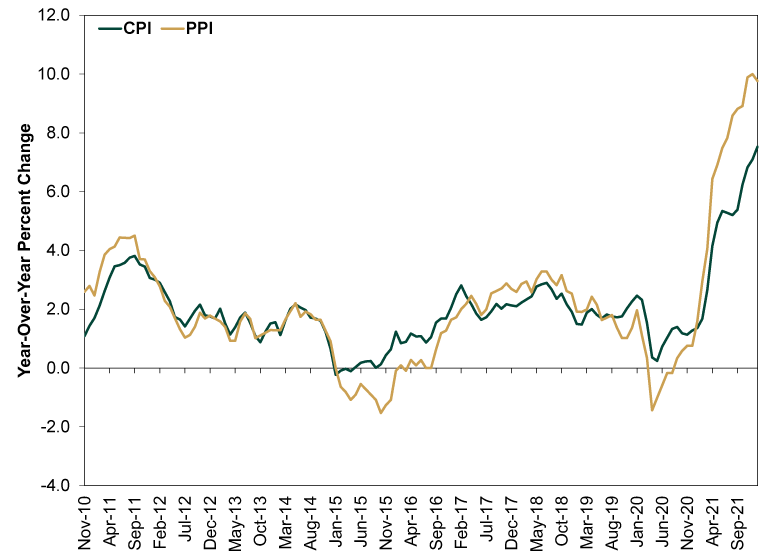

## Table of Contents

## What is the Producer Price Index (PPI)?

The Producer Price Index (PPI) is a measure of the average change over time in the prices that producers receive for their goods and services. It's like a report card that shows how much more or less money businesses are getting for what they sell compared to before. The PPI is important because it can tell us if the costs of things like raw materials, energy, and other inputs that businesses use are going up or down. This information helps businesses plan their prices and helps economists understand what's happening in the economy.

The PPI is different from the Consumer Price Index (CPI), which tracks the prices that consumers pay for things. While the CPI looks at the final price of goods and services, the PPI focuses on the earlier stages of production. For example, if the price of steel goes up, the PPI will show this increase before it affects the price of cars made with that steel, which would then be reflected in the CPI. By watching the PPI, we can get early warnings about inflation or deflation, which are important for making economic decisions.

## What is the Consumer Price Index (CPI)?

The Consumer Price Index (CPI) is a way to measure how the prices of things that people buy change over time. It looks at the cost of a basket of goods and services that a typical household might buy, like food, clothes, rent, and gas. By comparing the cost of this basket from one time to another, the CPI can tell us if prices are going up or down. If the CPI goes up, it means that, on average, people are paying more for the same things than they did before.

The CPI is really important because it helps us understand inflation, which is when prices generally go up over time. Governments and central banks use the CPI to make decisions about things like interest rates and economic policies. For example, if the CPI shows that prices are rising too fast, a central bank might raise interest rates to try to slow down inflation. The CPI also affects things like wages and social security benefits, as they might be adjusted based on changes in the CPI to keep up with the cost of living.

## How are PPI and CPI calculated?

The Producer Price Index (PPI) is calculated by looking at the prices that businesses get for what they sell. People collect data on prices for thousands of different goods and services, like raw materials, finished goods, and services. They compare these prices from one time to another, usually month to month. To find the PPI, they use a special math formula that takes the average of all these price changes. This formula gives more weight to things that are more important to businesses, so if the price of something big like oil changes, it will affect the PPI more than if the price of a less important item changes.

The Consumer Price Index (CPI) is calculated by looking at the prices that people pay for things they buy. They start by figuring out what a typical family buys, which is called a "market basket." This basket includes things like food, clothes, rent, and gas. Then, they collect prices for all these items from stores and other places where people shop. They compare these prices from one time to another, usually month to month. To find the CPI, they use a formula that averages all these price changes. This formula gives more weight to things that people spend more money on, so if the price of something important like rent goes up, it will affect the CPI more than if the price of a less important item changes.

## What is the basic relationship between PPI and CPI?

The Producer Price Index (PPI) and the Consumer Price Index (CPI) are both important ways to measure how prices change over time, but they look at different parts of the economy. The PPI measures the prices that businesses get for what they sell, like raw materials and finished goods. It helps us see if the costs for businesses are going up or down. On the other hand, the CPI measures the prices that people pay for things they buy, like food and rent. It shows us how much more or less people are spending on everyday things.

There is a basic relationship between PPI and CPI because changes in the PPI can affect the CPI. If the prices that businesses pay for things go up (shown by the PPI), they might have to charge more for their products. This means that the prices people pay could also go up, which would show up in the CPI. So, the PPI can be like an early warning sign for what might happen to the CPI. But it's not always a perfect match because other things can also affect the prices people pay, like taxes, transportation costs, and how much competition there is in the market.

## How does PPI influence CPI?

The Producer Price Index (PPI) can influence the Consumer Price Index (CPI) because it measures the prices that businesses pay for things they need to make their products. If these prices go up, businesses might have to charge more for what they sell to make up for the higher costs. This means that the prices people pay at the store could go up too, which would show up in the CPI. So, the PPI is like a heads-up for what might happen to the CPI.

But it's not always a direct connection. Other things can change the prices people pay, like taxes, how much it costs to get things from one place to another, and how many other businesses are selling the same thing. So, even if the PPI goes up, the CPI might not go up by the same amount or at the same time. Still, watching the PPI can help us guess what might happen to the CPI and get ready for changes in the prices people pay.

## Can changes in PPI predict future changes in CPI?

Changes in the Producer Price Index (PPI) can sometimes help us guess what might happen to the Consumer Price Index (CPI) in the future. The PPI looks at the prices that businesses pay for things they need to make their products. If these prices go up, businesses might have to charge more for what they sell. This could mean that the prices people pay at the store will go up too, which would show up in the CPI. So, if we see the PPI going up, it might be a sign that the CPI will go up later.

But it's not always that simple. Other things can affect the prices people pay, like taxes, how much it costs to get things from one place to another, and how many other businesses are selling the same thing. So, even if the PPI goes up, the CPI might not go up by the same amount or at the same time. Still, watching the PPI can give us a clue about what might happen to the CPI and help us get ready for changes in the prices people pay.

## What are the key differences between PPI and CPI?

The Producer Price Index (PPI) and the Consumer Price Index (CPI) both measure how prices change over time, but they look at different parts of the economy. The PPI looks at the prices that businesses get for what they sell, like raw materials and finished goods. This helps us see if the costs for businesses are going up or down. On the other hand, the CPI looks at the prices that people pay for things they buy, like food and rent. This shows us how much more or less people are spending on everyday things.

The way they are calculated is also different. The PPI uses a formula that averages the price changes of thousands of different goods and services that businesses sell. It gives more weight to things that are more important to businesses. The CPI uses a formula that averages the price changes of a basket of goods and services that a typical family buys. It gives more weight to things that people spend more money on. So, while the PPI can be an early warning sign for what might happen to the CPI, they are not the same thing because they measure different parts of the economy.

## How do PPI and CPI affect inflation rates?

The Producer Price Index (PPI) and the Consumer Price Index (CPI) both help us understand inflation, which is when prices go up over time. The PPI looks at the prices that businesses get for what they sell, like raw materials and finished goods. If these prices go up, it might mean that businesses will have to charge more for their products. This can be an early warning sign that inflation might be coming because if businesses have to pay more for things, they might raise their prices, which can lead to higher prices for everyone.

The CPI, on the other hand, looks at the prices that people pay for things they buy, like food and rent. If the CPI goes up, it means that, on average, people are paying more for the same things than they did before. This is a direct measure of inflation because it shows how much more people have to spend to keep up with their everyday needs. Both the PPI and CPI are important because they help governments and central banks make decisions about things like interest rates to try to control inflation and keep the economy stable.

## What sectors of the economy are most impacted by changes in PPI and CPI?

Changes in the Producer Price Index (PPI) can have a big effect on the manufacturing and wholesale sectors. When the PPI goes up, it means that businesses are paying more for things like raw materials and energy. This can make it more expensive for them to make their products. If they can't find a way to save money somewhere else, they might have to raise their prices. This can be tough for these businesses because it might mean they have to change how they do things to keep making money.

The Consumer Price Index (CPI) affects everyone, but some sectors feel it more than others. For example, the retail sector is really sensitive to changes in the CPI. If the CPI goes up, it means that people are paying more for things like food and clothes. Retail businesses might have to raise their prices too, and this can make people buy less if they feel like things are getting too expensive. The housing sector is also affected because if the CPI goes up, it can mean higher rent or mortgage payments, which can make it harder for people to afford a place to live.

## How do businesses use PPI and CPI data in their decision-making processes?

Businesses use PPI data to understand how much they are paying for things like raw materials and energy. If the PPI goes up, it means these costs are going up, and businesses might have to think about raising their prices to cover the extra costs. They can also look for ways to save money, like finding cheaper suppliers or using less of the expensive materials. By keeping an eye on the PPI, businesses can plan ahead and make sure they are not caught off guard by sudden price changes.

CPI data helps businesses see how much people are paying for things they buy every day. If the CPI goes up, it might mean that people have less money to spend on other things because they are spending more on basics like food and rent. Businesses in the retail sector might use this information to decide if they should raise their prices or offer sales to keep people buying. Companies in the housing sector might also use CPI data to adjust rent or mortgage rates to match what people can afford. By understanding the CPI, businesses can make better decisions about pricing and how to keep their customers happy.

## What are the limitations of using PPI and CPI as economic indicators?

Using the Producer Price Index (PPI) and the Consumer Price Index (CPI) as economic indicators has some limitations. One big problem is that they can be slow to show changes in the economy. It takes time to collect and put together all the price data, so by the time the numbers come out, things might have already changed. Also, the PPI and CPI look at a lot of different things, but they might not include everything that's important to everyone. For example, if a new product becomes really popular, it might not be in the basket of goods they use to calculate the CPI right away.

Another limitation is that the PPI and CPI can be affected by things that don't really show what's happening in the whole economy. For the PPI, if the price of one big thing like oil goes up a lot, it can make the whole index go up even if other prices are staying the same. For the CPI, things like taxes or how much it costs to get products from one place to another can change the prices people pay, but these changes might not show the real health of the economy. So, while the PPI and CPI are helpful, they don't tell the whole story and should be used with other information to understand what's really going on.

## How do global economic factors influence the relationship between PPI and CPI?

Global economic factors can change how the Producer Price Index (PPI) and the Consumer Price Index (CPI) relate to each other. For example, if the price of oil goes up a lot in other countries, it can make the PPI go up because businesses have to pay more for energy. This can lead to higher prices for things they make, which might show up in the CPI later. Also, if a country's currency gets weaker compared to other currencies, it can make things that are imported more expensive. This can affect both the PPI and the CPI because businesses and people have to pay more for stuff from other countries.

Another way global economic factors can influence the relationship between PPI and CPI is through trade policies. If a country puts up new tariffs or trade barriers, it can make the things businesses need to make their products more expensive. This can push the PPI up, and if businesses pass these costs onto customers, the CPI might go up too. On the other hand, if global competition increases and businesses can find cheaper materials from other countries, it might help keep the PPI and CPI from going up too fast. So, what happens in the world economy can really change how prices move at home.

## What is the understanding of CPI and PPI?

The Consumer Price Index (CPI) and the Producer Price Index (PPI) are two fundamental economic indicators used to measure inflation, reflecting changes in the price levels within an economy. The Consumer Price Index (CPI) quantifies the average change in prices that urban consumers pay for a typical basket of goods and services over time. This basket includes various categories such as food, clothing, transportation, and healthcare, making the CPI a crucial measure of living costs. The changes in CPI are often used to index social security and other payments, affecting both income and corporate financial planning.

Conversely, the Producer Price Index (PPI) captures the average change in selling prices that domestic producers receive for their output. Unlike the CPI, which analyzes prices from the standpoint of the consumer, the PPI provides insights into price changes at different production stages, including raw materials, intermediate goods, and finished goods. This makes the PPI a valuable indicator for understanding inflationary pressures from the supply side of the economy.

Both CPI and PPI serve as essential tools for policymakers, businesses, and investors. They offer significant insights into inflationary trends, aiding in tailoring monetary policy, forecasting economic conditions, and making informed investment decisions. Central banks, for instance, closely monitor these indices to adjust interest rates and influence economic stability.

Understanding the fundamental differences between CPI and PPI is critical. While CPI focuses on consumer prices, PPI assesses producer prices. This distinction is important for interpreting economic data as CPI is more consumer-centric, reflecting demand-side inflation pressures, whereas PPI highlights supply-side pressures.

Mathematically, both indicators are index numbers typically expressed as:

$$
\text{CPI} (t) = \frac{\text{Cost of Basket at Time } t}{\text{Cost of Basket in Base Year}} \times 100
$$

$$
\text{PPI} (t) = \frac{\text{Selling Price received by Producers at Time } t}{\text{Selling Price received in Base Year}} \times 100
$$

Incorporating these indices into trading or economic models requires understanding their implications on market trends and economic conditions. By analyzing CPI and PPI, traders and economists can better anticipate shifts in inflation, guiding strategic decision-making to harness potential opportunities or mitigate risks.

## References & Further Reading

[1]: Bryan, M. F., & Cecchetti, S. G. (1993). ["The Consumer Price Index as a Measure of Inflation."](https://www.nber.org/papers/w4505) Economic Review, Federal Reserve Bank of Cleveland.

[2]: ["The Producer Price Index: A Tool for All Seasons."](https://www.bls.gov/pPI/) U.S. Bureau of Labor Statistics.

[3]: Lopez de Prado, M. (2018). ["Advances in Financial Machine Learning."](https://www.amazon.com/Advances-Financial-Machine-Learning-Marcos/dp/1119482089) Wiley.

[4]: ["Evidence-Based Technical Analysis: Applying the Scientific Method and Statistical Inference to Trading Signals"](https://www.amazon.com/Evidence-Based-Technical-Analysis-Scientific-Statistical/dp/0470008741) by David Aronson.

[5]: Chan, E. P. (2008). ["Quantitative Trading: How to Build Your Own Algorithmic Trading Business."](https://github.com/ftvision/quant_trading_echan_book) Wiley.