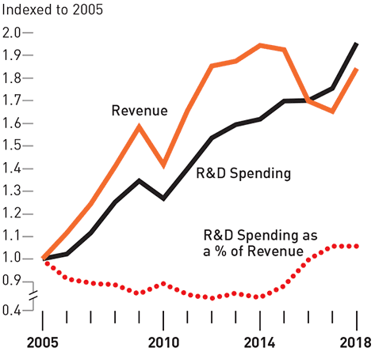

## Table of Contents

## What is R&D spending?

R&D spending, or Research and Development spending, is the money a company or organization spends on creating new products, improving existing ones, or finding new ways to do things. This spending is important because it helps companies stay competitive and innovative. Companies in fields like technology, pharmaceuticals, and automotive industries often spend a lot on R&D to keep up with changes and advancements in their sectors.

When a company decides how much to spend on R&D, it considers many things. These include how much money it has, what its goals are, and what its competitors are doing. R&D spending can be risky because there's no guarantee that the research will lead to successful products or services. However, when R&D is successful, it can lead to big profits and a stronger position in the market.

## What is profitability?

Profitability is when a business makes more money than it spends. It means that after paying for all the costs like materials, salaries, and other expenses, there is still money left over. This extra money is called profit. Businesses aim to be profitable because it shows they are doing well and can keep running and growing.

To measure profitability, businesses look at different numbers. They might check how much profit they make compared to their sales, or how much profit they make compared to the money they invested. These measures help them understand if they are using their resources well. Being profitable is important because it lets a business pay its owners, reinvest in the company, and handle any tough times that might come up.

## How does R&D spending affect a company's short-term financial performance?

R&D spending can make a company's short-term financial performance look worse. When a company spends a lot on research and development, it's using money that could have been profit. This means the company might show less profit or even a loss in the short term. For example, if a company spends $10 million on R&D, that's $10 million less in profit for that year. Investors and analysts might see this and think the company is not doing well, even if the R&D could lead to great things in the future.

However, not all companies feel the same impact from R&D spending. Some companies might have enough money to spend on R&D without hurting their short-term profits too much. They might be able to keep their profits steady while still investing in the future. But for smaller companies or those with less money, spending on R&D can be a big hit to their short-term financial performance. They need to be careful and plan well to make sure they can still pay their bills and keep their business running smoothly.

## Can increased R&D spending lead to higher long-term profitability?

Yes, increased R&D spending can lead to higher long-term profitability. When a company spends more on research and development, it's investing in new ideas and technologies. These new ideas can lead to better products or services that customers want to buy. If the R&D is successful, the company can sell these new products for more money than it cost to make them, leading to bigger profits over time. For example, a tech company might spend a lot on R&D to create a new smartphone. If the smartphone is popular, the company can make a lot of money from selling it.

However, there's no guarantee that R&D spending will always lead to higher profits. Sometimes, the research doesn't work out, and the company doesn't get any new products from it. This can mean the company spent a lot of money without getting anything back. But when R&D does lead to successful new products, it can give the company an edge over its competitors. This can help the company keep making money and growing for a long time. So, while R&D spending can be risky, it can also be very rewarding if it leads to new and successful products.

## What industries typically have high R&D spending?

Some industries spend a lot on R&D because they need to keep making new things. The tech industry is a big one. Companies like Apple and Google spend a lot of money to make new phones, computers, and software. They need to keep up with what people want and what other companies are doing. The pharmaceutical industry also spends a lot on R&D. They need to find new medicines and treatments for diseases. It takes a long time and a lot of money to test new drugs, but if they find something that works, it can help a lot of people and make the company a lot of money.

Another industry that spends a lot on R&D is the automotive industry. Car companies like Toyota and Tesla spend money to make better cars. They want to make cars that are safer, use less gas, or don't use gas at all. They also need to keep up with new rules about the environment. The aerospace industry is also big on R&D. Companies like Boeing and SpaceX spend money to make better planes and rockets. They need to make sure their products are safe and can do new things, like going to space.

## How do companies measure the success of their R&D investments?

Companies measure the success of their R&D investments by looking at how much money the new products or services make. They want to see if the money they spent on R&D brings in more money than it cost. If a new product sells well and makes a lot of profit, the company knows its R&D was successful. They also look at how the new product helps them do better than their competitors. If the new product makes the company more popular or helps it get more customers, that's another way to measure success.

Another way companies measure R&D success is by looking at how the new products or services help them in the long run. They might see if the new product helps them save money or if it leads to more new ideas. Sometimes, the success of R&D isn't just about making money right away. It can also be about learning new things that help the company in the future. Companies might use special numbers, like the return on investment (ROI), to see if their R&D spending was worth it. If the ROI is high, it means the R&D was a good use of money.

## What are some examples of companies that have benefited from high R&D spending?

Apple is a company that has done well because it spends a lot on R&D. They use that money to make new iPhones, iPads, and other cool gadgets. When Apple comes out with a new product, a lot of people want to buy it. This helps Apple make a lot of money and stay ahead of other companies. For example, the iPhone changed how people use phones, and it all started with Apple's R&D.

Another company that has benefited from high R&D spending is Pfizer. They spend a lot of money to find new medicines. One big success was the COVID-19 vaccine they made with BioNTech. It helped a lot of people and made Pfizer a lot of money. Their R&D helped them find a way to fight a big problem, and it showed how important it is to spend money on research.

Tesla is also a good example. They spend a lot on R&D to make better electric cars. Their cars can go far on one charge and have cool features like self-driving. This has made Tesla very popular and helped them make a lot of money. Their R&D spending has helped them lead the way in electric cars.

## How does R&D spending correlate with innovation and competitive advantage?

R&D spending helps companies come up with new ideas and stay ahead of others. When a company spends money on research and development, it's trying to find new ways to do things or make new products. This can lead to big changes in what they offer, like new phones or medicines. If a company can make something new and useful, it can be the first to sell it. This gives them an edge over other companies because people want to buy the new thing. For example, when Apple made the first iPhone, it was a big change in phones, and it helped Apple become a leader in the market.

Having a lot of R&D spending can also help a company keep its lead. If a company keeps spending on R&D, it can keep making new things and improving what it already has. This means it can stay ahead of other companies that might try to catch up. For example, Tesla keeps spending on R&D to make better electric cars. This helps them stay ahead of other car companies that are also trying to make electric cars. So, R&D spending is important for both coming up with new ideas and keeping a company at the top of its game.

## What are the risks associated with high R&D spending?

High R&D spending can be risky because it doesn't always lead to success. Sometimes, a company spends a lot of money on research and development, but it doesn't find anything new or useful. This means the company loses the money it spent without getting anything back. It's like trying to find a treasure but coming back empty-handed. If a company spends too much on R&D without making any money from it, it can have trouble paying its bills and keeping the business going.

Another risk is that high R&D spending can make a company's short-term financial performance look bad. When a company spends a lot on R&D, it's using money that could have been profit. This can make investors and analysts think the company is not doing well, even if the R&D might lead to good things in the future. If the company can't show good profits for a while, it might have trouble getting more money from investors or banks. This can make it hard for the company to keep spending on R&D or do other important things.

## How can companies optimize their R&D spending to maximize profitability?

Companies can optimize their R&D spending by focusing on projects that have a clear path to becoming profitable products or services. They should pick projects that match what their customers want and what their business is good at. This means doing a lot of research to understand what people need and what's missing in the market. Companies can also work with other businesses or universities to share the cost and the risk of R&D. By teaming up, they can use each other's skills and resources to make new things faster and cheaper.

Another way to make R&D spending more effective is to keep a close eye on how much money is being spent and what it's being spent on. Companies should set clear goals for their R&D projects and check how they're doing often. If a project isn't going well, they should be ready to stop it and move the money to something more promising. Using technology and data can help them see which projects are working and which ones aren't. By being smart about where they spend their R&D money, companies can increase their chances of making new, profitable things.

## What are the latest trends in R&D spending across different sectors?

In the tech industry, companies are spending a lot on R&D to make new things like artificial intelligence and better computer chips. They want to keep up with fast changes in technology and stay ahead of other companies. Big tech companies like Google and Amazon are putting a lot of money into AI to make their products smarter. They also spend on making their services work better and be more useful for people. This helps them keep their customers happy and attract new ones.

In the pharmaceutical industry, R&D spending is focused on finding new medicines and treatments. They are working on things like new cancer drugs and vaccines for diseases. The success of the COVID-19 vaccines showed how important R&D can be. Companies are also looking into personalized medicine, which means making treatments that work better for each person. This can be expensive, but it can also lead to big profits if they find something that works well.

In the automotive industry, R&D spending is going towards making electric cars and self-driving technology. Companies like Tesla and Toyota are trying to make cars that use less gas or no gas at all. They are also working on making cars safer and easier to drive with new technology. This is important because more people want to buy electric cars, and governments are making rules to help the environment. So, car companies need to spend on R&D to keep up with these changes and stay competitive.

## How does global economic policy impact the relationship between R&D spending and profitability?

Global economic policies can change how much companies spend on R&D and how much profit they make. If a country gives tax breaks or other benefits for R&D spending, companies might spend more on research. This can help them make new products and make more money in the long run. But if the economy is not doing well, companies might not have enough money to spend on R&D. They might need to save money instead of spending it on new ideas. This can make it harder for them to make new products and stay ahead of other companies.

Also, rules about trade and patents can affect how much profit companies make from their R&D. If a company can sell its new products in more countries, it can make more money. But if other countries have strict rules about patents, it might be hard for the company to protect its new ideas. This can make it less likely for the company to spend a lot on R&D because they might not be able to make money from it. So, global economic policies play a big role in whether companies can spend on R&D and make profits from it.

## What is the understanding of Business Economics in R&D?

Business economics is a specialized area within economics that focuses on the application of economic theory and quantitative methods to analyze and enhance business decision-making. It plays a critical role in strategic decision-making by helping managers understand market dynamics, forecast future trends, and optimize resource allocation.

Investing in Research and Development (R&D) is an essential long-term strategy for business growth. The economic rationale for such investments lies primarily in innovation and competitive advantage. R&D activities can lead to the development of new products, processes, or services that can significantly enhance a company's market position and profitability over time. By investing in R&D, businesses aim to secure future income streams through innovation, thereby sustaining and potentially increasing their market share.

From a business economics perspective, the decision to invest in R&D is often subjected to a rigorous cost-benefit analysis. This involves assessing the potential returns from R&D activities against the costs incurred. Key factors in the analysis include the expected increase in revenues from new innovations, the likelihood of successful R&D outcomes, and the time frame for realizing these benefits. This analysis typically involves calculating the Net Present Value (NPV) of expected R&D outcomes and comparing it with the initial investment. The formula for NPV is:

$$
\text{NPV} = \sum \frac{R_t}{(1 + r)^t} - C_0
$$

where $R_t$ are the net returns in year $t$, $r$ is the discount rate, and $C_0$ is the initial investment cost.

One of the significant challenges in quantifying the economic benefits of R&D expenditures is the inherent uncertainty and risk involved in these activities. Unlike capital investments with more predictable outcomes, R&D outcomes can vary widely, and their impact might only become apparent over time. Additionally, the influence of external factors such as market conditions, regulatory changes, and technological advancements further complicates this quantification.

Companies evaluate potential R&D projects by aligning them with broader economic goals and strategic priorities. This process typically involves a multi-criteria analysis, considering factors such as alignment with strategic goals, potential market impact, and risk assessment. Companies often use methodologies like real option valuation to account for uncertainty and the flexibility inherent in R&D investments, thus allowing them to make informed investment decisions that align with their economic objectives. By systematically assessing and prioritizing R&D projects, businesses can allocate resources effectively to drive innovation and enhance long-term profitability.

## How can we measure profitability from R&D investments?

Measuring the profitability of Research and Development (R&D) investments presents significant challenges for businesses. R&D activities often have uncertain outcomes, long time horizons, and indirect contributions to revenue generation. Despite these complexities, assessing the financial performance of R&D is crucial for companies to allocate resources effectively and drive innovation.

One of the key obstacles is the difficulty in directly linking R&D expenditures to immediate financial returns. R&D projects can result in the development of new products, processes, or technologies that contribute to revenue growth, but these links are rarely straightforward. The financial benefits of R&D may manifest as increased sales, cost savings, or enhanced market positioning, which are influenced by various internal and external factors.

To address this challenge, the concept of Return on Research Capital (RORC) has been introduced as a metric to evaluate the profitability of R&D investments. RORC provides a framework for assessing the efficiency and effectiveness of R&D spending by comparing the returns generated by these investments to the costs incurred. The formula for RORC is:

$$

\text{RORC} = \frac{\text{Net Income from R&D-related products}}{\text{R&D Expenditure}}
$$

Calculating RORC involves determining the net income attributable to R&D-driven innovations. For instance, if a pharmaceutical company spends $100 million on research that leads to a new drug generating $500 million in additional revenue, the RORC would be 5. This indicates a strong return on the research capital invested.

High RORC values suggest efficient utilization of R&D investments, potentially leading to greater business growth and enhanced competitiveness in the market. Companies with high RORC can leverage their innovative outcomes to achieve superior product differentiation, stronger brand recognition, and increased market share. Conversely, a low RORC may indicate inefficiencies, such as excessive expenditure on unsuccessful projects or inadequate commercialization strategies. This can hinder a company's growth prospects and weaken its competitive position.

Real-world examples from companies like Apple and Nokia provide insights into how R&D impacts profitability. Apple has consistently invested in R&D to fuel innovation across its product lines, resulting in high RORC and maintaining its position as a market leader [1]. The development of products like the iPhone and iPad illustrates how strategic R&D investments can drive substantial financial returns.

In contrast, Nokia's experience underscores the risks associated with R&D investments. Despite significant R&D spending, Nokia was unable to maintain its competitive edge in the smartphone market, largely due to strategic misalignments and slower adaptation to technological shifts. This highlights the importance of not only investing in R&D but also ensuring that these investments align with market trends and consumer demands.

In conclusion, while linking R&D spending directly to financial performance is complex, metrics like RORC offer valuable insights into the profitability of these investments. Companies that successfully manage and optimize their R&D efforts can achieve sustained growth and maintain a competitive edge in various industries.

References:
1. Apple Inc. Annual Financial Reports and R&D Insights, 2023.

## References & Further Reading

[1]: Bergstra, J., Bardenet, R., Bengio, Y., & Kégl, B. (2011). ["Algorithms for Hyper-Parameter Optimization."](https://dl.acm.org/doi/10.5555/2986459.2986743) Advances in Neural Information Processing Systems 24.

[2]: ["Advances in Financial Machine Learning"](https://www.amazon.com/Advances-Financial-Machine-Learning-Marcos/dp/1119482089) by Marcos Lopez de Prado  

[3]: ["Evidence-Based Technical Analysis: Applying the Scientific Method and Statistical Inference to Trading Signals"](https://www.amazon.com/Evidence-Based-Technical-Analysis-Scientific-Statistical/dp/0470008741) by David Aronson  

[4]: ["Machine Learning for Algorithmic Trading"](https://github.com/stefan-jansen/machine-learning-for-trading) by Stefan Jansen  

[5]: ["Quantitative Trading: How to Build Your Own Algorithmic Trading Business"](https://www.amazon.com/Quantitative-Trading-Build-Algorithmic-Business/dp/1119800064) by Ernest P. Chan  

[6]: Apple Inc. Annual Reports, [Apple's R&D Investment Insights](https://www.sec.gov/Archives/edgar/data/320193/000032019322000108/aapl-20220924.htm)  

[7]: Organisation for Economic Co-operation and Development (OECD). (2021). [Science, Technology and Industry Outlook 2021](https://www.oecd-ilibrary.org/science-and-technology/oecd-science-technology-and-innovation-outlook-2021_df401065-en)  

[8]: Kaplan, R. S. (2020). ["Aligning R&D and Business Strategy"](https://www.hbs.edu/faculty/Pages/item.aspx?num=8831). Harvard Business Review.