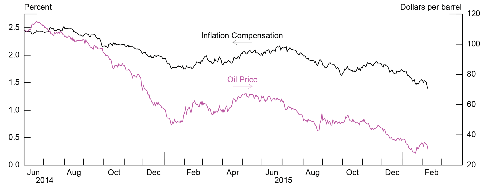

## Table of Contents

## What is the basic definition of oil prices?

Oil prices refer to the cost of a barrel of crude oil. This price is determined by many factors, including how much oil is available and how much people want to buy it. When there is a lot of oil but not many people want to buy it, the price goes down. When there is not much oil but many people want to buy it, the price goes up.

Oil prices are important because they affect many things in our daily lives. For example, when oil prices go up, it can make gasoline more expensive, which means it costs more to fill up your car. This can also affect the price of many products because oil is used to make and transport them. Governments and businesses watch oil prices closely because they can impact the economy.

## What is inflation and how is it measured?

Inflation is when the prices of things we buy, like food and toys, go up over time. It means that the money we have can buy less than it used to. For example, if a candy bar cost $1 last year and now it costs $1.10, that's inflation. It happens because the cost of making things can go up, or because more people want to buy things than there are things available.

To measure inflation, people look at the prices of a bunch of different things that people commonly buy. They put all these prices together into something called the Consumer Price Index, or CPI. The CPI is like a big list that shows how much more expensive things have become over time. If the CPI goes up, it means there's inflation. Governments and economists use the CPI to understand how fast prices are rising and to make plans to help keep the economy stable.

## How do oil prices directly affect the cost of living?

Oil prices directly affect the cost of living because oil is used to make and move many things we use every day. When oil prices go up, it costs more to make things like plastic toys and clothes, and it also costs more to ship these things to stores. This means that the price of many products we buy, like food and clothes, can go up too. For example, if it costs more to transport fruits and vegetables from the farm to the grocery store, the price of those fruits and vegetables will likely increase.

Also, when oil prices rise, the cost of gasoline goes up. This makes it more expensive to fill up your car, which can affect how much you spend on travel and commuting. If you drive a lot for work or to take your kids to school, higher gas prices can really add up. This extra cost can make it harder for families to pay for other things they need, like rent or groceries, which increases the overall cost of living.

## Can you explain the concept of 'cost-push inflation' in relation to oil prices?

Cost-push inflation happens when the cost of making things goes up, and businesses have to raise their prices to cover these higher costs. When oil prices go up, it's a big example of cost-push inflation. Oil is used to make lots of things, like plastic and gasoline, and it's also used to move things from one place to another. So, when oil gets more expensive, it costs more to make and ship products. Businesses then have to charge more for these products, which makes the prices go up for everyone.

This kind of inflation can make life harder for people because everything starts to cost more. If you need to drive to work, you'll pay more for gas. If you buy food, you might see higher prices because it costs more to get the food from the farm to the store. When oil prices push up the cost of living like this, it's an example of cost-push inflation. It's important for governments and businesses to watch oil prices because they can have a big impact on the economy and people's lives.

## What historical events show a clear link between oil price spikes and inflation?

One clear example of oil price spikes causing inflation happened in the 1970s. During that time, there were two big oil crises. The first one started in 1973 when some countries that produce a lot of oil decided to stop selling oil to the United States and other countries. This made the price of oil go way up. Because oil is used to make and move many things, the prices of lots of other things went up too. This led to high inflation, which means that people had to pay a lot more for the things they needed.

Another example was in the late 2000s, around 2007 and 2008. The price of oil went up a lot during this time, reaching over $140 a barrel. This big jump in oil prices made the cost of everything from gas to food go up. Many people felt the pinch because they had to spend more money just to keep up with their normal lives. This period of high oil prices contributed to a time of high inflation, making it harder for people to afford the things they needed.

## How do oil price fluctuations impact different sectors of the economy?

When oil prices go up and down, it affects many different parts of the economy. The transportation sector feels it right away. When oil prices rise, gas and diesel get more expensive, so it costs more for trucks, planes, and ships to move goods around. This can make things like food and clothes more expensive because it costs more to get them from the factory to the store. Companies that make cars and airplanes might also have to charge more for their products because the materials they use, like plastic, come from oil.

The energy sector is also hit hard by changes in oil prices. When oil prices are high, it can be good for oil companies because they can make more money selling oil. But it can be bad for other energy companies, like those that use natural gas or renewable energy, because people might switch back to oil if it's cheaper. On the other hand, when oil prices fall, it can hurt oil companies but help other energy companies because their products might become more competitive. This can also affect how much people pay for their electricity and heating bills.

Other parts of the economy feel the impact too. For example, the agriculture sector can be affected because farming equipment and fertilizers often depend on oil. When oil prices go up, it can cost farmers more to grow their crops, which can lead to higher food prices. The manufacturing sector also feels the pinch because many products, like plastics and chemicals, are made from oil. When oil prices change, it can make it harder for these companies to plan and can affect how much they charge for their products.

## What role do oil-dependent industries play in the broader economic impact of oil prices on inflation?

Oil-dependent industries are really important when it comes to how oil prices affect inflation. These industries, like transportation, energy, agriculture, and manufacturing, use a lot of oil to do their work. When oil prices go up, it costs these industries more money to make and move their products. For example, if a trucking company has to pay more for diesel, they might charge more to ship goods. This means that the prices of things like food and clothes can go up, which is part of what we call inflation.

The ripple effect of higher costs in oil-dependent industries can spread to the whole economy. When these industries raise their prices because of higher oil costs, it can make everything more expensive. People might have to spend more money on gas, food, and other things they need every day. This can lead to a general increase in prices, which is inflation. So, oil-dependent industries play a big role in how oil prices can push up the cost of living for everyone.

## How do government policies and subsidies influence the relationship between oil prices and inflation?

Government policies and subsidies can really change how oil prices affect inflation. When governments decide to put taxes on oil, it can make oil more expensive. This means that when oil prices go up, the price people pay at the pump goes up even more because of the taxes. On the other hand, if the government gives subsidies to oil companies, it can help keep oil prices lower than they would be without the help. This can stop oil prices from pushing up inflation as much. Governments have to be careful with these policies because they can make a big difference in how much people have to pay for things.

Subsidies can also affect other parts of the economy. If the government helps farmers with subsidies to cover the cost of oil, it can keep food prices from going up too much when oil prices rise. This can help keep inflation lower. But if the government stops these subsidies, it can make things more expensive and lead to more inflation. So, the choices governments make about taxes and subsidies on oil can have a big impact on how oil prices affect the cost of living for everyone.

## What are the global economic factors that mediate the impact of oil prices on inflation?

Global economic factors play a big role in how oil prices affect inflation. One important [factor](/wiki/factor-investing) is how much money different countries use to buy oil. If a country uses a lot of oil and its currency is strong, it can buy oil more easily, which might not push up inflation as much. But if a country's currency is weak, buying oil can become more expensive, leading to higher inflation. Another factor is how much oil a country produces itself. Countries that make a lot of their own oil might not feel the impact of high oil prices as much as countries that have to buy oil from other places.

Another global factor is how the world economy is doing overall. When the global economy is growing fast, there's usually more demand for oil, which can push prices up and lead to inflation. But if the global economy is slowing down, people might not want to buy as much oil, which can keep prices lower and help control inflation. Also, what other countries do with their oil policies can matter. If big oil-producing countries decide to produce more or less oil, it can change the price of oil around the world, affecting inflation in different countries in different ways.

## How do expectations of future oil prices affect current inflation rates?

When people think that oil prices will go up in the future, it can start to affect inflation right away. Businesses might decide to raise their prices now because they expect it will cost more to make things later. For example, if a company thinks gas will be more expensive next month, they might charge more for their products now to cover the future cost. This can make things like food and clothes more expensive, which is part of what we call inflation. So, even before oil prices actually go up, the expectation can start to push prices higher.

On the other hand, if people expect oil prices to go down in the future, it can help keep inflation lower. Companies might not raise their prices as much because they think it will be cheaper to make things later. This can make the cost of living go up more slowly. Governments and businesses pay close attention to what people think about future oil prices because these expectations can have a big impact on how much things cost today.

## What econometric models are used to study the relationship between oil prices and inflation?

Economists use special math models called econometric models to study how oil prices affect inflation. One common model is called the Vector Autoregression (VAR) model. This model looks at how different things in the economy, like oil prices and inflation, change together over time. It helps economists see if a change in oil prices today might lead to higher inflation in the future. Another model they use is the Structural Vector Autoregression (SVAR) model. This model is a bit more detailed because it tries to figure out why oil prices and inflation might be connected, not just that they are connected.

Another model economists might use is the Error Correction Model (ECM). This model is good for looking at how oil prices and inflation move back to normal after they've changed. It helps show how quickly things like inflation might go back to where they were before oil prices went up or down. These models are important because they help economists make better guesses about what might happen in the future. By using these models, they can give advice to governments and businesses on how to handle changes in oil prices and keep inflation under control.

## How can central banks use monetary policy to mitigate the inflationary effects of rising oil prices?

Central banks can use something called monetary policy to help control inflation when oil prices go up. One way they do this is by changing interest rates. If oil prices are making everything more expensive and causing inflation, the central bank might raise interest rates. When interest rates go up, it can make borrowing money more expensive. This means people might spend less money, which can slow down the economy a bit and help keep inflation from getting too high. 

Another tool central banks use is called open market operations. This is when they buy or sell government bonds to change how much money is in the economy. If oil prices are pushing up inflation, the central bank might sell bonds to take money out of the economy. When there's less money around, people and businesses might not spend as much, which can help bring down inflation. By using these tools, central banks try to keep prices from rising too fast when oil prices go up.

## References & Further Reading

[1]: Hamilton, J. D. (2009). ["Understanding Crude Oil Prices."](https://www.jstor.org/stable/41323239) The Energy Journal, 30(2), 179-206.

[2]: Kilian, L. (2008). ["The Economic Effects of Energy Price Shocks."](https://www.jstor.org/stable/27647084) Journal of Economic Literature, 46(4), 871-909.

[3]: Fama, E. F., & French, K. R. (1989). ["Business Conditions and Expected Returns on Stocks and Bonds."](https://www.sciencedirect.com/science/article/pii/0304405X89900950) Journal of Financial Economics, 25(1), 23-49.

[4]: U.S. Energy Information Administration. (2021). ["Electric Power Monthly with Data for December 2020."](https://www.eia.gov/electricity/monthly/) 

[5]: Ticknor, J. L. (2013). ["A Bayesian Regularized Artificial Neural Network for Stock Market Forecasting."](https://www.sciencedirect.com/science/article/pii/S0957417413002509) Financial Analytics Journal.

[6]: López de Prado, M. (2018). ["Advances in Financial Machine Learning."](https://www.amazon.com/Advances-Financial-Machine-Learning-Marcos/dp/1119482089) Wiley.

[7]: Chan, E. P. (2008). ["Quantitative Trading: How to Build Your Own Algorithmic Trading Business."](https://github.com/ftvision/quant_trading_echan_book) Wiley.

[8]: Melvin, M., & Prins, R. (2022). ["Algorithmic Trading and Changes in Market Quality"](https://www.sciencedirect.com/science/article/pii/S0378426623000687). Journal of Financial and Quantitative Analysis. 

[9]: Gorton, G., & Rouwenhorst, K. G. (2006). ["Facts and Fantasies about Commodity Futures."](https://www.nber.org/papers/w10595) Journal of Economic Perspectives, 20(3), 85-106.