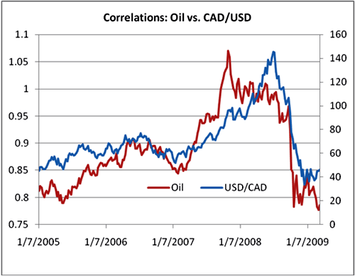

The global economy is intricately linked with various elements, notably oil prices, inflation, and the expanding influence of algorithmic trading. Each of these factors plays a crucial role in shaping the financial markets and ensuring economic stability. Oil prices are universally acknowledged as a fundamental component of economic dynamics, influencing not only the cost of energy but also production and transportation expenses. Changes in oil prices can prompt shifts in inflation rates, thereby affecting consumer purchasing power and business profitability.

Inflation, in turn, serves as a barometer of economic health. It's influenced by a multitude of factors, including commodity prices, which oil represents significantly. The rise and fall of inflation rates impact interest rates, borrowing costs, and overall economic activity, necessitating astute monitoring and management by policymakers and financial institutions.



Simultaneously, the rise of algorithmic trading has introduced a new dimension to the financial landscapes, altering how investments and resource allocations are made. These automated systems can process vast amounts of data at speeds unattainable by humans, enabling rapid decision-making and heightened market efficiency. However, this also means that market fluctuations can be magnified, as algorithms respond to trends rather than underlying economic fundamentals.

Understanding the interplay between these elements—how oil prices can affect inflation, how inflation impacts economic stability, and how algorithmic trading can exacerbate these effects—is crucial. It allows investors, policymakers, and businesses to make informed decisions amidst a constantly evolving economic environment. As these forces continuously interact and influence each other, stakeholders must remain vigilant, adapting strategies to safeguard their interests and promote financial stability globally.

## Table of Contents

## The Relationship Between Oil Prices and Inflation

Oil prices significantly influence inflation due to their pervasive impact on energy and production costs. When oil prices increase, the cost of goods and services often follows suit, manifesting as higher inflation rates. This correlation can be attributed to the vital role that oil plays in the global economy. For instance, historical data reveals that periods of oil price spikes are frequently accompanied by heightened inflation rates. The Arab oil embargo in the 1970s and the more recent spike in oil prices in 2008 are prime examples of how sudden increases in oil prices correspond to rising inflation levels. These events not only led to higher consumer prices but also posed substantial challenges for monetary policymakers worldwide.

Energy costs, driven predominantly by oil prices, comprise a considerable portion of the Consumer Price Index (CPI), which is a key indicator used to measure inflation. The CPI includes various categories related to energy, such as gasoline, electricity, and heating oil expenses, reflecting how fluctuations in oil prices can directly affect the overall cost of living. As oil prices rise, transportation and production costs increase, which businesses then often pass on to consumers through higher prices, contributing to inflationary pressure.

The influence of oil extends beyond direct consumer energy expenses, as it is integral to transportation and production processes. For instance, increased costs in transportation directly affect the prices of goods, especially those requiring long-distance shipping. The production sector, which relies heavily on oil as a raw material and energy source, also experiences a rise in expenses as oil prices escalate. This increase in production costs can subsequently amplify consumer prices for goods, leading to a chain reaction that affects almost every sector of the economy. Consequently, understanding the relationship between oil prices and inflation is crucial for anticipating and managing economic conditions effectively.

## Shifting Trends in Oil’s Economic Impact

The U.S. economy has exhibited a notable reduction in its dependency on oil, resulting in a softened impact of oil price fluctuations on inflation. This change is largely driven by the increased integration of renewable energy sources and advancements in technology, which have collectively redefined the role of oil in the economic framework.

Historically, the United States' economic growth was heavily reliant on oil, rendering it vulnerable to global oil price [volatility](/wiki/volatility-trading-strategies). However, recent shifts have altered this dynamic. The adoption of renewable energy forms — such as solar, wind, and hydropower — has gained [momentum](/wiki/momentum). According to the U.S. Energy Information Administration (EIA), renewables accounted for approximately 20% of the country's electricity generation in 2020, and this share is expected to increase significantly in the coming years.[^1^] This transition reduces the country's exposure to the financial instability caused by fluctuating petroleum costs, thus buffering the economy from oil-induced inflationary pressures.

Technological advancements have further reinforced this transition by enhancing energy efficiency and enabling the development of alternative energy solutions. Innovations in vehicle technology, such as electric and hybrid cars, have reduced oil consumption. This trend not only diminishes the direct impact of oil prices on consumer expenses but also encourages industrial sectors to implement energy-efficient practices. The result is a gradual decoupling of economic growth from oil consumption, contributing to a more resilient economic system.

However, this shift also introduces challenges, particularly in managing energy costs. Investment in renewable energy infrastructure and research requires substantial financial outlays. Transition-specific costs, such as upgrading power grids to accommodate renewable sources, must be managed carefully to prevent economic disruptions. Additionally, balancing the existing oil industry with emerging energy sectors poses regulatory and market challenges that need strategic management.

Despite these challenges, the transition towards a diversified energy portfolio presents significant opportunities. Diversification enhances energy security, reduces market volatility, and fosters innovation-driven competitive advantages. The potential economic benefits of reduced oil dependency highlight the importance of continued investment in renewable energy and technology, setting a precedent for sustainable growth and stability in the face of future energy challenges.

[^1^]: U.S. Energy Information Administration, "Electric Power Monthly with Data for December 2020", February 2021.

## Algo Trading and Its Influence on Oil Price Volatility

Algorithmic trading, a dominant force in contemporary financial markets, has significantly influenced oil price volatility in the commodities sector. This form of trading employs complex algorithms that execute orders rapidly based on predefined criteria. Such algorithms can analyze vast datasets and make split-second decisions, often resulting in pronounced and rapid price movements in the oil market. 

Algorithms can amplify price movements in response to market trends rather than underlying fundamentals. For instance, if an algorithm detects a trend indicating rising oil prices, it might initiate a series of buying orders. This activity can lead to higher price escalations as other algorithmic traders respond similarly, creating a feedback loop that pushes prices away from their fundamental value. Conversely, algorithms detecting a downward trend might trigger sell-offs, accelerating price declines.

The impact of automated trading on oil price volatility is palpable, with substantial fluctuations occurring over brief periods. Such volatility complicates the ability to forecast prices based solely on supply and demand dynamics. For example, during periods of geopolitical tension or unexpected changes in supply, [algorithmic trading](/wiki/algorithmic-trading) can exacerbate price swings as the algorithms react to the influx of news and market sentiment, which might not always reflect the actual supply-demand scenario.

Understanding the role of algorithmic trading is crucial for anticipating market trends and price changes. Investors and analysts increasingly rely on data analytics tools and [machine learning](/wiki/machine-learning) models to interpret trading patterns and predict potential volatility induced by automated systems. While traditional analytical methods focused on factors like production levels and geopolitical risks, modern techniques incorporate behavioral patterns and order flow analytics tied to algorithmic activities.

Moreover, some advanced algorithms might use machine learning techniques to adapt their trading strategies based on observed outcomes, potentially increasing complexity in the market. This adaptability allows them to respond not only to immediate market conditions but also to learn from past experiences to improve future decision-making.

The influence of algorithmic trading on oil price volatility underscores the necessity for market participants to be aware of both technological advancements and the dynamic nature of market interactions. By understanding these artificial influences, stakeholders can better navigate the complexities of the commodities market and adjust their strategies accordingly to manage risks associated with price volatility.

## The Effect on Goods Producers

Oil prices have a substantial bearing on the Producer Price Index (PPI), primarily because they are integral to the cost of goods manufacturing. The PPI, which measures the average change over time in the selling prices received by domestic producers for their output, is sensitive to fluctuations in oil prices due to their pervasive role in production processes. The energy sector significantly contributes to industrial activities, and variations in oil prices directly affect the cost of transportation, heating, and raw materials.

When oil prices rise, the production costs for manufacturers generally increase as well. This rise occurs because oil and its derivatives are crucial inputs in transportation and production. Consequently, these increased costs are usually transferred along the supply chain, resulting in higher wholesale and retail prices for consumers. For example, since transportation relies heavily on fuel, a hike in oil prices raises shipping costs, which in turn affects the prices of goods sold in retail stores.

The volatility of oil prices adds an additional layer of complexity for producers who must manage their costs effectively. Price fluctuations can make it challenging to predict future expenses, thereby complicating budgeting and pricing strategies. Manufacturers might resort to strategies such as hedging oil prices through futures contracts to stabilize their cost structure; however, these financial instruments also [carry](/wiki/carry-trading) risk and require sophisticated understanding and management.

For example, Python can be employed to simulate oil price predictions and their potential impacts on production costs using historical data. A simple linear regression model could be used to understand how variations in oil prices have influenced PPI historically:

```python
import numpy as np
import pandas as pd
from sklearn.linear_model import LinearRegression

# Hypothetical data as an example:
data = {'Oil_Prices': [50, 55, 60, 62, 65, 70, 80],  # in dollars per barrel
        'PPI': [100, 105, 110, 112, 115, 120, 130]}  # PPI index points

df = pd.DataFrame(data)

# Reshape data for sklearn
X = np.array(df['Oil_Prices']).reshape(-1, 1)
y = np.array(df['PPI'])

# Model instantiation and fitting
model = LinearRegression()
model.fit(X, y)

# Print coefficients
print("Coefficient (Slope):", model.coef_[0])
print("Intercept:", model.intercept_)

# Prediction
predicted_ppi = model.predict(np.array([[85]]))  # Predicting PPI for $85 per barrel
print("Predicted PPI for $85 oil price:", predicted_ppi[0])
```

This code estimates how changes in oil prices might translate to changes in the PPI, assisting in forecasting expenses and adjusting pricing strategies accordingly. Preparedness against oil price volatility is critical for producers to maintain competitiveness and ensure stability in their pricing models, thereby mitigating the adverse impact on overall economic stability.

## Implications for Investors and Policymakers

Investors are increasingly required to [factor](/wiki/factor-investing) in oil price trends and inflation when conducting risk assessments. Oil price fluctuations can affect various sectors differently, impacting investment portfolios. For instance, rising oil prices can benefit energy sector stocks but negatively affect transportation and manufacturing sectors due to increased operational costs. Inflation, often driven by oil price changes, can erode purchasing power and devalue fixed-income investments. Investors must monitor these variables closely and adjust asset allocations accordingly to mitigate risks.

Policymakers face the challenge of achieving stable inflation and consistent economic growth, compounded by the effects of oil price volatility. Changes in oil prices directly affect the Consumer Price Index (CPI) and, consequently, inflation rates. Maintaining stable inflation is crucial for economic predictability and planning, yet significant fluctuations in oil prices can destabilize the economy, leading to erratic consumer and business behavior. Policymakers must employ strategies such as adjusting interest rates, implementing fiscal policies, and encouraging diversification in energy sources to balance these effects.

Ensuring financial stability and robust market conditions requires strategic planning by both investors and policymakers. Investors need to adopt diversified portfolios to hedge against risks associated with volatile oil prices and rising inflation. They should consider commodities, alternative energy sectors, and inflation-protected securities. Policymakers must design comprehensive energy policies promoting sustainability while stabilizing oil market influences. Engaging in international cooperation to manage oil supply, exploring renewable energy incentives, and fostering innovation in energy efficiency are potential strategies to achieve these objectives.

For both investors and policymakers, continuous monitoring and proactive adaptation to oil price trends and inflationary pressures are vital. By understanding these dynamics, stakeholders can make informed decisions that promote economic resilience and growth.

## Conclusion

The intricate interplay between oil prices, inflation, and algorithmic trading forms a complex web that significantly influences global economic dynamics. Understanding how these elements interact is crucial for investors, policymakers, and businesses striving to navigate the often turbulent financial markets. Oil prices serve as a key input cost factor, heavily impacting inflation rates, as changes in oil prices directly affect production and transportation expenses. This leads to fluctuations in consumer prices, which are a substantial component of the Consumer Price Index (CPI).

Moreover, the rise of algorithmic trading has added a layer of complexity by often amplifying market trends and creating price volatility that may not align with fundamental economic indicators. This can lead to unpredictable swings in oil prices, further influencing inflationary pressures globally. Therefore, stakeholders must engage in continuous monitoring of these variables and adapt their strategies accordingly to mitigate economic risks.

Investors should incorporate oil price trends and inflation metrics into their risk assessments to safeguard their portfolios against potential market disruptions. At the same time, policymakers face the challenging task of striking a balance between fostering economic growth and maintaining stable inflation rates. Robust strategies that account for the interconnectedness of these factors are essential to ensure financial stability and sustain market confidence.

In conclusion, oil prices, inflation, and algorithmic trading are intertwined within the broader economic framework. A comprehensive understanding of these relationships empowers stakeholders to make informed decisions, enhancing their capacity to weather the uncertainties inherent in today's financial landscape. Continuous monitoring and strategic adaptation are vital in reducing exposure to economic risks and fostering sustainable economic environments.

## References & Further Reading

[1]: Hamilton, J. D. (2009). ["Understanding Crude Oil Prices."](https://www.jstor.org/stable/41323239) The Energy Journal, 30(2), 179-206.

[2]: Kilian, L. (2008). ["The Economic Effects of Energy Price Shocks."](https://www.jstor.org/stable/27647084) Journal of Economic Literature, 46(4), 871-909.

[3]: Fama, E. F., & French, K. R. (1989). ["Business Conditions and Expected Returns on Stocks and Bonds."](https://www.sciencedirect.com/science/article/pii/0304405X89900950) Journal of Financial Economics, 25(1), 23-49.

[4]: U.S. Energy Information Administration. (2021). ["Electric Power Monthly with Data for December 2020."](https://www.eia.gov/electricity/monthly/) 

[5]: Ticknor, J. L. (2013). ["A Bayesian Regularized Artificial Neural Network for Stock Market Forecasting."](https://www.sciencedirect.com/science/article/pii/S0957417413002509) Financial Analytics Journal.

[6]: López de Prado, M. (2018). ["Advances in Financial Machine Learning."](https://www.amazon.com/Advances-Financial-Machine-Learning-Marcos/dp/1119482089) Wiley.

[7]: Chan, E. P. (2008). ["Quantitative Trading: How to Build Your Own Algorithmic Trading Business."](https://github.com/ftvision/quant_trading_echan_book) Wiley.

[8]: Melvin, M., & Prins, R. (2022). ["Algorithmic Trading and Changes in Market Quality"](https://www.sciencedirect.com/science/article/pii/S0378426623000687). Journal of Financial and Quantitative Analysis. 

[9]: Gorton, G., & Rouwenhorst, K. G. (2006). ["Facts and Fantasies about Commodity Futures."](https://www.nber.org/papers/w10595) Journal of Economic Perspectives, 20(3), 85-106.