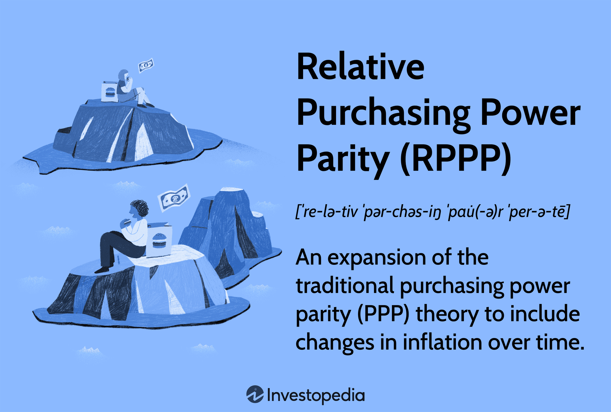

In today's global economy, the dynamics of exchange rates and purchasing power play a pivotal role for investors and traders. Understanding these elements is crucial for navigating the financial markets effectively. One fundamental economic theory that connects inflation rates with exchange rates is Relative Purchasing Power Parity (RPPP). This concept suggests that exchange rates between two countries should adjust to reflect changes in their respective inflation rates, thereby maintaining the purchasing power balance over time.

Algorithmic trading, commonly referred to as algo trading, utilizes cutting-edge technology and sophisticated mathematical models to optimize trading decisions. By leveraging high-speed data analysis and automation, algo trading enables the execution of trades under pre-defined criteria, seizing transient market opportunities that often escape human detection.



This article aims to explain the intersection of RPPP and algorithmic trading, shedding light on how these two worlds interact and their consequential impact on financial markets. Understanding these concepts fosters the ability to forecast market movements more accurately and gauging economic conditions with greater precision. This knowledge is indispensable for traders seeking competitive advantage and economists examining currency dynamics amidst inflationary pressures.

## Table of Contents

## Understanding Relative Purchasing Power Parity (RPPP)

Relative Purchasing Power Parity (RPPP) extends the foundational concept of Purchasing Power Parity (PPP) by linking inflation rates with exchange rates to explain currency value changes between countries. The core idea of RPPP is that variations in inflation rates between two countries will drive corresponding adjustments in their exchange rates. Specifically, if a country experiences a higher inflation rate compared to another, its currency is expected to depreciate proportionally.

### RPPP Formula

The RPPP can be mathematically expressed using the formula:

$$

\frac{e_1}{e_0} \approx \frac{1 + \text{inflation rate of country A}}{1 + \text{inflation rate of country B}} 
$$

Here, $e_0$ and $e_1$ represent the initial and future exchange rates, respectively, while the inflation rates of the two countries in question dictate the proportional change.

This mathematical representation underscores the dynamic nature of RPPP, founded on the principle of the law of one price. This principle posits that identical goods should maintain a constant price across various markets when prices are adjusted for exchange rates. In theory, this ensures that market forces bring the real price of goods to equilibrium globally.

### Practical Considerations

The practical application of RPPP is often challenged by several factors. While it provides a broad framework for understanding exchange rate movements driven by inflation differentials, market realities frequently disrupt its short-term applicability. Currency markets are influenced by a myriad of external factors, such as speculation, government intervention, and non-tradable goods, which can distort exchange rates.

Moreover, the assumption of RPPP holding true in competitive and efficient markets can often be unrealistic. Economic frictions like transportation costs, tariffs, and differences in product quality can further complicate the application of RPPP. Therefore, while RPPP offers valuable insights into long-term currency trends, its predictive power can be limited in the face of such market complexities.

### Conclusion

The RPPP theory serves as a vital tool for economists and traders aiming to comprehend how inflation impacts currency exchange rates over time. Despite its limitations and the challenges in its practical application, RPPP remains a significant theoretical construct for forecasting and understanding long-term currency movements linked to inflation differentials. As such, it continues to be a relevant topic of study in international finance, calling for a nuanced appreciation of its principles and the external variables affecting its outcomes.

## Algorithmic Trading: An Overview

Algorithmic trading employs computer algorithms to automate the process of trading financial instruments based on predefined rules and criteria. These algorithms can rapidly process large volumes of data, enabling traders to exploit transient opportunities in the market that may only exist for fractions of a second. The efficiency of [algorithmic trading](/wiki/algorithmic-trading) stems from its ability to eliminate human error and execute trades with extreme precision and speed.

A typical algorithmic trading strategy might integrate various technical indicators, such as moving averages and relative strength indices, with historical data analysis to predict potential price movements. By incorporating news sentiment analysis, algorithms can assess market sentiment and adjust trading strategies accordingly. This multimodal approach allows traders to navigate the complexities of the financial markets with more informed strategies.

Economic theories like Relative Purchasing Power Parity (RPPP) can also be incorporated into these algorithms. By accounting for macroeconomic factors such as inflation and exchange rate fluctuations, traders can enhance their strategy's robustness, potentially leading to better-informed decisions. For instance, an algorithm might adjust its trading tactics based on anticipated currency depreciation due to an inflation differential, as suggested by RPPP.

Advancements in [machine learning](/wiki/machine-learning) and [artificial intelligence](/wiki/ai-artificial-intelligence) have further increased the sophistication of algorithmic trading. Machine learning algorithms are able to identify and adapt to new patterns in data that may be too complex for traditional methods to detect. This adaptability can lead to improved predictive power and better trading performance over time. For example, [reinforcement learning](/wiki/reinforcement-learning), a type of machine learning, allows algorithms to learn optimal strategies through trial and error, continually refining their approach based on received feedback.

```python
# Example of a simple moving average crossover strategy in Python

def moving_average(data, window_size):
    return data.rolling(window=window_size).mean()

# Example data
import pandas as pd
price_data = pd.Series([100, 102, 104, 99, 98, 105, 107, 110])

# Calculate short and long moving averages
short_window = 3
long_window = 5
short_ma = moving_average(price_data, short_window)
long_ma = moving_average(price_data, long_window)

# Determine buy/sell signals
signals = pd.DataFrame(index=price_data.index)
signals['position'] = 0
signals['short_ma'] = short_ma
signals['long_ma'] = long_ma
signals['position'][short_window:] = \
    (signals['short_ma'][short_window:] > signals['long_ma'][short_window:]).astype(int)

signals['signal'] = signals['position'].diff()

# print buy/sell signals
print(signals)

# Output will show where the buy/sell signals (1 for buy, -1 for sell) occur based on moving average crossover
```

This example demonstrates a basic moving average crossover strategy, a common algo trading strategy where buy and sell signals are generated based on the relationship between short-term and long-term moving averages of a financial instrument's price. As algorithmic trading continues to evolve with the discipline of AI, we can expect even more complex and adaptive trading systems to develop, further transforming the landscape of financial trading.

## Integrating RPPP into Algo Trading

Integrating Relative Purchasing Power Parity (RPPP) into algorithmic trading entails the incorporation of inflation rate differentials and their consequences on currency valuations into trading algorithms. This process offers the potential to enhance the predictive capability of trading models by considering macroeconomic factors typically overlooked in technical analyses. An understanding of RPPP allows traders to formulate strategies that are more attuned to the economic realities affecting exchange rates.

At its core, RPPP posits that exchange rate movements are influenced by the differences in inflation rates between two countries. If one currency has a higher inflation rate relative to another, it tends to depreciate to maintain purchasing power parity. This dynamic can be expressed mathematically as:

$$

e_{t} = e_{0} \times \left( \frac{1 + i_{d}}{1 + i_{f}} \right)
$$

where $e_{t}$ is the future exchange rate, $e_{0}$ is the current exchange rate, $i_{d}$ is the domestic inflation rate, and $i_{f}$ is the foreign inflation rate.

By integrating this formula into algorithmic models, traders gain the ability to anticipate currency movements prompted by inflation discrepancies. Algorithms can be programmed to automatically adjust trading strategies based on updated inflation data, thereby providing a more dynamic response to market developments.

In the context of algorithmic trading, utilizing RPPP extends beyond the simplistic application of its formula. Algorithms can synthesize RPPP data with other trading indicators such as moving averages, relative strength indices, and economic news sentiment to reinforce strategy robustness. For instance, a Python script might incorporate RPPP predictions alongside technical signals:

```python
def calculate_rppp_rate(e0, id, if_):
    return e0 * ((1 + id) / (1 + if_))

current_exchange_rate = 1.2
domestic_inflation = 0.03
foreign_inflation = 0.01

predicted_exchange_rate = calculate_rppp_rate(current_exchange_rate, domestic_inflation, foreign_inflation)

# Example strategy combining RPPP and moving average
def trading_decision(rppp_rate, moving_average):
    if rppp_rate > moving_average:
        return "Buy"
    elif rppp_rate < moving_average:
        return "Sell"
    else:
        return "Hold"
```

This hybrid approach enables the generation of more nuanced trading signals, potentially improving profitability by aligning with both short-term market fluctuations and long-term economic trends. Moreover, integrating RPPP allows traders to identify opportunities that purely technical analyses might overlook, thereby crafting a more comprehensive trading strategy.

The success of this integration relies heavily on accurately modeling economic variables and continuously updating algorithms to reflect changing economic conditions. As advancements in data analytics and machine learning continue, the capacity to refine these models for greater market insight is anticipated to grow, offering traders increasingly sophisticated tools for decision-making.

## Limitations and Challenges

Relative Purchasing Power Parity (RPPP) and algorithmic trading each present unique limitations and challenges, despite their advantageous prospects in financial markets.

RPPP operates on several assumptions that often do not align with real-world economic conditions, affecting its accuracy. One foundational assumption is that of perfect competition, where markets are efficient, and all participants have access to the same information. However, in reality, markets are frequently plagued by inefficiencies, information asymmetries, and various forms of market power, disrupting the theoretical underpinnings of RPPP. Additionally, RPPP assumes the homogeneity of goods, suggesting that similar goods should have equivalent prices globally when exchange rates are considered. This assumption often fails, as local variations in taxes, tariffs, transportation costs, and preferences can lead to substantial discrepancies in pricing.

Another significant limitation of RPPP lies in its exclusion of non-tradable goods and services. Non-tradable assets, which cannot be easily exchanged between countries, such as real estate and personal services, are not considered in RPPP calculations, potentially skewing the accuracy of its predictions regarding currency valuations. Moreover, market sentiment, a critical driver of short-term currency fluctuations, is not accounted for in RPPP, lowering its efficacy as a predictive tool in volatile markets.

Algorithmic trading, while revolutionizing market participation through speed and efficiency, is not without its challenges. One significant technical issue is the risk of overfitting, which occurs when a trading model is excessively tailored to historical data, capturing noise instead of underlying patterns. This can result in poor predictive performance in future, unseen market conditions, undermining the robustness of trading strategies. Algorithmic traders must carefully balance the model's complexity to avoid overfitting while retaining generalizability.

Regulatory scrutiny is another critical challenge, as authorities increasingly examine the fairness and ethical implications of algorithmic trading. Concerns regarding market manipulation, such as spoofing and quote stuffing, have prompted regulators to impose stricter controls and transparency requirements on algorithmic trading practices, potentially impacting their operation. Ensuring compliance while maintaining competitive edge requires significant adaptation and innovation from market participants.

Given these limitations, both RPPP and algorithmic trading require careful consideration and continuous adjustment to navigate the complexities of global financial markets effectively.

## Conclusion

The application of Relative Purchasing Power Parity (RPPP) in algorithmic trading represents a significant convergence of economic theory and modern technological advancements. By integrating RPPP with trading algorithms, traders gain the ability to harness macroeconomic insights that can inform currency valuation strategies and trading decisions based on inflation differentials. This fusion requires a comprehensive understanding of both economic principles, like inflation's impact on exchange rates, and the nuances of computational techniques that algorithmic trading entails.

As algorithmic trading continues to evolve, incorporating advancements in artificial intelligence (AI) and big data analytics promises to further refine and enhance these strategies. These technologies can process vast datasets at unprecedented speeds, identifying subtle patterns and correlations that may not be immediately evident. For example, machine learning models can be developed to adaptively fine-tune trading strategies by incorporating new data on inflation rates and other macroeconomic indicators, allowing for more dynamic and responsive trading approaches.

To ensure competitiveness and informed decision-making in an increasingly complex financial landscape, traders and economists must actively engage with these technological advancements. Staying updated on emerging AI techniques and big data methodologies will enable them to improve their algorithmic trading strategies continually and optimize the integration of economic theories like RPPP. This continuous learning process is crucial as it equips market participants with the tools needed to navigate the challenges and embrace the opportunities presented by the fast-paced evolution of financial markets.

## References & Further Reading

[1]: Froot, K. A., & Rogoff, K. (1995). ["Perspectives on PPP and long-run real exchange rates."](https://www.nber.org/papers/w4952) Handbook of International Economics, Volume 3.

[2]: Levich, R. M. (1998). ["International Financial Markets: Prices and Policies"](https://archive.org/details/internationalfin00levi), 2nd Edition. McGraw-Hill.

[3]: Taylor, M. P., & Taylor, A. M. (2004). ["The Purchasing Power Parity Debate."](https://www.aeaweb.org/articles?id=10.1257/0895330042632744) Journal of Economic Perspectives, 18(4), 135-158.

[4]: ["Algorithmic Trading: Winning Strategies and Their Rationale"](https://onlinelibrary.wiley.com/doi/pdf/10.1002/9781118676998.fmatter) by Ernie Chan

[5]: ["Applied Econometric Time Series"](https://www.amazon.com/Applied-Econometric-Wiley-Probability-Statistics/dp/1118808568) by Walter Enders

[6]: ["Machine Learning for Asset Managers"](https://github.com/emoen/Machine-Learning-for-Asset-Managers) by Marcos Lopez de Prado