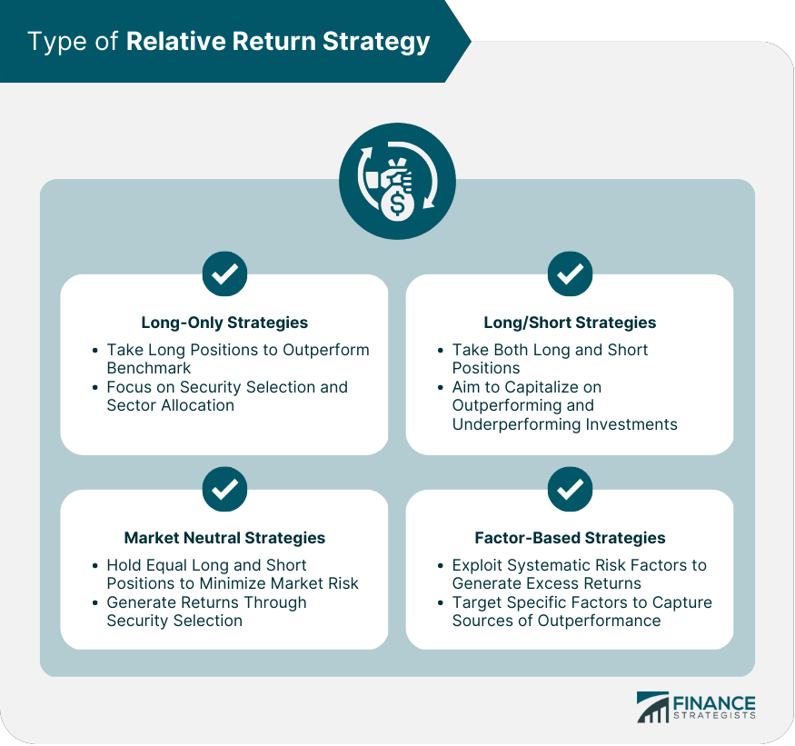

## Table of Contents

## What is relative return?

Relative return is a way to measure how well an investment is doing compared to something else, like a benchmark or another investment. It shows if your investment is doing better or worse than this comparison point. For example, if you invest in a stock and it goes up by 5%, but the market as a whole goes up by 10%, your relative return is negative because your stock did not perform as well as the market.

This measure is useful for investors who want to see if their choices are beating the market or other investments. It helps them understand if their strategy is working or if they need to make changes. By looking at relative return, investors can make smarter decisions about where to put their money to get the best results.

## How does relative return differ from absolute return?

Relative return and absolute return are two different ways to look at how well an investment is doing. Absolute return just tells you the total gain or loss of your investment over a certain time. For example, if you buy a stock for $100 and it goes up to $110, your absolute return is 10%. It's a simple way to see if you made money or lost money.

Relative return, on the other hand, compares your investment's performance to something else, like a stock market index. If your stock goes up by 10% but the market goes up by 15%, your relative return is negative because your stock didn't do as well as the market. Relative return helps you see if you're doing better or worse than others, which can be useful for deciding if you should change your investment strategy.

## Why is relative return important in investment analysis?

Relative return is important in investment analysis because it helps investors understand how their investments are doing compared to other options. Instead of just looking at how much money they made or lost, relative return shows if their choices were better or worse than the market or other investments. This is useful because it tells investors if their strategies are working well or if they need to make changes. For example, if an investor's portfolio grows by 8% but the market grows by 10%, the relative return is negative, indicating that the investor's choices did not beat the market.

By focusing on relative return, investors can make smarter decisions about where to put their money. It helps them see which investments are truly adding value compared to just following the market. This can lead to better long-term performance because it encourages investors to actively manage their portfolios and seek out investments that outperform others. Overall, relative return is a key tool for anyone looking to improve their investment strategy and achieve better results.

## Can you explain the basic mechanism of calculating relative return?

To calculate relative return, you need to compare the performance of your investment to a benchmark, like a stock market index. First, you find out the return of your investment over a specific time period. For example, if you bought a stock for $100 and it's now worth $110, your investment return is 10%. Next, you find the return of the benchmark over the same time period. If the stock market index went up by 8% during that time, you now have both numbers you need.

Then, you subtract the benchmark's return from your investment's return to get the relative return. In our example, your investment return is 10% and the benchmark's return is 8%. So, you do 10% minus 8%, which gives you a relative return of 2%. This positive number means your investment did better than the market. If the result was negative, it would mean your investment did worse than the market. This simple calculation helps you see how well your investment is doing compared to others.

## What are the common benchmarks used for calculating relative return?

When calculating relative return, people often use well-known stock market indexes as benchmarks. The most common ones are the S&P 500, which tracks the performance of 500 large companies in the U.S., and the Dow Jones Industrial Average, which follows 30 big companies. These indexes give a good picture of how the overall market is doing, so investors can see if their investments are doing better or worse than the market as a whole.

Another popular benchmark is the Nasdaq Composite, which includes many technology and internet companies. This is useful if you're investing mostly in tech stocks. For people investing outside the U.S., they might use the MSCI World Index or the FTSE 100, which are indexes for global and UK markets, respectively. By choosing the right benchmark, investors can get a clear idea of how their investments stack up against similar investments or the market in general.

## How do investors use relative return to assess portfolio performance?

Investors use relative return to see if their investments are doing better or worse than a benchmark like the S&P 500. They do this by comparing the return of their portfolio to the return of the benchmark over the same time. If their portfolio grows by 10% and the S&P 500 grows by 8%, the relative return is positive, which means their investments did better than the market. This helps investors feel good about their choices and can encourage them to keep doing what they're doing.

On the other hand, if the portfolio's return is lower than the benchmark, like if it only grows by 6% while the S&P 500 grows by 8%, the relative return is negative. This tells investors that their investments are not doing as well as they could be. They might then decide to change their strategy, maybe by [picking](/wiki/asset-class-picking) different stocks or adjusting how much they invest in certain areas. By looking at relative return, investors can make smarter choices to try to beat the market and improve their overall performance.

## What are the limitations of using relative return as a performance metric?

One big problem with using relative return is that it only tells you how well your investment did compared to something else, like the stock market. It doesn't say anything about how much actual money you made or lost. For example, if your investment went up by 10% but the market went up by 15%, your relative return is negative. But if you made a lot of money, you might still be happy with your investment even if it didn't beat the market.

Another issue is that relative return can make you focus too much on beating the market instead of thinking about your own goals. If your goal is to save for a house or retirement, it might not matter if your investments did better or worse than the market. What matters more is if you're on track to reach your personal goals. So, while relative return can be helpful, it's important to also look at other things like how much money you're actually making and whether you're meeting your own financial targets.

## How can relative return be used in different market conditions?

Relative return can help investors in all kinds of market situations, whether the market is going up, going down, or staying the same. When the market is doing well and going up, investors look at relative return to see if their investments are doing even better than the market. For example, if the market grows by 10% and your investment grows by 12%, your relative return is positive. This tells you that your choices are working well, even when everyone else is making money too.

In a down market, where the market is losing value, relative return can show if your investments are losing less money than the market. If the market drops by 8% but your investment only drops by 5%, your relative return is positive. This means your strategy is helping you lose less money than others, which can be a good thing during tough times. By looking at relative return, you can decide if you need to change your investments or if you're doing okay compared to the market.

## What advanced statistical methods can be applied to enhance the analysis of relative return?

To get a deeper look at relative return, investors can use a method called regression analysis. This helps them see how their investments move compared to the market. For example, by using regression, they can find out if their investments tend to go up or down more than the market. This is useful because it can show if their investments are riskier or safer than the market. Regression can also help predict future returns based on past data, which can guide investors in making smarter choices.

Another useful tool is risk-adjusted performance measures like the Sharpe Ratio. This method looks at how much return an investment gives for the amount of risk taken. By comparing the Sharpe Ratio of an investment to the market's Sharpe Ratio, investors can see if their investments are doing better or worse when you think about risk. This helps them decide if their investments are worth the risk or if they should look for safer options that still give good returns. Using these advanced methods can give investors a clearer picture of how well their investments are doing compared to the market.

## How does relative return influence investment strategy and asset allocation?

Relative return plays a big role in shaping an investor's strategy and deciding how to spread their money across different investments. By looking at relative return, investors can see if their choices are beating the market or other investments. If their portfolio is doing better than the market, they might feel confident to keep their current strategy. But if their investments are falling behind, they might want to change things up. For example, they could switch to different stocks or invest more in areas that are doing well compared to the market. This way, relative return helps investors make smart choices to try to get the best results.

Asset allocation is also influenced by relative return. If an investor sees that one type of investment, like stocks, is doing much better than the market, they might decide to put more money into stocks. On the other hand, if bonds are not keeping up with the market, they might reduce their bond holdings. By keeping an eye on relative return, investors can adjust their mix of investments to focus on what's working well. This helps them build a portfolio that's more likely to beat the market and meet their financial goals.

## Can relative return be negative, and what does it signify?

Yes, relative return can be negative. This happens when your investment does not do as well as the benchmark you are comparing it to. For example, if your stock goes up by 5% but the market goes up by 10%, your relative return is negative because your stock did not perform as well as the market. A negative relative return means that your investment choices are not beating the market or the other investments you are comparing them to.

When you see a negative relative return, it can be a sign that you might need to change your investment strategy. It tells you that your current choices are not working as well as they could be. You might decide to pick different stocks, invest in different areas, or adjust how much money you have in certain investments. By paying attention to relative return, you can make smarter decisions to try to do better in the future.

## What are the future trends and potential developments in the use of relative return metrics?

In the future, relative return metrics will likely become even more important as investors get better tools to analyze them. With technology getting better, investors will be able to use more advanced computer programs and data analysis to look at relative return in new ways. For example, they might use [artificial intelligence](/wiki/ai-artificial-intelligence) to predict how their investments will do compared to the market. This could help them make smarter choices and change their strategies faster when needed.

Another trend might be that more investors start using relative return not just to compare to big stock market indexes, but also to look at how they're doing compared to other types of investments, like real estate or cryptocurrencies. As the world of investing changes, relative return metrics will need to change too. This means they might start to include more types of investments and look at things like how much risk is involved or how sustainable the investments are. By doing this, investors can get a fuller picture of how well their money is working for them.

## What is the importance of understanding financial metrics in algorithmic trading?

Financial metrics are pivotal in evaluating and strategizing within algorithmic trading, which involves executing trades based on predefined rules and data analysis. These metrics serve as quantitative benchmarks that not only measure the performance of investment strategies but also offer insights into their viability over time.

Algorithmic trading, which leverages automation for executing trades, depends heavily on financial metrics to ensure the effectiveness and profitability of strategies. The implementation of these metrics aids traders in managing risks and achieving consistent returns. By utilizing financial metrics, traders can quantitatively assess their strategy’s performance, identify potential improvements, and adapt to changing market conditions for optimized results.

Among the vital financial metrics utilized are the Sharpe Ratio, Maximum Drawdown, and Total Return. Each of these metrics serves a unique purpose in providing a comprehensive understanding of a trading strategy’s performance:

1. **Sharpe Ratio**: This metric evaluates risk-adjusted returns. The Sharpe Ratio is calculated by subtracting the risk-free rate from the portfolio's return and then dividing by the standard deviation of the portfolio's excess return. Mathematically, it is expressed as:
$$
   \text{Sharpe Ratio} = \frac{R_p - R_f}{\sigma_p}

$$

   where $R_p$ is the portfolio return, $R_f$ is the risk-free rate, and $\sigma_p$ is the standard deviation of the portfolio's excess return. A higher Sharpe Ratio indicates a more favorable risk-adjusted return, providing confidence in the strategy's effectiveness against market volatility.

2. **Maximum Drawdown**: This metric identifies the largest peak-to-trough decline in a portfolio, revealing potential financial exposure during strategy implementation. It is crucial for understanding the risk of significant losses during adverse market conditions. The Maximum Drawdown helps traders gauge their risk tolerance and the robustness of their strategies under stress.

3. **Total Return**: Total Return considers the overall profit or loss from an investment, including interest, capital gains, dividends, and distributions gained over a specific period. It provides a straightforward measurement of the strategy's profitability without adjusting for volatility or risk.

These key metrics, when used collectively, offer a multifaceted view of an [algorithmic trading](/wiki/algorithmic-trading) strategy's performance, facilitating informed decision-making and strategy refinement. The interplay of these metrics allows traders to navigate the complexities of financial markets with improved precision and adaptability.

## What are the important metrics for evaluating algorithmic trading performance?

1. **Sharpe Ratio**: 

The Sharpe Ratio is a fundamental metric in evaluating algorithmic trading performance, providing a measure of risk-adjusted return. It is calculated by subtracting the risk-free rate from the expected portfolio return, and then dividing the result by the standard deviation of the portfolio returns. 

Mathematically, it is expressed as:

$$

\text{Sharpe Ratio} = \frac{R_p - R_f}{\sigma_p}
$$

Where:
- $R_p$ is the expected return of the portfolio
- $R_f$ is the risk-free rate of return
- $\sigma_p$ is the standard deviation of the portfolio's excess return

A higher Sharpe Ratio indicates better risk-adjusted performance, meaning the strategy generates higher returns for each unit of risk taken.

2. **Maximum Drawdown**: 

Maximum Drawdown (MDD) measures the largest peak-to-trough decline in the portfolio value before it achieves a new peak. It offers critical insight into the potential downside risk of a trading strategy. Maximum Drawdown is expressed as a percentage, portraying the magnitude of decline in the value of an investment.

The formula is:

$$

\text{Maximum Drawdown} = \frac{\text{Trough Value} - \text{Peak Value}}{\text{Peak Value}}
$$

This metric is important for assessing a strategy's resilience to market downturns and its capacity to recover from losses.

3. **Winning Percentage**:

Winning Percentage is the ratio of successful trades to the total number of trades conducted by an algorithm. It serves as an indicator of the strategy's accuracy and reliability.

The calculation is straightforward:

$$

\text{Winning Percentage} = \left(\frac{\text{Number of Winning Trades}}{\text{Total Number of Trades}}\right) \times 100\%
$$

A higher Winning Percentage suggests that the algorithm selects profitable trades more frequently, although it should be analyzed in conjunction with other metrics like the Sharpe Ratio and Maximum Drawdown to gauge the overall effectiveness of a trading strategy. Each metric provides unique insights into different aspects of risk and performance.

## How do Absolute and Relative Returns Compare in Strategy Evaluation?

Absolute and relative returns are fundamental concepts for evaluating investment strategies, particularly in algorithmic trading. Absolute return refers to the gain or loss of an investment over a specific period, presenting a direct measure of performance without any comparisons. It is represented as a percentage and calculated as:

$$
\text{Absolute Return} = \left( \frac{\text{Final Value} - \text{Initial Value}}{\text{Initial Value}} \right) \times 100\%
$$

In contrast, relative return considers an investment's performance in relation to a benchmark or market index. It helps assess whether a strategy outperforms or underperforms the broader market. The formula for relative return is:

$$
\text{Relative Return} = \text{Absolute Return of Investment} - \text{Return of Benchmark}
$$

Using relative return becomes crucial in volatile markets where absolute returns alone can be misleading. For example, a 5% absolute gain might appear satisfactory, but if the benchmark gained 10%, the strategy may actually underperform relative to the market.

Comparative analysis of absolute and relative returns provides insights into performance efficiency and strategy robustness. To illustrate, consider two investment strategies with equal absolute returns of 8%. If the benchmark return is 6%, the first strategy achieves a relative return of 2%, indicating market outperformance. If the second strategy's benchmark is 9%, it results in a relative return of -1%, suggesting underperformance.

For algorithmic trading, integrating both measures enhances understanding of risk-adjusted performance, market conditions, and competitive positioning. By analyzing differential performances, investors can adjust algorithm parameters, reallocate assets, or pivot strategies to adapt to changing market environments. This dual approach aids in identifying robust strategies that consistently deliver better risk-adjusted returns compared to their peers.

## References & Further Reading

[1]: Bergstra, J., Bardenet, R., Bengio, Y., & Kégl, B. (2011). ["Algorithms for Hyper-Parameter Optimization."](https://papers.nips.cc/paper/4443-algorithms-for-hyper-parameter-optimization) Advances in Neural Information Processing Systems 24.

[2]: ["Advances in Financial Machine Learning"](https://www.amazon.com/Advances-Financial-Machine-Learning-Marcos/dp/1119482089) by Marcos Lopez de Prado

[3]: ["Evidence-Based Technical Analysis: Applying the Scientific Method and Statistical Inference to Trading Signals"](https://www.amazon.com/Evidence-Based-Technical-Analysis-Scientific-Statistical/dp/0470008741) by David Aronson

[4]: ["Machine Learning for Algorithmic Trading"](https://github.com/stefan-jansen/machine-learning-for-trading) by Stefan Jansen

[5]: ["Quantitative Trading: How to Build Your Own Algorithmic Trading Business"](https://www.amazon.com/Quantitative-Trading-Build-Algorithmic-Business/dp/1119800064) by Ernest P. Chan