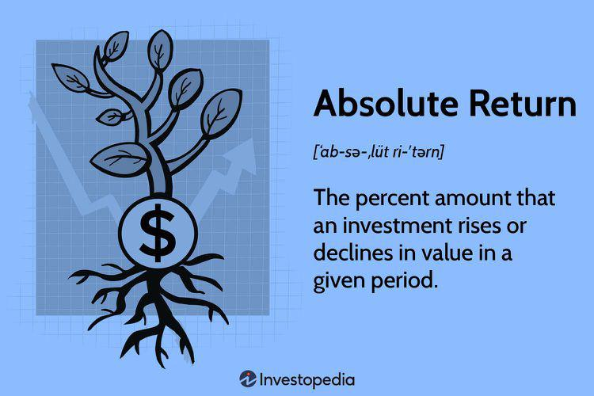

In financial markets, evaluating investment performance is crucial for informed decision-making. Investors strive to maximize returns while managing risks, and assessing these returns relative to established benchmarks is fundamental in determining the effectiveness of their strategies. A benchmark serves as a standard against which the performance of an investment can be measured, often representing a market index or a composite of various assets. By comparing investment returns to these benchmarks, investors can gauge not only absolute performance but also how well their strategies perform in a competitive context.

Algorithmic trading, a significant innovation driven by the advance of technology, leverages predefined rules and data analysis to execute trades. This automation allows for swift and efficient trading, often beyond human capability in terms of speed and accuracy. As this method reshapes investment landscapes, understanding key financial metrics becomes essential. These metrics facilitate the evaluation of strategy effectiveness, risk management, and the pursuit of consistent returns.



This article explores the intricate relationship between financial metrics, relative return, investment performance, and algorithmic trading. Financial metrics such as the Sharpe Ratio, Maximum Drawdown, and Total Return provide insights into risk-adjusted performance, volatility, and profitability. By analyzing these metrics in conjunction with relative return—a measure that expresses an asset's performance against a benchmark—we aim to enhance the decision-making process for investors and inform strategy optimization in algorithmic trading.

## Table of Contents

## Understanding Financial Metrics in Algorithmic Trading

Financial metrics are pivotal in evaluating and strategizing within algorithmic trading, which involves executing trades based on predefined rules and data analysis. These metrics serve as quantitative benchmarks that not only measure the performance of investment strategies but also offer insights into their viability over time.

Algorithmic trading, which leverages automation for executing trades, depends heavily on financial metrics to ensure the effectiveness and profitability of strategies. The implementation of these metrics aids traders in managing risks and achieving consistent returns. By utilizing financial metrics, traders can quantitatively assess their strategy’s performance, identify potential improvements, and adapt to changing market conditions for optimized results.

Among the vital financial metrics utilized are the Sharpe Ratio, Maximum Drawdown, and Total Return. Each of these metrics serves a unique purpose in providing a comprehensive understanding of a trading strategy’s performance:

1. **Sharpe Ratio**: This metric evaluates risk-adjusted returns. The Sharpe Ratio is calculated by subtracting the risk-free rate from the portfolio's return and then dividing by the standard deviation of the portfolio's excess return. Mathematically, it is expressed as:
$$
   \text{Sharpe Ratio} = \frac{R_p - R_f}{\sigma_p}

$$

   where $R_p$ is the portfolio return, $R_f$ is the risk-free rate, and $\sigma_p$ is the standard deviation of the portfolio's excess return. A higher Sharpe Ratio indicates a more favorable risk-adjusted return, providing confidence in the strategy's effectiveness against market volatility.

2. **Maximum Drawdown**: This metric identifies the largest peak-to-trough decline in a portfolio, revealing potential financial exposure during strategy implementation. It is crucial for understanding the risk of significant losses during adverse market conditions. The Maximum Drawdown helps traders gauge their risk tolerance and the robustness of their strategies under stress.

3. **Total Return**: Total Return considers the overall profit or loss from an investment, including interest, capital gains, dividends, and distributions gained over a specific period. It provides a straightforward measurement of the strategy's profitability without adjusting for volatility or risk.

These key metrics, when used collectively, offer a multifaceted view of an [algorithmic trading](/wiki/algorithmic-trading) strategy's performance, facilitating informed decision-making and strategy refinement. The interplay of these metrics allows traders to navigate the complexities of financial markets with improved precision and adaptability.

## Relative Return: A Key Performance Indicator

Relative return is a fundamental performance metric that compares an asset's performance against a designated benchmark. This measure is instrumental in assessing an investment's effectiveness by providing context regarding how an asset or portfolio performs relative to the broader market or a specific sector.

Understanding relative return is crucial for evaluating fund managers’ skills and the strategic advantages of their investment methods. It allows investors to determine whether an asset manager has successfully exceeded the expected performance of a benchmark. A positive relative return indicates that the investment has outperformed the benchmark, while a negative relative return implies underperformance.

Relative return is often intertwined with the concept of "alpha," which represents the excess return of an investment relative to the return of a benchmark index. Alpha quantifies the value added by the portfolio manager's investment choices, independent of the market's movement. For instance, if a mutual fund returns 10% and its benchmark index returns 8%, the alpha is 2%. This result indicates superior investment strategy or management performance.

In contrast, absolute return refers to the total return generated by an investment over a specific period, without reference to any benchmark. While absolute returns provide a clear picture of gains or losses, they do not offer context on how these results compare to the market or similar investments, thereby limiting a comprehensive assessment of investment performance.

In conclusion, relative return as a key performance indicator offers nuanced insights by contrasting the broader market’s conditions, thereby helping investors to recognize superior investment strategies and fund manager expertise.

## Important Metrics for Evaluating Algorithmic Trading Performance

1. **Sharpe Ratio**: 

The Sharpe Ratio is a fundamental metric in evaluating algorithmic trading performance, providing a measure of risk-adjusted return. It is calculated by subtracting the risk-free rate from the expected portfolio return, and then dividing the result by the standard deviation of the portfolio returns. 

Mathematically, it is expressed as:

$$

\text{Sharpe Ratio} = \frac{R_p - R_f}{\sigma_p}
$$

Where:
- $R_p$ is the expected return of the portfolio
- $R_f$ is the risk-free rate of return
- $\sigma_p$ is the standard deviation of the portfolio's excess return

A higher Sharpe Ratio indicates better risk-adjusted performance, meaning the strategy generates higher returns for each unit of risk taken.

2. **Maximum Drawdown**: 

Maximum Drawdown (MDD) measures the largest peak-to-trough decline in the portfolio value before it achieves a new peak. It offers critical insight into the potential downside risk of a trading strategy. Maximum Drawdown is expressed as a percentage, portraying the magnitude of decline in the value of an investment.

The formula is:

$$

\text{Maximum Drawdown} = \frac{\text{Trough Value} - \text{Peak Value}}{\text{Peak Value}}
$$

This metric is important for assessing a strategy's resilience to market downturns and its capacity to recover from losses.

3. **Winning Percentage**:

Winning Percentage is the ratio of successful trades to the total number of trades conducted by an algorithm. It serves as an indicator of the strategy's accuracy and reliability.

The calculation is straightforward:

$$

\text{Winning Percentage} = \left(\frac{\text{Number of Winning Trades}}{\text{Total Number of Trades}}\right) \times 100\%
$$

A higher Winning Percentage suggests that the algorithm selects profitable trades more frequently, although it should be analyzed in conjunction with other metrics like the Sharpe Ratio and Maximum Drawdown to gauge the overall effectiveness of a trading strategy. Each metric provides unique insights into different aspects of risk and performance.

## Comparing Absolute and Relative Returns in Strategy Evaluation

Absolute and relative returns are fundamental concepts for evaluating investment strategies, particularly in algorithmic trading. Absolute return refers to the gain or loss of an investment over a specific period, presenting a direct measure of performance without any comparisons. It is represented as a percentage and calculated as:

$$
\text{Absolute Return} = \left( \frac{\text{Final Value} - \text{Initial Value}}{\text{Initial Value}} \right) \times 100\%
$$

In contrast, relative return considers an investment's performance in relation to a benchmark or market index. It helps assess whether a strategy outperforms or underperforms the broader market. The formula for relative return is:

$$
\text{Relative Return} = \text{Absolute Return of Investment} - \text{Return of Benchmark}
$$

Using relative return becomes crucial in volatile markets where absolute returns alone can be misleading. For example, a 5% absolute gain might appear satisfactory, but if the benchmark gained 10%, the strategy may actually underperform relative to the market.

Comparative analysis of absolute and relative returns provides insights into performance efficiency and strategy robustness. To illustrate, consider two investment strategies with equal absolute returns of 8%. If the benchmark return is 6%, the first strategy achieves a relative return of 2%, indicating market outperformance. If the second strategy's benchmark is 9%, it results in a relative return of -1%, suggesting underperformance.

For algorithmic trading, integrating both measures enhances understanding of risk-adjusted performance, market conditions, and competitive positioning. By analyzing differential performances, investors can adjust algorithm parameters, reallocate assets, or pivot strategies to adapt to changing market environments. This dual approach aids in identifying robust strategies that consistently deliver better risk-adjusted returns compared to their peers.

## Challenges and Considerations in Algorithmic Trading

Algorithmic trading, while offering the potential for high efficiency and profit, introduces several challenges and considerations that necessitate thorough evaluation and strategic adaptation. One notable risk is overfitting, where a trading algorithm is so closely tailored to historical data that it loses its predictive power when applied to new data sets. Overfitting can result in misleadingly high backtest results that do not translate into real-world performance. To mitigate this risk, it is crucial to employ robust model validation techniques such as cross-validation and out-of-sample testing. 

Increased market exposure is another concern associated with algorithmic trading. Algorithms often execute high volumes of trades in rapid succession, exposing traders to significant financial risks in volatile market conditions. To manage these risks, traders need to incorporate risk management strategies like stop-loss orders and position sizing algorithms that adjust exposure based on market conditions.

Metrics used to evaluate algorithmic trading performance can also be impacted by various factors, including transaction costs, data latency, and market fluctuations. Transaction costs, such as broker fees and the bid-ask spread, can significantly erode profit margins, especially in high-frequency trading strategies. Data latency, the delay between the occurrence of a market event and the subsequent reaction by the trading algorithm, can lead to suboptimal trade execution. This is particularly critical for strategies relying on timely information to capitalize on short-lived opportunities. Accurately accounting for these factors is essential to ensure reliability in performance assessment.

Market fluctuations pose additional challenges by introducing unpredictability and risk of significant drawdowns. Algorithmic strategies must be adaptable, continuously optimized to remain effective under changing market conditions. Implementing [machine learning](/wiki/machine-learning) techniques can enhance adaptability, enabling algorithms to learn from new data and adjust their strategies accordingly. The following Python snippet illustrates a simple implementation of machine learning in algorithmic trading using a stochastic gradient descent (SGD) classifier:

```python
from sklearn.model_selection import train_test_split
from sklearn.linear_model import SGDClassifier
from sklearn.metrics import accuracy_score

# Example feature and target data
features = ...  # Historical market data
targets = ...   # Target labels (e.g., buy/sell signals)

# Split data into training and testing sets
X_train, X_test, y_train, y_test = train_test_split(features, targets, test_size=0.2)

# Initialize and train the SGDClassifier
clf = SGDClassifier(max_iter=1000, tol=1e-3)
clf.fit(X_train, y_train)

# Predict and evaluate accuracy on the test set
predictions = clf.predict(X_test)
accuracy = accuracy_score(y_test, predictions)
print(f'Accuracy: {accuracy:.2f}')
```

In conclusion, while algorithmic trading presents a frontier of opportunities, navigating its challenges requires a nuanced understanding of potential pitfalls and strategic adaptability. With comprehensive evaluation and ongoing optimization, algorithmic trading strategies can be fine-tuned to achieve desired performance metrics despite market complexities.

## Conclusion

Evaluating financial metrics within algorithmic trading is essential for optimizing investment strategies. This evaluation provides a structured approach to understanding how well an investment strategy performs against market conditions and benchmarks. Financial metrics such as the Sharpe Ratio, Maximum Drawdown, and Relative Return are key indicators that offer detailed insights into the risk-adjusted performance, potential financial exposure, and efficiency of investment strategies.

Understanding relative returns alongside these key performance metrics empowers investors to make informed decisions tailored to specific market conditions. For instance, relative return, often represented by alpha ($\alpha$), is crucial in assessing an asset's performance relative to its benchmark, highlighting the effectiveness of fund managers and the superiority of the investment strategy. Monitoring the relative return combined with metrics like the Sharpe Ratio enables investors to evaluate strategies not just on standalone returns but in relation to their risk and market benchmarks, offering a comprehensive view of performance.

Moreover, continuous monitoring and adaptability are indispensable for maintaining performance in the ever-evolving financial markets. Algorithms used in trading must be regularly updated and optimized to reflect current data and market conditions, ensuring they remain effective and relevant. As financial markets are inherently dynamic, strategies need to be flexible to adapt to changes such as market [volatility](/wiki/volatility-trading-strategies), economic shifts, and technological advancements.

Python, for example, offers extensive libraries like NumPy and Pandas for analyzing these metrics. Here's a simple illustration in Python to calculate the Sharpe Ratio:

```python
import numpy as np

def calculate_sharpe_ratio(returns, risk_free_rate):
    excess_returns = returns - risk_free_rate
    return np.mean(excess_returns) / np.std(excess_returns)

# Example usage
daily_returns = np.array([0.01, 0.02, -0.01, 0.007])
risk_free_rate = 0.0001
sharpe_ratio = calculate_sharpe_ratio(daily_returns, risk_free_rate)
print("Sharpe Ratio:", sharpe_ratio)
```

In conclusion, a thorough grasp of financial metrics and their application in algorithmic trading allows for improved strategic decisions, ensuring that investment strategies are both effective and resilient in a rapidly changing financial landscape.

## References & Further Reading

[1]: Bergstra, J., Bardenet, R., Bengio, Y., & Kégl, B. (2011). ["Algorithms for Hyper-Parameter Optimization."](https://papers.nips.cc/paper/4443-algorithms-for-hyper-parameter-optimization) Advances in Neural Information Processing Systems 24.

[2]: ["Advances in Financial Machine Learning"](https://www.amazon.com/Advances-Financial-Machine-Learning-Marcos/dp/1119482089) by Marcos Lopez de Prado

[3]: ["Evidence-Based Technical Analysis: Applying the Scientific Method and Statistical Inference to Trading Signals"](https://www.amazon.com/Evidence-Based-Technical-Analysis-Scientific-Statistical/dp/0470008741) by David Aronson

[4]: ["Machine Learning for Algorithmic Trading"](https://github.com/stefan-jansen/machine-learning-for-trading) by Stefan Jansen

[5]: ["Quantitative Trading: How to Build Your Own Algorithmic Trading Business"](https://www.amazon.com/Quantitative-Trading-Build-Algorithmic-Business/dp/1119800064) by Ernest P. Chan