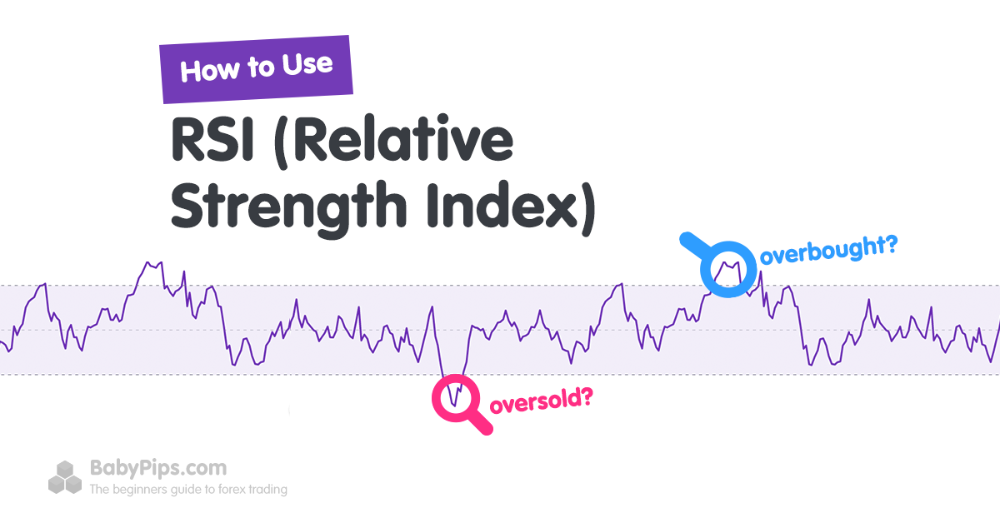

## Table of Contents

## What is the Relative Strength Index (RSI) in forex trading?

The Relative Strength Index (RSI) is a tool used in forex trading to measure how fast and how much a currency's price is changing. It helps traders understand if a currency is being bought a lot (overbought) or sold a lot (oversold). The RSI is shown as a number between 0 and 100. If the RSI is above 70, it might mean the currency is overbought and could soon drop in price. If it's below 30, it might mean the currency is oversold and could soon rise in price.

Traders use the RSI to make decisions about when to buy or sell a currency. For example, if the RSI shows a currency is oversold, a trader might decide to buy it, expecting the price to go up. On the other hand, if the RSI shows a currency is overbought, a trader might sell it, expecting the price to go down. The RSI can also show when a trend might be changing, which helps traders plan their next moves in the market.

## How is the RSI calculated?

The RSI is calculated by looking at the average gains and losses of a currency's price over a certain number of days, usually 14 days. First, you find the difference between the closing prices of the currency from one day to the next. If the price went up, that's a gain. If it went down, that's a loss. You then calculate the average gain and the average loss over those 14 days. To do this, you add up all the gains and divide by 14, and do the same for the losses.

Next, you use these averages to find the Relative Strength (RS), which is the average gain divided by the average loss. The RSI is then calculated using the formula: RSI = 100 - (100 / (1 + RS)). This gives you a number between 0 and 100. The RSI helps traders see if a currency is being bought or sold a lot, which can help them decide when to buy or sell the currency themselves.

## What does the RSI measure in the context of forex markets?

The RSI measures how fast and how much a currency's price is changing in the forex market. It looks at the average gains and losses of the currency's price over a set number of days, usually 14 days. By doing this, the RSI gives traders a number between 0 and 100 that shows if the currency is being bought a lot or sold a lot.

Traders use the RSI to decide when to buy or sell a currency. If the RSI is above 70, it might mean the currency is overbought and could soon drop in price. If the RSI is below 30, it might mean the currency is oversold and could soon rise in price. This helps traders make better choices about when to enter or exit the market.

## What are the typical settings used for RSI in forex trading?

In forex trading, the typical setting for the RSI is 14 days. This means that the RSI looks at the average gains and losses of a currency's price over the last 14 days to give traders a number between 0 and 100. This setting is used because it gives a good balance between being sensitive to recent price changes and showing the overall trend of the currency.

Traders often use the RSI to see if a currency is overbought or oversold. If the RSI is above 70, it might mean the currency is overbought and could soon drop in price. If it's below 30, it might mean the currency is oversold and could soon rise in price. These levels help traders decide when to buy or sell a currency. Some traders might change the RSI setting to a shorter period, like 9 days, to get quicker signals, or a longer period, like 25 days, for a smoother trend, but 14 days is the most common setting.

## How can traders interpret RSI values to make trading decisions?

Traders use the RSI to help them decide when to buy or sell a currency. If the RSI is above 70, it means the currency might be overbought. This could be a sign that the price might soon go down. So, a trader might decide to sell the currency before the price drops. On the other hand, if the RSI is below 30, it means the currency might be oversold. This could be a sign that the price might soon go up. So, a trader might decide to buy the currency before the price rises.

The RSI can also show when a trend might be changing. If the RSI starts to move away from being overbought or oversold, it might mean the price trend is changing too. For example, if the RSI was above 70 and starts to go down, it could mean the price might start to go down too. Traders watch for these changes to plan their next moves in the market. By understanding the RSI, traders can make better choices about when to enter or exit the market.

## What is considered an overbought or oversold condition using RSI?

In forex trading, an overbought condition happens when the RSI value is above 70. This means the currency has been bought a lot recently and its price might be too high. Traders see this as a sign that the price could soon go down. So, they might decide to sell the currency before its price drops.

An oversold condition happens when the RSI value is below 30. This means the currency has been sold a lot recently and its price might be too low. Traders see this as a sign that the price could soon go up. So, they might decide to buy the currency before its price rises.

## Can RSI be used to identify potential trend reversals in forex?

Yes, traders can use the RSI to spot when a currency's price trend might be about to change. When the RSI goes above 70, it means the currency is overbought, and the price might soon go down. When the RSI goes below 30, it means the currency is oversold, and the price might soon go up. If the RSI starts moving away from these levels, it could be a sign that the price trend is changing too. For example, if the RSI was over 70 and starts to go down, it might mean the price will start to go down too.

Traders watch for these changes in the RSI to plan their next moves. If they see the RSI moving away from overbought or oversold levels, they might decide to buy or sell the currency before the price changes. This helps them make better choices about when to enter or exit the market. By understanding the RSI, traders can be more ready for when the price trend might reverse.

## How does RSI differ from other momentum indicators in forex trading?

The RSI is a special tool in forex trading because it measures how fast and how much a currency's price is changing. It does this by looking at the average gains and losses over a set number of days, usually 14 days. This gives traders a number between 0 and 100. If the RSI is above 70, it means the currency might be overbought and could soon drop in price. If it's below 30, it means the currency might be oversold and could soon rise in price. This helps traders decide when to buy or sell a currency.

Other momentum indicators, like the Moving Average Convergence Divergence (MACD) or the Stochastic Oscillator, also help traders see how fast a currency's price is changing. But they do it in different ways. The MACD looks at the difference between two moving averages to show momentum, while the Stochastic Oscillator compares a currency's closing price to its price range over a certain period. Each of these tools gives traders different information about the market, so they might use them together to make better trading decisions.

## What are the limitations of using RSI in forex trading?

The RSI is a helpful tool for traders, but it has some limits. One big problem is that it can give false signals. For example, if the RSI goes above 70, it might look like the currency is overbought and will go down soon. But sometimes, the price keeps going up even after the RSI goes over 70. This can trick traders into selling too early. The same thing can happen when the RSI goes below 30. Traders might think the currency is oversold and will go up, but the price might keep going down.

Another limit of the RSI is that it doesn't work well in markets that are going in one direction for a long time, called trending markets. In a strong uptrend, the RSI might stay above 70 for a long time, which can make traders think the currency is overbought when it's really just following the trend. The opposite is true in a strong downtrend. The RSI might stay below 30, making traders think the currency is oversold when it's really just following the trend. Because of these limits, many traders use the RSI along with other tools to get a better picture of what's happening in the market.

## How can RSI be combined with other technical indicators for better results?

Traders can get better results by using the RSI along with other tools, like the Moving Average Convergence Divergence (MACD). The RSI helps traders see if a currency is overbought or oversold, but it can give false signals sometimes. The MACD looks at the difference between two moving averages to show momentum. When traders use both the RSI and the MACD, they can check if the signals they're getting from one tool match the signals from the other. If both tools are showing the same thing, it can make traders more sure about their decisions.

Another tool that works well with the RSI is the Stochastic Oscillator. The Stochastic Oscillator compares a currency's closing price to its price range over a certain period. Like the RSI, it also shows if a currency is overbought or oversold. When traders use both the RSI and the Stochastic Oscillator, they can get a better idea of whether a currency is really overbought or oversold. If both tools agree, it can give traders more confidence in their trading choices. By combining the RSI with other tools, traders can get a fuller picture of the market and make better decisions about when to buy or sell a currency.

## What are some advanced RSI strategies used by experienced forex traders?

Experienced forex traders often use a strategy called RSI divergence to spot when a currency's price trend might be about to change. RSI divergence happens when the currency's price is moving in one direction, but the RSI is moving in the opposite direction. For example, if the currency's price is going up but the RSI is going down, it might mean the price will soon start to go down too. Traders watch for these differences between the price and the RSI to decide when to buy or sell a currency. By understanding RSI divergence, traders can be more ready for when the price trend might reverse.

Another advanced strategy is using different time periods for the RSI. While the typical setting is 14 days, some traders might use a shorter period like 9 days to get quicker signals or a longer period like 25 days for a smoother trend. By looking at the RSI with different time periods, traders can get a better idea of what's happening in the market. For example, a trader might use a 9-day RSI to spot quick changes and a 25-day RSI to see the bigger picture. This helps them make more informed decisions about when to enter or exit the market.

## How can traders adjust RSI settings for different forex market conditions?

Traders can change the RSI settings to fit different market conditions. In a market that's moving fast, traders might use a shorter time period for the RSI, like 9 days. This helps them see quick changes in the currency's price. If the market is moving slowly, traders might use a longer time period, like 25 days. This gives them a smoother view of the trend and helps them avoid false signals.

In a market that's going up or down a lot, called a trending market, the RSI might stay overbought or oversold for a long time. To deal with this, traders can change the levels they use to decide when a currency is overbought or oversold. Instead of using 70 and 30, they might use 80 and 20. This can help them avoid selling or buying too early in a strong trend. By adjusting the RSI settings, traders can make better choices about when to enter or exit the market.

## What is the Role of RSI in Forex Trading?

The Relative Strength Index (RSI) is a momentum oscillator that measures the speed and change of price movements, often used to identify overbought or oversold market conditions. Developed by J. Welles Wilder in 1978, the RSI is one of the most widely utilized tools in technical analysis. The RSI is calculated using the formula:

$$
RSI = 100 - \left( \frac{100}{1 + RS} \right)
$$

where RS (Relative Strength) is the average of the closes of a set number of up-periods divided by the average of the closes of a set number of down-periods. Typically, the RSI is calculated over a 14-day period, but traders may adjust this to suit their specific strategy.

The RSI scale ranges from 0 to 100, allowing traders to gauge the strength and velocity of a currency pair's price movement. An RSI reading above 70 typically indicates that a currency pair is overbought, suggesting that a price reversal or correction may be imminent. Conversely, an RSI reading below 30 suggests that a currency pair is oversold, indicating potential upward price movement.

For example, if an RSI reading on a currency pair reaches 80, a trader might consider this an overbought signal, prompting a review for potential selling opportunities. Alternatively, if the RSI falls to 25, this might signal an oversold condition, where a trader could contemplate entering a long position.

Traders might employ the RSI in conjunction with other indicators or chart patterns to confirm signals and reduce the potential for false readings. Nonetheless, while RSI is a powerful tool in the trader’s arsenal, reliance solely on RSI without considering other factors can result in poor trade decisions, especially during strong trends where an asset can remain overbought or oversold for extended periods. Proper [backtesting](/wiki/backtesting) and strategy development are essential for effective RSI-based decision-making.

## References & Further Reading

[1]: Wilder, J. W. (1978). ["New Concepts in Technical Trading Systems"](https://archive.org/details/newconceptsintec00wild). Trend Research.

[2]: Murphy, J. J. (1999). ["Technical Analysis of the Financial Markets: A Comprehensive Guide to Trading Methods and Applications"](https://archive.org/details/technicalanalysi0000murp). New York Institute of Finance.

[3]: Chan, E. (2009). ["Quantitative Trading: How to Build Your Own Algorithmic Trading Business"](https://github.com/ftvision/quant_trading_echan_book). Wiley.

[4]: Lopez de Prado, M. (2018). ["Advances in Financial Machine Learning"](https://books.google.com/books/about/Advances_in_Financial_Machine_Learning.html?id=oU9KDwAAQBAJ). Wiley.

[5]: Aronson, D. (2007). ["Evidence-Based Technical Analysis: Applying the Scientific Method and Statistical Inference to Trading Signals"](https://www.amazon.com/Evidence-Based-Technical-Analysis-Scientific-Statistical/dp/0470008741). Wiley.

[6]: Jansen, S. (2020). ["Machine Learning for Algorithmic Trading"](https://github.com/stefan-jansen/machine-learning-for-trading). Packt Publishing.