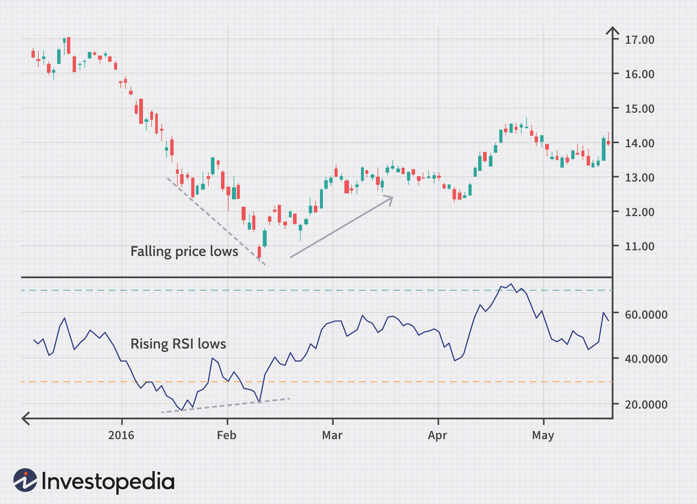

Foreign exchange trading, or Forex trading, involves the exchange of currencies on a global decentralized market. As one of the largest financial markets in the world, its daily trading volume surpasses $6 trillion, highlighting its crucial role in global economics. The Forex market operates 24 hours a day through an electronic network of banks, corporations, and individual traders, enabling currency pairs to be traded across different time zones.

Technical analysis plays a vital role in predicting market movements within Forex trading. By evaluating historical market data, especially price and volume, technical analysis allows traders to identify trends and patterns that assist in informed decision-making. Unlike fundamental analysis, which considers economic indicators and geopolitical events, technical analysis focuses on price action to forecast future movements.



A key tool within technical analysis is the Relative Strength Index (RSI), developed by J. Welles Wilder in 1978. The RSI is a momentum oscillator that measures the speed and change of price movements. It ranges from 0 to 100, with levels typically set at 70 and 30 to indicate overbought or oversold conditions, respectively. Traders utilize RSI to gauge if a currency pair is likely to reverse direction or continue its trend, aiding in timing entry or exit points.

The rise of algorithmic trading has significantly transformed Forex markets, allowing trades to be executed at speeds unattainable by human traders. Algorithmic trading involves the use of computer programs to automatically place trades based on pre-defined criteria and strategies. This method of trading brings benefits such as improved order execution, minimized human error, and the ability to backtest historical data for optimizing trading strategies.

This article aims to explore the integration of RSI into algorithmic trading systems within the Forex market. By examining how RSI can be implemented into automated trading strategies, we hope to provide insights into the benefits and challenges of using this technical indicator to enhance trading performance.

## Table of Contents

## Understanding Forex Trading and Its Dynamics

Foreign exchange trading, commonly known as Forex trading, is the global marketplace for exchanging national currencies against one another. Operating 24 hours a day, five days a week, Forex trading is essential due to its role in determining currency exchange rates, which are vital for international trade and investments. The Forex market is the largest and most liquid financial market in the world, with a daily trading volume exceeding $6 trillion, as of recent estimates.

Forex trading operates on an over-the-counter (OTC) basis, meaning there is no centralized exchange. Instead, trading occurs electronically through computer networks, connecting traders worldwide. This facilitates continuous trading and enhances market accessibility, attracting a diverse range of participants such as banks, corporations, fund managers, retail traders, and speculators.

In Forex trading, currencies are quoted in pairs. The most actively traded pairs, known as major currency pairs, include EUR/USD (Euro/US Dollar), USD/JPY (US Dollar/Japanese Yen), GBP/USD (British Pound/US Dollar), and USD/CHF (US Dollar/Swiss Franc). These pairs represent currencies from some of the world's largest economies, influencing their exchange rates are various economic factors, such as interest rates, inflation, political stability, economic performance, and geopolitical events. Economic indicators, such as GDP growth rates, employment figures, and trade balances, also play a crucial role in impacting Forex [volatility](/wiki/volatility-trading-strategies) and trends.

Forex traders can engage in different trading styles based on their strategies, risk tolerance, and market conditions. **Day trading** involves buying and selling currency pairs within a single trading day, benefiting from small price movements. Traders employing this style close all positions by the end of the day, avoiding overnight exposure. **Swing trading** spans several days to weeks, capturing intermediate-term price swings. It suits traders who prefer to analyze broader market trends rather than rapid fluctuations. **Long-term trading**, known as position trading, involves holding positions for several months or even years. This style is favored by traders who base their strategies on [fundamental analysis](/wiki/fundamental-analysis), taking into account macroeconomic conditions and currency valuation over extended periods.

Liquidity and volatility are two vital characteristics of the Forex market. Liquidity refers to the ease with which currency pairs can be bought or sold without dramatically affecting their prices. High [liquidity](/wiki/liquidity-risk-premium), particularly in major currency pairs, ensures efficient pricing and tighter spreads, making it easier for traders to enter and [exit](/wiki/exit-strategy) positions. Volatility, on the other hand, indicates the magnitude of price changes in the market. While high volatility can present trading opportunities, it also increases risk, necessitating robust risk management strategies.

Forex market dynamics are driven by a myriad of factors, where participants need to navigate economic indicators, political events, market sentiment, and global financial developments to succeed. Understanding these dynamics is crucial for traders aiming to exploit the potential of Forex trading.

## Technical Analysis in Forex Trading

Technical analysis is a method used in Forex trading to forecast future price movements by analyzing historical market data, primarily price and [volume](/wiki/volume-trading-strategy). Its significance lies in its ability to provide traders with actionable insights based on identifiable patterns and trends, rather than relying purely on economic indicators and fundamental data. This approach appeals to many traders due to its focus on market-generated information, rather than world events that can be subjective or open to interpretation.

Key elements of technical analysis include price action, chart patterns, and indicators. Price action refers to the movement of a security's price over time and is often displayed on charts. Traders analyze these movements to predict future price behavior, taking into consideration factors such as support and resistance levels. Chart patterns, such as head and shoulders or flags, represent particular price action configurations that are believed to forecast future movements.

Indicators are mathematical calculations based on the price and/or volume of a security, used to aid in decision-making. Some of the most commonly used indicators in Forex trading, besides the Relative Strength Index (RSI), include Moving Averages, the Moving Average Convergence Divergence (MACD), and Bollinger Bands.

Moving Averages smooth out price data to identify trends over a certain period. A Simple Moving Average (SMA) is calculated as the average price over a specific number of periods, while an Exponential Moving Average (EMA) gives more weight to recent prices. MACD is a trend-following [momentum](/wiki/momentum) indicator that illustrates the relationship between two moving averages. It is calculated by subtracting the 26-period EMA from the 12-period EMA, with a 9-period EMA of the MACD line acting as a signal line.

Bollinger Bands consist of a middle band (an SMA) and two outer bands, which are standard deviations away from the middle band. They provide a relative definition of high and low prices, which helps identify potential overbought or oversold conditions.

Technical analysis offers several advantages over fundamental analysis in Forex trading. It provides insights that are directly derived from market data, making it well-suited for short-term trading strategies where rapid decision-making is crucial. Unlike fundamental analysis, which requires assessing a wide range of variables like economic indicators, news reports, and geopolitical events, technical analysis focuses on past market behavior to predict future movements, which can be more straightforward and less time-consuming.

By leveraging these technical analysis tools, traders are equipped to make more informed decisions, enhancing their ability to navigate the complexities of Forex markets.

## The Role of RSI in Forex Trading

The Relative Strength Index (RSI) is a momentum oscillator that measures the speed and change of price movements, often used to identify overbought or oversold market conditions. Developed by J. Welles Wilder in 1978, the RSI is one of the most widely utilized tools in technical analysis. The RSI is calculated using the formula:

$$
RSI = 100 - \left( \frac{100}{1 + RS} \right)
$$

where RS (Relative Strength) is the average of the closes of a set number of up-periods divided by the average of the closes of a set number of down-periods. Typically, the RSI is calculated over a 14-day period, but traders may adjust this to suit their specific strategy.

The RSI scale ranges from 0 to 100, allowing traders to gauge the strength and velocity of a currency pair's price movement. An RSI reading above 70 typically indicates that a currency pair is overbought, suggesting that a price reversal or correction may be imminent. Conversely, an RSI reading below 30 suggests that a currency pair is oversold, indicating potential upward price movement.

For example, if an RSI reading on a currency pair reaches 80, a trader might consider this an overbought signal, prompting a review for potential selling opportunities. Alternatively, if the RSI falls to 25, this might signal an oversold condition, where a trader could contemplate entering a long position.

Traders might employ the RSI in conjunction with other indicators or chart patterns to confirm signals and reduce the potential for false readings. Nonetheless, while RSI is a powerful tool in the trader’s arsenal, reliance solely on RSI without considering other factors can result in poor trade decisions, especially during strong trends where an asset can remain overbought or oversold for extended periods. Proper [backtesting](/wiki/backtesting) and strategy development are essential for effective RSI-based decision-making.

## Algorithmic Trading and Its Impact on Forex Markets

Algorithmic trading, often referred to as algo trading, represents a significant transformation in modern financial markets, including the Forex market. It involves the utilization of computer programs to execute trades based on predetermined criteria, enabling trades to be processed at speeds and frequencies that are difficult to match by manual trading. The growing influence of [algorithmic trading](/wiki/algorithmic-trading) is evident in its increasing market share, as it offers distinct advantages and poses unique challenges.

Algo trading provides several benefits that enhance the trading process. One of the primary advantages is speed. Algorithms can evaluate multiple market conditions and execute trades within milliseconds, a capability beyond human traders. This speed advantage can be crucial in the highly volatile Forex market, where slight delays can lead to significant differences in trading outcomes. Additionally, algorithmic trading enhances efficiency by minimizing manual errors and ensuring trades are executed under the specified rules and conditions. The emotionless nature of algorithmic systems also prevents the psychological pitfalls that might affect human traders, such as fear and greed, which can lead to suboptimal decision-making.

Algorithmic trading strategies in Forex are diverse and can be customized to fit specific market conditions. Common strategies include trend-following algorithms, which seek to capitalize on established market trends, and [arbitrage](/wiki/arbitrage) algorithms, designed to exploit price discrepancies between correlated currency pairs. Another popular strategy is the mean reversion approach, where algorithms identify currencies that are expected to return to their historical average price levels. The use of high-frequency trading ([HFT](/wiki/high-frequency-trading-strategies)) algorithms, which execute a large number of orders at extremely fast speeds, is also prevalent in the Forex market.

Despite its advantages, algorithmic trading introduces several challenges and risks. The reliance on complex algorithms can result in technical failures or bugs that may lead to unintended trading actions and financial losses. Market participants also face the risk of over-optimization, where an algorithm is too finely tuned to historical data, reducing its effectiveness in real-time market conditions. Additionally, algorithmic trading can contribute to increased market volatility, as the rapid execution of large orders can lead to sudden price movements. Regulatory concerns are another [factor](/wiki/factor-investing), as authorities worldwide are continuously evolving regulations to address the potential for market manipulation and systemic risk associated with high-frequency trading and other algorithmic strategies.

Algorithmic trading continues to shape the dynamic landscape of the Forex market by offering enhanced speed and efficiency, but it also requires careful management of associated risks and challenges.

## Integrating RSI into Algorithmic Trading Strategies

Integrating the Relative Strength Index (RSI) into algorithmic trading strategies involves leveraging this momentum oscillator to automate decision-making processes in the Forex market. RSI gauges the speed and change of price movements, typically used to identify overbought or oversold conditions. Automated systems can effectively make use of RSI by embedding this indicator into trading algorithms, thus allowing for consistent and systematic decision-making while eliminating human emotional biases.

### Strategies for Incorporating RSI Indicators in Automated Trading Systems

1. **Overbought and Oversold Strategy:** One common approach to using RSI in algorithmic strategies is to execute trades based on overbought and oversold conditions. When the RSI value exceeds the upper threshold (commonly set at 70), it suggests that a currency pair might be overbought, indicating a potential for price reversal. Conversely, an RSI value below 30 suggests oversold conditions, signaling a potential upward correction. Algorithms can be programmed to trigger sell orders when the RSI crosses below a high threshold and buy orders when it crosses above a low threshold.

2. **RSI Divergence Strategy:** Divergences between the RSI and price can indicate potential reversal points. A bullish divergence occurs when price makes a new low while the RSI forms a higher low, suggesting weakened downward momentum. A bearish divergence is indicated when price reaches a new high and the RSI forms a lower high. Algorithms can be configured to detect such patterns and execute trades accordingly.

3. **Cutoff RSI Levels:** Some algorithms use custom RSI levels rather than the traditional 30/70 threshold, to better cater to specific currency pairs or market conditions. Backtesting can help in determining the optimal RSI levels for different trading scenarios.

### Advantages of Using RSI in Developing Algorithmic Strategies for Forex

- **Objectivity:** The RSI provides objective entry and exit signals that can be consistently applied in various market conditions. This is essential for the automation that algo trading relies on.

- **Flexibility:** Despite its original thresholds of 30/70, the RSI can be customized to fit different timeframes and market volatilities, providing traders with flexibility in strategy development.

- **Compatibility:** RSI can be easily integrated with other indicators such as Moving Average Convergence Divergence (MACD) or Bollinger Bands to create robust, multifaceted trading strategies.

### Coding RSI-Based Algorithms: Resources and Tools Available for Traders

For developing RSI-based algorithms, traders can utilize several platforms and resources:

- **Python Libraries:** Python, being a popular language for quantitative trading, offers various libraries such as Pandas for data manipulation, TA-Lib for technical indicators, and Backtrader for strategy backtesting.

    ```python
    import talib
    import backtrader as bt

    class RSIStrategy(bt.Strategy):
        params = (('rsi_period', 14), ('upper', 70), ('lower', 30),)

        def __init__(self):
            self.rsi = bt.indicators.RSI_SMA(self.data.close, period=self.params.rsi_period)

        def next(self):
            if self.rsi < self.params.lower:
                self.buy()
            elif self.rsi > self.params.upper:
                self.sell()
    ```

- **Trading Platforms:** Platforms like MetaTrader (MT4/MT5) and TradingView allow integration of custom indicators and algorithms using their respective script languages (MQL and Pine Script).

### Case Studies: Successful RSI Algorithm Implementations in Forex Trading

Several successful deployments of RSI-based algorithms in Forex highlight the potential of such strategies:

- **Automated Mean Reversion Systems:** Used by traders to profit from the temporary reversals that occur in overbought or oversold markets. These systems capitalize on the reversion to the mean following significant RSI divergences.

- **RSI and Moving Average Hybrid Strategy:** This combines RSI signals with moving average crossover confirmations, enhancing the reliability of signals and improving trade accuracy in volatile market conditions. These hybrid strategies are reported to reduce false signals, enhancing trading performance.

Utilizing RSI within algorithmic trading frameworks allows traders to capitalize on established technical analysis techniques while leveraging the precision and discipline inherent in automated systems. This combination can yield robust trading solutions, responsive to both conventional and unusual market dynamics.

## Risks and Considerations in RSI-based Algo Trading

Relying solely on the Relative Strength Index (RSI) for trading decisions can present several challenges and risks. The RSI, while a powerful tool, is not infallible and should be complemented by other indicators and methods to form robust trading strategies.

One of the critical vulnerabilities of RSI-based trading strategies is their susceptibility to false signals, particularly during volatile market conditions or when markets are not trending strongly. The RSI can indicate overbought or oversold conditions, leading traders to execute trades that may not align with the underlying market momentum. An overbought reading, typically above 70, may not always signify an imminent reversal if there is strong underlying demand, and similarly, an oversold reading below 30 might not automatically lead to a price increase.

Backtesting and optimizing RSI algorithms are essential for mitigating these risks. Backtesting involves running a trading strategy through historical data to evaluate its viability. This process helps in identifying whether the algorithm would have performed well in different market conditions and uncovering any irregular patterns or periods of drawdowns that need addressing. Optimization allows traders to tweak parameters, such as the RSI period length or threshold levels, to improve performance. However, traders must avoid overfitting – adjusting a model to perform exceptionally well on historical data at the expense of future performance.

RSI-based strategies may also be significantly impacted by market anomalies and news events. Sudden geopolitical events or unexpected economic data releases can cause rapid price movements that might not be captured by RSI readings alone. For example, a surprise [interest rate](/wiki/interest-rate-trading-strategies) announcement may trigger currency fluctuations that overshadow RSI signals. Thus, traders should be cautious of relying on RSI without considering broader market contexts and fundamental factors.

Risk management is crucial when using RSI in algorithmic trading. Strategies might include setting stop-loss and take-profit levels to limit potential losses and secure gains. Additionally, incorporating other technical indicators can provide confirmation, reducing the likelihood of making erroneous trades based on RSI alone. For instance, combining RSI with moving averages or Bollinger Bands might offer a more comprehensive view of market conditions.

Utilizing Python, traders can implement a simple RSI-based strategy with risk management features. Here's a basic example:

```python
import pandas as pd
import numpy as np

def calculate_rsi(data, period=14):
    delta = data['Close'].diff()
    gain = (delta.where(delta > 0, 0)).rolling(window=period).mean()
    loss = (-delta.where(delta < 0, 0)).rolling(window=period).mean()
    rs = gain / loss
    rsi = 100 - (100 / (1 + rs))
    return rsi

data = pd.DataFrame({'Close': [ ... ]})  # Incorporate historical price data
data['RSI'] = calculate_rsi(data)

# Parameters for the trading strategy
rsi_upper = 70
rsi_lower = 30
stop_loss = 0.03
take_profit = 0.05

# Example logic for a trading strategy
for index, row in data.iterrows():
    # Enter a short position if RSI crosses above 70
    if row['RSI'] > rsi_upper:
        # Implement short logic
        pass
    # Enter a long position if RSI crosses below 30
    elif row['RSI'] < rsi_lower:
        # Implement long logic
        pass
```

This code snippet illustrates an elementary approach to incorporating RSI logic with basic risk management. A trader might further develop this framework through comprehensive testing and validation to ensure its effectiveness under various market conditions.

## Conclusion

Technical analysis has long been a cornerstone of Forex trading, offering traders insights into market movements beyond mere speculation. Among the plethora of tools available, the Relative Strength Index (RSI) stands out due to its ability to measure the velocity and change of price movements, thus indicating overbought or oversold conditions. Integrating RSI with algorithmic trading enhances the predictive power of Forex strategies, marrying the systematic and emotionless precision of algorithms with the nuanced insights provided by technical analysis.

Algorithmic trading extends beyond traditional methods by providing unparalleled speed and efficiency, and removing emotional biases that often affect human traders. These algorithms can capitalize on even minute market fluctuations, making them that much more effective when paired with a robust indicator like RSI. Through continuous backtesting and optimization, these systems can adapt to changing market conditions and improve over time. The strategic inclusion of RSI enables these algorithms to make more informed decisions based on the identification of potential reversals or continuation trends.

As the Forex market remains one of the most dynamic and volatile markets globally, traders are encouraged to keep learning and adapting. The intersection of technical analysis tools like RSI and algorithmic trading techniques represents a significant advancement in trading strategies, but it also demands a commitment to understanding and innovation. Continuous learning is crucial, as it is the only way to stay ahead in a market that is constantly evolving due to economic changes, technological advances, and geopolitical events.

For further mastery in RSI algo trading within Forex, traders can explore resources such as "Technical Analysis of the Financial Markets" by John Murphy for traditional technical analysis emphasis, or "Algorithmic Trading: Winning Strategies and Their Rationale" by Ernie Chan for a comprehensive guide to strategy development. Online platforms like Investopedia and educational courses from financial institutions can also provide valuable insights and updates. Engaging with community forums and attending webinars can also offer practical advice and up-to-date information on the latest strategies and tools in algorithmic trading.

## References & Further Reading

[1]: Wilder, J. W. (1978). ["New Concepts in Technical Trading Systems"](https://archive.org/details/newconceptsintec00wild). Trend Research.

[2]: Murphy, J. J. (1999). ["Technical Analysis of the Financial Markets: A Comprehensive Guide to Trading Methods and Applications"](https://archive.org/details/technicalanalysi0000murp). New York Institute of Finance.

[3]: Chan, E. (2009). ["Quantitative Trading: How to Build Your Own Algorithmic Trading Business"](https://github.com/ftvision/quant_trading_echan_book). Wiley.

[4]: Lopez de Prado, M. (2018). ["Advances in Financial Machine Learning"](https://books.google.com/books/about/Advances_in_Financial_Machine_Learning.html?id=oU9KDwAAQBAJ). Wiley.

[5]: Aronson, D. (2007). ["Evidence-Based Technical Analysis: Applying the Scientific Method and Statistical Inference to Trading Signals"](https://www.amazon.com/Evidence-Based-Technical-Analysis-Scientific-Statistical/dp/0470008741). Wiley.

[6]: Jansen, S. (2020). ["Machine Learning for Algorithmic Trading"](https://github.com/stefan-jansen/machine-learning-for-trading). Packt Publishing.