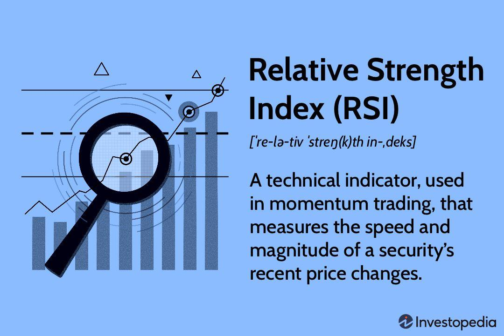

The Relative Strength Index (RSI) is a widely utilized momentum oscillator in technical analysis, developed by J. Welles Wilder Jr. Introduced in Wilder's seminal 1978 book, "New Concepts in Technical Trading Systems," the RSI has become a cornerstone for traders seeking to gauge market momentum and make informed trading decisions. This indicator measures the speed and change of price movements, providing traders with a quantifiable method to assess market conditions and potential reversals.

The RSI operates on the principle of analyzing the price movement over a specified period, typically 14 days, but traders may adjust this depending on their strategy and market conditions. The RSI value oscillates between 0 and 100, with readings above 70 indicating potential overbought conditions, and readings below 30 indicating potential oversold conditions. These threshold levels allow traders to deduce possible trend reversals or continuation, enhancing their ability to strategize effectively in diverse market environments.



In algorithmic trading, the RSI's adaptability and straightforward calculation make it a valuable tool for automating trading decisions. Its integration with various trading algorithms allows for backtesting and refining strategies, combining with other indicators like moving averages or MACD for improved accuracy.

This article will cover the intricate workings of the RSI, including its calculation method and strategic application in algorithmic trading, demonstrating its critical role in assessing market movements and forming robust trading strategies.

## Table of Contents

## Understanding the Relative Strength Index (RSI)

The Relative Strength Index (RSI) is an essential indicator used by traders to evaluate the momentum of price movements in financial markets. It determines whether a market is in an overbought or oversold state by comparing the magnitude of recent gains to recent losses. This assessment provides insights into whether an asset's current price is reflective of its underlying value, facilitating more informed trading decisions.

The primary calculation of the RSI involves measuring the average gains and average losses over a specific period, which is typically set at 14 days. This standard period can be adjusted to suit the specific needs and strategies of different traders. The RSI is mathematically expressed with the following formula:

$$
RSI = 100 - \left( \frac{100}{1 + RS} \right)
$$

where $RS$ denotes the relative strength, defined as:

$$
RS = \frac{\text{Average Gain}}{\text{Average Loss}}
$$

To compute the average gain or loss, one needs to aggregate the price changes over the look-back period, taking into account only the days with gains or losses, respectively. For a 14-day RSI, the average is commonly calculated as a smoothed moving average of these gains and losses. On any given day, the average gain is updated by:

$$
\text{Average Gain}_t = \frac{(\text{Previous Average Gain} \times 13) + \text{Current Gain}_t}{14}
$$

Similarly, the average loss is updated by:

$$
\text{Average Loss}_t = \frac{(\text{Previous Average Loss} \times 13) + \text{Current Loss}_t}{14}
$$

The results from these calculations enable the RSI to oscillate between 0 and 100, with specific levels signaling market conditions. A value above 70 typically indicates an overbought environment, suggesting that the asset may be due for a price correction or reversal. Conversely, a reading below 30 indicates an oversold condition, potentially signaling an impending price increase.

This oscillation makes the RSI a powerful tool in identifying potential reversals and can help traders optimize entry and [exit](/wiki/exit-strategy) points in their strategies. By understanding the RSI's foundation on recent price action, traders are better equipped to make measured decisions aligned with real-time market conditions.

## Calculating the RSI

Calculating the Relative Strength Index (RSI) involves a structured approach that encompasses two primary steps: the averaging of gains and losses, followed by computing the RSI value. This [momentum](/wiki/momentum) oscillator, introduced by J. Welles Wilder Jr., plays a pivotal role in evaluating the velocity and direction of price movements.

To commence, the calculation of RSI necessitates determining the average gain and average loss over a specified period. Conventionally, this period spans 14 days, although traders may customize it according to their strategies. For each day, compute the 'gain' as the difference between the current closing price and the previous day’s closing price, provided the current price is higher. Conversely, when the current price is lower, a 'loss' is registered equivalent to this difference.

The next step is to derive the average gain and loss. For the first calculation:
- **Average Gain** = Total of Gains over the past 14 days / 14
- **Average Loss** = Total of Losses over the past 14 days / 14

Subsequent calculations employ a smoothing technique. The formulas for subsequent average gains and losses are:
- **Average Gain$_\text{next}$** = [(Previous Average Gain) × 13 + Current Gain] / 14
- **Average Loss$_\text{next}$** = [(Previous Average Loss) × 13 + Current Loss] / 14

With these smoothed averages, the Relative Strength (RS) is computed as the ratio of average gain to average loss:
$$
\text{RS} = \frac{\text{Average Gain}}{\text{Average Loss}}
$$

Finally, the RSI is calculated using the formula:
$$
\text{RSI} = 100 - \left(\frac{100}{1 + \text{RS}}\right)
$$

This formula transforms the RS value into a scale of 0 to 100, where higher RSI values signify stronger upward momentum and lower values indicate stronger downward momentum. The smoothing methodology ensures the RSI captures market trends accurately, minimizing erratic fluctuations often seen with raw data. This calculated RSI can then be used to assess potential buy and sell signals based on preset thresholds.

## Interpreting the RSI for Trading

The Relative Strength Index (RSI) is a valuable tool for traders aiming to capitalize on market movements. By interpreting its signals, traders can make informed decisions about when to enter or exit trades. The RSI operates on a scale from 0 to 100, with key threshold levels typically set at 70 and 30. These levels help traders identify overbought and oversold conditions within a market.

When the RSI exceeds 70, the market is considered overbought. This suggests that the price might have risen too quickly and could be due for a correction. In such cases, a trader might interpret this as a potential selling opportunity, anticipating a price decline. Conversely, when the RSI falls below 30, the market is viewed as oversold. This condition indicates that the price may have fallen too rapidly, offering a potential buying opportunity as traders expect a rebound.

Understanding the RSI ranges and their implications is crucial for enhancing trading strategies. While the standard thresholds are 70 and 30, traders sometimes adjust these levels to suit specific market conditions or trading styles. For example, in a highly volatile market, a trader might choose to use more conservative levels, such as 80 for overbought and 20 for oversold, to account for increased market fluctuations.

To effectively incorporate RSI analysis into trading strategies, it is important to recognize the context of the market. It is generally more reliable in trading environments where price movements are cyclical or range-bound. In strongly trending markets, the RSI might give false signals, as it could remain in overbought or oversold territory for extended periods without the anticipated reversal occurring.

Traders often use the RSI in conjunction with other technical indicators to strengthen their trading strategies. For instance, combining RSI signals with moving averages or support and resistance levels can provide a clearer picture of market conditions, reducing the likelihood of false signals. By doing so, traders can establish more robust entry and exit points, optimizing their potential returns.

## RSI in Algorithmic Trading

Algorithmic traders often utilize the Relative Strength Index (RSI) within their automated systems to facilitate decision-making and assess trading strategies. This tool is particularly favored for its ability to generate signals based on relative strength and momentum, thus allowing algorithms to capitalize on market inefficiencies.

One of the fundamental applications of the RSI in [algorithmic trading](/wiki/algorithmic-trading) involves its integration with other technical indicators such as moving averages or the Moving Average Convergence Divergence (MACD). By combining these indicators, traders can create more robust trading algorithms that help reduce false signals and improve predictive accuracy. For instance, a common strategy might involve entering a buy position when the RSI indicates an oversold condition and the price crosses above a moving average, signaling a potential upward trend.

The adaptability of the RSI is a key reason it is frequently incorporated into various trading bots and strategies. Its flexibility allows it to be applied across multiple asset classes and timeframes, enhancing its utility in dynamic and volatile markets. Traders often employ [backtesting](/wiki/backtesting)—a method of testing a trading strategy on historical data—to refine their RSI-based algorithms. This process helps in optimizing parameters such as the lookback period for the RSI calculation or the thresholds for overbought and oversold conditions.

Below is an example of how RSI can be coded into a simple algorithm using Python to participate in backtesting:

```python
import pandas as pd
import numpy as np

# Sample data frame with historical price data
data = pd.DataFrame({
    'date': pd.date_range(start='2021-01-01', periods=100, freq='D'),
    'price': np.random.random(100) * 100
})

# Function to calculate RSI
def calculate_rsi(data, window=14):
    delta = data['price'].diff()
    gain = delta.where(delta > 0, 0)
    loss = -delta.where(delta < 0, 0)
    avg_gain = gain.rolling(window=window).mean()
    avg_loss = loss.rolling(window=window).mean()
    rs = avg_gain / avg_loss
    rsi = 100 - (100 / (1 + rs))
    return rsi

data['RSI'] = calculate_rsi(data)

# Example of a simple RSI-based strategy
def rsi_strategy(data):
    buy_signals = []
    sell_signals = []
    for i in range(len(data)):
        if data['RSI'].iloc[i] < 30:  # Oversold condition
            buy_signals.append(data['price'].iloc[i])
            sell_signals.append(np.nan)
        elif data['RSI'].iloc[i] > 70:  # Overbought condition
            buy_signals.append(np.nan)
            sell_signals.append(data['price'].iloc[i])
        else:
            buy_signals.append(np.nan)
            sell_signals.append(np.nan)
    data['Buy Signal'] = buy_signals
    data['Sell Signal'] = sell_signals

rsi_strategy(data)
print(data[['date', 'price', 'RSI', 'Buy Signal', 'Sell Signal']])
```

This code calculates the RSI for a given dataset and simulates buy and sell signals based on defined thresholds. Traders can expand upon this model by integrating additional logic, such as stop-losses or other technical indicators, to further refine their strategies.

In conclusion, the Relative Strength Index remains a vital component in algorithmic trading strategies, offering the potential for high adaptability and effectiveness in diverse trading environments.

## Limitations and Considerations

The Relative Strength Index (RSI) is an effective tool in technical analysis, widely used for identifying overbought or oversold market conditions. However, like all indicators, it has limitations that traders must recognize to prevent misinterpretation and potential losses. One major limitation is the tendency of RSI to generate false signals, particularly during strong trending markets. In such cases, the RSI may remain in overbought or oversold territory for extended periods, misleading traders who interpret these signals as immediate reversal points.

To better navigate these challenges, traders should be aware of the RSI's susceptibility to false signals. For example, in a robust upward trend, the RSI might linger above the 70 mark, suggesting an overbought condition while the price continues to rise. Conversely, in a strong downward trend, the RSI might stay below 30, indicating oversold conditions without the anticipated price reversal. Understanding these tendencies underscores the importance of contextualising RSI signals within the broader market landscape.

Moreover, integrating RSI analysis with other technical indicators can provide a more comprehensive view of market conditions, reducing the risk of erroneous trades. Pairing the RSI with trend-confirming tools such as moving averages or MACD (Moving Average Convergence Divergence) can enhance its predictive capabilities. For example, a trader might seek confirmation through a moving average crossover before acting on an RSI signal, thereby achieving a more nuanced and robust trading strategy.

In conclusion, while the RSI is a valuable component of technical analysis, its effectiveness is significantly enhanced when used in conjunction with other analytical tools. By acknowledging its limitations and employing a multi-faceted approach, traders can utilize the RSI to its full potential, making informed and strategic market decisions.

## Case Study: RSI Application in Forex Trading

The Relative Strength Index (RSI) is a pivotal tool in Forex trading, offering traders insight into potential entry and exit points by identifying overbought or oversold conditions in currency pairs. Its application in the Forex market is exemplified by its ability to signal shifts in momentum, allowing traders to capitalize on reversals and trends.

Traders typically use the RSI by observing key levels, notably the 70 and 30 thresholds, to make informed trading decisions. When the RSI for a currency pair rises above 70, it may indicate an overbought condition, prompting traders to consider a sell position. Conversely, an RSI below 30 often suggests an oversold condition, signaling a potential buy opportunity. These signals are most effective when confirmed by other technical indicators or chart patterns, reducing the likelihood of false signals, especially in volatile markets.

For instance, consider the scenario of trading the EUR/USD currency pair. Suppose the RSI crosses above the 70 level as the exchange rate hits a recent high. A trader might interpret this as a signal to sell, anticipating a price correction. Similarly, if the RSI dips below 30 while the currency pair is at a recent low, traders might view this as a cue to buy, expecting a rebound.

The success of RSI-based strategies in Forex trading varies depending on market conditions. In highly trending markets, the RSI may produce misleading signals as the momentum might sustain beyond traditional oversold or overbought levels. However, in range-bound or less volatile markets, the RSI can significantly enhance trading outcomes.

Systematic backtesting is crucial to evaluate the effectiveness of RSI strategies in Forex trading. Traders often employ algorithmic backtesting tools to simulate RSI-based strategies over historical data, assessing their potential profitability and risk. Python, among other programming languages, provides robust libraries for such analyses. A simple Python snippet for calculating RSI using the 'pandas' library might look like this:

```python
import pandas as pd

def calculate_rsi(data, window=14):
    delta = data['Close'].diff()
    gain, loss = delta.copy(), delta.copy()

    gain[gain < 0] = 0
    loss[loss > 0] = 0

    avg_gain = gain.rolling(window=window, min_periods=1).mean()
    avg_loss = abs(loss.rolling(window=window, min_periods=1).mean())

    rs = avg_gain / avg_loss
    rsi = 100 - (100 / (1 + rs))

    return rsi

# Sample usage
# data = pd.DataFrame(...)  # Replace with your forex data containing a 'Close' column
# rsi = calculate_rsi(data)
```

Forex traders leveraging the RSI often combine it with other indicators like moving averages and MACD to refine entry and exit points further. This multi-faceted approach can enhance the robustness of trading strategies, especially in dynamic and fast-paced Forex markets.

In summary, while RSI provides valuable insights for Forex trading, its success is best realized through careful integration with comprehensive market analysis and risk management strategies.

## Conclusion

The Relative Strength Index (RSI) remains a vital element in the arsenal of both individual traders and comprehensive trading platforms. Its capacity to pinpoint key market trends and potential reversals enhances strategy development, adding a layer of critical insight to trading activities. The RSI achieves this by effectively measuring the magnitude of recent price movements, thereby distinguishing overbought or oversold conditions. This oscillator, with values ranging between 0 and 100, signals traders when the market might be primed for reversals, specifically when the index touches the 70 or 30 thresholds.

Incorporating the RSI into diverse trading strategies allows for more informed decision-making. Its flexibility and adaptability enable traders to align the RSI with other technical analysis tools, such as moving averages or the Moving Average Convergence Divergence (MACD), which can fortify trading decisions through a more comprehensive market evaluation. By acknowledging the RSI's significance and integrating it within a broader analytical framework, traders can enhance the precision of their market predictions.

Despite its strengths, it is crucial to be aware of the RSI's limitations, especially its proneness to false signals during strong trends. Traders should, therefore, avoid relying solely on the RSI and instead use it as part of a multifaceted approach to market analysis. In doing so, they can mitigate potential pitfalls and improve the robustness of their trading strategies. By leveraging the RSI's ability to identify trends and reversals, traders and platforms alike can enhance their ability to navigate complex market environments effectively.

## FAQs

**Address common questions about using RSI in trading**

The Relative Strength Index (RSI) is a popular momentum oscillator, yet its application in trading often raises questions. Here are some of the most frequently asked questions regarding RSI use:

1. **How can I interpret RSI values correctly?**

   The RSI values range from 0 to 100, which help traders determine potential market conditions. Values above 70 typically indicate that an asset may be overbought, suggesting a potential sell signal, while values below 30 suggest an asset might be oversold, implying a potential buy signal. However, these thresholds are not absolute and should be considered in conjunction with other market indicators.

2. **Does RSI provide reliable trading signals during trending markets?**

   A common misconception is that RSI is equally reliable in all market conditions. In strong trending markets, the RSI can remain in the overbought or oversold territory for extended periods. Here, relying solely on RSI might result in false signals. Traders often integrate other trend-confirming indicators or look for divergences between the RSI and price movements for more accurate interpretations.

3. **Can RSI be used for something other than spotting overbought or oversold conditions?**

   Yes, RSI can also reveal bullish or bearish divergences. A bullish divergence occurs when prices fall to a new low while the RSI forms a higher low, potentially indicating a reversal to the upside. Conversely, a bearish divergence is when prices rise to a new high but the RSI forms a lower high, which could predict an impending decline.

4. **What is the optimal period setting for calculating RSI?**

   The default setting for RSI is 14 periods, as recommended by its creator J. Welles Wilder Jr. However, traders may adjust this period according to their trading style. Shorter periods, such as 7 or 9, tend to make the RSI more sensitive to price changes, while longer periods, like 21 or 28, provide smoother RSI results with fewer signals.

5. **How can I incorporate RSI into a broader technical analysis framework?**

   To maximize the potential of the RSI, traders often combine it with other technical analysis tools. Moving Averages, for example, work well with RSI by providing a trend confirmation. The Moving Average Convergence Divergence (MACD) indicator is another popular complement. Additionally, support and resistance levels identified in price charts can enhance RSI analysis by establishing context for potential reversals.

6. **Are there recommended strategies for using RSI in trading?**

   There are multiple strategies involving RSI, such as the RSI crossover strategy, where traders look for crosses above the 30 line or below the 70 line as buy or sell signals, respectively. Another strategy involves using divergence patterns as indications for entries or exits. Some traders also use trend line support or resistance on the RSI itself.

Through a nuanced understanding of the RSI and its application within a broader technical framework, traders can significantly enhance their trading performance. Integrating RSI with complementary tools and adjusting settings to match market conditions are crucial for effective utilization.

## References & Further Reading

[1]: Wilder, J. W. (1978). ["New Concepts in Technical Trading Systems."](https://archive.org/details/newconceptsintec00wild) Trend Research.

[2]: Murphy, J. J. (1999). ["Technical Analysis of the Financial Markets: A Comprehensive Guide to Trading Methods and Applications."](https://www.amazon.com/Technical-Analysis-Financial-Markets-Comprehensive/dp/0735200661) New York Institute of Finance.

[3]: Achelis, S. B. (2000). ["Technical Analysis from A to Z, 2nd Edition."](https://books.google.com/books/about/Technical_Analysis_from_A_to_Z_2nd_Editi.html?id=GkjJzE_GuQEC) McGraw-Hill.

[4]: Pring, M. J. (2002). ["Technical Analysis Explained, 4th Edition: The Successful Investor's Guide to Spotting Investment Trends and Turning Points."](https://www.amazon.com/Technical-Analysis-Explained-Fifth-Successful/dp/0071825177) McGraw-Hill Education.

[5]: Allen, D. E., McAleer, M., & Singh, A. K. (2017). ["An Analysis of the RSI as a Trend Indicator in a Trading Strategy," Finance Research Letters, 23, 230-234.](https://researchers.mq.edu.au/en/publications/risk-measurement-and-risk-modelling-using-applications-of-vine-co)

[6]: Appel, G. (2005). ["Technical Analysis: Power Tools for Active Investors."](https://www.pearson.de/media/muster/ext/9780131951860.pdf) Financial Times Press.

[7]: Elder, A. (1993). ["Trading for a Living: Psychology, Trading Tactics, Money Management."](https://www.amazon.com/Trading-Living-Psychology-Tactics-Management/dp/0471592242) John Wiley & Sons.