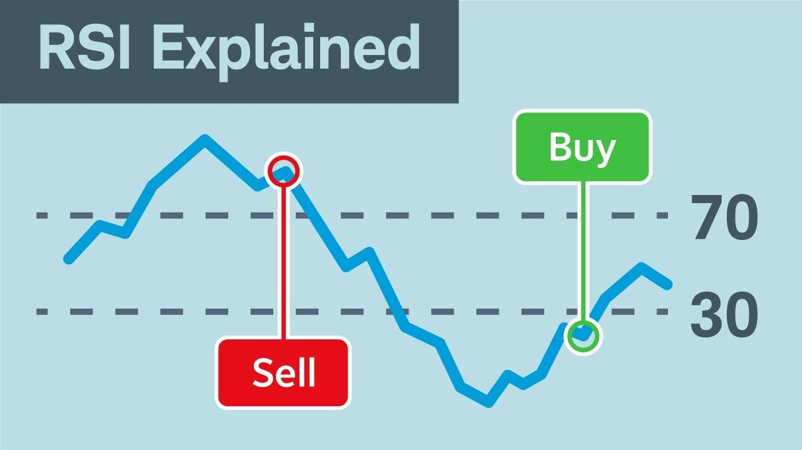

## Table of Contents

## What is the Relative Strength Index (RSI)?

The Relative Strength Index (RSI) is a tool used in trading to measure how fast and how much a stock's price is changing. It helps traders see if a stock is being bought a lot (overbought) or sold a lot (oversold). The RSI is shown as a number between 0 and 100. If the RSI is above 70, it might mean the stock is overbought and could go down soon. If it's below 30, it might mean the stock is oversold and could go up soon.

Traders use the RSI to make decisions about buying or selling stocks. For example, if the RSI shows a stock is oversold, a trader might decide to buy it, expecting the price to go up. On the other hand, if the RSI shows a stock is overbought, a trader might sell it, expecting the price to go down. The RSI can also show when the price of a stock might change direction, which helps traders plan their moves.

## How is the RSI calculated?

The RSI is calculated using the average gains and losses of a stock's price over a certain period, usually 14 days. First, you find the difference between the closing prices of the stock from one day to the next. If the price goes up, that's a gain. If it goes down, that's a loss. You then average these gains and losses over the 14 days. The average gain is the total of all the gains divided by 14, and the average loss is the total of all the losses divided by 14.

Next, you use these averages to find the Relative Strength (RS), which is the average gain divided by the average loss. After that, you plug the RS into a formula to get the RSI. The formula is: RSI = 100 - (100 / (1 + RS)). This gives you a number between 0 and 100, which tells you if the stock is overbought or oversold. If the RSI is above 70, the stock might be overbought. If it's below 30, the stock might be oversold.

## What is the typical time period used for calculating RSI?

The typical time period used for calculating the Relative Strength Index (RSI) is 14 days. This means that when traders calculate the RSI, they look at the average gains and losses of a stock's price over the past 14 days. This 14-day period helps give a good balance between being responsive to recent price changes and not being too affected by short-term fluctuations.

However, traders can also use different time periods depending on what they are trying to achieve. For example, a shorter period like 7 days can make the RSI more sensitive to price changes, which might be useful for short-term trading. On the other hand, a longer period like 21 days can smooth out the RSI and might be better for longer-term analysis. The choice of time period can affect how quickly the RSI reacts to price movements, so it's important to pick a period that fits the trading strategy.

## What do RSI values indicate about a market?

The RSI is a number between 0 and 100 that helps traders understand if a market is overbought or oversold. When the RSI is above 70, it means the market might be overbought. This can happen when a lot of people are buying and the price is going up fast. Traders might see this as a sign that the price could soon go down, so they might decide to sell their stocks. On the other hand, when the RSI is below 30, it means the market might be oversold. This can happen when a lot of people are selling and the price is going down fast. Traders might see this as a sign that the price could soon go up, so they might decide to buy stocks.

RSI can also show when the market might change direction. If the RSI starts to move away from being overbought or oversold, it could mean the price is about to change. For example, if the RSI was high but starts to go down, it might mean the price will start to go down too. Traders use this information to plan when to buy or sell. The RSI helps traders make smart choices by giving them a clear picture of what the market is doing.

## How can RSI be used to identify overbought and oversold conditions?

The Relative Strength Index (RSI) helps traders see if a stock is overbought or oversold. When the RSI goes above 70, it means the stock might be overbought. This happens when lots of people are buying the stock and its price is going up fast. Traders might think the price is too high and could go down soon, so they might decide to sell their stocks. On the other hand, when the RSI drops below 30, it means the stock might be oversold. This happens when lots of people are selling the stock and its price is going down fast. Traders might think the price is too low and could go up soon, so they might decide to buy the stock.

Traders use the RSI to make decisions about when to buy or sell stocks. If the RSI shows a stock is oversold, a trader might buy it, expecting the price to go up. If the RSI shows a stock is overbought, a trader might sell it, expecting the price to go down. The RSI can also help traders see when the price of a stock might change direction. For example, if the RSI was high but starts to go down, it might mean the price will start to go down too. This helps traders plan their moves based on what the RSI is telling them about the market.

## What are common RSI thresholds for overbought and oversold levels?

The common RSI threshold for an overbought level is when the RSI goes above 70. This means that a lot of people have been buying the stock and the price has been going up fast. Traders might see this as a sign that the price is too high and could soon go down, so they might decide to sell their stocks to avoid losing money.

The common RSI threshold for an oversold level is when the RSI drops below 30. This means that a lot of people have been selling the stock and the price has been going down fast. Traders might see this as a sign that the price is too low and could soon go up, so they might decide to buy the stock hoping to make a profit when the price rises again.

## Can RSI be used to confirm price trends?

Yes, RSI can help confirm price trends. When the price of a stock is going up and the RSI is also going up, it can mean that the upward trend is strong. Traders look for this to feel more sure about buying the stock. If the RSI stays above 50 while the price is going up, it's another sign that the trend might keep going up. This helps traders decide if they should keep buying or if it's time to sell.

On the other hand, if the price of a stock is going down and the RSI is also going down, it can mean that the downward trend is strong. Traders might use this to feel more sure about selling the stock. If the RSI stays below 50 while the price is going down, it's another sign that the trend might keep going down. This helps traders decide if they should keep selling or if it's time to buy. By watching the RSI along with the price, traders can make better choices about what to do with their stocks.

## What is divergence in the context of RSI, and why is it important?

Divergence in RSI happens when the price of a stock and the RSI are moving in different directions. For example, if the price of a stock is going up but the RSI is going down, that's called bearish divergence. It might mean the price could start to go down soon. On the other hand, if the price of a stock is going down but the RSI is going up, that's called bullish divergence. It might mean the price could start to go up soon.

Divergence is important because it can help traders see when a stock's price might change direction. By looking for these differences between the price and the RSI, traders can make better decisions about when to buy or sell. If they see a bearish divergence, they might decide to sell their stocks before the price goes down. If they see a bullish divergence, they might decide to buy stocks before the price goes up. This way, divergence helps traders plan their moves more carefully.

## How can RSI be integrated with other technical indicators for better analysis?

RSI can be used with other technical indicators to give traders a better understanding of the market. One common way is to use RSI with moving averages. A moving average smooths out the price data over a certain period, helping traders see the overall trend. If the RSI shows a stock is overbought and the price is above the moving average, it might mean the price will go down soon. But if the RSI shows a stock is oversold and the price is below the moving average, it might mean the price will go up soon. By looking at both the RSI and the moving average, traders can make smarter choices about when to buy or sell.

Another useful combination is RSI with the Moving Average Convergence Divergence (MACD). The MACD helps traders see the strength and direction of a trend. When the RSI shows a stock is overbought or oversold, traders can check the MACD to see if the trend is likely to continue or change. If the RSI and MACD both suggest the same thing, like a possible price increase, it gives traders more confidence in their decisions. Using RSI with other indicators like these helps traders get a fuller picture of what the market is doing, making it easier to plan their next moves.

## What are the limitations of using RSI as a standalone indicator?

Using RSI by itself can be tricky because it might give false signals. Sometimes, the RSI might show that a stock is overbought or oversold, but the price doesn't change right away. This can happen when there's a strong trend going on. For example, if a stock's price is going up a lot, the RSI might stay over 70 for a long time without the price going down. So, traders need to be careful and not rely only on RSI to make their decisions.

Another problem with using RSI alone is that it doesn't tell the whole story about what's happening in the market. RSI looks at how fast the price is changing, but it doesn't show other important things like the overall trend or how much people are trading the stock. That's why it's better to use RSI with other tools like moving averages or the MACD. These other indicators can help traders see the bigger picture and make better choices about when to buy or sell.

## How does RSI perform in different market conditions, such as trending vs. ranging markets?

In a trending market, where the price of a stock is going up or down in a clear direction, RSI can sometimes give false signals. For example, if a stock is in a strong uptrend, the RSI might stay above 70 for a long time without the price going down. This can make traders think the stock is overbought and ready to drop, but the price might keep going up. The same thing can happen in a strong downtrend, where the RSI might stay below 30, making traders think the stock is oversold and ready to go up, but the price might keep going down. So, in a trending market, RSI might not be the best tool to use by itself.

In a ranging market, where the price moves up and down within a certain range, RSI can be more useful. When the price is moving between two levels without a clear trend, the RSI can help traders see when the price might be ready to bounce back. If the RSI goes above 70 and then starts to go down, it might mean the price will go down too. If the RSI goes below 30 and then starts to go up, it might mean the price will go up too. In a ranging market, RSI can help traders find good times to buy or sell, but it's still important to use other tools to make sure the signals are right.

## What advanced RSI strategies can be employed by expert traders?

Expert traders often use a strategy called RSI divergence to find good times to buy or sell stocks. Divergence happens when the price of a stock and the RSI are moving in different directions. For example, if the price is going up but the RSI is going down, it's called bearish divergence. This might mean the price could start to go down soon. On the other hand, if the price is going down but the RSI is going up, it's called bullish divergence. This might mean the price could start to go up soon. By looking for these divergences, expert traders can predict when the price might change direction and make smarter decisions about when to buy or sell.

Another advanced strategy is using RSI with other indicators to get a better picture of the market. For example, traders might use RSI with moving averages, which help show the overall trend of a stock's price. If the RSI shows a stock is overbought and the price is above the moving average, it might mean the price will go down soon. But if the RSI shows a stock is oversold and the price is below the moving average, it might mean the price will go up soon. Traders can also use RSI with the MACD, which helps show the strength and direction of a trend. By combining RSI with other tools, expert traders can see the bigger picture and make more informed choices about their trades.

## What is the Relative Strength Index and how can it be understood?

The Relative Strength Index (RSI) is a crucial tool in technical analysis, a [momentum](/wiki/momentum) oscillator that evaluates the speed and change of price movements. It provides traders with insights into whether an asset is overbought or oversold, aiding in decision-making for entering or exiting trades. 

The RSI is computed using closing prices over a designated timeframe, customarily a 14-day period. This conventional setting is favored for its balance between reactivity and reliability, making it prevalent among traders. The RSI formula is expressed as follows:

$$
RSI = 100 - \left(\frac{100}{1 + RS}\right)
$$

where RS (Relative Strength) is the average of 'n' days' up closes divided by the average of 'n' days' down closes. For a 14-day RSI, 'n' would be 14. The values of RSI range from 0 to 100, creating a scale that assists in identifying market conditions. 

On this scale, an RSI level above 70 typically indicates that an asset is overbought, suggesting a potential downward price correction. In contrast, an RSI below 30 suggests an oversold condition, often preceding an upward price change. These critical levels enable traders to gauge potential market reversals and craft their entry or [exit](/wiki/exit-strategy) strategies accordingly. 

The adaptability of RSI makes it suitable for various trading strategies, offering traders the flexibility to adjust the timeframe or thresholds based on specific asset behavior or market conditions, thereby tailoring the indicator to their trading needs.

## What is the Calculation Methodology?

The Relative Strength Index (RSI) is calculated using a particular methodology that involves upward and downward changes in asset prices, smoothed moving averages, and a conversion of relative strength to the RSI value. This process ensures that traders have a reliable measure of momentum to aid their decision-making.

To calculate RSI, the first step involves determining the average gain and average loss over a specific period, often set at 14 days. The formula for average gain is:

$$
\text{Average Gain} = \frac{\sum{\text{Gains over the past } n \text{ days}}}{n}
$$

Similarly, average loss is calculated as:

$$
\text{Average Loss} = \frac{\sum{\text{Losses over the past } n \text{ days}}}{n}
$$

Here, gains refer to periods where the asset's closing price is higher than the previous day, while losses are when the closing price is lower.

The relative strength (RS) is then derived as the ratio of average gain to average loss:

$$
\text{RS} = \frac{\text{Average Gain}}{\text{Average Loss}}
$$

The RSI is calculated using the RS value with the following formula:

$$
\text{RSI} = 100 - \left( \frac{100}{1 + \text{RS}} \right)
$$

An essential part of this calculation is the smoothing of averages. Unlike simple moving averages which do not distinguish between different periods, Wilder's method uses a moving average that accounts for changes more gradually, akin to an exponential moving average (EMA). This technique provides stability and reduces [volatility](/wiki/volatility-trading-strategies) in RSI readings.

There are different methods for averaging, such as the simple moving average (SMA) or the exponential moving average (EMA). The SMA provides a straightforward average of prices over a period, whereas the EMA gives more weight to recent prices, making it more responsive to new information.

Cutler's RSI is a variation that uses the SMA for its calculations, which some traders argue offers a different perspective by incorporating a more straightforward averaging process. The choice between these averaging techniques depends on the trader's preference for responsiveness versus stability in the RSI.

In conclusion, the computation of RSI involves intricate methods of averaging and smoothing, where relative strength plays a pivotal role. By understanding and applying these calculations, traders can better interpret the momentum of asset prices and make informed trading decisions.

## References & Further Reading

[1]: Wilder, J. W. (1978). ["New Concepts in Technical Trading Systems."](https://archive.org/details/newconceptsintec00wild) Trend Research.

[2]: Murphy, J. J. (1999). ["Technical Analysis of the Financial Markets: A Comprehensive Guide to Trading Methods and Applications."](https://archive.org/details/technicalanalysi0000murp) New York Institute of Finance.

[3]: Aronson, D. (2007). ["Evidence-Based Technical Analysis: Applying the Scientific Method and Statistical Inference to Trading Signals."](https://www.amazon.com/Evidence-Based-Technical-Analysis-Scientific-Statistical/dp/0470008741) Wiley.

[4]: Appel, G., & Hitschler, F. (2008). ["Technical Analysis: Power Tools for Active Investors."](https://www.amazon.com/Technical-Analysis-Power-Active-Investors/dp/0132930048) Financial Times Prentice Hall.

[5]: Levich, R. M. (Ed.). (2011). ["The Handbook of Trading: Strategies for Navigating and Profiting from Currency, Bond, and Stock Markets."](https://archive.org/details/internationalfin00levi) Wiley.

[6]: Elder, A. (2002). ["Trading for a Living: Psychology, Trading Tactics, Money Management."](https://www.amazon.com/Trading-Living-Psychology-Tactics-Management/dp/0471592242) Wiley.