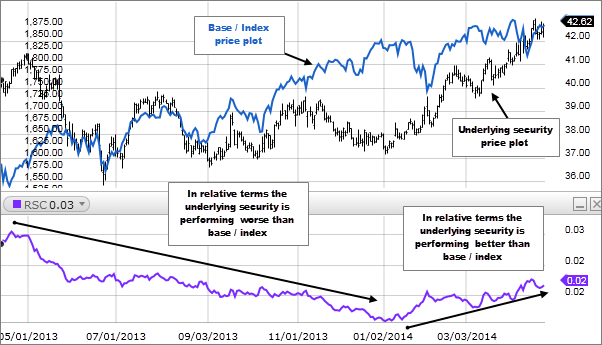

The landscape of investing has transformed significantly with the advent of technology and data-driven strategies, marking a new era for investors worldwide. Amid this evolution, relative strength stock analysis and algorithmic trading have emerged as crucial tools, offering new ways to optimize investment decisions. These innovations empower investors by utilizing systematic methods to enhance returns and reduce inefficiencies in trading practices.

Relative strength stock analysis, a key concept in momentum investing, involves the assessment of a stock or asset's performance relative to a benchmark or market index. This approach banks on the momentum of price movements, with the strategy of purchasing high-performing stocks and selling them at higher prices, banking on their continued outperformance. It remains particularly effective during periods of market stability, allowing investors to harness the power of trends effectively.



Algorithmic trading, meanwhile, utilizes computer algorithms to automate trading strategies based on predefined rules. This method facilitates rapid decision-making and trade execution, leading to improved trading efficiency and precision. By integrating data analytics, algorithmic trading is reshaping the trading landscape, enabling strategies that would be complex and time-consuming if executed manually.

The harmonious integration of relative strength analysis and algorithmic trading creates a strategic synergy, fostering a systematic approach to investment. This combination not only refines the timing of trades but also enriches decision-making processes, thereby enhancing financial outcomes. As technology and data analytics continue to advance, these tools are poised to evolve, offering fresh opportunities and challenges for investors who are keen on maximizing their strategies in the dynamic world of investing.

## Table of Contents

## Understanding Relative Strength in Stock Analysis

Relative strength is a fundamental concept within momentum investing, primarily used to identify stocks or assets that have demonstrated superior performance compared to a market or benchmark. The primary aim of employing relative strength is to capitalize on the continued outperformance of these selected stocks, adhering to a strategy often summarized as "buy high and sell higher." This approach relies on the inherent principle that securities which have performed well in the past are likely to continue doing so in the near future.

Relative strength analysis is most effective during periods of stable market conditions. During such times, the trends in asset performance are more predictable, allowing investors to make informed decisions based on historical outperformances. This method can, however, present challenges in volatile markets where rapid fluctuations can disrupt established trends.

To facilitate relative strength assessments, investors commonly use the Relative Strength Index (RSI), a [momentum](/wiki/momentum) oscillator that quantifies the speed and change of price movements over a specified time frame. The RSI operates on a scale from 0 to 100, with values typically above 70 indicating that a stock may be overbought, and values below 30 suggesting it might be oversold. The RSI is calculated using the formula:

$$
\text{RSI} = 100 - \left( \frac{100}{1 + \text{RS}} \right)
$$

where $\text{RS}$ (Relative Strength) is the average gain of the stock's up periods during the specified time frame, divided by the average loss of its down periods. This quantification assists investors in identifying potential entry and exit points, thereby optimizing their trading strategies.

The use of relative strength, augmented by analytical tools such as the RSI, enables investors to systematically track and evaluate market trends, guiding them in formulating strategies that potentially yield enhanced returns. While effective, it is crucial for investors to apply these techniques judiciously, considering the broader market environment and potential anomalies that might influence asset performance.

## Algorithmic Trading: Automating Investment Strategies

Algorithmic trading involves the utilization of computer systems to execute trading strategies automatically. This automation is governed by predefined rules, allowing for rapid decision-making and trade execution. The efficiency of [algorithmic trading](/wiki/algorithmic-trading) is one of its major advantages, as it significantly reduces human intervention and the associated time delays. 

A key feature of algorithmic trading is its ability to incorporate technical indicators such as the Relative Strength Index (RSI) to prompt buying or selling actions. Technical indicators enable the system to evaluate market data precisely and respond to specific conditions that align with the defined strategy. For instance, the RSI can signal an overbought or oversold condition when the RSI value crosses certain thresholds, typically 70 for overbought and 30 for oversold. The algorithm can be coded to buy or sell based on these signals, automatically executing trades that would be delayed by manual processes.

Algorithmic trading is particularly beneficial for executing complex strategies that are impractical for manual handling due to the [volume](/wiki/volume-trading-strategy) of data and rapid decision-making required. Strategies such as statistical [arbitrage](/wiki/arbitrage), [market making](/wiki/market-making), or [trend following](/wiki/trend-following) rely heavily on the speed and accuracy of algorithmic systems. These systems can continuously monitor multiple markets and securities, executing trades across various platforms to optimize gains.

The integration of data analytics further enhances algorithmic trading. By analyzing large datasets in real time, algorithms can adapt to new information faster than human traders. Machine learning techniques can be employed to identify patterns or anomalies in the data that may not be evident through traditional analysis. Python, a popular programming language for algorithmic trading, offers libraries such as NumPy, pandas, and scikit-learn, facilitating data manipulation and model development. An example of a simple algorithm using RSI might look like this:

```python
import talib
import numpy as np

# Sample closing prices
close_prices = np.array([...])  # replace with actual price data

# Calculate RSI
rsi = talib.RSI(close_prices, timeperiod=14)

# Define buy/sell conditions
def trade_signal(rsi_value):
    if rsi_value < 30:
        return "Buy"
    elif rsi_value > 70:
        return "Sell"
    else:
        return "Hold"

# Generate trade signals
signals = [trade_signal(value) for value in rsi]
```

The constant evolution of technology and analytics tools is revolutionizing trading. Algorithmic trading not only increases market efficiency but also enables trades at scales and speeds that were once unimaginable. As more sophisticated models and algorithms are developed, the capability to harness market opportunities swiftly and accurately continues to grow, establishing algorithmic trading as a critical component of modern finance.

## Combining Relative Strength and Algorithmic Trading

Using the Relative Strength Index (RSI) in algorithmic trading offers investors the capability to automate the detection of overbought or oversold market conditions. This automation helps to initiate trades based on predefined criteria, streamlining the decision-making process and ensuring timely actions that capitalize on market momentum. The RSI, a momentum oscillator, measures the speed and change of price movements on a scale of 0 to 100. An RSI value above 70 is typically considered overbought, while a value below 30 suggests oversold conditions. By incorporating these indicators into algorithmic systems, investors can automate the evaluation of these signals, allowing for more efficient market participation.

Algorithmic strategies can adjust dynamically to market fluctuations, leveraging relative strength indicators as a foundational basis. This adaptability is crucial because it enables the trading system to react almost instantaneously to market changes, ensuring that investment strategies remain aligned with current market trends. The algorithms can also be programmed to reevaluate positions as market conditions shift, maintaining an optimal asset allocation strategy.

Backtesting is an essential component of refining algorithmic strategies to ensure their effectiveness. Through [backtesting](/wiki/backtesting), potential trades are simulated using historical data, allowing investors to evaluate how an algorithm would have performed in past market conditions. This process helps identify any weaknesses in the trading strategy, providing a foundation for optimization. The goal is to ensure that the algorithmic strategies are robust and capable of delivering consistent performance across different market environments.

The synergy achieved by combining relative strength analysis with algorithmic trading enhances both trade timing and decision-making. It allows investors to remove emotional bias from their trading activities, resulting in a more disciplined approach. By basing decisions on quantitative metrics, traders can focus on executing strategies that have been statistically validated, increasing the probability of favorable outcomes.

Real-world examples of this combination include algorithms that adjust asset allocation dynamically based on relative performance metrics. For instance, a trading algorithm might allocate more capital to sectors or stocks exhibiting high relative strength while reducing exposure to underperforming assets. Here is a simple example in Python illustrating how one might implement an RSI-based algorithmic strategy:

```python
import pandas as pd
import numpy as np

def calculate_rsi(data, window_length=14):
    delta = data['Close'].diff()
    gain = (delta.where(delta > 0, 0)).rolling(window=window_length).mean()
    loss = (-delta.where(delta < 0, 0)).rolling(window=window_length).mean()
    rs = gain / loss
    rsi = 100 - (100 / (1 + rs))
    return rsi

# Sample data frame
data = pd.DataFrame({
    'Close': [150, 151, 152, 153, 150, 148, 147, 149, 150, 152, 153, 155, 157]
})

data['RSI'] = calculate_rsi(data)

# Define buy and sell signals
buy_signal = 30
sell_signal = 70

# Example placing buy/sell orders
buy_orders = data[data['RSI'] < buy_signal]
sell_orders = data[data['RSI'] > sell_signal]

print("Buy Orders:\n", buy_orders)
print("Sell Orders:\n", sell_orders)
```

This simple example calculates the RSI for a series of closing prices and identifies buy and sell signals based on RSI thresholds. In practice, more sophisticated algorithms would incorporate additional rules and data inputs, and real-time data would be used to execute trades automatically.

Through these strategies, the fusion of relative strength analysis and algorithmic trading not only facilitates improved trade execution but also paves the way for more advanced investment solutions as technology progresses.

## Benefits and Risks

Algorithmic trading offers several distinct benefits to those involved in modern investing. One of the primary advantages is enhanced precision and speed, which allows for the execution of trades with minimal delay. By processing trades quickly, algorithms can take advantage of minute market fluctuations that might be missed in manual trading. This rapid execution minimizes slippage, which is the difference between the expected price of a trade and the actual price.

Another benefit is the removal of emotional biases from trading decisions. Human traders are often influenced by fear, greed, and numerous behavioral biases, which can negatively impact decision-making processes. Algorithms, on the other hand, follow pre-defined rules and criteria without deviation, leading to consistent trading practices that are devoid of emotional influence.

Additionally, algorithms can process vast amounts of data simultaneously, identifying patterns and trends that may go unnoticed by the human eye. This capability is particularly advantageous in high-frequency trading environments where decisions need to be made in milliseconds. The use of technical indicators, like the Relative Strength Index (RSI), enables algorithms to analyze market conditions and trigger trades under specific circumstances, enhancing their ability to capitalize on short-term opportunities.

Despite these benefits, there are notable risks associated with algorithmic trading. One significant risk is the over-reliance on automation. Traders who depend solely on algorithms may become complacent, missing crucial market changes that aren't captured by their models. Technical glitches present another risk. Software errors or issues with data feeds can lead to unintended trades or substantial financial losses, as evidenced by historical events like the Flash Crash of 2010.

Market anomalies also pose a risk, as algorithms are typically designed based on historical data and may not adapt well to unexpected market conditions. Consequently, continuous monitoring and updating of algorithms are essential to ensure their effectiveness. This involves regular backtesting and optimization to adjust trading strategies as market conditions evolve.

Moreover, a thorough understanding of the market environment is crucial for the effective application of algorithmic trading strategies. Without this insight, there is a danger of misapplying the strategy, which can lead to suboptimal outcomes.

Overall, while algorithmic trading provides significant benefits like speed, precision, and data processing capabilities, its success depends on diligent management and a deep understanding of market dynamics to mitigate risks.

## Conclusion

Relative strength stock analysis and algorithmic trading are powerful tools for the modern investor. By integrating these approaches, investors can create more robust and efficient investment strategies, leading to enhanced financial outcomes. The synergy of relative strength and algorithmic trading offers a systematic approach to identifying high-performing stocks and executing trades with precision, minimizing emotional biases and improving decision-making processes.

As technology continues to advance, the landscape of investment strategies is constantly evolving. Innovations in data analytics, [machine learning](/wiki/machine-learning), and computational power provide new opportunities to refine these methods further. For instance, the incorporation of [artificial intelligence](/wiki/ai-artificial-intelligence) in algorithmic trading systems allows for more sophisticated pattern recognition and predictive modeling, potentially increasing the reliability and profitability of these strategies.

Investors are encouraged to stay updated with the latest developments in relative strength analysis and algorithmic trading. Continuous learning and adaptation are crucial in a rapidly changing market environment. By understanding and embracing new technological advancements, investors can refine their strategies to remain competitive and capitalize on emerging opportunities.

The future of investing resides at the intersection of human insight and technological innovation. While algorithmic systems can process vast amounts of data and execute trades with unparalleled speed and accuracy, human intuition and strategic thinking remain invaluable. Success in modern investing will depend on leveraging the strengths of both human judgment and machine efficiency, striking a balance that maximizes returns while managing risks effectively.

## References & Further Reading

[1]: ["Advances in Financial Machine Learning"](https://www.amazon.com/Advances-Financial-Machine-Learning-Marcos/dp/1119482089) by Marcos Lopez de Prado

[2]: ["Evidence-Based Technical Analysis: Applying the Scientific Method and Statistical Inference to Trading Signals"](https://www.amazon.com/Evidence-Based-Technical-Analysis-Scientific-Statistical/dp/0470008741) by David Aronson

[3]: ["Machine Learning for Algorithmic Trading"](https://github.com/stefan-jansen/machine-learning-for-trading) by Stefan Jansen

[4]: ["Quantitative Trading: How to Build Your Own Algorithmic Trading Business"](https://www.amazon.com/Quantitative-Trading-Build-Algorithmic-Business/dp/1119800064) by Ernest P. Chan

[5]: ["Technical Analysis Using Multiple Timeframes"](https://www.morpher.com/blog/technical-analysis-multiple-timeframes) by Brian Shannon